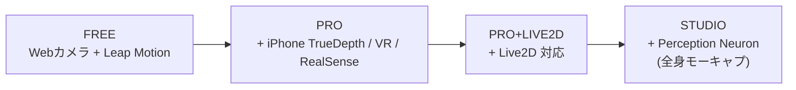

日本発の **VRM 中心の VTuber アプリ**。PLUSPLUS Co., Ltd. が開発、現行は v4。Windows / macOS 対応の FREE 版があり、PRO 系列で iPhone TrueDepth / VR / RealSense 等のハイエンドトラッキングが解禁される段階制ライセンス。

## 何のためのソフトか

[[vrm|VRM]] アバターを **配信・録画・スクショ用に動かす**「再生プレイヤ + キャプチャ統合」アプリ。VRoid Studio で作った `.vrm` をロードして、Web カメラ向きでアバターが連動。VTuber や Vlogger、社内向けプレゼン動画制作などに使われる。

VRM 規格をベースにしつつ、上位版で [[live2d|Live2D]] にも対応しており、**3D と 2D を同じワークフローに乗せられる**のが強み（日本市場で珍しい）。

## バージョンと差分

| 版 | 対応モデル | トラッキング | 主な利用層 |
|---|---|---|---|
| **FREE** | VRM | Web カメラ、Leap Motion | 試用、軽い配信 |
| **PRO** | VRM | + iPhone X TrueDepth、VR ヘッドセット、RealSense | 個人 VTuber 本格運用 |
| **PRO+LIVE2D** | VRM + Live2D | 上記 + Live2D アバター対応 | 2D / 3D 両刀の VTuber |
| **STUDIO** | VRM + Live2D | + Perception Neuron（全身慣性計測） | スタジオ制作、企業案件 |

FREE 〜 PRO はそれぞれ独立した Steam ページがあり、Steam 経由でも直販でも入手可能。

## 主な機能

- **アバター読み込み** — `.vrm` ドラッグ＆ドロップ
- **顔表情同期** — Web カメラから瞬き・口開け・首振りを検出
- **音声リップシンク** — マイク入力から口の動きを生成（カメラなしでも口だけ動く）
- **背景** — 単色（クロマキー用）・画像・透過 PNG 出力
- **エフェクト** — 表情プリセット、エモートアニメーション
- **ポーズ** — マウスでアバターの姿勢を直接編集
- **録画 / スクリーンショット** — 内蔵
- **OBS 連携** — 「3tene Screen Capture」として OBS の映像ソースに直接出せる（v3.0.8+）

## 競合との立ち位置

| アプリ | 主形式 | 特徴 | 課金モデル |
|---|---|---|---|
| **3tene** | VRM (+ Live2D 上位版) | 日本語 UI、PRO 段階制、VR/iPhone 拡張 | 段階購入 |
| **VSeeFace** | VRM | 軽量・無料、英語圏で人気 | 完全無料 |
| **VTube Studio** | Live2D 主、VRM 一部 | 2D 配信のデファクト | 買切 |
| **Animaze** | 独自 + VRM | 商用ストック多数 | サブスク |
| **バーチャルキャスト** | VRM | VR 内ライブ配信特化 | 無料 + 課金要素 |

3tene の差別化ポイント:

- **日本語ネイティブ** — UI / ドキュメント / サポートすべて日本語が一次
- **段階制ライセンス** — Free → Pro → Pro+Live2D → Studio で投資を段階化できる
- **Live2D との同居** — 1 アプリ内で 2D も 3D も切り替えられる（PRO+LIVE2D 以上）

## トラッキング機材まとめ

| 機材 | 必要な版 | 取れるもの |
|---|---|---|
| Web カメラ | FREE | 顔向き、瞬き、口、表情の大まか |
| マイク | FREE | リップシンク（音量ベース） |
| Leap Motion | FREE | 手の指の動き |
| iPhone X 以降 | PRO | TrueDepth による高精度表情（ARKit blendshapes） |
| Meta Quest / Vive | PRO | VR 内でのアバター操作 |
| Intel RealSense | PRO | 顔・上半身トラッキング |
| Perception Neuron | STUDIO | 全身モーキャプ（慣性センサスーツ） |

## ファイル取り扱い

- **入力**: `.vrm`（VRM 0.x / 1.0、ただし 1.0 対応はバージョン依存）
- **入力（Live2D 版）**: Cubism 3+ の `.model3.json` 一式
- **出力**: 録画 mp4 / スクショ png / OBS 経由でのライブ配信

`.vrm` は VRoid Studio で作るのが一番手軽だが、Blender + UniVRM や VRoid Hub からダウンロードしたモデルもそのまま読める。

## 押さえどころ（カード化候補）

- 3tene は何のソフトか → **VRM 中心の VTuber アプリ。PLUSPLUS 製、Windows/Mac、FREE/PRO/PRO+LIVE2D/STUDIO の段階制**
- 3tene FREE で出来ること → **VRM ロード、Web カメラと Leap Motion でのトラッキング、録画・スクショ・OBS 連携**
- PRO 版で増える機能 → **iPhone X の TrueDepth、VR ヘッドセット、Intel RealSense でのトラッキング**
- PRO+LIVE2D 版の意味 → **VRM に加えて Live2D アバターも読み込めるようになる版（3tene の中で 2D/3D を併用できる）**
- STUDIO 版が想定する規模 → **スタジオでの本格制作。Perception Neuron による全身慣性モーキャプに対応**
- 3tene と VSeeFace の主な違い → **3tene は段階制商用ライセンスで PRO 拡張あり。VSeeFace は完全無料・英語圏中心。両方とも VRM が主軸**

## 関連

- [[vrm|VRM]] — 3tene が読み込むアバターフォーマット
- [[face-tracking|フェイストラッキング]] — アバターを駆動するトラッキング技術
- [[vroid-studio|VRoid Studio]] — .vrm を作る代表的ツール
- [[live2d|Live2D]] — PRO+LIVE2D 版で対応する 2D アバター技術
- [[obs|OBS Studio]] — 配信の出口（OBS 連携機能あり）

## Links

- [3tene 公式](https://3tene.com/)
- [3tene WebDocument（使い方）](https://3tene.github.io/WebDocument/)
- [3tene FREE on Steam](https://store.steampowered.com/app/871170/3tene/)
- [3tene PRO on Steam](https://store.steampowered.com/app/3850680/3tene_PRO/)
