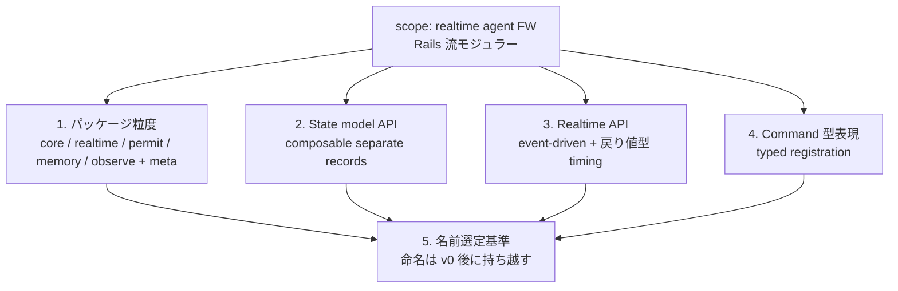

> **[仮版・concept design]** [[agent-framework-scope]] でスコープが「realtime agent framework + Rails 流モジュラー」に固まったのを受けて、その下層の 5 つの設計詳細（package 粒度 / state model API / realtime API / command protocol 型表現 / 名前選定基準）を概念設計する。実装はしない。各節は推奨案 + open questions を残す形で書く。

## 1. パッケージ分割の粒度

### Rails の参考

Rails は meta-gem `rails` の下に概ね次の component gem を持つ:

```
activesupport / activemodel / activerecord / actionpack / actionview /
actionmailer / activejob / actioncable / activestorage / actiontext / railties
```

10+ の sub-gem。理由:

- 単体使用ニーズ（ActiveRecord だけ使いたい / ActiveJob だけ使いたい）
- リリースサイクル分離
- インストール時間 / バイナリサイズ最適化
- 関心の分離（DB / view / job は別物）

### Almide 版での候補

[[almide-agent-framework]] の 7 抽象（L0–L7、L1 は外部）+ realtime をどう束ねるか。3 つの粒度案:

| 案 | 構成 | 評価 |
|---|---|---|
| α 粗（3）| `core` (L0/L2/L3/L4/L7 + realtime) / `permit` / `observe` | ✗ realtime が core に張り付き、外せない |
| **β 中（5）** | `core` (L0/L2/L3/L4/L7) / `realtime` / `permit` / `memory-persistent` / `observe` + meta | ✓ Rails 流、各 layer 独立 |
| γ 細（8+）| L0/L2/L3/L4 を更に分割 | ✗ 過剰分割、単独使用ニーズが薄い層が多い |

### 推奨: β（5 sub-package + meta）

```
?-core               L0 message + L2 loop + L3 dispatch + L4 state(in-memory) + L7 testing
?-realtime           push driver / timing / backpressure / protocol contract
?-permit             L5 permission resolver + 危険パターン検出
?-memory-persistent  L4 拡張（DB / Redis / file 等のアダプタ）
?-observe            L6 trace events + token usage + latency
?                    meta package — 全部 bundle（Rails 相当）

almai                framework に取り込まず外部依存（L1 provider）
```

**判断軸**:

- in-memory state は core に含める（agent loop が状態なしで成立しないため）
- 永続 memory は外部依存（DB / Redis）が増えるので separate
- realtime を独立させるのは、これだけが進化速度が速い領域だと予想されるため
- permit と observe は **省略可能** にしたい場面がある（embedded WASM で軽くしたい場合等）

### Open questions

- L4 state の record 合成 API（後述§2）が決まらないと、core と memory-persistent の境界が確定しない
- realtime と core の depend 方向：core は realtime に依存しない（pull 駆動だけで回る）、realtime は core に依存する。逆向きにならないことを確認する必要

## 2. L4 State Model の API

### Almide の素材

- record 合成 / nested record
- pattern match
- `effect fn`（mutation を型に上げる）
- 不変性（再帰 threading）

### 設計選択肢

**A. 単一 record 全部入り**

```almide
type AgentState = {
  history: List[Message],
  memory: Memory,
  scene: Option[SceneState],
  ...
}
```

- ✓ シンプル、全部見える
- ✗ 拡張不能、domain 固有 fields が core に染み込む

**B. extensible / generic record**

```almide
type CoreAgentState[T] = {
  history: List[Message],
  memory: Memory,
  domain: T,
}
```

- ✓ domain で T を埋められる
- ✗ T に何でも入り、型保証が弱まる

**C. composable separate records（推奨）**

```almide
type CoreState     = { history: List[Message], memory: Memory }
type RealtimeState = { tick: Int, last_event_ms: Int }
type SceneState    = { avatar: Avatar, camera: Camera, expression: Expression }

// AITubeStudio が組み立てる:
type StudioState = {
  core: CoreState,
  realtime: RealtimeState,
  scene: SceneState,
}

// homullus が組み立てる:
type HomulluState = {
  core: CoreState,
  repl: ReplState,
}
```

- ✓ 各 layer が独立した型として存在、composition で domain state を組み立て
- ✓ Almide の record 合成と相性が良い
- ✗ nested access の冗長性（`state.core.history` のような chain）

### 推奨: C + ヘルパーアクセサ

C を採用しつつ、framework が `core_history(state)` のような top-level アクセサを提供して nested の冗長を緩和する。Almide の lambda + パイプとも相性が良い:

```almide
state |> core_history |> list.last
```

### Open questions

- record 更新の API（`{ ...state, core: { ...state.core, history: new_history } }` の冗長を構文で減らせるか）
- domain 側で「core の history に書き込む」許可を framework がどう統制するか
- 永続化のフック点 — `?-memory-persistent` がどこで state を観察して snapshot を取るか

## 3. Realtime Primitives の API

### 必要なもの

- **push tick** — 外部イベント（frame / WebSocket / timer）が agent loop に入る経路
- **timing 契約** — 「このハンドラは N ms 以内に返す」を表現する手段
- **backpressure** — イベント過剰時の制御
- **non-blocking 保証** — loop 内で blocking 操作をしないことの担保

### Almide の素材

- `effect fn` + `Result`
- `fan { a(); b() }` / `fan.map` / `fan.race` / `fan.any` / `fan.settle`（concurrency primitives）
- WASM / native のデュアルターゲット

### 設計選択肢

**event-driven loop**:

```almide
effect fn handle_event(state: State, event: Event) -> Result[State, RtError]

realtime.run(source, handle_event, opts)
// source: イベントの出元（WebSocket / frame timer / etc.）
// opts: backpressure policy, deadline, trace hook
```

**timing 契約の表現**:

annotation（`@deadline(16)`）は Almide にない。代替案:

```almide
// 戻り値型に deadline 違反を含める
type FrameResult[S] = | OnTime(S) | Late(S, lag_ms: Int) | Timeout
```

戻り値で表現するほうが型に乗り、`effect fn` と整合する。

**backpressure**:

```almide
type Backpressure =
  | DropOldest
  | DropNewest
  | Coalesce(merge_fn: (Event, Event) -> Event)
  | Block
```

policy として渡す。

**non-blocking 保証**:

Almide が effect fn に "blocking" マーカーを持つかどうか次第。現時点では型に出ない可能性が高いので、**規約 + lint** で縛るのが現実的（"`?-realtime` 内では `fs.read_text` を呼ばない" 等）。

### 推奨: event-driven + 戻り値型での timing 表現 + policy 引数 backpressure

ただし non-blocking 保証は型では完全には縛れない。lint と doc で誘導する形を取る。

### Open questions

- pull 駆動と push 駆動を **同じ agent loop primitive** で表現できるか、それとも別 API になるか
- frame timer のソースを Almide の native / WASM target で抽象化する方法
- WebSocket protocol の型契約をどこで宣言するか（§4 に関連）

## 4. Command Protocol の型表現

openaituber の WebSocket commands（`setEmotion` / `lookAt` / `speak` / `playFbx` / `setCamera` / `setBackground`）と homullus の tools（`Bash` / `Read` / `Write` / ...）を、framework の dispatch surface でどう型付けするか。

### 設計選択肢

**A. variant 型で閉じた集合**

```almide
type Command =
  | SetEmotion(name: String)
  | LookAt(yaw: Float, pitch: Float)
  | Speak(url: String)
  ...

effect fn dispatch(state: State, cmd: Command) -> Result[State, String]
```

- ✓ exhaustive match で抜けが型でわかる
- ✗ command set が閉じる。user が独自 command を追加できない
- ✗ framework に AITuber 固有 command を含めることになり、スコープ違反

**B. dispatch table with effect fn references**

```almide
type Handler = (State, Value) -> Result[State, String]
let commands: Map[String, Handler] = ["setEmotion": ..., ...]
```

- ✓ 開いた集合、user 拡張可能
- ✗ 引数の型が `Value`（dynamic）になり、型安全性が落ちる

**C. typed registration（推奨）**

```almide
type CommandSpec[A] = {
  name: String,
  decode: (Value) -> Result[A, String],
  handler: (State, A) -> Result[State, String],
}

// 各 command を typed で登録
let set_emotion = CommandSpec[SetEmotionArgs](
  name: "setEmotion",
  decode: SetEmotionArgs.decode,
  handler: ...,
)

// dispatch surface に bundle
let surface = dispatch.surface([set_emotion, look_at, ...])
```

- ✓ 各 command が型を持ったまま登録される（Almide の codec system と相性が良い）
- ✓ 集合は開いている、user 拡張可能
- ✓ framework は `CommandSpec` 型だけ提供、具体スキーマは domain（AITubeStudio）が定義

### 推奨: C（typed registration）

Almide の `Type.decode(value) / Type.encode(value)` codec convention をそのまま活かせる。`CommandSpec` を framework の dispatch surface の中核型として置く。

### Open questions

- `surface.dispatch(name, value)` の戻り値型をどう設計するか（command によって返す型が異なる場合）
- command の "副作用" を effect fn で表現する程度（`fs.read` を呼ぶ command と純粋な state 変更の command を型で区別するか）
- WebSocket protocol → CommandSpec の自動生成（openaituber の `protocol.ts` 相当を Almide で書く方法）

## 5. Framework 名 — 選定基準と候補レジスタ

framework name は意図的に未決のまま据え置く（[[almide-agent-framework]] の方針）。本節はあくまで **選定基準** と **候補のレジスタ（傾向）** を整理するもので、命名は AITubeStudio v0 が動いた段階に持ち越す。

### 選定基準

| # | 基準 | 根拠 |
|---|---|---|
| 1 | **短い**（1–3 音節）| Rails（1 音節）、Ruby（2 音節）の伝統 |
| 2 | **専用 GitHub org が空いている** | [[almide-agent-framework]] org 構造の前提 |
| 3 | **agent / runtime / direction を喚起** | framework のドメインを示唆 |
| 4 | **Almide エコシステム命名と整合** | bonsai / homullus / lumen / prism / syschord の poetic / Latin 系 |
| 5 | **特定ドメインに閉じない** | AITuber 専用に聞こえないこと |
| 6 | **意味が狭すぎない** | "Reins" の反省（"制御" に寄りすぎた）|
| 7 | **AI 時代の構造的断絶を示唆** | Rails が "線路" だったように、何か別の motif |

### 候補のレジスタ（方向性のみ、特定の名前は決めない）

- **動き / 方向**: rails / reins / course / route / 系 — 既視感が強い
- **rhythm / pace**: cadence / tempo / pulse 系 — agent loop の周期性に対応
- **weaving / composition**: loom / mesh / weave 系 — tool と state を織る含意
- **conducting**: conductor / ensemble / aria 系 — multi-agent / character 駆動と相性
- **vessel / container**: vessel / hull 系 — agent を「乗り物」と捉える
- **Latin / poetic（Almide 風）**: anima / vox / lumen 隣接 / homullus 系列 — 既存エコシステムと音が合う
- **agora / public space**: agora / forum 系 — agent と外部の interaction の場

### 早すぎる命名のリスク

- 命名すると、その語の含意に抽象が引きずられる（Reins → "制御" 偏向の実例）
- 抽出された framework の粒度がまだ確定していない（小さいなら短い名、Rails 級に大きいなら別の重みの名前）
- AITubeStudio v0 が動いて初めて「実際に何を framework が担っているか」が見える

### 推奨タイミング

- AITubeStudio v0 の核機能が動き、homullus との共通抽象が実コードで検証できた段階
- 第二の現場（汎用 agent or 別キャラクター product）で再利用が一度成功した段階

それまでは "Almide エージェントフレームワーク" / "framework" / "?" の placeholder で planning を進める。

## 5 項目の関係構造



5 つは独立ではなく、**1〜4 が固まって初めて 5 の名前が決められる** 構造。1〜4 のいずれかが大きく動けば、framework の輪郭が変わり、ふさわしい名前のレジスタも変わる。

## 押さえどころ（カード化候補）

- パッケージ分割の推奨粒度 → **β 中粒度（5 sub-package + meta）。core / realtime / permit / memory-persistent / observe。`almai` は外部依存**
- realtime を独立 sub-package にする理由 → **進化速度が一番速い領域だと予想される / pull 駆動だけで済む使い方では外したい / Rails の actioncable に対応する位置**
- L4 state model の推奨形 → **composable separate records。各 layer が独立した型として存在し、domain が composition で組み立てる。Almide の record 合成と相性が良い**
- realtime API の timing 契約の表現 → **annotation がないので戻り値型で表現。`type FrameResult = OnTime | Late(lag_ms) | Timeout` のようにレイテンシ違反を型に乗せる**
- command protocol の型表現 → **typed registration（`CommandSpec[A]` を framework が提供、具体スキーマは domain が定義）。Almide の codec convention と整合**
- variant 型で command を閉じない理由 → **framework に AITuber 固有 command を含めることになり、スコープ違反になる。集合は開いた registration 型で持つ**
- framework 名選定の基準 7 つ → **短い / org が空いている / agent ドメインを示唆 / Almide 命名と整合 / 特定ドメインに閉じない / 意味が狭すぎない / AI 時代の構造的断絶を示唆**
- 早すぎる命名のリスク → **語の含意に抽象が引きずられる（Reins の反省）。粒度が確定していない / 実コードでの輪郭が見えていない**

## Links

- [[agent-framework-scope]] — 上層のスコープ判断（本ノートの前提）
- [[almide-agent-framework]] — 候補抽象 7 つの planning sketch
- [[aitube-studio]] — Basecamp 役のプロダクト planning
- [[the-almide-doctrine]] — 設計判断が継承する哲学
- [Almide Specification](https://github.com/almide/almide/blob/main/docs/SPEC.md)
- [Almide Cheatsheet](https://github.com/almide/almide/blob/main/docs/CHEATSHEET.md)
