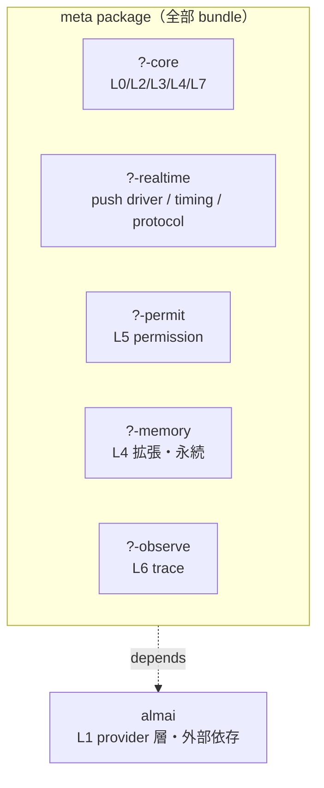

> **[仮版・concept design]** [[almide-agent-framework]] の候補抽象 7 つのうち、**どこまでを「Almide 版 Rails」として bundle するか** を決めるための概念設計ノート。スコープ判断が後の抽出・命名・パッケージ分割すべての境界条件を決めるので、実コードに入る前にここを固める。

Rails が 2004 年に「Web アプリに必要なもの全部入り」を選んだのと同じ位置で、Almide 版 framework は **AI エージェントに必要な何をどこまで含めるか** を選ぶ必要がある。本ノートはその選択肢と判断の根拠。

## なぜスコープから始めるのか

スコープが先に決まらないと:

- 抽出時に「これは framework に上げるべきか」「homullus / AITubeStudio に残すか」の判断軸が定まらない
- 命名すら決められない（含意が変わる）
- 依存関係 / org 構造 / リリース粒度のすべてがブレる
- "[[the-almide-doctrine]] 第 3 原則 Stdlib is the Omakase" を framework レベルでも踏襲できない（おまかせの粒度が決まらない）

Rails が 12 年経って後から Doctrine を書けたのは、最初に **「Web アプリ全部入り」というスコープ判断を腹を括って下した** からこそ。

## 歴史的スコープ判断 — どこにポジションするか

| FW | 領域 | 含めるもの | 性質 |
|---|---|---|---|
| **Sinatra** (2007) | Web | routing + controller のみ | 最小核。DSL の薄さで勝負 |
| **Rails** (2004) | Web | routing / MVC / ORM / view / mail / jobs / asset / test | 全部入り。CoC + 統合で勝負 |
| **LangGraph** (2023) | AI agent | state machine + tools + persistence + checkpoints | loop の構造特化 |
| **Mastra** (2024) | AI agent | agent / workflow / memory / RAG / eval / telemetry / deploy | TS 陣営の Rails ポジション |
| **? (TBD)** | AI agent + realtime | ↓本ノートで決める | Almide 基盤からしか出せない位置 |

Sinatra 路線（薄い core のみ）と Rails 路線（厚い全部入り）の選択は、framework の文化を決定的に分ける。Almide 版がコミュニティ財として育つには、**Rails 寄りの opinionated full-stack** がふさわしいと考えている（[[the-almide-doctrine]] 全体がそれを支持する）。

## スコープ候補 3 つ

### A. 汎用 agent framework（Mastra と機能的に同等）

含める:
- L0 message envelope / L2 agent loop / L3 dispatch / L4 state / L5 permission / L6 observability / L7 testing
- L1 provider は `almai` 依存として外部利用

含めない: realtime / character / avatar / streaming

評価:
- ✓ 一般性が高い、framework として広く使える
- ✗ Mastra の機能網羅で正面対決になる。Almide 基盤の構造的優位（MSR / `effect fn` / WASM）はあるが、差別化が「実装基盤の違い」だけで「カバー領域の違い」がない
- ✗ AITubeStudio が要求する realtime 制約が framework 外に追いやられ、抽出されない

### B. realtime agent framework（構造的差別化）

含める: A の全部 + **realtime primitives**
- push driver（外部イベント駆動の loop tick）
- timing contract（フレーム / レイテンシ予算）
- backpressure（イベント過剰時の対処）
- protocol contract types（WebSocket / SSE のスキーマ契約）

含めない: character / avatar specifics（VRM / 表情 / モーション 等）

評価:
- ✓ Mastra や LangGraph がカバーしない領域に踏み出す
- ✓ AITubeStudio 由来の要求が直接 framework に効く
- ✓ 「リアルタイム agent」は AITuber 以外にも適用領域がある（live chat bot / voice agent / 組込）。一般性を保ちつつ差別化できる
- ✗ A より複雑、設計工数が増える

### C. 全部入り AITuber framework（Rails 級に opinionated）

含める: B の全部 + character / avatar / animation / scene primitives

評価:
- ✓ AITuber 領域で他の追随を許さない強い showcase
- ✗ niche に閉じる、framework としての普及性が落ちる
- ✗ AITubeStudio と framework の境界が曖昧になる（具象と抽象の区別が崩れる）

## 推奨: B + モジュラー構成（Rails 流儀）

**B（realtime agent framework）** を選び、**Rails の meta-gem + sub-gems パターン** で構成する。

各 sub-package は独立して使える（Rails で `activerecord` が `actionpack` 抜きで使えるのと同じ）。meta package は全部 bundle する opinionated なエントリポイント。

`almai` は framework に取り込まず、**外部依存として参照** する。Rails が独自の HTTP クライアントを抱えなかった判断と同じ筋。

## IN / OUT 一覧

### framework に IN（Almide 版 Rails の責務）

| カテゴリ | 内容 |
|---|---|
| 型 | message envelope（Message / ToolCall / Event / Result）|
| ループ | pull 駆動（LLM 応答待ち）と push 駆動（外部イベント）の両対応 agent loop |
| dispatch | tool / command の統一 dispatch surface（name + schema + handler）|
| 状態 | 合成可能な immutable state、再帰 threading |
| 認可 | permission resolver（事前承認 / 事後監視 / リアルタイム遮断）|
| memory | 短命 session + 長命 persistent の 2 層を扱える基本型 |
| realtime | timing 契約 / backpressure / WebSocket protocol contract types |
| 観測 | structured trace events、token usage、レイテンシ計測 |
| テスト | scripted provider + scripted dispatch + scripted realtime event |

### framework が OUT（外部依存 or domain code）

| カテゴリ | 行き先 | 理由 |
|---|---|---|
| LLM provider | `almai` 外部依存 | 既に独立、再発明しない |
| VRM / FBX 描画 | AITubeStudio domain | 抽象化が AITuber に閉じすぎる |
| アニメーション pipeline | AITubeStudio domain | 同上 |
| 表情 / リップシンク | AITubeStudio domain | 同上 |
| OBS / 配信統合 | AITubeStudio domain | 同上 |
| `setEmotion` 等の具体 protocol | AITubeStudio domain | 具体スキーマは domain 側 |

判断軸: **「homullus と AITubeStudio の両方で出てくるか」**。両方で出てくれば framework に上げる。片方だけなら domain code として残す。L5 permission は両者で出てくる（homullus は Bash 危険パターン、AITubeStudio は 配信 moderation）ので IN。avatar 描画は AITubeStudio にしかないので OUT。

## AITubeStudio が framework の上で組み立てるもの

framework の primitives を組み合わせて、AITubeStudio domain code として書く部分:

- VRM / FBX レンダリングパイプライン（three-vrm 相当の WASM 実装 or 委譲）
- 表情・リップシンク・視線・モーション制御
- OBS 連携 / 配信 chrome-free モード
- 視聴者対話 / コメント連動
- 具体的な WebSocket commands（`setEmotion` / `speak` / `lookAt` 等）— protocol contract type だけ framework から借りて、具体スキーマは AITubeStudio が定義
- persona の長期記憶ポリシー

## homullus が framework の上で組み立てるもの

- 6 ツールの具体実装（Bash / Read / Write / Edit / Glob / Grep）
- 各 slash command（`/model` `/tools` `/clear` 等）
- CLI バイナリ起動経路、REPL UI
- streaming UI / token counter 表示
- CLAUDE.md / git status auto-injection

両者が共通して使うのは framework の **L0/L2/L3/L4/L5/L6/L7 + realtime primitives** のみ。

## 何を入れない判断の根拠

スコープを意識的に「狭めに切る」理由:

- **抽象は早期に固定すると現場の都合に縛られる**（[[almide-agent-framework]] と同じ警句）
- **framework は post hoc rationalization が効かない**（Rails Doctrine が後から書けたのは Rails が動いた後だから）
- **AITuber 固有を取り込むと普及性が落ちる**（C 案の弱点）
- **何を含めないかは含めるものと同じくらい重要**（One Canonical Form の含意）

逆に「ここまでは含める」と腹を括る理由:

- realtime primitives を core に含めないと、AITubeStudio が組み立て直しになり homullus との共通抽象が成立しない
- permission を含めないと、agent framework としての安全性の保証が provider 任せになる
- testing harness を含めないと、Rails が `rake test` を含めたのと同じ DX が成立しない

## 次の判断ポイント

このスコープ判断が固まった後に決めるべきこと（順不同）:

1. **package 分割の粒度** — sub-package を 3 つにするか 5 つにするかの細かい判断
2. **L4 state model の API** — record 合成のスタイル、永続化のフックの形
3. **realtime primitives の API** — push tick の入り口、timing 契約の表現方法
4. **command 系 protocol の型表現** — `effect fn` での dispatch をどこまで型レベルで縛るか
5. **framework 名** — スコープが固まれば名前の候補も絞られる

## 押さえどころ（カード化候補）

- スコープから始める理由 → **抽出・命名・依存・org・リリース粒度の境界条件をすべて決めるから。Rails も「Web アプリ全部入り」を最初に腹を括って下したから後の Doctrine が書けた**
- 歴史的ポジション → **Sinatra（薄い core）と Rails（全部入り）の二極のうち、Almide 版は Rails 寄りの opinionated full-stack を選ぶ。Mastra と LangGraph の中間より realtime 寄り**
- スコープ候補 3 つの違い → **A 汎用 agent（Mastra と正面対決）/ B realtime agent（構造的差別化）/ C 全部入り AITuber（普及性が落ちる）。推奨は B**
- 推奨スコープの構成 → **realtime agent framework + Rails 流の meta-gem + sub-gems。`almai` は framework に取り込まず外部依存として参照**
- IN / OUT の判断軸 → **homullus と AITubeStudio の両方で出てくるかどうか。両方なら framework に上げる、片方なら domain code に残す**
- realtime primitives を core に含める根拠 → **これがないと AITubeStudio が組み立て直しになり、homullus との共通抽象が成立しない。差別化の要でもある**
- 何を入れないかが含めるものと同じくらい重要な理由 → **早期に固定すると現場に縛られる / framework は post hoc rationalization が効かない / 普及性のために狭く切る**

## Links

- [[almide-agent-framework]] — 候補抽象 7 つの planning sketch
- [[aitube-studio]] — Basecamp 役のプロダクト planning
- [[the-almide-doctrine]] — スコープ判断が継承する設計哲学
- [Rails sub-gems の参考構造](https://github.com/rails/rails)
- [almide/almai（外部依存として参照）](https://github.com/almide/almai)
