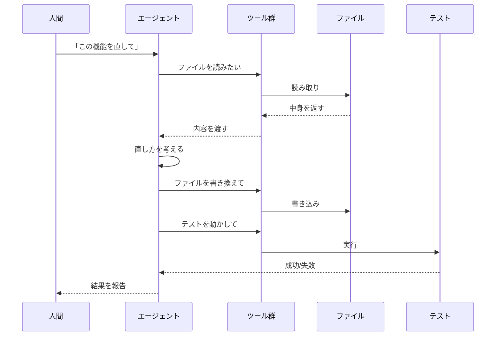

LLM がコードの読み書き・実行・テストを自律的に行う開発パラダイム。

## 何ができる？

これまで人間がキーボードで一文字ずつ打ち込んでいたプログラム作りを、賢い助手にお願いできるようになります。たとえば「この機能を直して」と話しかければ、助手が自分で必要なファイルを探して、書き直し、動作確認まで一通りやってくれます。料理に例えると、これまでは自分で材料を切って炒めて味付けしていたのが、レシピを伝えるだけで助手が買い物から盛り付けまで進めてくれるイメージです。

これが嬉しいのは、人間が「考えること」に集中できるからです。退屈な作業を任せて、設計や判断の部分だけ自分で見る、という分担ができるようになります。

## 用語

- **LLM**: 大量の文章を学習した「言葉のしくみを覚えた巨大なモデル」のこと。質問に答えたり文章を書いたりできる。
- **エージェント**: 指示を受けて自分で考え、必要な作業を順番にこなしてくれる「自律的な助手」プログラム。
- **コード生成**: プログラム（コード）を機械に書いてもらうこと。
- **ツール利用 (Tool Use)**: 助手がファイルを読んだり、コマンドを動かしたりするための「道具」を使えるようにすること。
- **CLI**: 黒い画面に文字で命令を打って操作する仕組み。アイコンをクリックする代わりに文字で指示する。
- **Permission System**: 助手が勝手に危ないことをしないよう、「これはやってよし、これは確認して」と決めるルール集。
- **Context Window**: 助手が一度に覚えていられる文章の量の上限。短期記憶の容量のようなもの。
- **トークン**: 文章を機械が扱う最小単位。日本語だとおおむね1〜2文字で1トークン。覚える容量も料金もこれで計算される。
- **トークン圧縮**: 余計な文字を削って、覚える量を減らす工夫。
- **AST**: プログラムの文法的な「骨組み」をきれいに整理した形。文章で言うと「主語＋述語＋目的語」の構造図のようなもの。
- **Effect system**: プログラムが「何をするか（ファイル書き込み？通信？）」を型で明示する仕組み。助手が間違いを起こしにくくなる。

## 仕組み

人間は「やってほしいこと」を伝えるだけで、エージェントが必要な道具（ツール）を自分で選んで、ファイルを直し、テストで確かめて、結果を返してくれます。途中で失敗したら、エージェントが自分でやり直しを判断します。

## 構成要素

1. **LLM Agent** — コード生成・修正の判断主体
2. **Tool Use** — ファイル操作、Bash 実行、Git 操作
3. **Permission System** — エージェントの行動を制御
4. **Context Window** — エージェントが参照できる情報量の上限

## Context Window の経済学

Agentic coding では context window がボトルネック。コマンド出力が大きいほどトークンを消費し、コストが上がり、古いコンテキストが圧縮される。

[[rtk|RTK]] はこの問題を直接解決する:
- コマンド出力を 60-90% 圧縮
- context window の有効利用率を上げる
- 結果としてエージェントの判断精度が向上

## 言語設計との関係

[[almide|Almide]] は agentic coding を前提に設計された言語:
- **曖昧性除去** → LLM の分岐トークンを削減
- **Effect system** → 生成空間を制限して正確な補完を促進
- **MSR (Modification Survival Rate)** → AI による連続修正の成功率を計測

## 主要ツール

- [[claude-code|Claude Code]] — Anthropic の CLI エージェント
- Cursor — VS Code ベースの AI エディタ
- GitHub Copilot — コード補完 + チャット
- Codex — OpenAI のエージェント
- Gemini CLI — Google のエージェント

## 最適化の方向性

- **言語** — LLM が書きやすい構文 → [[almide|Almide]]
- **出力** — トークン圧縮 → [[rtk|RTK]]
- **可視化** — 知識のグラフ化 → [[graph-garden]]
- **ダイアグラム** — 美しい図の自動生成 → [[premaid]]
