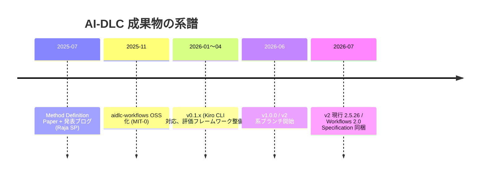
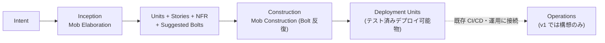

AWS が 2025 年に提唱した開発方法論。**AI を実行の主体（中心的コラボレーター）に据え、人間は承認ゲートで判断・監督する側に回る** — この役割反転を軸に SDLC を第一原理から再設計する。方法論を定義した whitepaper（Method Definition Paper）と、それを AI コーディングエージェント向けの実行可能ワークフローとして OSS 実装した [awslabs/aidlc-workflows](https://github.com/awslabs/aidlc-workflows)（v1 系 / v2 系）で構成される。

## 成果物とバージョンの全体像

「whitepaper v1 / workflow v1 / workflow v2」の 3 点で捉えるのはほぼ正しい。正確には whitepaper が 2 つある:

| 成果物 | 実体 | 日付 |
|---|---|---|
| **Whitepaper ①: Method Definition Paper** | 8 ページの方法論定義書。著者 Raja SP (Principal Solutions Architect, AWS)。[専用サイト](https://prod.d13rzhkk8cj2z0.amplifyapp.com/)で公開(SPA)。[AWS DevOps ブログ](https://aws.amazon.com/blogs/devops/ai-driven-development-life-cycle/)(2025-07-31)はその発表・要約版 | 2025-07 |
| **Workflow v1** | リポジトリ `main` ブランチ。Markdown のステアリングルール群。タグ v0.1.0〜v1.0.1 | OSS 化 2025-11-29 / v1.0.0 2026-06-17 |
| **Workflow v2** | `v2` ブランチ(Workflows 2.0、GA)。git タグは v2.3.0(2026-07-09)まで、README/CHANGELOG 上の現行は **2.5.26**(2026-07-29) | 2026-06〜 |
| **Whitepaper ②: Workflows 2.0 Specification** | `v2` ブランチの `assets/AI-DLC-Workflows-2.0-Specification.pdf`(6 ページ、PDF メタデータ上の作成日 2026-07-22)。v2 実装のビジョン・原則・アーキテクチャを規定 | 2026-07 |

注意: IJAIDSML 掲載論文「AI-DLC: Reimagining Software Engineering for the AI Era」(2026-03)は **AWS ではなく独立研究者 Nitin Addla による二次的レビュー論文**(5 ページ)。AWS 資料を引用してまとめたもので、流通する効果数値の多くはこれ経由。

## 背景と問題意識

whitepaper は現在を「**AI-Assisted の時代**(AI が個別タスクを補助)から **AI-Driven の時代**(AI がプロセス自体をオーケストレーション)への移行期」と位置づける。従来手法(SDLC/Scrum)は人間駆動の長い反復のために設計されており、「AI を後付け(retrofit)すると AI の能力を制約するだけでなく、旧来の非効率を強化する」と断じる。裏付けには第三者研究を引く。従来型プロセスへの AI 後付けの速度向上は 10〜15% 程度(ThoughtWorks 2025)、統制実験では AI 利用開発者がむしろ 20% 遅い(Metr.org)。真のボトルネックは調整会議・依存待ち・コンテキストスイッチを含む「システム全体」にある、というのが whitepaper の診断だ。

## Whitepaper v1 の 10 原則

Method Definition Paper 本体が定義する原則(全文確認済み):

| # | 原則 | 要点 |
|---|---|---|
| 1 | Reimagine rather than retrofit | 既存手法への後付けでなく第一原理から再設計。「速い馬車ではなく自動車を」 |
| 2 | Reverse the conversation direction | **AI が会話を開始・主導**し、人間は承認者に回る。Google Maps の比喩(人間が目的地を設定、システムが経路を提示、人間が旅程を監督) |
| 3 | Integration of design techniques into the core | Scrum が設計技法を範囲外にした空白が品質劣化を招いたとし、DDD/BDD/TDD を方法論の中核に組み込む(初版は DDD フレーバー) |
| 4 | Align with AI capability | 現在の AI は自律実行にはまだ不十分という現実認識の上で、AI-Assisted 以上・完全自律未満のバランスを取る |
| 5 | Cater to building complex systems | 対象は複雑なシステム。ローコードで済む単純系は範囲外 |
| 6 | Retain what enhances human symbiosis | ユーザーストーリーやリスク台帳など、人間の検証に効く既存アーティファクトは残す |
| 7 | Facilitate transition through familiarity | 既存用語との対応関係を保ち 1 日で移行可能に(Sprint→Bolt の意図的リネーム) |
| 8 | Streamline responsibilities | インフラ/FE/BE/DevOps/セキュリティのサイロを越境させ役割を最小化。PO と開発者は残す |
| 9 | Minimise stages, maximise flow | 人間の検証を「**損失関数**」として機能させ、下流の無駄を早期に刈る。フェーズは最小限だが十分な数 |
| 10 | No hard-wired, opinionated SDLC workflows | 固定ワークフローを押し付けず、AI が意図から Level 1 Plan を提案し人間が検証。以降のレベルへ再帰 |

## 中心動作ループ

「AI が計画を作り、明確化の質問でコンテキストを取りにいき、**人間の承認を得てから**実装する」— このサイクルを全活動で高速に繰り返す。仕組みとしては:

- **Level 1 Plan**: 意図(グリーンフィールド開発/機能追加/リファクタ/欠陥修正)を与えると AI がワークフロー全体の計画を提案 → 人間が検証 → 各ステップをさらにサブタスクへ再帰分解([[htn-planning|HTN プランニング]]と同型の発想)
- **損失関数としての人間**: 各ステップの検証が「エラーが雪だるまになる前に早期に刈り取る」役割を担う
- **Context memory**: 生成された全アーティファクト(意図、ストーリー、ドメインモデル、テスト計画)を永続化し、AI がライフサイクル横断で参照。全アーティファクトは前方/後方トレーサビリティでリンクされる

厳格なフェーズ構造と承認ゲートで LLM を縛ることでむしろ力を引き出す設計は、[[constraints-liberate|制約が自由を生む]]の方法論版といえる。

## 分解構造: Intent → Unit → Bolt

whitepaper の正確な定義:

| 概念 | 定義 |
|---|---|
| **Intent** | 達成したいことの高位ステートメント(ビジネスゴール/機能/技術的成果)。AI 駆動分解の起点 |
| **Unit** | Intent から導かれる自己完結の作業要素。DDD のサブドメイン/Scrum のエピック相当。凝集度の高いユーザーストーリー群を含み、Unit 同士は疎結合(並行開発・独立デプロイ可能) |
| **Bolt** | **最小のイテレーション**(Sprint の置き換え)。1 つの Unit、または Unit 内のストーリー群を実装する。ビルド-検証サイクルは週でなく**時間〜日**単位。1 Unit は 1 個以上の Bolt で実行され、Bolt は**並列でも逐次でも**走らせられる。Bolt の計画は AI が立て、開発者/PO が検証する |

アーティファクトの流れ: Domain Design(インフラ非依存のビジネスロジックモデル。集約・エンティティ・値オブジェクト等)→ Logical Design(NFR を満たす設計パターン適用 + ADR 生成)→ Code & Unit Tests → **Deployment Units**(コンテナイメージ/サーバレス関数 + Helm/Terraform/CFN 等の構成一式。機能・セキュリティ・NFR・運用リスクのテスト済み)。

## 3 フェーズと儀式

1. **Inception** — 儀式は **Mob Elaboration**: PO・開発者・QA らが 1 室(共有スクリーン+ファシリテータ)に集まり、AI が Intent をストーリー・受入条件・Unit へ分解提案し、モブ全体でその場で検証・修正する。典型 4 時間〜半日で「数週間〜数か月分の逐次作業を凝縮」。出力: 明確に定義された Unit 群 + a) PRFAQ b) ユーザーストーリー c) NFR 定義 d) リスク記述(組織のリスク台帳と照合) e) ビジネス意図に遡れる測定基準 f) **Suggested Bolts**
2. **Construction** — 儀式は **Mob Construction**: Inception の検証済みコンテキストを使い、Unit ごとに Domain Design → Logical Design → コード生成 → 自動テストを Bolt で反復。チームは同室でリアルタイムに技術判断を返す(例: Lambda は承認するがストレージは DynamoDB に上書き)。ブラウンフィールドでは最初にコードを静的モデル+動的モデルへ**逆行モデリング**して意味的コンテキストを構築
3. **Operations** — AI がテレメトリ(メトリクス/ログ/トレース)を分析して異常検知・SLA 違反予測、ランブックと連携して対処を提案し、開発者の承認後に実行する — という**構想**(後述の通り v1 実装では未実装)

## 実務: Inception + Construction の 2 フェーズ Bolt 運用

whitepaper v1 は 3 フェーズを定義するが、**開発ループとして実際に回るのは Inception と Construction だけ**であり、2 フェーズ運用は方法論の実態と一致する。根拠は 3 つ:

1. **whitepaper 自身の実践例(Appendix A)が 2 フェーズ** — 同梱のプロンプト集は Setup(aidlc-docs フォルダ規約)/ Inception(User Stories、Units)/ Construction(Domain Model、Code Generation、Architecture/IaC)のみで、**Operations 用プロンプトは存在しない**。デプロイ計画・IaC 生成までが Construction 側のプロンプトとして書かれている
2. **OSS 実装(workflow v1)の Operations は PLACEHOLDER** — `core-workflow.md` の Operations フェーズは 1 ステージだけの空実装で「将来のデプロイ/監視用」と明記。実装が提供するのは Inception 7 ステージ + Construction 6 ステージ
3. **AWS の実践者も公言** — 顧客ワークショップを 9 か月実施した AWS の Micah Walter が「Operations フェーズはまだプレースホルダー」と摩擦点として自認

**2 フェーズ運用の境界線**: Construction の完了条件は「テスト済み・運用可能な Deployment Units」まで。つまり 2 フェーズで「デプロイ可能物 + ビルド/テスト完了」を作り、**デプロイ実行・監視・インシデント対応は既存の CI/CD・運用プラクティスへ接続する**のが v1 時点の設計上の落とし所。逆に言えば、AI-DLC を導入しても運用側のガバナンス(リリースゲート、変更管理、監査証跡)は自前で維持する必要がある — これは批判側(後述の Explore Agentic)が「方法論は実在するがガバナンス層は実在しない」と指摘する点でもある。

## Workflow v1 の実装詳細

実装といってもコードは含まれない。実体は **Markdown のステアリングルール群**(MIT-0)で、Tenets に「Methodology first(ツールより方法論)」「Agnostic(特定 IDE/モデル非依存)」「Human in the loop」を掲げる。

- **コア**: `aidlc-rules/aws-aidlc-rules/core-workflow.md`(539 行、「This workflow OVERRIDES all other built-in workflows」)+ 条件付きで参照される詳細ルール `aws-aidlc-rule-details/`(common 10 / inception 7 / construction 6 / operations 1 / extensions)
- **ステージ構成**: Inception = ① Workspace Detection(常時)→ ② Reverse Engineering(brownfield のみ)→ ③ Requirements Analysis(常時)→ ④ User Stories(条件付き)→ ⑤ Workflow Planning(常時)→ ⑥ Application Design(条件付き)→ ⑦ Units Generation(条件付き)。Construction = Unit ごとに Functional Design / NFR Requirements / NFR Design / Infrastructure Design(条件付き)+ Code Generation(常時)→ 全 Unit 完了後に Build and Test(常時)
- **承認ゲート**: ほぼ全ステージ末尾に「Wait for Explicit Approval — DO NOT PROCEED」。標準 2 択(Request Changes / Continue)を強制し、勝手な 3 択メニュー等の逸脱を明示的に禁止。User Stories と Code Generation は「計画承認 → 生成」の 2 重ゲート
- **adaptive の実装**: 各条件付きステージに Execute IF / Skip IF の具体条件を列挙し、Workflow Planning ステージが全ステージの EXECUTE/SKIP を判定して Mermaid の実行計画(`aidlc-docs/inception/plans/execution-plan.md`)として可視化 → ユーザーが承認。深さは別軸で、成果物の詳細度を 6 要因(明確さ/複雑度/スコープ/リスク/文脈/ユーザー好み)から調整
- **extensions**: security / testing / resiliency の 3 カテゴリ。起動時は `.opt-in.md`(選択式質問)だけロードし、opt-in 後に本体ルール(SECURITY-01〜10 等、各ルールに Verification 節)をロード。違反はステージ完了を**ブロック**する
- **生成物**: すべて `aidlc-docs/` 配下(コードはワークスペースルート)。`aidlc-state.md`(進捗)、`audit.md`(**追記専用**・全ユーザー入力を要約禁止で生記録・ISO 8601 タイムスタンプ)、requirements/、plans/、ユニット別成果物など。質問への回答は Markdown 内の `[Answer]:` タグ + チェックボックス進捗
- **インストール**: リリース zip を展開し所定位置へコピー — Kiro `.kiro/steering/`、Amazon Q `.amazonq/rules/`、Claude Code `CLAUDE.md`、Cursor `.cursor/rules/*.mdc`、Cline `.clinerules/`、Copilot `.github/copilot-instructions.md`、Codex `AGENTS.md`。起動はチャットで「**Using AI-DLC, ...**」と打つだけ
- **品質担保**: `scripts/aidlc-evaluator/` — 同じルールを複数モデル(Nova Lite〜Opus 4.6)・複数エージェントで走らせ、セマンティック評価+静的解析+モデル間一貫性で採点する回帰評価フレームワーク

## Workflow v2 (Workflows 2.0) の実装詳細

「one core, many harnesses」— ハーネス中立の単一 `core/` から各ツールへネイティブ生成。決定論エンジン(状態機械・監査・並列調停)は全ハーネスで byte-identical。前提は bun + AWS Bedrock。

- **5 フェーズ 32 ステージ**(3+7+8+7+7): Phase 0 Initialization(Workspace Scaffold / Detection / State Initialization — ここだけ承認ゲートなしの決定論実行)、Phase 1 Ideation(Intent Capture & Framing / Market Research / Feasibility / Scope Definition / Team Formation / Rough Mockups / Approval & Handoff)、Phase 2 Inception(Reverse Engineering / Practices Discovery / Requirements Analysis / User Stories / Refined Mockups / Application Design / Units Generation / Delivery Planning)、Phase 3 Construction(Functional Design / NFR Requirements / NFR Design / Infrastructure Design / Code Generation / Build and Test / CI Pipeline — **Bolt 単位で反復**)、Phase 4 Operation(Deployment Pipeline / Environment Provisioning / Deployment Execution / Observability Setup / Incident Response / Performance Validation / Feedback & Optimization)。**v1 で構想止まりだった Operations が 7 ステージの実装になった**のは大きな進化
- **14 エージェント**: ドメイン専門 11(product / architect / aws-platform / developer / quality / devsecops / compliance / delivery / design / pipeline-deploy / operations)+ レビュー専任 2(product-lead、architecture-reviewer — 「Does not produce — only reviews」)+ **composer**(implementation entropy を推定し最小十分なステージ列を合成)。エージェント間の直接呼び出しは禁止(オーケストレータのみが委譲)
- **質問はファイルベースの選択式**: 各ステージが `<slug>-questions.md` を生成(A〜E + 必ず `X. Other` + `[Answer]:` タグ)。回答モードは Guide Me(対話)/ I'll Edit the File(直接編集)/ Chat(自由対話から抽出)の 3 つで「質問ファイルが常に source of truth」。質問数は depth 連動(Minimal 2–4 / Standard 5–8 / Comprehensive 8–12+)
- **9 スコープ**(EXECUTE ステージ数/32): enterprise 32 / feature 32(既定)/ mvp 22 / workshop 25 / infra 13 / security-patch 10 / poc 8 / refactor 8 / bugfix 7。自由文からキーワード推論し、複雑な意図は composer が合成(`/aidlc compose`、実行中の recompose も可)。**3 深度**(Minimal/Standard/Comprehensive)+ depth 独立の **3 テスト戦略**(Minimal は「要件 1 つに 1 テスト」の Nyquist モデル)
- **「検証可能・自己修正」の実体**: ① 決定論センサー(Write/Edit 時に出典タグ・必須セクション・上流参照・linter・型チェックを自動検証。現状 advisory)② **敵対的レビュアー契約**(「defect がある前提で反証を試み、破壊に失敗した結果が READY」。producer とは別モデル階層、上限超過で人間へエスカレーション)③ flow-altering フック 3 種(turn 終了をブロックしてワークフロー継続を強制 / 状態直接改変の拒否 / レビュアーの越境読み取りブロック)④ フェーズ境界での成果物存在・トレーサビリティ・孤児検出。監査は **74 イベント・19 カテゴリ**
- **二層ナレッジ + 学習ループ**: Tier 1(フレームワーク同梱、編集禁止)/ Tier 2(チーム管理)。ルールは org → team → project → phase → stage の 5 層 strict-additive で、ワークフロー開始時に一度だけコンパイル(実行中不変)。ステージ中の逸脱・解釈を日誌化し、ゲート前に人間が承認した項目だけが `memory/project.md` の永続ルールに着地(team へワンクリック昇格)
- **extensions の実体はプラグイン機構**(v2.3.0〜): `plugins/<name>/` に記述し、packager が各ハーネスの実プラグインへ射影。既存ステージへ成果物・センサー・本文断片を冪等に合流できる。同梱リファレンスは `test-pro` 1 つ。※「security/testing/resiliency 拡張」は v1 の構成で、v2 では未同梱
- **ハーネス**: Claude Code(`dist/claude/` をコピーし `/aidlc`)、Kiro IDE / Kiro CLI ≥2.6、Codex CLI ≥0.145.0(`$aidlc`)、opencode ≥1.17(v2.4.6〜)。検証は `/aidlc --doctor`

## v1 → v2 の変化(要点)

| 観点 | v1 | v2 |
|---|---|---|
| フェーズ/ステージ | 3 フェーズ 14 ステージ | 5 フェーズ 32 ステージ(+Ideation、Operations 実装化) |
| 実行主体 | 単一エージェント + ルール | 14 エージェント分業 + composer による動的合成 |
| 実装形態 | Markdown ルールのコピー | `core/` からハーネス別に生成(bun + Bedrock 前提) |
| 承認ゲート | ほぼ全ステージ(Phase 0 相当なし) | 全ステージ(Phase 0 のみ決定論実行) |
| 検証 | ルール内の指示 + 評価フレームワーク | センサー + 敵対的レビュアー + 強制フック + トレーサビリティ検証 |
| スコープ適応 | Execute IF/Skip IF + 深さ 6 要因 | 9 スコープ × 3 深度 × 3 テスト戦略 + entropy ベース合成 |
| 拡張 | opt-in 式ルール(ブロッキング) | プラグイン機構(センサーは現状 advisory) |

## 実際に使うとどうなるか

- **開始**: v1 はチャットに「Using AI-DLC, let's build a web application to solve the river crossing puzzle.」のように打つだけ。歓迎メッセージ → Workspace Detection → Requirements Analysis → … と進み、各ステージで承認待ちになる
- **承認体験の実態**: AI が `requirement-verification-questions.md` に選択式質問を書き出し、人間はファイル内の `[Answer]:` タグに回答して「Done」とチャットに打つ。計画はチェックボックス付き md で提示され「Continue」か修正指示で応じる — 「ファイル編集 + 短いチャット入力」が承認の実像
- **公式ワークショップ**(AWS Workshop Studio「AI-DLC Workshop」): 意図(従業員アイデア提出プラットフォーム)を入力 → AI が 15 問の逆質問(認証方式、ロール、スコア尺度…)→ 回答後に FR1〜8 + NFR + データモデル入りの requirements.md が数分で完成、という体験報告(Qiita)
- **Unicorn Gym**(AWS と顧客の協働プログラム。日本開催 2026-01-22〜23、11 社参加): 8 名混成チームが Kiro で 2 日間、1 日目 Inception(ストーリー 10〜15 件推奨、FE/BE ユニット分割、コンテキストマップ、OpenAPI 設計書)、2 日目 Construction で結合テストまで到達。ルールは「人間はコードを一切書かない/全成果物レビュー必須/違和感があれば修正でなく破棄・作り直し」(DevelopersIO)
- **実践知見(日本語圏)**: AI の生成速度がレビュー速度を上回り**人間のレビューがボトルネック化**/若手だけでは提案の運用耐性を評価できず「なんとなく良さそう」で通しがち(シニア同席が品質維持に効く)/「コードを読めるメンバーが半数以上」が望ましい/YAGNI 徹底と「何を作らないか」の意思決定が従来以上に重要/実装前に言語・FW・ディレクトリ規約を固定
- re:Invent 2025 のセッション **DVT214** が正式紹介の場。Tips として「タスクは狭く定義」「無関係コンテキストのクリア」「意味密度の高い指示」「CI/CD 整備を先に(生成が速くなるとテスト・リリースがボトルネック化)」

## 効果の主張と検証状況

- **原典ブログ自体には数値が一切ない**(定性的主張のみ)。流通する数値 — 生産性 10〜15 倍、開発速度 40〜60% 改善、欠陥 40〜60% 減、12 か月 ROI 300〜500%、予測可能性 20%→80% 超 — はすべて AWS のプレゼン・内部資料・二次論文経由の**ベンダー自己申告値**で、「業界・地域をまたぐ 100 件超の顧客実験に基づく」との記載はあるが測定方法は非公開
- 事例も条件付き: Wipro「3 か月分の作業を約 20 時間」は AWS 支援下の 20 時間ワークショップでのライブデモ。Dun & Bradstreet「2 か月見積を 48 時間」も同系。第三者の Explore Agentic は「明確な要件・グリーンフィールド・継続的チーム参加という好条件下の数字。ベンダーベンチマークとして扱え」と注記
- **独立した第三者検証は存在しない**(2026-07 時点、確認できた範囲で)。AWS 自身が対置する「非構造化な AI 導入は 10〜15% 止まり」という比較の根拠構造も AWS の語りに依存している

## 批判と限界

- **ガバナンス層の不在**(Explore Agentic): AI の計画を「誰が・どの基準で・どこに記録して」承認するか未定義で、監査人がテストできる統制になっていない。「コードを書いた同じエージェントがテストも書く。それは**自己採点**だ」。「AWS は速度を渡した。説明責任は自分で構築する必要があり、しかも先に構築すべきだ」
- **間違ったボトルネック論**(Will Mitchell, 元 Dropbox/Asana): 真の制約は上流の「ユーザー理解・検証・合意」であり、ビルドを速くすると制約は人間中心工程に移るだけ。Mob Elaboration はユーザーインサイトなしのリアルタイム意思決定を迫り、出荷後検証の不在は「誰も使わない機能の大量出荷」リスクを生む。同趣旨で Kerno も「コードが正しいことを理解するのが最遅工程。エージェント能力の向上は人間レビュアーへ認知負荷を移すだけ」
- **理論的裏付けの薄さ**(Peter Tilsen): プロンプトやフォルダ構造など実装メカニクスに偏り、「学習」と「較正」の混同、context memory の実装不透明さを指摘(ただし「潜在的に革命的」と肯定も)
- **Mob 儀式のコスト**: 4 人での Bolt 検証モブは「スプリントなら 2 週間に分散していた作業がシニアの丸一日の午後を食う」— シニアの注意という希少資源の集中投下が前提
- **コミュニティの温度**: AWS エコシステム内の熱量に対し、Hacker News はほぼ無反応(関連投稿は 3〜5 ポイント・コメント 0〜2)、Reddit にも実質的議論スレなし。エバンジェリズムと外部の無関心のコントラストが顕著

## Spec-Driven Development との関係・エコシステム

- 第三者の整理では「**AI-DLC = SDD の組織的実装(operationalization)**」— SDD は個人プラクティスでチーム調整と組織導入を扱わないが、AI-DLC はモブ儀式とフェーズ成果物で組織スケーリングを加える(BuildWithDC)。AI-DLC は分解のデフォルトとして DDD を組み込む点も特徴
- 関連ツール/手法: Kiro(AWS 製スペック駆動 IDE)、GitHub Spec Kit、BMAD-METHOD、Agent OS。AI-DLC 派生実装として specs.md(忠実実装+軽量版)、Chorus(OSS 協働プラットフォーム)、ai-dlc-uml など
- 補助ツール(AWS samples): aidlc-design-reviewer(Bedrock でマルチエージェント設計レビュー)、aidlc-traceability、aidlc-code-reviewer

## 押さえどころ（カード化候補）

- **AI-DLC とは** → AWS が 2025 年に提唱した AI ネイティブ開発方法論。AI が実行主体・人間は承認ゲートで監督、に役割を反転する。
- **成果物の全体像** → whitepaper は 2 つ: Method Definition Paper(2025-07、Raja SP)と Workflows 2.0 Specification(2026-07、v2 同梱 PDF)。実装は aidlc-workflows の v1(main)と v2(現行 2.5.26)。
- **分解 3 層** → Intent(意図)→ Unit(疎結合な作業単位、エピック相当)→ Bolt(最小イテレーション、時間〜日単位、Unit 内で並列/逐次可)。
- **中心ループ** → AI が計画(Level 1 Plan)→ 明確化質問 → 人間承認 → 実装。人間の検証は「損失関数」。
- **2 フェーズ運用の根拠** → 開発ループは Inception + Construction で完結する設計。whitepaper の Appendix A に Operations プロンプトはなく、workflow v1 の Operations は PLACEHOLDER。デプロイ以降は既存 CI/CD へ接続。
- **Inception の出力** → Unit 群 + PRFAQ / ストーリー / NFR / リスク / 測定基準 / **Suggested Bolts**。
- **v2 の骨格** → 5 フェーズ 32 ステージ、14 エージェント(専門 11 + レビュー 2 + composer)、9 スコープ × 3 深度、ファイルベース選択式質問、敵対的レビュアー、Claude Code/Kiro/Codex/opencode 対応。
- **効果数値の扱い** → 10〜15x 等は AWS 側自己申告で独立検証なし。引用時は必ずその旨を添える。
- **実践の最重要知見** → ボトルネックはコード生成でなく**人間のレビュー速度**。シニアの承認能力がスループット上限になる。

## 関連

- [[ai-dlc-basics]] — 開発 1 年目向けの入門版。まず全体感を掴みたい人はこちらから
- [[constraints-liberate]] — 厳格なフェーズ構造・承認ゲートで LLM を縛ることで力を引き出す = 制約が自由を生むの方法論版
- [[error-messages-for-ai-agents]] — AI エージェントを開発の第一級の行為者として設計し直す同じ潮流。あちらはコンパイラ出力、こちらはプロセス全体
- [[htn-planning]] — Intent → Level 1 Plan → サブタスクの再帰分解は階層型タスクネットワークと同型の発想

## Links

### 一次資料
- [AI-DLC Method Definition Paper (Raja SP, AWS)](https://prod.d13rzhkk8cj2z0.amplifyapp.com/) — whitepaper v1 本体(8 ページ、SPA サイト)
- [AI-Driven Development Life Cycle (AWS DevOps blog, 2025-07-31)](https://aws.amazon.com/blogs/devops/ai-driven-development-life-cycle/) — 発表ブログ
- [awslabs/aidlc-workflows](https://github.com/awslabs/aidlc-workflows) — main = v1 系 / [v2 ブランチ](https://github.com/awslabs/aidlc-workflows/tree/v2) — 現行 GA、Workflows 2.0 Specification PDF 同梱
- [Open sourcing adaptive workflows for AI-DLC (AWS DevOps blog, 2025-11-29)](https://aws.amazon.com/blogs/devops/open-sourcing-adaptive-workflows-for-ai-driven-development-life-cycle-ai-dlc/)
- [Building with AI-DLC using Amazon Q Developer (AWS DevOps blog)](https://aws.amazon.com/blogs/devops/building-with-ai-dlc-using-amazon-q-developer) — 実践ガイド(川渡りパズル)
- [AI-DLC for Financial Services (AWS Industries blog)](https://aws.amazon.com/blogs/industries/ai-driven-development-lifecycle-for-financial-services/) — 規制産業文脈
- [re:Invent 2025 DVT214 録画](https://www.youtube.com/watch?v=1HNUH6j5t4A)

### 二次資料・実践報告
- [AI-DLC: Reimagining Software Engineering for the AI Era (Nitin Addla, IJAIDSML, 2026)](https://ijaidsml.org/index.php/ijaidsml/article/view/469) — 独立研究者による二次レビュー論文
- [Unicorn Gym 日本開催 参加記 (DevelopersIO)](https://dev.classmethod.jp/articles/aws-ai-dlc-unicorn-gym-260122-23/)
- [AI-DLC Workshop 体験記 (Qiita)](https://qiita.com/senbu/items/da8f2c0f584a0ba06cf2) / [チーム実践の課題報告 (Qiita)](https://qiita.com/yakumo_09/items/76e416a5ae28f18ad976)
- [DVT214 セッションまとめ (Zenn)](https://zenn.dev/kiiwami/articles/45a7ac851f2aeb27)

### 批評
- [A critical, yet hopeful view (Peter Tilsen, Medium)](https://medium.com/data-science-collective/the-ai-driven-development-lifecycle-ai-dlc-a-critical-yet-hopeful-view-edc966173f2f)
- [AI-DLC Explained (Explore Agentic)](https://www.exploreagentic.ai/insights/ai-dlc/) — ガバナンス層不在の指摘
- [AI-DLC Solves the Wrong Bottleneck (Will Mitchell)](https://wakamoleguy.com/p/ai-dlc-solves-wrong-bottleneck)
- [Notes on exploring AI-DLC (Micah Walter, AWS)](https://www.micahwalter.com/posts/notes-on-exploring-ai-dlc) — 実践者の摩擦点自認
- [AI-DLC implements Spec-Driven Development (BuildWithDC)](https://buildwithdc.substack.com/p/aidlc-implements-spec-driven-development)
