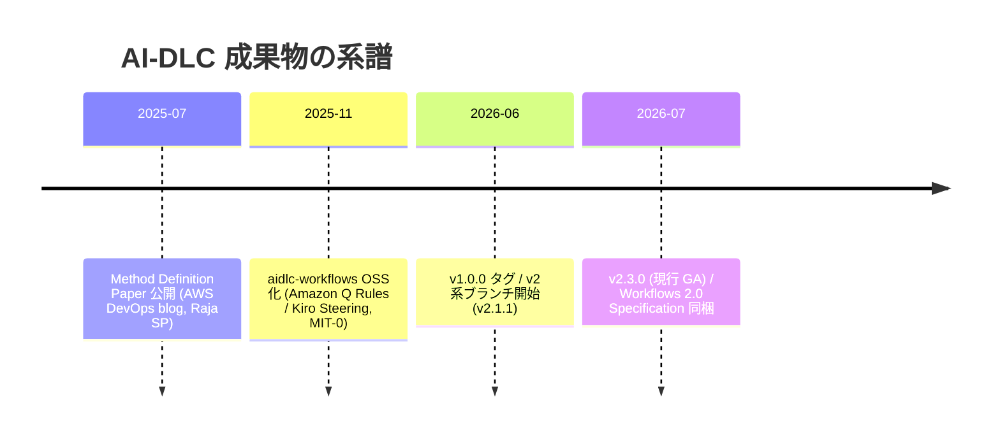

AWS が 2025 年に提唱した開発方法論。**AI を「補助ツール」ではなく実行の主体（中心的コラボレーター）に置き、人間は承認ゲートで判断・監督する側に回る**よう SDLC を組み替える。方法論を定義した whitepaper（Method Definition Paper）と、それをコーディングエージェント向けの実行可能なワークフローとして OSS 実装した [awslabs/aidlc-workflows](https://github.com/awslabs/aidlc-workflows)（v1 系 / v2 系）の三層構造で捉えると全体像が掴める。

## 中核思想 — 役割の反転

従来: 人間が実行し、AI が補助する。AI-DLC: **AI が実行し、人間が監督する**（"AI Powered Execution with Human Oversight"）。中心となる動作パターンは全フェーズで同一:

1. AI が計画を立てる
2. 曖昧な点を**人間に質問して**コンテキストを取りにいく
3. **人間の承認（validation）を得てから**実装する

このループを高速に回す。ビジネス文脈を要する判断は必ず人間に委ねられる — AI の自律性を上げるほど、逆に**人間のチェックポイントを構造として明示する**必要が生じる、という設計。厳格なフェーズ構造と儀式で LLM の力を縛ることでむしろ引き出す、[[constraints-liberate|制約が自由を生む]]の方法論版といえる。

## 方法論の語彙

アジャイルの語彙を AI 前提に置き換えている:

| AI-DLC の用語 | 置き換え対象 | 意味 |
|---|---|---|
| **Bolt** | スプリント | 作業サイクル。週単位ではなく**時間〜日単位** |
| **Unit of Work** | エピック | 作業のまとまり |
| **Mob Elaboration** | 要件定義・リファインメント | チーム全員で AI の質問・提案を検証しながら要件化する儀式 |
| **Mob Construction** | 実装 | AI が設計・コード・テストを提案し、チームがリアルタイムに技術判断を返す儀式 |

## 3 つのフェーズ（元の方法論定義）

1. **Inception** — Mob Elaboration の場。AI がビジネス意図を詳細な要件・ストーリーへ変換し、チーム全体で AI の質問と提案を検証する
2. **Construction** — Mob Construction の場。AI がアーキテクチャ・ドメインモデル・コード・テストを提案し、チームが技術判断をその場で返す
3. **Operations** — AI がインフラとデプロイを管理し、前フェーズまでに蓄積したコンテキストを活かしてチームが監督する

## 成果物とバージョンの全体像

「whitepaper v1 / workflow v1 / workflow v2」という 3 点で捉えるのはほぼ正しい。正確には **whitepaper が 2 つある**（方法論定義と、v2 用の仕様書）:

| 成果物 | 実体 | 日付 |
|---|---|---|
| **Whitepaper ①: Method Definition Paper** | AWS DevOps ブログ + 論文。著者 Raja SP (Principal Solutions Architect, AWS) | 2025-07-31 |
| **Workflow v1** | aidlc-workflows の `main` ブランチ。タグ v0.1.0〜v1.0.1 | OSS 化 2025-11-29 / v1.0.0 タグ 2026-06-17 |
| **Workflow v2** | 同リポジトリの `v2` ブランチ。タグ v2.1.1〜v2.3.0（現行）。GA | v2.1.1 タグ 2026-06-26 / v2.3.0 タグ 2026-07-09 |
| **Whitepaper ②: Workflows 2.0 Specification** | `v2` ブランチに PDF として同梱された正式仕様書 | v2 と同時期 |

リポジトリは MIT-0 ライセンス。OSS 化発表の著者は Will Matos, Raj Jain, Siddhesh Jog, Raja SP。

## Workflow v1 — adaptive workflows

方法論を **AI コーディングエージェント向けのステアリングルール**（Amazon Q Developer の Rules / Kiro の Steering ファイル）として実装したもの。「adaptive」の意味は:

- **動的ステージ選択** — 意図とコンテキストの評価に基づき、ステージを賢くスキップしたり深掘りしたりする（breadth の適応）
- **深さの変調** — 各ステージの掘り下げをプロジェクトの複雑さに合わせる（depth の適応)
- **承認ゲート** — 重要な判断点に human-in-the-loop の承認を挟む
- Mob Elaboration / Mob Construction の儀式を Inception / Construction / Operations の 3 フェーズ上で回す

## Workflow v2 — Workflows 2.0（現行）

「検証可能で自己修正するエンジニアリングワークフロー」への全面再設計。GA 版:

- **5 フェーズ・32 ステージ** — Initialization / Ideation / Inception / Construction / Operation
- **14 エージェント編成** — ドメイン専門 11 + レビュー専任（品質ゲート）2 + adaptive-workflows composer 1。composer がユーザーの意図やスキャンレポートからステージ計画を組み立てる
- **全ステージに承認ゲート** — v1 の「重要な判断点」から「毎ステージ」へ強化
- **質問はチャットではなくファイル内の選択式** — AI の質問を構造化された multiple-choice としてファイルに書き出し、人間が選んで返す
- **9 段階の adaptive scope**（enterprise〜workshop、自由記述の意図から自動判定）× **3 段階の深さ**（Minimal / Standard / Comprehensive)+ 独立したテスト戦略レベル
- **拡張（extensions）によるブロッキング制約** — security / testing / resiliency などを「通らないと先へ進めない制約」として合成できる
- **二層ナレッジシステム + 学習ループ** — フレームワーク同梱の方法論知識とチーム管理の知識を分離し、人間の修正を永続的な行動ルールに変換して蓄積する
- **マルチハーネス** — 単一のソースから Claude Code（一次リファレンス実装）・Kiro IDE・Kiro CLI (≥2.6)・Codex CLI (≥0.145.0)・opencode (≥1.17) にインストールできる。決定的なエンジンは共通で、表層のシェルだけがプラットフォームごとに異なる

## v1 → v2 の変化（要点）

| 観点 | v1 | v2 |
|---|---|---|
| フェーズ | 3（Inception / Construction / Operations） | 5（+ Initialization / Ideation）・32 ステージ |
| 実行主体 | 単一エージェント + ステアリングルール | 14 エージェントの分業 |
| 承認ゲート | 重要な判断点 | 全ステージ |
| 質問の形式 | チャット対話 | ファイル内の構造化選択式 |
| 品質制約 | ルール内の指示 | 拡張によるブロッキング制約 |
| 対応ツール | Amazon Q Developer / Kiro | Claude Code / Kiro IDE / Kiro CLI / Codex CLI / opencode |
| 仕様書 | ブログ + Method Definition Paper | 専用の Workflows 2.0 Specification (PDF) |

## 効果の主張と読み方の注意

論文（IJAIDSML 掲載版）は 100 社超の顧客実験に基づくとして **生産性 10〜15 倍・開発速度 40〜60% 改善・欠陥 40〜60% 削減・12 ヶ月で ROI 300〜500%** を主張し、Wipro・S&P Global・Persistent Systems・NASDAQ などが実験中とする。ただしこれらは**提唱元（AWS）側の自己報告値**であり、独立した追試はまだ乏しい。方法論自体も 2025 年生まれで若く、v1→v2 で構造が大きく変わった点からも、まだ設計が流動的であることは織り込んで読むべき。

## 押さえどころ（カード化候補）

- **AI-DLC とは** → AWS が 2025 年に提唱した開発方法論。AI が実行の主体、人間は承認ゲートで監督する側に役割を反転させる。
- **中心ループ** → AI が計画 → 曖昧さを人間に質問 → 人間の承認後に実装。これを全フェーズで高速に回す。
- **語彙の置き換え** → Bolt（スプリント→時間単位）、Unit of Work（エピック）、Mob Elaboration（要件の儀式）、Mob Construction（実装の儀式）。
- **成果物の 3+1 構造** → Method Definition Paper（2025-07）→ workflow v1（OSS 化 2025-11、steering rules）→ workflow v2（2026-06〜、GA）+ v2 同梱の Workflows 2.0 Specification。whitepaper は実は 2 つ。
- **v2 の骨格** → 5 フェーズ 32 ステージ、14 エージェント（専門 11 + レビュー 2 + composer 1）、全ステージ承認ゲート、選択式質問のファイル化、9 scope × 3 depth、単一ソースから 5 ハーネスへ。
- **効果数値の扱い** → 10〜15x 等は AWS 側の自己報告。独立検証は乏しい、と添えて引用する。

## 関連

- [[constraints-liberate]] — 厳格なフェーズ構造・承認ゲートで LLM を縛ることで力を引き出す = 制約が自由を生むの方法論版
- [[error-messages-for-ai-agents]] — AI エージェントを開発の第一級の行為者として設計し直す同じ潮流。あちらはコンパイラ出力、こちらはプロセス全体

## Links

- [AI-Driven Development Life Cycle (AWS DevOps blog, 2025-07-31, Raja SP)](https://aws.amazon.com/blogs/devops/ai-driven-development-life-cycle/) — Method Definition の原典
- [Open sourcing adaptive workflows for AI-DLC (AWS DevOps blog, 2025-11-29)](https://aws.amazon.com/blogs/devops/open-sourcing-adaptive-workflows-for-ai-driven-development-life-cycle-ai-dlc/) — workflow v1 の OSS 化発表
- [awslabs/aidlc-workflows](https://github.com/awslabs/aidlc-workflows) — main = v1 系
- [awslabs/aidlc-workflows v2 ブランチ](https://github.com/awslabs/aidlc-workflows/tree/v2) — 現行 GA。Workflows 2.0 Specification PDF 同梱
- [AI-DLC: Reimagining Software Engineering for the AI Era (IJAIDSML)](https://ijaidsml.org/index.php/ijaidsml/article/view/469) — 論文版。効果数値の出典
- [Building with AI-DLC using Amazon Q Developer (AWS DevOps blog)](https://aws.amazon.com/blogs/devops/building-with-ai-dlc-using-amazon-q-developer) — v1 の実践ガイド
