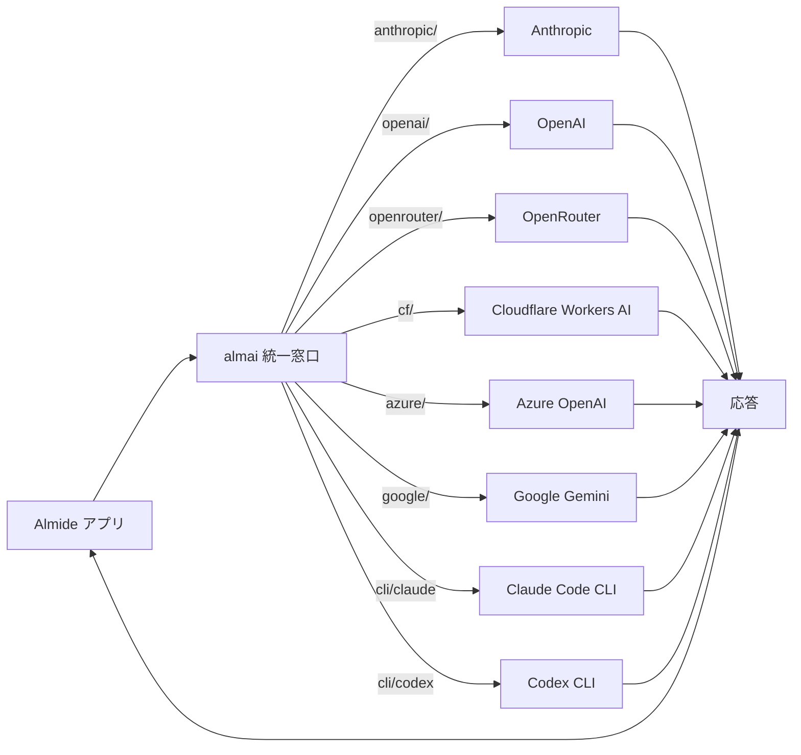

[[almide|Almide]] 用のマルチプロバイダ LLM クライアント。一つのインターフェースで全プロバイダ（Anthropic / OpenAI / OpenRouter / Cloudflare Workers AI / Azure / Google / Claude Code CLI / Codex CLI）を扱う。

## 何ができる？

複数の AI 業者への注文窓口を 1 つにまとめる「電話交換手」を、Almide という独自言語で書いたものです。役割は [[unillm]] と同じで、利用者は「業者名/モデル名」を文字で指定するだけで、裏で正しい業者に取り次がれます。コンビニの「どの会社の商品も同じレジで買える」便利さを、Almide で書かれたプログラムからも享受できるようにする道具です。新しい業者を試したいときに注文先を 1 行書き換えるだけで切り替えられるので、特定の業者に縛られず比較しやすくなります。

## 用語

- **Almide**: aid-on が開発しているプログラミング言語。WASM（ブラウザでも動く形式）を狙った設計
- **クライアント**: 業者にお願いを送る側のプログラム。レストランで言う「お客側のテーブル」
- **プロバイダ**: AI を提供する会社（OpenAI、Anthropic など）
- **マルチプロバイダ**: 複数業者を 1 つの窓口で扱える性質
- **REST API**: ウェブで標準的な「決まった形でお願いと返事をやり取りする」仕組み
- **SDK**: 業者が公式に配る「呼び出し用キット」。almai はこれを使わず生で REST を叩く
- **JSON mode**: AI に「答えを JSON 形式（決まった構造）で返して」と指示するモード
- **tool calling**: AI に「天気 API などの道具を呼んでいいよ」と権限を与え、必要なら呼ばせる仕組み
- **指数バックオフ**: 失敗時に待ち時間を徐々に伸ばして再試行する作戦（1 秒 → 2 秒 → 4 秒…）
- **CLI**: コマンドラインで動かすツール。GUI を持たない端末用プログラム
- **Pure 実装**: 外部ライブラリに頼らず、その言語だけで書かれた実装

## 仕組み



利用者は「業者プレフィックス/モデル名」を渡すだけで almai が正しい宛先に取り次ぎます。各プロバイダ実装は外部 SDK に頼らず、Almide だけで REST API を直接叩いて軽量に保たれています。

## TS 版 [[unillm]] との関係

[[unillm|@aid-on/unillm]] が TypeScript で実現している統一プロバイダ・インタフェースの Almide 版。設計思想は同じ:「`provider/model` プレフィックスでルーティング、各プロバイダは REST API を直接叩く Pure 実装、外部 SDK 依存ゼロ」。

## Quick start

```almide
import almai

effect fn main() -> Unit = {
  let r = almai.call("anthropic/claude-sonnet-4-6", [
    almai.system("You are helpful."),
    almai.user("What is 2+2?"),
  ])!
  println(r.content)
}
```

## プロバイダ

| Prefix | Provider | Env vars |
|---|---|---|
| `anthropic/` | Anthropic Messages API | `ANTHROPIC_API_KEY` |
| `openai/` | OpenAI Chat Completions | `OPENAI_API_KEY` |
| `openrouter/` | OpenRouter (100+ models) | `OPENROUTER_API_KEY` |
| `cf/` | Cloudflare Workers AI | `CF_ACCOUNT_ID`, `CLOUDFLARE_API_KEY` |
| `azure/` | Azure OpenAI | `AZURE_OPENAI_API_KEY`, `AZURE_OPENAI_ENDPOINT` |
| `google/` | Google Gemini | `GOOGLE_API_KEY` |
| `cli/claude` | Claude Code CLI | (authenticated CLI) |
| `cli/codex` | Codex CLI | (authenticated CLI) |

## Options / JSON mode / Tools

```almide
let opts = almai.defaults()
  |> almai.with_max_tokens(8192)
  |> almai.with_temperature(0.7)
  |> almai.with_system("You are a code reviewer.")
  |> almai.with_json_mode
  |> almai.with_tools([weather_tool])

let r = almai.call_with("openai/gpt-4o", msgs, opts)!
```

`almai.has_tool_calls(r)` / `almai.first_tool_call(r)` で tool call を取り出す。

## Conversation builder

```almide
import almai.conv

let c = conv.empty()
  |> conv.add_system("You are a math tutor.")
  |> conv.add_user("What is a derivative?")
  |> conv.add_assistant("...")
  |> conv.add_user("Example?")

let r = almai.call("anthropic/claude-sonnet-4-6", conv.messages(c))!
```

## Retry

`almai.call_retry(model, msgs, opts, max_attempts)` で 429 / 5xx / connection error を指数バックオフで再試行。auth / malformed-request はそのまま伝播。

## Architecture

```
src/
  mod.almd              Public API, types, dispatch
  tools.almd            Tool calling types + JSON Schema helpers
  conv.almd             Conversation builder
  providers/
    openai.almd         OpenAI / OpenRouter (OpenAI-compatible)
    anthropic.almd      Anthropic Messages API
    cloudflare.almd     Cloudflare Workers AI
    azure.almd          Azure OpenAI
    google.almd         Google Gemini
    cli.almd            Claude Code / Codex CLI
```

すべて Pure Almide。SDK 依存なし、各プロバイダは `http.request` で直接 REST を叩く。

## 関連

- [[almide]] — 言語本体
- [[unillm]] — TS 版（同じ思想、別言語実装）
- [[bonsai-almide]] — 同じ Almide エコシステム上の LLM 案件 (こちらは推論側)

## Links

- [GitHub](https://github.com/almide/almai)
