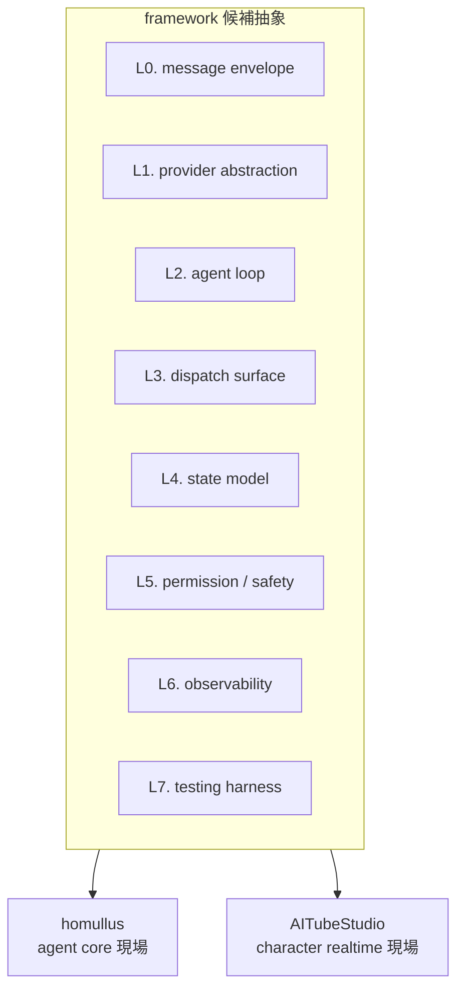

> **[仮版・thin sketch]** まだ実装に入らない。[[aitube-studio]] と homullus が並走で叩くであろう共通抽象を、抽出フェーズに入る前に薄く列挙しておく planning ノート。各抽象の境界・名前・粒度・存続可否はすべて検討中。意思決定の固定ではなく **「抽出時に何を見るか」のチェックリスト** として書く。

Almide における Rails 等価物（名前 TBD）の構成要素を、現場 2 つの重力場の交点として薄くスケッチする。詳細設計には踏み込まない。

## 重力場の 2 軸

| | homullus | AITubeStudio |
|---|---|---|
| 形態 | CLI agent runtime | リアルタイム配信 + 制御サーフェス |
| 駆動形 | 単発リクエスト → ツール → 完了 | 永続ループ + フレーム更新 + 外部 protocol |
| 叩く層 | agent core | character + realtime |
| 失敗単位 | コマンド失敗 → やり直し | フレーム落ち / 接続切断 / 同期ズレ |
| 状態寿命 | REPL session（短命）| 配信単位 + 永続 persona（長命）|

両者の **交点** にある抽象だけを framework に昇格させる。片方にしか効かないものは domain code として留める。

## 候補抽象 7 つ

### L0. message envelope

LLM 入出力を載せる型付きエンベロープ。`Message` / `ToolCall` / `ToolResult` / `Event`。

- homullus 側: `assistant.tool_calls` ↔ `role:"tool"` with `tool_call_id` のロードトリップ。すでに ad-hoc に存在
- AITubeStudio 側: WebSocket コマンド（`setEmotion` / `speak` 等）の入出力エンベロープ。openaituber の `protocol.ts` に対応するもの
- 緊張点: HTTP ターンベース vs WebSocket ストリームの差を 1 つの型族で吸収できるか

### L1. provider abstraction

LLM プロバイダ（Anthropic / OpenAI / Groq / Bedrock / ...）の差を吸収する層。

- homullus 側: `almai` パッケージとして既に独立済み
- AITubeStudio 側: 同じ `almai` を使えばよい
- 緊張点: ほぼなし。**framework に取り込むのではなく `almai` への依存に留める** のが筋（Rails が独自 HTTP クライアントを抱えなかったのと同じ判断）

### L2. agent loop

`state → action → state` の再帰関数。action は「LLM 呼び出し」「dispatch」「exit」のどれか。

- homullus 側: `src/agent.almd` の `run_turn` + 再帰 REPL に既存
- AITubeStudio 側: 配信ループの中で「LLM が次に何を発話/動作すべきか」を決める部分が同型になる見込み
- 緊張点: realtime 側はループの tick が外部（フレーム更新 / 視聴者イベント）から来る。homullus 側は LLM 応答が tick。**driver が外向きか内向きか** が違う。同じ loop primitive で両方扱うには「pull 型 / push 型のどちらでも回せる」設計が要る

### L3. dispatch surface

名前 + 入力スキーマ + ハンドラ + 戻り値型のマッピング。

- homullus 側: tools（Bash / Read / Write / Edit / Glob / Grep）が `effect fn` として実装、`tools.almd` で dispatch
- AITubeStudio 側: WebSocket commands（`setEmotion` / `speak` / ...）が dispatch 対象。tool と command は同じ shape（name + schema + handler）
- 緊張点: tool は通常テキストを返し、command は state mutation を引き起こす。**「副作用の型をどう揃えるか」** が抽象化のカギ。`effect fn` で両方表現できる可能性が高いが、実コードで確認が要る

### L4. state model

不変な状態スレッディング。グローバル変数なし、`var` 明示。

- homullus 側: `main.almd` の REPL state（model / mode / history / system prompt）を再帰で threading
- AITubeStudio 側: scene state（avatar / camera / background）+ persona state（履歴 / 視聴者文脈）の 2 層
- 緊張点: AITubeStudio は state が 2 層（短命 scene + 長命 persona）に分かれる。framework は **state を 1 つの型に閉じ込めず、合成可能なレコードとして提供** する必要がある

### L5. permission / safety

action に対する認可と危険パターン検出。

- homullus 側: 3 mode（default / accept-edits / bypass）+ Bash の危険パターン（`rm -rf`, `curl | sh`, `mkfs`, fork bomb）
- AITubeStudio 側: 配信中の自律発話に対する moderation、視聴者連動アクションの確認、課金関連動作のゲート、など
- 緊張点: homullus の "ask before exec" モデルが realtime 配信に乗るか不明。**事前承認 / 事後監視 / リアルタイム遮断** の 3 通りに resolver を一般化する必要があるかも

### L6. observability

構造化されたトレースイベント。

- homullus 側: tool call ログ、token usage 表示はある。専用 trace 型はまだ
- AITubeStudio 側: フレーム timing、lipsync 同期、レイテンシ、protocol 往復が見えないと運用できない
- 緊張点: AITubeStudio の要求が量・粒度で homullus を大きく超える。framework として共通化するか、AITubeStudio 側の domain として持つかの判断ライン

### L7. testing harness

scripted provider + scripted dispatch によるオフライン再現テスト。

- homullus 側: provider injection で scripted な LLM 応答を流し込み、24 件の integration assertion を回す手法が既に成立
- AITubeStudio 側: 同じ手法 + scripted な realtime イベント（フレーム tick / 視聴者入力）の合成が要る
- 緊張点: ほぼなし。homullus の手法を素直に拡張できそう。**framework が一級市民として持つ価値が高い領域**

## 抽象が成立しない可能性のある緊張点（重要）

framework に昇格させる前に、現場 2 つで **本当に同じ shape か** を確かめる必要がある。先回りで見えている怪しい点:

1. **loop の駆動源**: pull（LLM 応答待ち）vs push（外部イベント駆動）。同じ loop primitive で吸収できるか不明
2. **失敗の意味論**: homullus の「失敗 = やり直し or ユーザーに返す」vs AITubeStudio の「失敗 = フレーム落ちでも続行 / 接続切断は復旧」。`Result[T, E]` で両方表現できるが、意味付けは異なる
3. **realtime 制約**: GC なし・低レイテンシは Almide 基盤の強みだが、framework がそこを **横断的に保証** する API を持つかどうか（タイミング契約 / バックプレッシャ / ノンブロッキング保証）

これらが framework 抽出時に観察すべきチェックポイント。

## 名前を決めない

framework name は意図的に未定のまま据え置く。理由:

- 抽出されるまで「どの粒度の framework か」が確定しない（Rails 全体相当か、ActiveRecord 相当の小さい部分から始まるか）
- 名前を先に決めると、その名前の含意に抽象が引きずられる（"Reins" を仮置きした時点で、若干「制御」寄りに考えてしまった反省）
- placeholder 参照（"Almide エージェントフレームワーク" / "framework"）で planning は十分回る

名前選定は **AITubeStudio v0 が動き、homullus との共通抽象が実コードで見えた段階** に持ち越す。

## 組織構造（将来）— Rails の分離パターン

Rails は `github.com/rails` という **専用 organization** を持つ（rails/rails をフラグシップ、sprockets / turbolinks / spring 等の component gem も同 org で運用）。Basecamp は別組織 `github.com/basecamp`。**フレームワークと起源プロダクトで org が分離されている** のが Rails が community framework として定着した条件の一つ。

Almide エコシステムでも、framework が名前を持つ段階で同じ分離が必要になる:

| 層 | Web 時代 | AI エージェント時代 |
|---|---|---|
| 言語の org | `github.com/ruby` | `github.com/almide`（既存）|
| 起源プロダクトの org | `github.com/basecamp` | `github.com/Aid-On`（既存）|
| **抽出された framework の org** | `github.com/rails` | **TBD（framework 名確定時に新設予定）**|

org 分離が概念的・実務的に持つ意味:

- **概念的**: framework は抽象、product は具象。org が分かれることで「framework は誰のもの」「product は誰のもの」の所有権境界がコードレベルで顕在化する。一企業 / 一プロダクトの社内ツールに見えなくなる
- **実務的**: framework が他の product でも使われるようになった時、特定の company org に閉じない。コミュニティが framework に貢献する際、product 側の意思決定権を経由せずに済む

この分離は **framework がコミュニティ財として機能するための前提条件**。homullus が `github.com/almide` 配下にいる現状はあくまで testbed の位置づけで、抽出された framework は Aid-On でも almide でもない第三の org に置くのが Rails 流儀に沿う。

## 実装に入らない理由

このノートは設計仕様ではなく **観察ガイド**。実コードでの抽象抽出は次の条件が揃った後に着手する:

1. AITubeStudio v0 が現実に動いている（[[aitube-studio]] 参照）
2. homullus が daily driver として安定（既に達成）
3. 上記「緊張点」のうち少なくとも 1 つに、実コード由来の答えが出ている

planning ノートを実装に転化する圧力は意識的に避ける。**抽象は早期に固定すると現場の都合に縛られる** という Rails 抽出が示した教訓を、ここでも踏襲する。

## 押さえどころ（カード化候補）

- framework が叩く 2 つの重力場 → **homullus（agent core 層）と AITubeStudio（character + realtime 層）。両者の交点だけが framework に昇格する**
- 候補抽象の 7 階層 → **L0 message envelope / L1 provider / L2 agent loop / L3 dispatch surface / L4 state model / L5 permission / L6 observability / L7 testing**
- L1 (provider) を framework に取り込まない判断 → **`almai` への依存に留める。Rails が独自 HTTP クライアントを抱えなかったのと同じ筋**
- 抽出前に確かめるべき 3 つの緊張点 → **(1) loop の駆動源 pull/push、(2) 失敗の意味論、(3) realtime 制約の横断的保証**
- 名前を決めない理由 → **粒度未確定 / 含意に引きずられる / placeholder で planning は回る。決定は AITubeStudio v0 が動いた段階に持ち越す**
- framework org の Rails 流儀 → **Rails が `github.com/rails` を専用 org として持ち、Basecamp（`github.com/basecamp`）から分離されているのと同様、抽出された framework は Aid-On でも almide でもない第三の専用 org に置く。コミュニティ財として機能する前提条件**

## Links

- [[aitube-studio]] — Basecamp 役のプロダクト planning
- [[the-almide-doctrine]] — framework が継承する設計哲学
- [almide/homullus](https://github.com/almide/homullus)
- [almide/almai（L1 provider 層）](https://github.com/almide/almai)
- [Aid-On/openaituber（AITubeStudio の TS 版・移植元）](https://github.com/Aid-On/openaituber)
