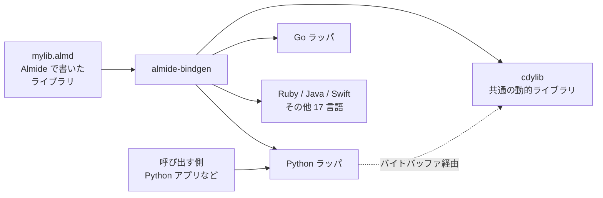

[[almide|Almide]] のユニバーサル FFI バインディング生成器。すべて Almide で書かれたライブラリ（`import bindgen`）。CLI は [[almide-lander]]。

## 何ができる？

Almide で書いたプログラムを、Python や Java や Ruby など 20 種類もの他のプログラミング言語から「呼んで使える」ようにする魔法のラッパーを自動生成します。日本で書かれた本を、英語・中国語・スペイン語など 20 言語に同時翻訳して世界中の本屋に並べるイメージです。

異なる言語間でデータをやり取りするとき、「住所の書き方が違う」「漢字とアルファベットの形式が違う」みたいな問題が起きます。この道具は「国際郵便の共通フォーマット」のようなバイト列にすべてを詰め直して、確実にデータが届くように仲介します。

おかげで Almide で一度書けば、世界中のどの言語のプロジェクトからでも呼び出して使ってもらえるライブラリが完成します。

## 用語

- **FFI (Foreign Function Interface)**: 違う言語同士が関数を呼び合うための取り決め。国際電話の共通プロトコル。
- **バインディング**: ある言語から別の言語の機能を呼び出すための「橋渡しコード」。
- **cdylib**: C 言語スタイルで他言語から呼べる「動的ライブラリ」。`.so` `.dll` `.dylib` などの拡張子を持つ部品ファイル。
- **C ABI**: C 言語が決めた「関数の呼び方の世界共通ルール」。多くの言語がこれに準拠する。
- **バイトバッファ**: データを「ただの数字の並び」に変換した塊。言語が違っても同じ並びを送り合えば伝わる。
- **直列化 (シリアライズ)**: 複雑なデータを送りやすい一本の列に変換する作業。引っ越しで荷物を箱詰めするイメージ。
- **big-endian**: 数字の並べ方の流派の一つ。「上の桁から書く」（人間の数字の書き方と同じ）。
- **UTF-8**: 文字を機械が扱うための世界標準の表現方法。日本語も英語も絵文字も扱える。
- **scaffolding (足場)**: 自動生成される下準備コード。家を建てる前に組む足場のように、実装を支える土台。
- **header (ヘッダ)**: C 言語などで「この関数があります」と宣言だけ書いてあるファイル。
- **ctypes / JNA / cgo / koffi など**: 各言語ごとに用意されている「他の言語の動的ライブラリを呼ぶ仕組みの名前」。

## 仕組み



中央の動的ライブラリは「C 言語スタイルの共通玄関」を持っていて、20 言語それぞれの「翻訳係」を経由して呼ばれます。データはすべて「バイトの列」という共通フォーマットに変換されて行き来するので、言語が違っても確実に伝わります。

## 20 言語 + Rust scaffolding

| Language | FFI | Language | FFI |
|---|---|---|---|
| Python | ctypes | C++ | extern "C" |
| Go | cgo | Rust | FFI |
| Ruby | FFI gem | JavaScript | koffi |
| Swift | C header | Scala | JNA |
| C# | P/Invoke | Julia | ccall |
| Dart | dart:ffi | PowerShell | DllImport |
| Kotlin | JNA | Elixir | NIF |
| Java | JNA | PHP | FFI ext |
| C | header | Lua | LuaJIT FFI |
| Zig | extern | Nim | dynlib |

## バイトバッファプロトコル

すべての型は FFI 境界でバイトバッファに直列化される。C struct マッピング不要。

```
Rust:   extern "C" fn bridge_distance(args: *const u8, args_len: i32, out: *mut u8, out_cap: i32) -> i32
Python: buf = struct.pack('>d', a.x) + ... → result = struct.unpack_from('>d', call(buf))
```

| Type | Encoding | Size |
|---|---|---|
| Int | big-endian i64 | 8 bytes |
| Float | big-endian f64 | 8 bytes |
| Bool | 0/1 | 1 byte |
| String | u32 BE length + UTF-8 | 4 + N |
| Record | fields in order | sum |
| Variant | u32 BE tag + payload | 4 + payload |

## ライブラリ API

```almide
import bindgen

bindgen.version()                                   // "0.1.0"
bindgen.supported_languages()                       // ["python", "go", ...]

let lib_rs   = bindgen.scaffolding.generate(iface_json, rust_source)
let cargo    = bindgen.scaffolding.generate_cargo(iface_json)
let py_code  = bindgen.bindings.python.generate(iface_json)
let go_code  = bindgen.bindings.go.generate(iface_json)
// ... 20 言語
```

## 設計

- すべての generator は `.almd` ファイル
- 外部ツール依存ゼロ（UniFFI なし、PyO3 なし、napi-rs なし）
- `scaffolding.almd` が Rust FFI レイヤを生成
- `bindings/<lang>.almd` が pure な言語ラッパを生成

## 関連

- [[almide-wasm-bindgen]] — WASM + JS/TS 専用（target model が違うため分離）
- [[almide-lander]] — CLI orchestrator
- [[almide]] — 言語本体

## Links

- [GitHub](https://github.com/almide/almide-bindgen)
