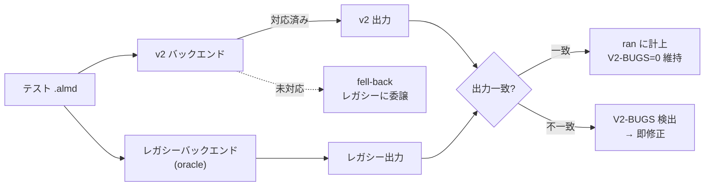

新しい WASM バックエンド(v2)の出力を、**既存(レガシー)バックエンドの出力と1テストずつ照合**して回帰を防ぐ仕組み。新実装を「正しいと信じる」のではなく「旧実装と一致するか」を機械的にゲートする差分テスト(differential / back-to-back testing)の一種。

## 3つの指標の読み方

報告に出てくる数字はこの3つ。

| 指標 | 意味 |
|---|---|
| **ran-under-v2 (ran)** | v2 バックエンドで**実行できた**テストカテゴリ数。機能が増えるほど上がる(例: closures 実装で 7→8) |
| **fell-back** | まだ v2 で動かず**レガシーにフォールバック**しているテスト数。残ブロッカーの総量 |
| **V2-BUGS** | v2 の出力がレガシーと**食い違った**件数。**常に 0 が条件**(一致しなければ即バグ) |

→ 開発は「**ran を上げ、fell-back を減らし、V2-BUGS は 0 を維持**」で進む。fell-back の各項目(push/pop, JSON, stdlib-call など)が次に潰すブロッカーになる。

## なぜ差分なのか

新バックエンドは「正しい仕様」を別途書くより、**既に正しいと検証済みのレガシー実装を oracle(基準)にする**方が安全・安価。出力一致を機械判定するので、人間が気づけない silent な差異も捕まえられる。これは [[almide]] の Pipeline Verification Chain(各パスが事後条件で自身を保証する)と同じ「証明あり・パズル無し」の思想 — 機能追加のたびに正しさを自動で担保する。

## 関連

- [[almide]] — Pipeline Verification Chain。差分ゲートはその実行時版
- [[almide-list-mutation]] — push/pop の各段階を差分ゲートで保証しながら進める
- [[anf-closure-lifting-bug]] — 同じく「事後検証が本物のバグを検出した」事例(postcondition 版)
- [[safety-critical-certification]] — 出力照合を証明連鎖へ引き上げる先にある安全臨界認証の要求
