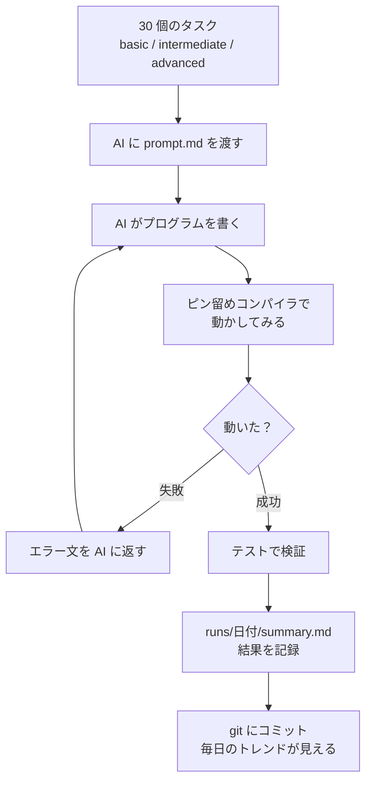

[[almide|Almide]] の MSR (Modification Survival Rate) を毎日測定するハーネス。LLM にタスクを書かせ、ピン留めしたコンパイラで評価し、結果を git にコミットする。

## 何ができる？

Almide という言語が「AI に優しいか」を毎日テストする道場です。AI に小さな課題を 30 個解かせて、書いたプログラムが何回直されても動き続けるかを記録します。料理の世界で「日替わりで腕の良い料理人と腕のたよりない料理人にレシピを書かせて、何度直しても料理が完成する確率」を測るようなものです。

腕の良い料理人（賢い AI）は一発で完成、たよりない料理人（小さい AI）は何度も焦がす、という違いが数字で見えてきます。この記録を毎日続けることで、Almide という言語の「AI 対応力」が良くなっているか悪くなっているかを、感覚ではなく数字で追えるようになります。

## 用語

- **MSR (Modification Survival Rate)**: AI が書いたプログラムを連続で修正したとき、ちゃんと動き続ける確率。「歩留まり」のようなもの。
- **ハーネス**: 自動で測定を回す仕組みのこと。動物に装着するハーネスのように、AI を実験装置に繋ぐ道具。
- **タスク**: AI に解かせる小さな課題（例：「FizzBuzz を書いて」「素数判定を書いて」）。
- **1-shot**: AI が一発で正解した割合。再挑戦なしで成功した率。
- **N-shot**: AI が N 回までやり直して成功した割合。
- **diagnostic (診断メッセージ)**: コンパイラが出す「ここが間違ってます」という案内文。AI はこれを読んで自分で直す。
- **Malicious hints (有害なヒント)**: 逆に AI を誤った方向へ導いてしまう紛らわしい診断メッセージ。集めて改善ネタにする。
- **pinned (ピン留めされた)**: バージョンを固定して動かさないこと。「測る物差し」が変わると比較できないので固定する。
- **stdlib (標準ライブラリ)**: その言語に最初から付属している便利な機能集。「文字列を分ける」「ファイルを読む」などの基本道具。
- **deprecate (非推奨化)**: 「これは古いから使わないで」と印を付けること。完全に消さず、新しい方を併設する。
- **summary**: 集計した結果のまとめ。詳細な生データではなく、要点のみ。

## 仕組み



AI に課題を解かせる「ループ」を回し、何度目で成功したか・どんなエラーで詰まったかを毎日記録していきます。記録は git に積まれていくので、月単位・年単位で「Almide の AI 対応力」が良くなっているか追えます。

## Core Idea

[[almide|Almide]] の存在意義は唯一「LLM が書いたコードがどれだけ修正に耐えるか」という指標にある。Dojo はその数値を継続的に観測する装置。

```
tasks/<difficulty>/<name>/prompt.md
    → LLM がコード生成（claude CLI 経由）
    → almide build (pinned compiler)
    → 失敗なら diagnostic を返して再試行（最大 N 回）
    → 成功なら tests.almd で検証
    → runs/YYYY-MM-DD/summary.md に記録
```

## 計測指標

- **1-shot success rate** — 再試行なしでコンパイル成功した割合
- **N-shot success rate** (N = 2, 3, 5)
- **Average retry count per task**
- **Diagnostics that helped** — ヒントを読んで LLM が修正できた件数
- **Malicious hints** — 逆に LLM をミスリードした diagnostic（`malicious-hints.md` に蓄積）

## Self-Hosting

ハーネス本体 (`src/main.almd`) も [[almide|Almide]] で書かれている。HTTP / fs / process / json を多用する I/O 重め非自明プログラムで、Almide 自身の MSR データ点としても機能する。stdlib の不足は upstream `almide/almide` で修正する方針。

## Task Bank（30 タスク × 3 段）

| Tier | LOC | タスク数 | 例 |
|---|---|---|---|
| `basic/` | <20 | 15 | fizzbuzz, factorial, gcd, is-prime, list-sum |
| `intermediate/` | 20–80 | 10 | caesar-cipher, balanced-parens, binary-search, zip-with |
| `advanced/` | >80 | 5 | expression-eval, custom-linked-list, mini-json-query, matrix-ops |

各タスクは `prompt.md` / `tests.almd` / `meta.toml` で構成。LLM には `prompt.md` のみ渡し、`tests.almd` は隠す。

## 不変条件

- 既存タスクの後付け改変禁止（MSR トレンドラインを破壊する）。修正したいときは新タスクを並置して旧を deprecate
- 生 LLM 出力は `runs/YYYY-MM-DD/raw/` に置き、コミットしない
- 集計済みメトリクス (`summary.md`) のみコミット → git history からトレンドを読める

## Pinned Compiler

`almide-pin.toml` で評価対象の Almide コンパイラのコミットを固定。コンパイラ更新と MSR 計測を分離する。

## 関連

- [[almide]] — 評価対象の言語、MSR を最大化するように設計されている
- [[claude-code|Claude Code]] — `process.exec` で呼び出すデフォルトのモデルランナー
- [[famulus2]] — 同様に LLM 駆動だが、こちらは生成側の評価基盤

## Links

- [GitHub](https://github.com/almide/almide-dojo)
