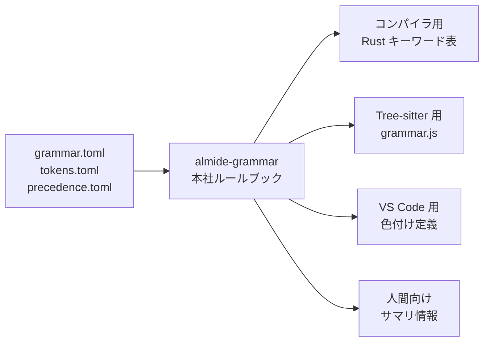

[[almide|Almide]] の構文定義の Single Source of Truth。キーワード、演算子、優先順位、TextMate スコープを一箇所で管理し、すべての consumer が参照する。

## 何ができる？

Almide という言語の「ルールブック」を一箇所だけにまとめておく仕組みです。会社の就業規則を本社のマスターファイルで管理し、各部門にはそのコピーを配るのと同じ考え方です。

言語には「使える単語のリスト」「記号の優先順位」「色付けのルール」など、いろんな部品があります。これらを別々の場所に書いてしまうと、ある場所では `if` が使えるのに別の場所では使えない、といった食い違いが必ず起きます。このノートで紹介する仕組みは、本社にあたる一つのファイルからすべての関係者に同じルールを配るので、矛盾が起きません。

おかげで言語の関係ツール群（言語処理本体・解析ツール・エディタ拡張）が常に揃った認識で動きます。

## 用語

- **構文**: プログラム言語の「文法ルール」。日本語で言う「主語の次に動詞」みたいな並び方の決まり。
- **キーワード**: その言語で特別な意味を持つ予約された単語（`if`, `for`, `fn` など）。
- **演算子**: `+` や `*` のような計算記号。「優先順位」とは「掛け算は足し算より先」みたいな順番のルール。
- **Single Source of Truth (SSoT)**: 「正解はここだけ」という唯一の参照元。会社のマスターファイル。
- **TOML**: 設定を書くための、人間にも読みやすいシンプルなファイル形式。Excel みたいな表に近い感覚。
- **TextMate スコープ**: エディタが「この単語は変数」「この単語はキーワード」と理解して色を塗るためのラベル付けルール。
- **Tree-sitter**: 文章を機械が理解する地図を作る道具（[[tree-sitter-almide]] 参照）。
- **build.rs**: Rust のプロジェクトでビルド前に走らせる準備スクリプト。ここから TOML ファイルを読み込んで自動生成する。
- **consumer**: そのルールを使う側のツールやプロジェクト（コンパイラ・エディタ拡張など）。
- **CLI**: コマンドラインから打って動かすツール。黒い画面で `almide-grammar tree-sitter` のように打つ。

## 仕組み



中央の「ルールブック」を一度書けば、4 種類の出力先それぞれが必要な形のルールを自動で受け取ります。元のファイルを変更すると全員に同じ変更が伝わるので、不整合が起きません。

## Why

コンパイラ・[[tree-sitter-almide|tree-sitter]]・[[vscode-almide|VS Code 拡張]] がそれぞれ別々のキーワードリストを持つと不整合が必ず起きる。`almide-grammar` はこれらすべての共通参照点になる。

## API

| Function | Return | 説明 |
|---|---|---|
| `keyword_groups()` | `List[KeywordGroup]` | 5 グループ: control / declaration / modifier / value / flow |
| `keyword_aliases()` | `List[(String, String)]` | `Ok→ok`, `Err→err`, `Some→some`, `None→none` |
| `precedence_table()` | `List[PrecLevel]` | 8 レベル: pipe (1) → unary (8) |
| `all_keywords()` | `List[String]` | 35 キーワード（sorted） |

## Distribution

### Almide パッケージとして

```toml
[dependencies]
almide-grammar = { git = "https://github.com/almide/almide-grammar", tag = "v0.1.0" }
```

```almide
import almide_grammar

for group in almide_grammar.keyword_groups() {
  println(group.category ++ ": " ++ string.join(group.words, " "))
}
```

### CLI として

```bash
almide run almide-grammar <target>
```

| Target | 出力 |
|---|---|
| `tree-sitter` | grammar.js 用のキーワードルール + 優先順位 |
| `textmate` | tmLanguage 用 JSON パターン |
| `rust` | コンパイラレキサ用キーワードマップ + `ALL_KEYWORDS` |
| `info` | 人間向けサマリ |

## TOML Files

`tokens.toml` と `precedence.toml` はコンパイラ build.rs から直接読まれる（Almide ランタイムなしでも参照できるようにするため）。

## 構造

```
almide-grammar/
  almide.toml         package: almide_grammar v0.1.0
  tokens.toml         キーワード/演算子定義（compiler build.rs 用）
  precedence.toml     演算子優先順位（compiler build.rs 用）
  src/
    mod.almd          ライブラリエントリ — 全データ定義
    main.almd         CLI — `import self as grammar`
```

## Consumers

| Project | 利用方法 |
|---|---|
| [[almide]] (compiler) | `build.rs` が `tokens.toml` / `precedence.toml` を読み `src/generated/token_table.rs` を生成 |
| [[tree-sitter-almide]] | grammar.js 生成時にキーワードリストを参照 |
| [[vscode-almide]] | TextMate 生成器が `import almide_grammar` してスコープを取得 |

## 関連

- [[almide]] — コンパイラの build.rs から TOML を消費
- [[tree-sitter-almide]] — grammar.js 生成時の依存
- [[vscode-almide]] — TextMate 生成器が依存

## Links

- [GitHub](https://github.com/almide/almide-grammar)
