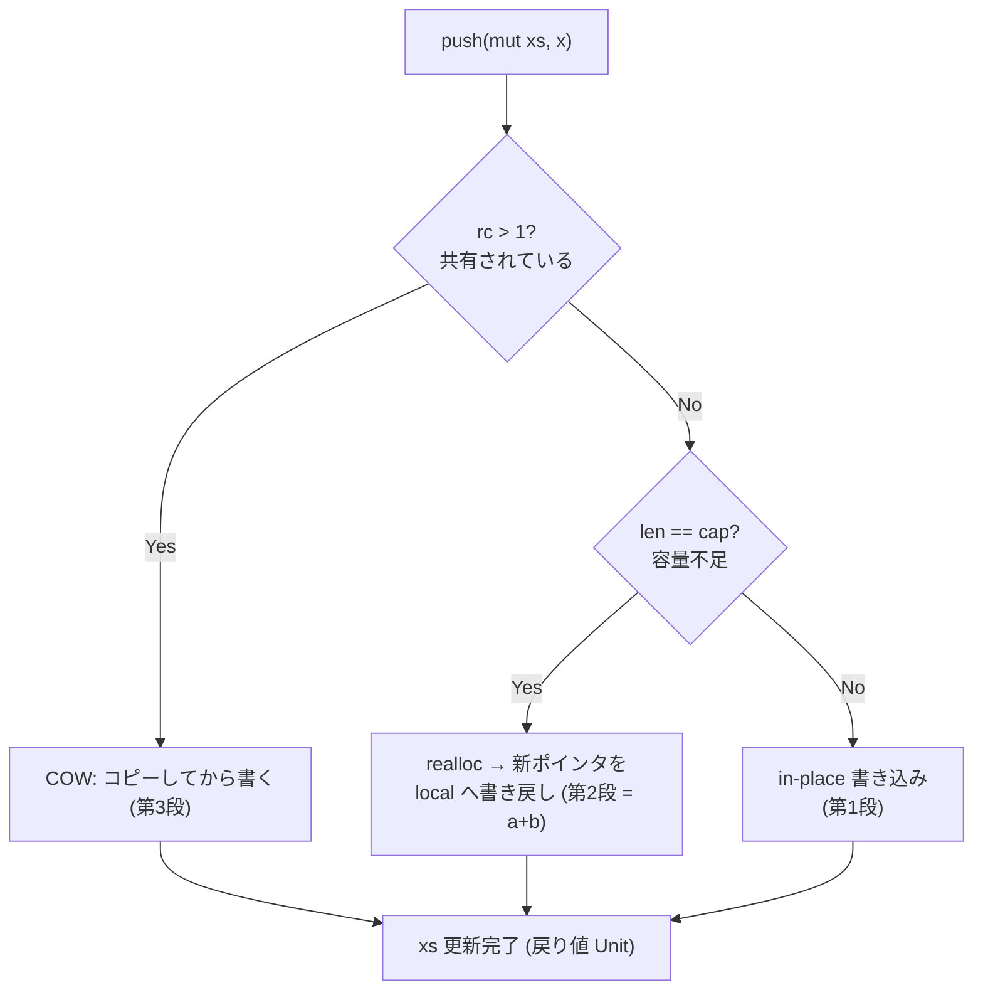

`push(mut xs, x) -> Unit` のような **list の破壊的変更**を WASM に落とすときの設計。「ランタイム関数を足すだけ」では済まず、**(a) 変数書き戻し・(b) realloc・(c) COW** の3つを同時に設計する必要がある。Almide WASM バックエンドで closures の次に来る「本丸」。

## なぜ難しいか — 3つの絡む問題

list は `[len][cap][data]` レイアウト(長さ・確保容量・データ本体)。`push` はこの構造を **その場で書き換える**操作で、3段に問題が連鎖する。

| # | 問題 | 何が起きるか |
|---|---|---|
| (a) | **変数書き戻し** | `push` の戻り値は `Unit` なのに `xs` 自体を変える。`xs` が `Var` なら、その local を更新する特別扱いが要る |
| (b) | **realloc** | `len == cap` で容量不足になると再確保 → **バッファのポインタが動く**。新ポインタを (a) で呼び出し元 local に書き戻さねば壊れる |
| (c) | **COW (copy-on-write)** | [[perceus\|Perceus]] 的には push は所有的変更。共有されている(`rc > 1`)list を push すると、他参照を壊さないため[[copy-on-write\|コピーしてから書く]]必要がある |

(c) は borrow / `alm_eq` 解析と整合させないと、共有 list を黙って破壊する致命的バグになる。

## 安全に切るための段階分割

closures と同じく、一気にやらず**小さく安全に**から始める。

1. **第1段: cap に空きがある時だけ in-place push**(realloc 無し)。容量不足や `rc > 1` は当面フォールバック。→ 「`with_capacity` で事前確保したケース」が動く。
2. **第2段: realloc + 書き戻し**。容量不足時に再確保し、新ポインタを local に書き戻す。
3. **第3段: COW**。`rc > 1` を検出したらコピーしてから変更。

各段で[[almide-differential-gate|差分ゲート]]がレガシー出力との一致を保証する。

3つの問題が `push` 1回の判定フローにどう現れるか:

第1段は右端の `in-place` だけを実装し、`rc>1` と `len==cap` は当面フォールバックする、という切り出しになる。

## なぜこの順序か

(a) 書き戻しは push が成立する前提、(b) realloc は実用に必須だが (a) の上に乗る、(c) COW は最も設計が重い(RC 検出・コピー・borrow 整合)。**設計コストが跳ねるのは (c)** なので、軽いブロッカー(stdlib-call など)を先に潰してから push/pop に段階的に入る、という優先順位判断につながる。

## 背景の設計判断 (ADR)

- **WASM-GC 不採用**: 線形メモリ + [[perceus|Perceus]] を維持し、非GC機構だけ取り込む。可変循環を作らない(= Arena / Handle で表現)。COW がそもそも要るのは、この「RC ベースで共有を許す」前提から来ている。

## 関連

- [[perceus]] — RC と所有。`rc > 1` 判定が COW の発火条件
- [[copy-on-write]] — 共有データを変更する前にコピーする一般戦略。(c) の正体
- [[almide-differential-gate]] — 各段階の正しさをレガシー照合で保証する仕組み
- [[hof-inline-fusion]] — 同じ WASM バックエンドの、closures 側の設計
- [[almide]] — コンパイラ全体
