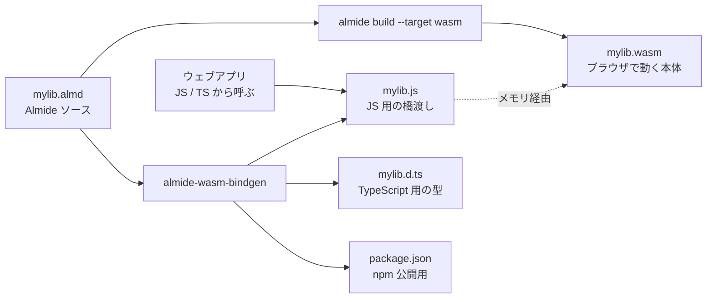

[[almide|Almide]] の WebAssembly + JS/TS バインディング生成器。Almide で書かれたライブラリ（`import wasm_bindgen`）。CLI 呼び出しは [[almide-lander]] の `--target wasm`。

## 何ができる？

Almide で書いたプログラムを、ウェブブラウザの中で動かせるように変換する仕組みです。普段ウェブサイトを動かしている JavaScript の隣に、「Almide で書かれた高速エンジン」を置いてあげるイメージです。世界中のだれもが、ブラウザを開くだけでそのプログラムを使えるようになります。

JavaScript 側からは普通の関数として呼べる形で出てくるので、ウェブの開発者は中身が Almide であることを意識せずに使えます。さらに `npm` という世界共通の部品市場にそのまま並べて公開できる完成品まで自動で出してくれます。

驚くことに、こうして作ったプログラムは、同等の従来手法で作ったものより速くて、しかもファイルサイズが約 7 分の 1 に小さくなります。

## 用語

- **WebAssembly (WASM)**: ブラウザの中で動く、超高速な共通プログラム形式。「アプリの缶詰」の規格。
- **JavaScript (JS)**: ウェブページを動かす定番の言語。ブラウザに必ず入っている。
- **TypeScript (TS)**: JavaScript に「型のチェック機能」を加えた強化版。間違いを早く見つけられる。
- **ESM (ES Modules)**: JavaScript の現代的なモジュール（部品）の書き方。`import` で部品を読み込める。
- **glue code (糊コード)**: 二つの世界をつなぐための、ちょっとした橋渡しのコード。WASM と JS の間に挟む。
- **npm**: JavaScript 用の世界最大の部品配布サービス。ここに登録すれば誰でも自分のプログラムに組み込める。
- **linear memory**: WASM が使う、一本のとても長いメモリ領域。番地（ポインタ）でデータの場所を指す。
- **ポインタ**: メモリ内の「番地」を表す数字。「3 丁目 5 番地に荷物がある」と伝えるだけでデータを共有できる。
- **TextEncoder / TextDecoder**: JavaScript で文字を「バイト列」に変換したり戻したりする道具。
- **Component Model / WIT**: WASM の次世代仕様で、「この WASM はこういう関数を持っています」を機械が理解できる宣言形式。
- **persistent handle**: データそのものを毎回送らず、「あの場所にあるあれ」と番地だけ渡し合う最適化テクニック。

## 仕組み



`.almd` ファイルから 3 つの兄弟ファイル（本体・橋渡し・型情報）と公開設定が出力され、そのまま npm で配布できます。利用側の JS/TS からは「普通の関数」を呼ぶ感覚で使えます。

## なぜ [[almide-bindgen]] と分かれているか

- `almide-bindgen` — cdylib + byte-buffer protocol（21 言語、C ABI ベース）
- `almide-wasm-bindgen` — WASM linear memory + `__alloc`、JS/TS surface、npm 配信
- target model も consumption model も根本的に違うため分離。Rust の `wasm-bindgen` が ad-hoc FFI ツールから独立しているのと同じ理由。

## 出力

```
dist/
├── <mod>.wasm          ← almide build --target wasm
├── <mod>.js            ← ESM glue (init + exported fns + helpers)
├── <mod>.d.ts          ← TypeScript declarations
├── <mod>.wit           ← WebAssembly Interface Types (Component Model)
└── package.json        ← npm metadata
```

`cd dist && npm publish` でそのまま公開可能。

## ABI / 型マッピング（抜粋）

| Almide | WASM ABI | JS surface | TS |
|---|---|---|---|
| `Int` | `i64` (BigInt 境界) | `Number(...)` | `number` |
| `String` | `i32 ptr → [len:i32 LE][utf8]` | `TextEncoder/Decoder` | `string` |
| `List[T]` | `[len:i32][elems...]` | array | `T[]` |
| `Option[T]` | `i32 ptr` (0=None) | `null` or value | `T \| null` |
| `Result[T, String]` | `[tag:i32][value]` | Ok→return, Err→throw | `T` |
| `effect fn` | implicit `Result` at ABI | auto-unwrap (throw on Err) | `T` |
| `Record` | sequential WASM offsets | plain object | `interface` |
| `Variant` | `[tag:i32][payload]` | `{ tag, _0, _1, ... }` | discriminated union |
| `Matrix` | `[rows][cols][f64×rows×cols]` | `Matrix` class（zero-copy） | `class Matrix` |
| `Bytes` | `[len:i32][u8×len]` | `Uint8Array` | `Uint8Array` |
| `Map[K, V]` | packed pairs | `Map<K, V>` | `Map<K, V>` |

メモリ拡張安全性: 各 marshaller は呼び出し時に `_exports.memory.buffer` をフレッシュに取得し、`__alloc` による growth でポインタが無効化されないようにする。

## ライブラリ API

```almide
import wasm_bindgen

wasm_bindgen.generate_esm(iface_json, module_name)      -> String   // <mod>.js
wasm_bindgen.generate_dts(iface_json, module_name)      -> String   // <mod>.d.ts
wasm_bindgen.generate_wit(iface_json, module_name)      -> String   // <mod>.wit
wasm_bindgen.generate_package_json(module, version)     -> String   // package.json
```

## 対 Rust+wasm-bindgen 性能

- `matmul 256×256`: 4.62 ms vs 8.48 ms（**Almide 1.84× faster**）
- `axpy N=512`: 0.38 ms vs 0.36 ms（Rust 1.05× narrow）
- **WASM サイズ: 1490 B vs 11225 B（Almide 7.53× smaller）**

`Matrix` を persistent handle として扱い、chained ops でデータではなくポインタを渡すことで境界コストを 13× 削減（iter 48）。

## 関連

- [[almide-bindgen]] — 21 言語の native FFI（姉妹ライブラリ）
- [[almide-lander]] — CLI orchestrator
- [[almide-js]] — npm 向けの例 + ベンチマーク
- [[almide]] — 言語本体

## Links

- [GitHub](https://github.com/almide/almide-wasm-bindgen)
