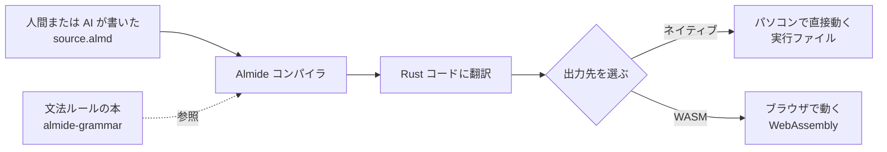

LLM によるコード生成に最適化されたプログラミング言語。Rust と WebAssembly にコンパイルされる。

## 何ができる？

人間と AI が二人三脚でプログラムを書くための、新しい「言葉」です。普通のプログラミング言語は人間にとって自然なように作られていますが、Almide は「AI が間違えにくいルール」だけを残した、外国人にもわかる簡単な日本語のような言語です。

たとえば「同じ意味なのに書き方が複数ある」とか「省略できる場所がある」と AI は迷ってしまいますが、Almide ではそういう曖昧さをすべて取り除いてあります。その結果、AI が一度書いたプログラムを何度修正しても、ちゃんと動き続ける確率がとても高くなります。

書いたプログラムは、パソコンで直接動く形にも、ウェブブラウザの中で動く形にも変身できます。AI 時代のソフトウェア開発をスムーズにするための土台です。

## 用語

- **LLM**: 大量の文章を学習して文章やプログラムを書ける AI のこと（ChatGPT や Claude など）。
- **コンパイル**: 人間が書いた文章のようなプログラムを、機械が直接動かせる形に翻訳する作業。
- **Rust**: 速くて安全な動作で知られる、有名なプログラミング言語。Almide は最終的にこの言語に翻訳されてから機械語になる。
- **WebAssembly (WASM)**: ウェブブラウザの中で動く、超高速な共通フォーマット。スマホでもパソコンでも動く「アプリの缶詰」のようなもの。
- **MSR (Modification Survival Rate)**: AI が書いたプログラムを何度直しても壊れずに動き続ける確率。「修正しても生き残る率」。料理のレシピを何度書き直しても完成する確率に近い。
- **ジェネリクス**: 「中身の型を後で決められる箱」を作る仕組み。たとえば「数字のリスト」「文字のリスト」を一つの定義でまかなえる。
- **パターンマッチ**: 「もしこの形ならこう、別の形ならこう」と分岐する書き方。郵便物の宛先で仕分けるイメージ。
- **Effect (副作用)**: ファイルを読む、ネットに繋ぐなど、外の世界に影響する操作のこと。「外出する関数」と「家から出ない関数」を区別する。
- **pure 関数**: 外部に何も影響を与えず、同じ入力からは必ず同じ結果を返す関数。
- **構造化並行性 (fan)**: 複数の作業を同時にやらせて、全部終わるのを待つ仕組み。料理で「お湯を沸かす」「野菜を切る」を並行するイメージ。
- **パイプライン**: データを「ベルトコンベア」のように加工順に流していく書き方（`|>`）。
- **トークン**: AI が文章を読み書きする最小単位。「迷う回数 = 思考トークン」が増えるほど AI は間違えやすい。

## 仕組み



ソースコード（拡張子 `.almd`）はまずコンパイラに渡され、Rust という有名な言語の形に翻訳されます。そのあと用途に応じて「パソコン用」または「ブラウザ用」の最終形に出力されます。

## Core Metric: MSR (Modification Survival Rate)

AI が書いたコードに対して連続的な修正を加えたとき、コンパイル + テストが通り続ける割合。Almide はこの数値を最大化するように設計されている。

| Model | Pass Rate | 1-Shot Rate |
|---|---|---|
| Claude Sonnet 4.6 | 100% (30/30) | 47% |
| Llama 3.3 70B | 61% (17/28) | 33% |

## Design: Minimal Thinking Tokens

LLM が構文・意味・修復戦略で分岐する回数を最小化する。

### 曖昧性の除去

- null なし → `Option[T]` のみ
- 例外なし → `Result[T, E]` のみ
- ジェネリクスは `[T]`（`<T>` は比較演算子と曖昧）
- ループは `for x in xs` と `while cond` の2形式のみ
- 早期リターンなし → 最後の式が戻り値、`guard...else` で構造化脱出
- ラムダは `(x) => expr` の一形式のみ
- 文の終端は改行（セミコロンなし、ASI なし）
- `if` は `else` 必須（dangling else 問題なし）
- 暗黙の型変換なし → `int.to_string(n)` のように明示

### Effect System

`effect fn` は安全機構ではなく **生成空間の削減器**。

- pure 関数は pure 関数しか呼べない → 有効な補完候補が劇的に減る
- `effect fn` が I/O 境界を明示 → LLM は副作用が合法な箇所を正確に把握
- 関数シグネチャだけで何が呼べるか判断可能 → 関数本体を読む必要がない

## Syntax Highlights

```almd
// 関数定義
fn greet(name: String) -> String =
  "Hello, " ++ name ++ "!"

// レコード型
type User = { name: String, age: Int }

// バリアント型（leading | で判別）
type Shape =
  | Circle(Float)
  | Rect{ w: Float, h: Float }

// パターンマッチ（網羅的）
fn area(s: Shape) -> Float =
  match s {
    Circle(r) => 3.14159 * r * r
    Rect{ w, h } => w * h
  }

// Effect function（副作用あり）
effect fn read_config(path: Path) -> Result[String, String] =
  fs.read_text(path)

// Fan concurrency（構造化並行性）
effect fn fetch_both() -> Result[(String, String), String] =
  fan { http.get("https://a.com"); http.get("https://b.com") }

// パイプライン
fn process(data: List[Int]) -> List[Int] =
  data
    |> list.filter((x) => x > 0)
    |> list.map((x) => x * 2)
    |> list.sort_by((a, b) => int.compare(a, b))
```

## Concurrency: fan

`async/await` は存在しない。`effect fn` が非同期境界で、コンパイラが残りを処理する。

- `fan { a(); b() }` — 並行実行、全完了待ち、タプルで返却
- `fan.map(xs, fn)` — コレクションの並列 map
- `fan.race(thunks)` — 最初に完了したものを返し、残りをキャンセル
- `fan.any(thunks)` — 最初に成功したものを返す
- `fan.settle(thunks)` — 全結果を収集（失敗含む）

ルール: `fan` 内で `var` キャプチャ不可（データ競合防止）、1つ失敗で全体 fail-fast。

## Module System

```almd
// コアモジュール（auto-import）
// int, string, list, map, set, option, result, env, json, ...

// fs のみ明示 import が必要
import fs

// プロジェクト内のサブモジュール
import self.parser
import self.utils.{helper_a, helper_b}
```

## Toolchain

- `almide run file.almd` — コンパイル + 実行
- `almide build` — ネイティブバイナリ生成
- `almide build --target wasm` — WebAssembly 出力
- `almide test` — テスト実行
- `almide fmt` — フォーマッタ

## Links

- [GitHub](https://github.com/almide/almide)
- [Playground](https://almide.github.io/playground/)
