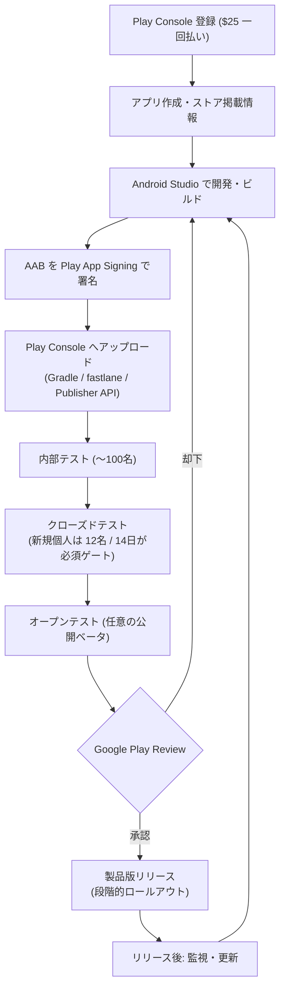

Android アプリを **ゼロから一般公開まで** に通す一連のフロー。[[android-studio|Android Studio]]（作る）→ [[android-delivery|Android Delivery]]（運ぶ）→ [[google-play-review|Google Play Review]]（通す）→ [[google-play|Google Play]]（配る）を時系列で束ねた全体地図。[[app-release-flow|Apple 側のフロー]]と対になる。

## 全体フロー

## 各ステップ

### 1. 前提（初回のみ）

- **Play Console** 登録（$25 の一回払い。[[app-release-flow|Apple の $99/年]]と対照的）
- アプリ作成、ストア掲載情報、コンテンツレーティング、データセーフティ申告
- **Play App Signing** を有効化（Upload Key を作成）

### 2. ビルドする

- [[android-studio|Android Studio]] で開発し **AAB** を生成（`./gradlew bundleRelease`）
- **Android 15 以上を target**（2026年要件）

### 3. アップロードする

- Play Console / Gradle / fastlane `supply` / **Publisher API** で AAB を投入
- Google が Dynamic Delivery 用に処理

### 4. テストトラックを回す

- **内部テスト**: 〜100名、QA 用に即時配布
- **クローズドテスト**: 2023/11/13 以降に作った **新規個人アカウント**は、**12名以上のテスターが14日連続でオプトイン**していることが製品版公開の **必須ゲート**（旧20名から緩和）
- **オープンテスト**: 任意の公開ベータ。ストア掲載から参加可能

### 5. 審査に出す

- [[google-play-review|ポリシー審査]]へ提出。アップデートは速いが新規アプリ/アカウントは長期化
- 却下なら修正してステップ2へ

### 6. リリースする

- 製品版トラックへ公開。**段階的ロールアウト（staged rollout）** で一部ユーザーから徐々に展開し不具合の影響を抑える
- 価格・配信国を設定（[[google-play|地域別・インストール時点別の手数料]]に注意）

### 7. リリース後

- 指標・クラッシュ（Android Vitals）を監視。更新はステップ2〜6を再び回す

## Apple との主な違い

- **テストゲート**: Android はクローズドテスト14日が新規個人の関門。Apple は TestFlight 任意（審査の往復が関門）
- **登録費**: $25 一回 vs $99/年
- **配信自由度**: Android はサイドローディング・代替ストアが標準。Apple は EU/DMA で初めて開放
- **ビルド形式**: AAB（Dynamic Delivery） vs archive（IPA）

## 関連

- [[android-studio|Android Studio]] — 作る
- [[android-delivery|Android Delivery]] — 運ぶ（AAB・署名・CI/CD）
- [[google-play-review|Google Play Review]] — 通す（ポリシー審査・テストゲート）
- [[google-play|Google Play]] — 配る（手数料・代替ストア）
- [[app-release-flow|App Release Flow]] — Apple 側の対応フロー

## Links

- [Prepare and roll out a release (Play Console Help)](https://support.google.com/googleplay/android-developer/answer/9859348)
- [Set up an open, closed, or internal test (Play Console Help)](https://support.google.com/googleplay/android-developer/answer/9845334)
- [Internal vs Closed vs Open Testing on Google Play (2026)](https://primetestlab.com/blog/google-play-internal-vs-closed-vs-open-testing)
