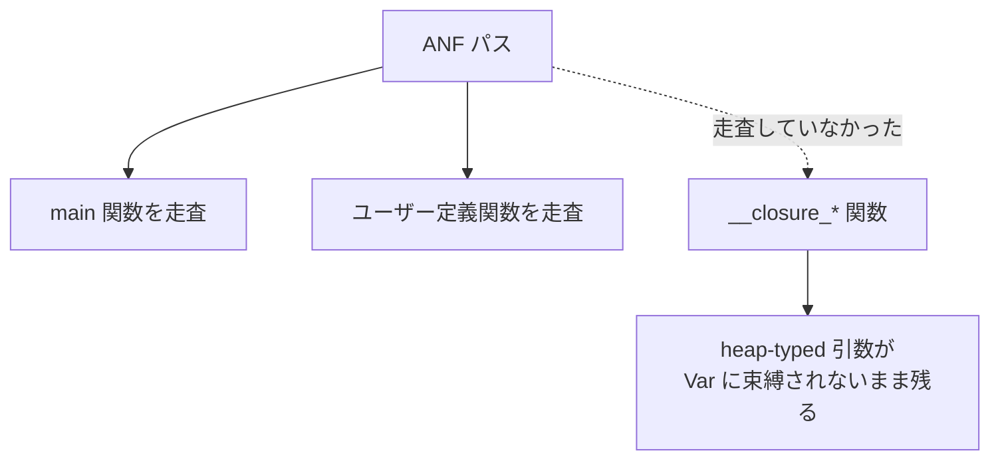

Almide コンパイラの ANF パスが、リフトされたクロージャ内部の関数呼び出し引数を正規化し損ねていたバグ。postcondition（パス実行後の検証チェック）が検出した。deny-list → allow-list への反転リファクタリングが silent leak を顕在化させた好例。

## 前提知識

### ANF (A-Normal Form) とは

プログラムの中間表現の一種。**すべての部分式に名前を付ける**（変数に束縛する）ことで、式の評価順序を明示化する。

```
// ANF 変換前
print(add(1, mul(2, 3)))

// ANF 変換後: 各部分式が変数に束縛される
let _1 = mul(2, 3)
let _2 = add(1, _1)
print(_2)
```

なぜ必要か: [[perceus|Perceus]] の dup/drop 挿入は各変数の生存区間が明確である必要がある。ANF にすれば構文的に「この変数はここで最後に使われる」が確定する。

### クロージャリフティングとは

クロージャ（外側の変数をキャプチャする関数）を、トップレベルの通常関数に変換するコンパイラ変換。

```
// 変換前: クロージャが outer をキャプチャ
fn make_adder(outer) =
  (x) => outer + x

// 変換後: クロージャがトップレベル関数 __closure_1 にリフトされる
fn __closure_1(outer, x) =
  outer + x

fn make_adder(outer) =
  partial(__closure_1, outer)  // outer を部分適用
```

リフトされた `__closure_*` 関数は `program.functions` に追加され、他の関数と同じようにコンパイラパスの処理対象になる。

### needs_lift() — 何を変数に束縛するか

ANF パスの中核関数。式を見て「これは変数に束縛すべきか？」を判定する。

**heap-typed な引数**（ヒープに確保される型 = String, List, ユーザー定義型など）は ANF で必ず変数に束縛する必要がある。束縛しないと Perceus の RC 管理が正しく動かない。

## 何が起きたか

### deny-list → allow-list の反転

もともと `needs_lift()` は **deny-list 方式**だった:

```
// deny-list: 「リフトしなくていいもの」を列挙
fn needs_lift(expr) =
  match expr {
    Var(_) => false      // 変数はそのまま
    Literal(_) => false  // リテラルはそのまま
    _ => true            // それ以外は全部リフト
  }
```

これが **allow-list 方式** に反転された:

```
// allow-list: 「リフトすべきもの」を列挙
fn needs_lift(expr) =
  match expr {
    Call(..) => true
    RuntimeCall(..) => true
    // ... 明示的にリスト
    _ => false
  }
```

**なぜ反転したか**: deny-list だと、新しい `IrExprKind` のバリアントが追加されたとき deny-list に入れ忘れると**黙ってリフトされる**（安全側に倒れるが無駄が増える）。allow-list だと入れ忘れは**黙ってリフトされない**（危険側に倒れるが postcondition が検出する）。

### postcondition が本物のバグを検出

deny-list 反転後、ConcretizeTypes パスの postcondition が発火した:

```
closure_nested_capture_test.almd:
  __closure_3: heap-typed 引数が Var にリフトされていない (Discriminant(2))
  __closure_5: 同上
```

`Discriminant(2)` は `IrExprKind` enum の3番目のバリアント（0始まり）で、`Call` または `RuntimeCall` に相当。つまり**関数呼び出しの引数が ANF 正規化されていなかった**。

### 根本原因

ANF パスがリフトされたクロージャ (`__closure_*`) のボディを走査していなかった。



クロージャリフティングが `__closure_*` を `program.functions` に追加するタイミングが ANF パスのカウンター（走査済みリスト）の後だったため、追加されたクロージャ関数が ANF 変換を素通りしていた。

## なぜ今まで見つからなかったか

deny-list 時代は `needs_lift()` が広すぎたため、**本来リフト不要なものまでリフトしていた**。結果として「リフトし忘れ」は起きにくかった（過剰リフトが silent leak をマスクしていた）。allow-list に反転して初めて、必要なリフトが行われない箇所が顕在化した。

## postcondition の価値

| 検出方式 | このバグを見つけられたか |
|---|---|
| 単体テスト | クロージャのネストが浅いケースでは通ってしまう。深いネストの特定パターンでのみ発火 |
| deny-list の needs_lift() | 過剰リフトでマスクされる |
| allow-list + postcondition | **検出できた**。パス実行後に「heap-typed な引数がすべて Var か？」を機械的に検証 |

これは [[almide|Almide]] の Pipeline Verification Chain の実例。各パスが postcondition で自身の正しさを保証することで、パス間のバグが積み重なる前に検出される。

## 関連

- [[almide|Almide]] — Pipeline Verification Chain。ConcretizeTypes の postcondition がこのバグを検出
- [[perceus|Perceus]] — ANF 上で dup/drop を挿入する。ANF が不完全だと RC 管理が壊れる
- [[hof-inline-fusion|HOF インライン融合とクロージャ変換]] — 非capturing ラムダを生 Lambda のまま残す最適化。同じくクロージャ表現の場合分けが生む制約
