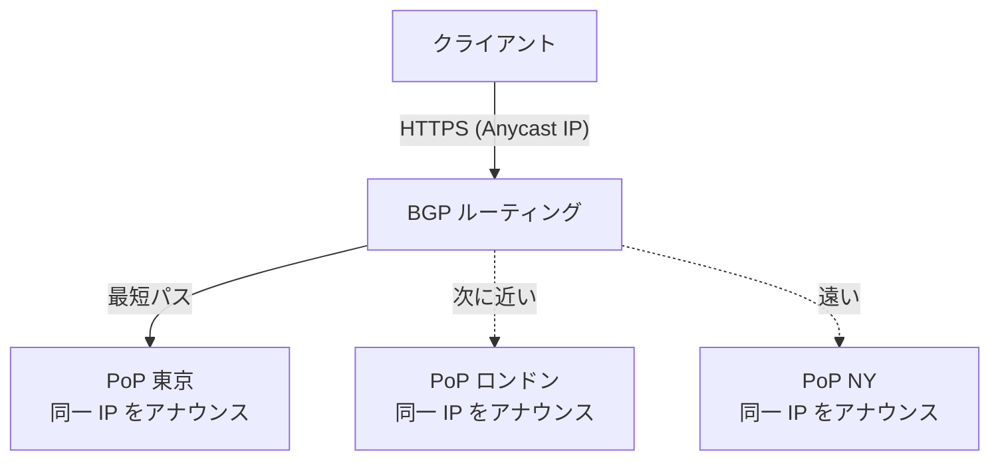
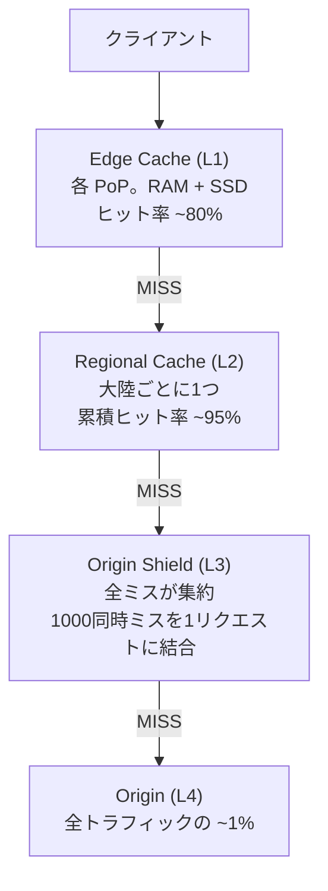
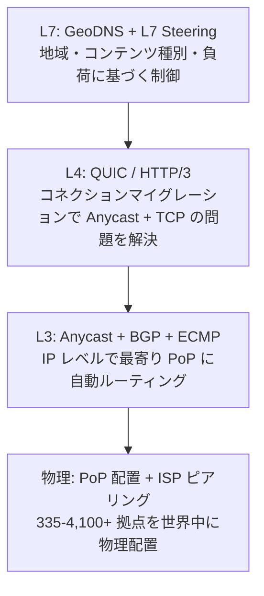

[[edge-computing|Edge Computing]] における「近さ」を実現する技術。Anycast は L3 で最寄りの PoP にパケットを自動ルーティングし、CDN はその上にキャッシュ階層を構築する。Edge CDN はさらにコンピュートを追加して「近い場所でコードも実行できる」世界を実現した。

## IP ルーティングの4方式

| 方式 | 送信:受信 | 定義 | 用途 |
|---|---|---|---|
| Unicast | 1:1 | 特定の1つの IP に送信 | HTTP, SSH |
| Broadcast | 1:全 | ネットワーク全体に送信 | ARP, DHCP |
| Multicast | 1:N | オプトインしたグループに送信 | IPTV, ストリーミング |
| Anycast | 1:最寄り1台 | 同一 IP を複数拠点が共有。最も「近い」1台にルーティング | DNS, CDN |

## Anycast の仕組み

### 同一 IP を複数拠点でアナウンス

1. 各 PoP が同一の IP プレフィックス (通常 /24) を BGP で上流にアナウンス
2. インターネット上のルーターが同一プレフィックスへの複数経路を保持
3. BGP 経路選択アルゴリズムに基づき「最良」の経路を選択
4. クライアントのパケットがトポロジカルに最も「近い」PoP に到達

### 「最も近い」≠ 物理距離

Anycast の「近さ」は BGP メトリクス (AS パス長等) で測った最短パスであり、物理的な地理距離とは一致しない。海底ケーブルの容量や ISP のピアリング関係が影響する。

### BGP 経路選択の主要ステップ

| 優先度 | 属性 | 選択基準 | Anycast での重要度 |
|---|---|---|---|
| 2 | LOCAL_PREF | 最大値 | 最重要。CDN 事業者がトラフィック制御に使用 |
| 4 | AS_PATH 長 | 最短 | 重要。AS Prepending で人為的に延長可能 |
| 6 | MED | 最小値 | 隣接 AS への入口選好の提案 |
| 8 | IGP メトリック | 最小値 | Hot Potato Routing |
| 9 | ECMP | 等コスト全経路 | 等コスト経路間の負荷分散 |

## DNS ルーティング vs Anycast ルーティング

| 比較 | DNS ベース (GeoDNS) | Anycast ベース |
|---|---|---|
| 動作層 | L7 (アプリケーション) | L3 (ネットワーク) |
| 仕組み | DNS リゾルバの IP から位置推定 → 最寄り PoP の IP を応答 | 全 PoP が同一 IP を BGP 広告。IP 層で最寄りに到達 |
| TTL 依存 | あり。キャッシュ期限まで古い IP を使用 | なし。即座にルーティング |
| 位置精度 | DNS リゾルバの位置に依存 | クライアント自身のネットワーク位置 |
| フェイルオーバー | DNS TTL 期限切れまで障害 PoP に向く | BGP 経路撤回で秒単位 |
| 制御粒度 | 高い (地域・言語別に細かく制御可能) | 低い (BGP に委ねる) |

現代の CDN は Anycast + GeoDNS + L7 Steering の3層ハイブリッド。

## CDN の仕組み

### キャッシュ階層 (4層モデル)

Origin Shield のリクエスト結合: 1000クライアントが同時にキャッシュミスしても、Origin には1リクエストしか送らない。Cloudflare: Argo Tiered Cache、Fastly: Shielding。

### TLS 終端

CDN の最大の性能貢献の一つ。シドニー→バージニアで直接 TLS ハンドシェイクすると 2 RTT (~700ms)。PoP でローカルに終端することでこのレイテンシを排除。

### キャッシュ制御

| ディレクティブ | 説明 |
|---|---|
| `max-age=N` | N秒間キャッシュ有効 |
| `s-maxage=N` | CDN 向け TTL (`max-age` より優先) |
| `stale-while-revalidate=N` | 期限切れ後 N秒間、古い応答を返しつつバックグラウンドで再検証 |
| `stale-if-error=N` | オリジンエラー時、N秒間古い応答を提供 |
| `immutable` | コンテンツ不変。再検証しない |

推奨戦略:
- 静的アセット (バージョン付 URL): `max-age=31536000, immutable`
- HTML: `max-age=30, stale-while-revalidate=60, stale-if-error=600`
- API: `s-maxage=60, stale-while-revalidate=120`

### キャッシュキーの注意

- Cookie をキャッシュキーに含めない → セッション Cookie で per-user バリアントが生成され、ヒット率が 95% → ~0% に崩壊
- `Vary: Accept-Encoding` は許容 (2バリアント)。`Vary: User-Agent` は厳禁 (数千バリアント)
- バージョン付 URL (`/app.a3f7c9.js`) が最も確実なキャッシュ無効化

## TCP と Anycast の問題

TCP はコネクション指向。通信中に BGP の経路が変更されると:

1. パケットが別 PoP に到達
2. 新 PoP に TCP 状態がない
3. TCP RST (リセット) → コネクション断

### 対策

| 対策 | 効果 |
|---|---|
| BGP の安定性確保 | 保守的なポリシーでルート変更を抑制 |
| BFD | 1秒未満の障害検出 → BGP 収束を高速化 |
| ECMP | 一貫性ハッシュでフロー固定 |
| QUIC / HTTP/3 | Connection ID でコネクション識別。IP 変更でも接続維持 |

### QUIC が Anycast の問題を構造的に解決

- QUIC コネクションは Connection ID で識別 (IP/ポートではない)
- 初回は Anycast で最寄り PoP に接続 → PoP がユニキャスト IP を通知 → 以降はユニキャストで安定接続
- Connection ID により切り替えが透過的 (コネクションマイグレーション)

## Anycast の利点

| 利点 | 詳細 |
|---|---|
| DDoS 耐性 | 攻撃トラフィックが全 PoP に自動分散。ネットワーク全体の容量が攻撃耐力 |
| 低レイテンシ | BGP で最寄り PoP に自動ルーティング。DNS 遅延なし |
| 高可用性 | PoP 障害時、BGP 経路撤回で秒単位フェイルオーバー。DNS TTL 待ち不要 |
| UDP との親和性 | DNS (1.1.1.1, 8.8.8.8) 等の短トランザクションに最適 |

## Edge Computing と Anycast

### 従来 CDN vs Edge CDN

| | 従来 CDN | Edge CDN |
|---|---|---|
| できること | 静的コンテンツのキャッシュ・配信 | キャッシュ + 任意のコード実行 |
| パーソナライズ | 不可 | 可能 (リクエストごとに動的生成) |
| オリジン依存 | 動的コンテンツは必ずオリジンに転送 | Edge で処理完結可能 |

### Anycast + Edge Compute = グローバル分散コンピュータ

1. Anycast: デプロイ先を意識せず、全リクエストが最寄り PoP に到達
2. Edge Compute: PoP 上で任意のロジックを実行 ([[v8-isolates|V8 Isolates]] / [[wasm-at-the-edge|WASM]])
3. 分散ストレージ: [[edge-data|KV, D1, R2, Durable Objects]] で Edge に状態を持てる
4. ゼロコンフィグ: コード push → 330+ PoP に即座にデプロイ

従来の「リージョン選択 → デプロイ → LB 設定」というクラウドの運用モデルとは根本的に異なる。

## 主要 CDN プレイヤー

| CDN | PoP 数 | Anycast | Edge Compute |
|---|---|---|---|
| Akamai | 4,100+ | DNS 主体 + Anycast DNS | EdgeWorkers + Spin (WASM) |
| CloudFront | 450+ | DNS ベース (Route 53 Anycast) | Lambda@Edge / CF Functions |
| Cloudflare | 335+ | 全面 Anycast | Workers (V8 Isolates) |
| Google Cloud CDN | 180+ | Anycast | Cloud Functions/Run 連携 |
| Fastly | ~80 | Anycast | Compute (WASM) |

PoP 数の注意: 定義がプロバイダーごとに異なる。Akamai は ISP 内の単一サーバー、Cloudflare はフルスタックデプロイ。330 PoP が 1,500 PoP とメディアンレイテンシで同等以上のケースもある。

## 「近さ」の実現スタック

## 押さえどころ（カード化候補）

- Anycast の定義 → 同一 IP アドレスを複数拠点が BGP でアナウンスし、ネットワーク層で「最も近い」1台にパケットをルーティングする L3 技術。CDN と DNS の基盤
- Anycast の「近い」≠ 物理距離 → BGP メトリクス (AS パス長等) による最短パスは物理距離と一致しない。海底ケーブル容量や ISP ピアリング関係が影響
- DNS ルーティング vs Anycast → DNS: TTL 依存、リゾルバ位置に依存、フェイルオーバーが遅い。Anycast: IP 層で即座にルーティング、DNS キャッシュ影響なし、秒単位フェイルオーバー
- CDN キャッシュ階層 → Edge (ヒット率 ~80%) → Regional (累積 ~95%) → Origin Shield (リクエスト結合) → Origin (~1%)。4層で Origin 到達を最小化
- Origin Shield のリクエスト結合 → 1000同時キャッシュミスを Origin への1リクエストに結合。Thundering herd 問題を解決
- TLS 終端が CDN の性能貢献 → シドニー→バージニア直接で 2 RTT ~700ms。PoP でローカルに TLS 終端することでこのレイテンシを排除
- TCP + Anycast の問題 → 通信中に BGP 経路が変更されると TCP コネクション断。QUIC が Connection ID でコネクション識別することで構造的に解決
- Anycast の DDoS 耐性 → 攻撃トラフィックが全 PoP に自動分散。1キャッチメントの攻撃は他に影響しない。PoP 増加で耐性が線形スケール
- キャッシュキーの罠 → Cookie をキャッシュキーに含めるとヒット率 95% → ~0% に崩壊。Vary: User-Agent も厳禁 (数千バリアント)。バージョン付 URL が最も確実な無効化
- Edge CDN vs 従来 CDN → 従来: 静的キャッシュのみ。Edge CDN: キャッシュ + 任意コード実行 + パーソナライズ。Edge CDN の CAGR ~34% (従来 ~14%)
- Anycast + Edge Compute の意味 → Anycast (自動最寄りルーティング) + Edge Compute (PoP でコード実行) + 分散ストレージ = 「グローバル分散コンピュータ」。リージョン選択不要のゼロコンフィグデプロイ
- BGP 収束と可用性 → PoP 障害時 BGP 経路撤回で 5-20秒でフェイルオーバー。BFD で 1秒未満の障害検出。DNS ベースより桁違いに速い

## Links

- [RFC 4786: Operation of Anycast Services](https://www.rfc-editor.org/rfc/rfc4786.html)
- [What is Anycast? (Cloudflare)](https://www.cloudflare.com/learning/cdn/glossary/anycast-network/)
- [BGP Best Path Selection Algorithm](https://www.pinglabz.com/bgp-best-path-selection/)
- [Cache-Control (MDN)](https://developer.mozilla.org/en-US/docs/Web/HTTP/Reference/Headers/Cache-Control)

## 関連

- [[edge-computing]] — Anycast / CDN が Edge の「近さ」を実現する基盤技術
- [[edge-platforms]] — Cloudflare, Fastly, Deno 各プラットフォームの Anycast 活用
- [[edge-data]] — CDN キャッシュと Edge データストアの使い分け
- [[quic-http3]] — QUIC の Connection ID が TCP + Anycast の経路変更問題を構造的に解決
