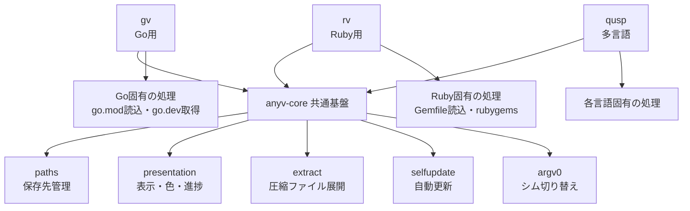

`*v` 系ツールチェインマネージャ（[[gv]]、[[rv]] など）の共通基盤 crate。言語非依存な配管部分を肩代わりする。

## 何ができる？

複数の「言語バージョン管理ソフト」（[[gv]] = Go 用、[[rv]] = Ruby 用、など）が共通して必要とする裏方の仕事をまとめて引き受ける部品庫です。図書館の貸出システムが、本でも CD でも DVD でも「貸出記録」「返却処理」「延滞通知」など共通の機能を一つの仕組みで使い回すのと同じ発想で、各言語マネージャがインストール先のフォルダ管理・進捗バー表示・自動アップデートなどをいちいち作り直さなくて済むようにしています。

何が嬉しいかというと、新しい言語向けの管理ソフトを作るときに、毎回 500 行以上の同じようなコードを書かずに済み、結果としてどの言語のマネージャも同じ操作感で使えるようになる点です。

## 用語

- **ツールチェインマネージャ**: プログラミング言語の「バージョン切り替え係」。同じパソコンで Go 1.21 と Go 1.25 を使い分けたい時に役立つ。
- **crate**: Rust の世界で言う「再利用可能な部品パッケージ」。
- **trait**: Rust で「こういう機能を備えた部品」と決める設計図。anyv-core はあえてこの設計図を共通化していない。
- **XDG レイアウト**: Linux/Mac で「設定ファイルや保存先はこのフォルダに置く」という共通ルール。
- **シム（shim）**: 本物のコマンドの代わりに置く小さな仲介役プログラム。「IDE から呼ばれた時にどのバージョンを使うか」を判断する。
- **archive**: 複数のファイルを一つにまとめた箱（zip や tar.gz）。
- **sha256**: ファイルの「指紋」のような数値。中身が一文字でも違えば指紋も変わるので、改ざんチェックに使う。
- **atomic-replace**: ファイル置き換えを「中途半端な状態が見えない」一発で行う技。実行中のバイナリを安全に差し替えるのに使う。
- **マニフェスト**: そのプロジェクトが使うバージョンを書き留めたファイル（go.mod、Gemfile など）。
- **ロックファイル**: 全員が同じバージョンを使えるよう、確定したバージョンを記録したファイル。

## 仕組み



中央の anyv-core が「どの言語でも変わらない処理」を提供し、上にぶら下がる各マネージャが「その言語ならではの細部」だけを担当します。共通部分を中央に集めることで、すべての言語マネージャが同じ操作感（同じサブコマンド、同じ記号、同じ解決順序）になります。

## Core Idea

「汎用 VM フレームワーク」ではない。trait ベースのバックエンド抽象は持たない。Gemfile vs `go.mod`、`ruby-build` vs `go.dev`、`rubygems.org` vs `sum.golang.org` のような言語固有のセマンティクスは各 `*v-core` に残す。anyv-core は「どの言語でも同じになる箇所」だけを持つ。

依存することで ~500 行のボイラプレートを削減し、`gv`/`rv` で機能している慣習を継承できる。

## What you get

| Module | 提供物 |
|---|---|
| `paths` | `<APP>_HOME` 上書き対応の XDG レイアウト (`GV_HOME`, `RV_HOME` …) |
| `presentation` | スピナー、ANSI色、`humanize_bytes`、`format_duration_ms`、`plural`、`quote_sh`/`quote_ps`、`set_quiet` + `say!` マクロ |
| `extract` | `extract_archive(p, dest)` — `.tar.gz` / `.zip` 自動判定 |
| `fs` | `dir_size`（symlink 二重カウントしない）、`walk_files` |
| `argv0` | `rewrite_for_x_dispatch("foo")` — `foox` シムトリック (`gvx` / `rvx`) |
| `target` | `target_triple()` — self-update 用の Rust target 検出 |
| `selfupdate` | `SelfUpdate { repo, bin_name, current_version }.run(...)` — GitHub Release 取得 + sha256 検証 + 原子的バイナリ置換 |

## What stays in your `*v-core`

- ツールチェインインストーラ（go.dev tarball / `ruby-build` / `python-build-standalone` / `nodejs.org` …）
- パッケージレジストリクライアント（`sum.golang.org` / `rubygems.org` / `pypi.org` / npm registry）
- マニフェストリーダ（`go.mod`, `Gemfile`, `pyproject.toml`, `package.json` engines）
- 解決連鎖（env → manifest → file → global → latest の順序は普遍だが、ファイル名とパーサは異なる）
- ロックファイル schema（`gv.lock` のモジュールハッシュ vs `rv.lock` の gem チェックサム）

## 継承される慣習

依存することで自然に揃うインターフェース:

1. サブコマンドレイアウト: `install`, `list`, `current`, `which`, `use-global`, `run`, `add tool`, `tool {list, registry, add, remove}`, `sync (--frozen)`, `init`, `tree`, `outdated`, `upgrade`, `lock`, `cache {info, prune}`, `dir`, `uninstall`, `env`, `self-update`, `completions`, `doctor`, `x` (with `<app>x` shim)
2. プロジェクトファイル: `<app>.toml` ルート、`[<lang>]` でツールチェインバージョン、`[tools]` でユーティリティピン
3. ロックファイル: `<app>.lock`、`--frozen` でネットワーク解決禁止
4. 解決順序: env var → 言語マニフェスト → ツール固有バージョンファイル → ユーザグローバル → 最新インストール
5. 出力規約: `✓` 完了、`+` 新規、`~` 変更、`=` 不変、`-` 削除

## SelfUpdate 期待形式

```
https://github.com/<repo>/releases/download/<tag>/<bin_name>-<tag>-<triple>.tar.gz
```

兄弟 `.sha256` 必須。Atomic-replace は unix では inode をまたぐ rename、Windows では rename-aside-then-move で実行中バイナリ問題に対処。

## リファレンス実装

- [[gv]] — Go (`go.mod`、`go.dev`、`proxy.golang.org` + `sum.golang.org`)
- [[rv]] — Ruby (`Gemfile` / `.ruby-version`、`ruby-build`、`rubygems.org`)
- [[qusp]] — multi-language（gv-core/rv-core を Cargo lib として直接利用）

## Versioning

Semver。0.x では minor で破壊的変更。tag でピン:

```toml
anyv-core = { git = "https://github.com/O6lvl4/anyv-core", tag = "v0.1.0" }
```

## Links

- [GitHub](https://github.com/O6lvl4/anyv-core)
