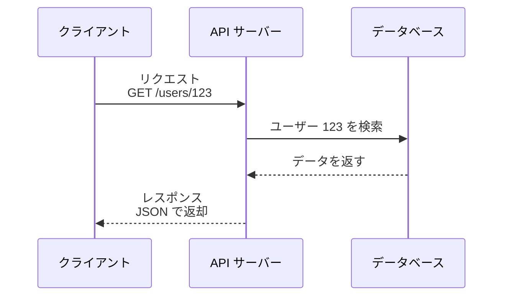

プログラム同士が会話するための「窓口」と「契約」。決まった手順でリクエストを送ると、決まった形でレスポンスが返ってくる。

## 何ができる？／なぜ重要？

コンビニの ATM を思い浮かべてください。中で銀行のシステムが何をしているかは知らなくても、画面の指示通りにカードを入れて金額を打てば、お金が出てきます。「裏側の仕組みは隠して、表の手順だけ決めておく」これが API の発想です。プログラムから見ると、API は「この URL にこの形のデータを送れば、この形の答えが返ってくる」という約束ごとです。

これが嬉しいのは、相手の中身を理解しなくても機能を借りられることです。地図サービスの API を使えば自分で地図を作らずに済み、決済 API を使えば自分で銀行と契約しなくて済みます。なければ、何をするにも一から作る必要があり、現代のソフトウェアは成り立ちません。

## 仕組み

クライアントは決まった形式でリクエストを送り、API サーバーが内部処理をして決まった形式のレスポンスを返します。中身の実装は隠されています。

## 用語

- **エンドポイント**: API の窓口の URL。例: `https://api.example.com/users`。
- **リクエスト / レスポンス**: 送る情報と返ってくる情報。
- **REST**: 代表的な API スタイル。HTTP メソッド（GET/POST 等）で操作を表す。
- **GraphQL**: 必要なデータだけを問い合わせて取得する API スタイル。
- **JSON**: API でよく使われるデータ形式。`{ "key": "value" }` の形。
- **認証 (Authentication)**: 誰がアクセスしているかを確認する仕組み。
- **APIキー / トークン**: 認証に使う「鍵」のような文字列。
- **レートリミット**: 一定時間あたりの呼び出し回数の上限。
- **SDK**: 特定の言語から API を使いやすくしたライブラリ。

## vault 内での使われ方

- [[unillm]] — 複数の LLM API を統一インターフェースで扱う
- [[llm-throttle]] — LLM API のレートリミット制御
- [[llm-queue-dispatcher]] — LLM API 呼び出しのキュー管理
- [[outline-api-client-ts]] — Outline の API クライアント
- [[next-auth-providers]] — 認証 API プロバイダ
- [[auth-providers-ts]] — TS 製の認証 API ラッパー
- [[memre]] — 記憶 API
- [[memory-rag]] — RAG API
- [[aid-on-contract-generator]] — 契約書生成 API 利用
- [[almide-wasm-bindgen]] — Almide と JS の API 橋渡し
- [[almide-bindgen]] — 言語間 API バインディング生成
- [[image-catalog-composer]] — 画像 API を活用
- [[fractop]] — API 連携を含むツール
- [[ccgrid]] — API 連携グリッドツール
- [[playground]] — API を試す環境

## 関連概念

- [[cli]] — 人間向けのインターフェース。API はプログラム向け
- [[llm]] — LLM サービスは API として提供される
- [[token]] — API 利用は通常トークン量で課金

## Links

- [Wikipedia: API](https://ja.wikipedia.org/wiki/%E3%82%A2%E3%83%97%E3%83%AA%E3%82%B1%E3%83%BC%E3%82%B7%E3%83%A7%E3%83%B3%E3%83%97%E3%83%AD%E3%82%B0%E3%83%A9%E3%83%9F%E3%83%B3%E3%82%B0%E3%82%A4%E3%83%B3%E3%82%BF%E3%83%95%E3%82%A7%E3%83%BC%E3%82%B9)
