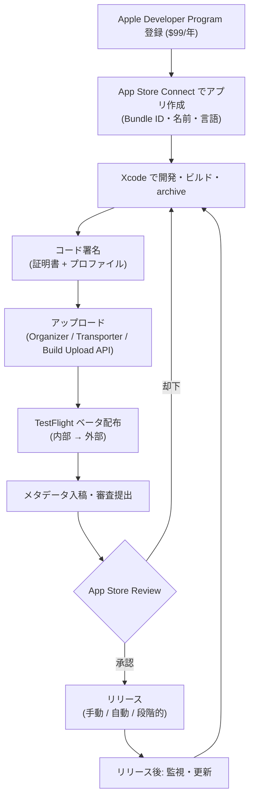

iOS/macOS アプリを **ゼロから一般公開まで** に通る一連のフロー。[[xcode|Xcode]]（作る）→ [[app-delivery|App Delivery]]（運ぶ）→ [[app-store-review|App Store Review]]（通す）→ [[app-store|App Store]]（配る）を時系列で束ねた全体地図。各工程の詳細はリンク先へ。

## 全体フロー

## 各ステップ

### 1. 前提を整える（初回のみ）

- **Apple Developer Program** 登録（$99/年）。TestFlight・配布はここに含まれる
- **App Store Connect** でアプリレコード作成（Bundle ID、アプリ名、プライマリ言語）
- 署名基盤を用意 — Xcode 自動署名、またはチーム/CI なら [[app-delivery|fastlane match]]

### 2. ビルドする

- Xcode でビルドして **archive**（配布用バイナリ）
- **Privacy Manifest** を整備（required reason API の用途申告。不備は頻出却下要因）
- **2026年4月以降** は全プラットフォームで最低 SDK 要件を満たすこと
- バージョン番号 / ビルド番号を更新

### 3. アップロードする

- Xcode Organizer / Transporter / **Build Upload API**（2026新、CI/CD 直結）で App Store Connect へ
- アップロード後、Apple 側で処理される（Webhooks で状態変化を受け取れる）

### 4. ベータ配布する（TestFlight）

- **内部テスト**: チーム内〜100名、審査なしで即時
- **外部テスト**: 〜10,000名。初回は簡易な Beta App Review が必要
- クラッシュ／スクショのフィードバックを収集（TestFlight API で取得可）

### 5. 審査に出す

- メタデータ入稿: スクリーンショット、説明文、**年齢レーティング**（2026/1/31 までに更新必須）、プライバシー栄養ラベル、AI 利用の開示
- 審査提出 → 通常 **24〜48時間**（[[app-store-review|ヘルス/金融/キッズは長期化]]）
- 却下なら原因修正 → ステップ2へ戻り再提出

### 6. リリースする

- **手動リリース** / 承認後 **自動リリース** / **段階的リリース（phased release）**= 7日かけて段階的に配信し不具合の影響を抑える
- 価格・配信地域を設定（[[app-store|地域別に手数料・配信経路が異なる]]点に注意）
- EU 向けは [[app-store|代替マーケット/Web 配信]]とノータリゼーションの別フローも選択可

### 7. リリース後

- クラッシュ・指標を監視。アップデートは再びステップ2〜6を回す（同じループ）

## 勘所

- **審査はループの一部** — 一発で通す前提で組まず、却下→修正→再提出の往復を織り込む。スコープの小さい変更ほど審査が安定する
- **自動化が効くのは2〜5** — fastlane / Xcode Cloud + Build Upload API + Webhooks で「ビルド→アップロード→ベータ→提出」を CI/CD に載せると、人為ミスとリードタイムが激減する
- **地域分岐は最後に効く** — 価格・手数料・配信経路（US / EU / 日本 / UK）は[[app-store|地域別戦略]]が前提

## 関連

- [[xcode|Xcode]] — 作る（ビルド・署名・archive）
- [[app-delivery|App Delivery]] — 運ぶ（署名・配布・CI/CD の詳細）
- [[app-store-review|App Store Review]] — 通す（審査基準と時間）
- [[app-store|App Store]] — 配る（手数料・配信経路の地域分岐）
- [[android-release-flow|Android Release Flow]] — Android 側の対応フロー
