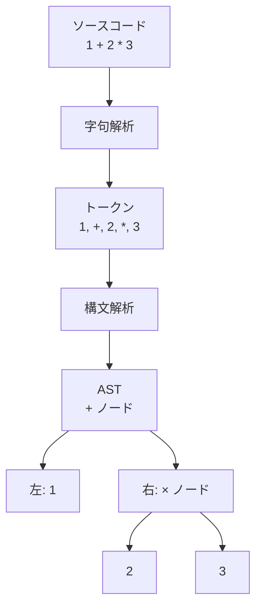

プログラムの文法的な「骨組み」を木の形で表したもの。ソースコードの文字列ではなく、構造を扱うためのデータ表現。

## 何ができる？／なぜ重要？

家系図や本の章立てを思い浮かべてください。「祖父→父→自分→子」のように、関係が枝分かれして広がっていく図です。AST はプログラムを同じように「枝分かれの木」として表したものです。たとえば `1 + 2 * 3` という式は、「足し算」の下に「1」と「掛け算（2 と 3）」がぶら下がる木になります。

これが嬉しいのは、プログラムを「文字列」ではなく「構造」として扱えるようになるからです。文字を一つずつ見るのではなく、「これは関数定義」「これは if 文」とまとまった単位で操作できます。なければ、コードの分析や変換のたびに正規表現を駆使するハメになり、すぐ破綻します。

## 仕組み

ソースコードはまずトークン列に分解され、次に構文解析器が文法ルールに従って木構造を組み立てます。完成した木が AST です。

## 用語

- **ノード**: 木の節。式、文、関数などひとつの単位を表す。
- **ルートノード**: 木のいちばん上のノード。プログラム全体に対応。
- **葉 (Leaf)**: それ以上分岐しない末端のノード（数値、変数名など）。
- **構文解析 (Parsing)**: トークン列から AST を組み立てる工程。
- **字句解析 (Lexing)**: 文字列をトークンに分解する工程。
- **AST 変換**: 木を別の木に書き換えること。リファクタリングや最適化の基本。
- **CST (Concrete Syntax Tree)**: 空白やコメントも含む、より生に近い木。AST はこれを抽象化したもの。
- **Visitor パターン**: AST を上から順に巡回して処理する書き方。

## vault 内での使われ方

- [[codopsy]] — AST レベルでコードの品質を計測する Rust 実装
- [[codopsy-ts]] — TypeScript 版 codopsy。AST から複雑度を算出
- [[famulus2]] — tree-sitter 経由で AST を解析するツール
- [[famulus]] — AST を活用したコード解析の前身
- [[tree-sitter-almide]] — Almide の文法を AST として扱う
- [[almide-grammar]] — Almide 言語の文法定義（AST のもと）
- [[almide]] — 自身の AST を持つプログラミング言語
- [[vscode-almide]] — VSCode 上で AST を活用したシンタックスハイライト
- [[lean2ts]] — Lean の AST を TypeScript に変換
- [[ccgrid]] — AST ベースの分析を含む

## 関連概念

- [[parser]] — AST を作る装置
- [[tree-sitter]] — 多言語の AST を生成するライブラリ
- [[compiler]] — AST を機械語に変換する全体工程
- [[llvm]] — AST から IR、機械語へ変換する基盤

## Links

- [Wikipedia: 抽象構文木](https://ja.wikipedia.org/wiki/%E6%8A%BD%E8%B1%A1%E6%A7%8B%E6%96%87%E6%9C%A8)
