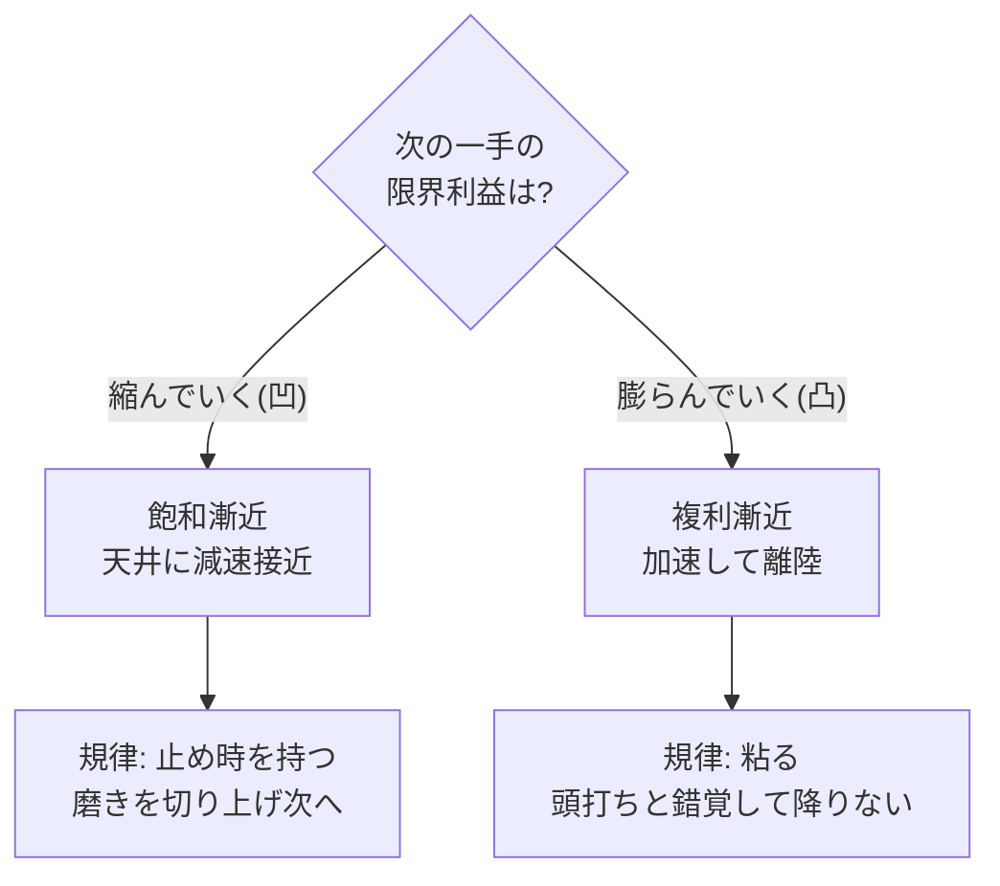

漸近線(asymptote)とは、曲線が**限りなく近づきながら決して交わらない**直線。距離は 0 に向かうが 0 にはならない。形式的には「任意の `ε>0` に対し、ある先からは距離が `ε` より小さい」— **どれだけ近くと言われてもそれより近くまで行けるが、到達はしない**。この一点を「諦め」と読むか「自由」と読むかで、仕事の規律が変わる。

## 核心: 漸近には二種類ある

同じ「線に近づく」でも、**近づき方の曲率**で意味が真逆になる。これを混同すると判断を誤る。

| | 飽和漸近(凹 / concave) | 複利漸近(凸 / convex) |
|---|---|---|
| 形 | 天井に**減速しながら**近づく | 床から離れ**やがて加速**する |
| 限界利益 | → 0(次の一手の見返りが減る) | → 増大(次の一手の見返りが増える) |
| 例 | 研磨・最適化・習熟曲線・MSR→1.0 | 複利・[[constraints-liberate\|フライホイール]]・累積資産 |
| 正しい規律 | **止め時を知る** | **早く諦めない** |
| 典型の罠 | 天井近くを磨き続けて時間を溶かす | 複利を「もう頭打ち」と誤読して降りる |

見分けの一行: **「次の1単位の努力で得られる差分」が縮むなら飽和、膨らむなら複利。**

## 仕事に貫通させる

- **MSR → 1.0 は飽和漸近** — [[the-almide-doctrine\|修正生存率]]を 0.99 から 0.999 へ磨く一手は、見返りが急速に縮む。**完璧主義は飽和線への執着**。だから[[almide-dojo\|日次計測]]は「どこで磨きを切り上げるか」の判断材料であって、1.0 到達が目的ではない。
- **コミット母数の差は複利漸近** — エコシステムの蓄積・採用・学習データは天井がない凸の曲線。**ここで「先行者に追いつけない」と諦めるのが最大の罠** — 飽和と錯覚している。複利漸近では「追いつく」のではなく、**相手の減速地点を自分の加速地点が**追い越す。
- **motto「理想に到達して勝て」の読み直し** — 理想は到達しない＝**漸近線**。否定形なら「永遠に届かない」だが、肯定形なら「**いくらでも近づける自由**」。完成は停止、漸近は永久機関。設計目標が漸近線である限り、降りる理由は生まれない。

## なぜ「自由」と読むか

到達可能な目標は、達成した瞬間に動機を失う(飽和の終端＝停止)。漸近線は永遠に達成されないからこそ、**改善の余地が枯れない**。「完成」を成功条件に置くと有限ゲームになり、「降りたくならない曲線であり続けること」を成功条件に置くと無限ゲームになる。漸近の語彙は、後者を設計するための道具。

## 押さえどころ（カード化候補）

- **漸近線とは** → 限りなく近づくが決して触れない線。距離→0 だが 0 にならない(任意の ε より近づける)。
- **二種類** → 飽和漸近(凹・限界利益→0・**止め時を知れ**)と複利漸近(凸・限界利益→増大・**早く諦めるな**)。見分けは「次の一手の差分が縮むか膨らむか」。
- **最大の罠** → 複利漸近を飽和と誤読して降りること。母数・蓄積・フライホイールは凸。追いつくのでなく追い越す。
- **完璧主義の正体** → 飽和線(MSR→1.0 等)の天井近くを磨き続ける、限界利益ゼロへの執着。
- **自由としての漸近** → 到達可能な目標は達成で停止する。漸近線は枯れないから永久機関。成功条件を「完成」でなく「降りたくならない曲線であり続けること」に置く。

> 漸近とは、到達しないことの**諦め**ではなく、限りなく**近づけることの自由**である。
> 飽くは止め、複利は粘れ。理想は触れず、近づき続けよ。

## 関連

- [[constraints-liberate]] — フライホイール(複利漸近)の駆動源。制約が累積優位を生む構造
- [[the-almide-doctrine]] — MSR は飽和漸近。1.0 到達でなく「降りない曲線」を設計する思想
- [[almide-dojo]] — MSR を日次計測。飽和線のどこで磨きを切り上げるかの判断材料
- [[simple-vs-easy]] — easy(短期の凹)を削って simple(長期の凸)を買う、漸近の選択
