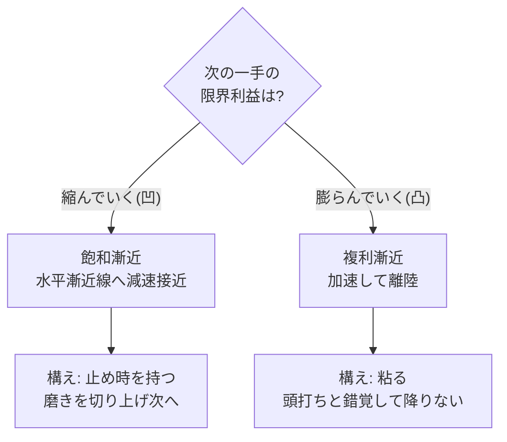

漸近線(asymptote)とは、曲線が**限りなく近づきながら決して交わらない**直線。距離は 0 に向かうが 0 にはならない。形式的には「任意の `ε>0` に対し、ある点から先では距離が `ε` より小さい」— **どれだけ近くと言われてもそれより近くまで行けるが、到達はしない**。この「到達しなさ」を諦めと読むか自由と読むかで、向き合い方が変わる。

語源はギリシャ語 *asymptōtos*（a-「ない」+ sym-piptein「共に落ちる＝交わる」）＝「**交わらないもの**」。「漸近」は「漸(ようや)く近づく」。

## 漸近の二つの顔: 幾何と解析

「漸近的」という語は数学で二つの家を持つ。混同しやすいので先に分けておく。

| | 漸近線(geometry) | 漸近的挙動(analysis) |
|---|---|---|
| 問い | 曲線はどの**直線**に近づくか | 関数は十分大きい所で**どう振る舞う**か |
| 道具 | 水平/垂直/斜め漸近線 | 極限、Big-O、漸近展開 |
| 例 | `1/x` は軸に漸近 | `n²+3n` は `n→∞` で `n²` が支配 |

以下、まず幾何の三種を押さえ、次に解析(計算量・統計)を見る。

## 漸近線の三種（数学）

| 種類 | 形 | 直感 |
|---|---|---|
| **水平漸近線** | `x→±∞` で `y→` 定数 | **天井/床**に近づく。飽和。例: `1-e^{-x}` → 1 |
| **垂直漸近線** | `x→a` で `y→±∞` | **壁/特異点**。ある一点に近づくとコストが発散。例: `1/x` の `x=0`、`tan` の `π/2` |
| **斜め漸近線** | `x→∞` で `y→ mx+b` | 曲がりが取れて**一定の傾き**に収束。例: `(x²+1)/x = x + 1/x` → `y=x` |

水平は「もう伸びない」、垂直は「ここから先は行けない(無限の費用)」、斜めは「結局この一次トレンドに乗る」。同じ漸近でも意味は別物。

## 漸近解析: n→∞ の振る舞い

計算機科学・統計で「漸近的」と言えばふつうこちら。**支配項だけを見て、定数倍・低次項を捨てる**見方。

- **Big-O 記法** — `O(n)`, `O(n²)`, `O(2ⁿ)` は `n→∞` での**増大率の分類**。`3n²+100n+5` は漸近的に `O(n²)`(`n²` が他を呑む)。アルゴリズムの優劣を「十分大きい入力」で比べる共通言語。
- **漸近は有限領域を保証しない** — `O(n log n)` のクイックソートも、小さな配列では `O(n²)` の挿入ソートに負ける(定数倍と分岐コスト)。だから実装は小領域で素朴法に切り替える。**「漸近的に速い」≠「いつも速い」**。
- **統計の漸近** — 中心極限定理は `n→∞` で標本平均の分布が**正規分布に漸近**する(漸近正規性)。推定量が真値に近づく性質を一致性と呼ぶ。「`n` を増やせばいくらでも近づく」＝漸近線と同じ構造。

→ ここでも教訓は幾何と同じ: **漸近は「無限の彼方の保証」であって、手元の有限点については何も言わない**。

## 核心: 漸近には二種類ある（使う側の見分け）

判断の道具として漸近を使うとき、効くのは**近づき方の曲がり(曲率)**の対比。ここを取り違えると、続けるべき所で降り、降りるべき所で粘る。

| | 飽和漸近(凹 / concave) | 複利漸近(凸 / convex) |
|---|---|---|
| 形 | 水平漸近線へ**減速しながら**近づく | 加速しながら離れる(`e^{t}`、上限なし) |
| 限界利益 | → 0(次の一手の見返りが**縮む**) | → 増大(次の一手の見返りが**膨らむ**) |
| 身近な例 | 習熟曲線の停滞、テストカバレッジ 95→99%、最適化の最後の数% | 複利、語彙が語彙を呼ぶ読書、信頼・評判の蓄積 |
| 数式の顔 | `1 - e^{-t}`(上に頭打ち) | `e^{t}`, 雪だるま式 |
| 正しい構え | **止め時を知る** | **早く諦めない** |

厳密には複利側(`e^t`)は上方に漸近線を持たない — 無限に伸びるか、finite-time singularity なら**垂直漸近線**(発散)に化ける。「飽和＝水平漸近、暴走＝垂直漸近」と対にすると幾何とも噛み合う。見分けの一行: **「次の1単位の努力で得られる差分」が縮むなら飽和、膨らむなら複利。**

## なぜ見分けが要るか — 二つの罠

- **飽和を複利と誤る** → 天井近くを磨き続け、限界利益ゼロに時間を溶かす。**完璧主義の正体**は、飽和線への執着。99% を 99.9% にする一手の見返りは、最初の一手の何百分の一しかない。
- **複利を飽和と誤る** → 「もう頭打ちだ」と早合点して、加速が始まる**離陸の直前で降りる**。複利漸近は序盤がいちばん退屈で平らに見える(指数関数は最初ほぼ水平)。ここで「伸びない」と判断するのが最大の取りこぼし。

同じ「最近あまり変化がない」という観測が、飽和なら**撤退の合図**、複利なら**離陸前の静けさ**。観測だけでは区別できず、**曲率を読む**しかない。これは漸近解析の「有限点は保証しない」と同根 — 一点のスナップショットからは漸近の正体は出てこない。

## 漸近を「自由」と読む

到達可能な目標は、達成した瞬間に動機を失う(飽和の終端＝停止)。漸近線は永遠に達成されないからこそ、**改善の余地が枯れない**。「完成」をゴールに置けば有限ゲームになり、達成で終わる。「**近づき続けられる曲線であること**」をゴールに置けば無限ゲームになり、降りる理由が生まれない。

否定形では「永遠に届かない」。肯定形では「**いくらでも近づける**」。同じ事実の裏表で、漸近の語彙はこの肯定形を設計するための道具になる。

## 押さえどころ（カード化候補）

- **漸近線とは** → 限りなく近づくが決して触れない線。距離→0 だが 0 にならない(任意の ε よりは近づける)。語源は「交わらないもの」。
- **二つの顔** → 幾何の漸近線(どの直線に近づくか)と解析の漸近的挙動(n→∞ でどう振る舞うか)。語が同じで対象が違う。
- **漸近線の三種** → 水平(天井/床・飽和)、垂直(壁/特異点・費用が発散)、斜め(一次トレンドに収束)。
- **漸近解析** → Big-O は n→∞ の増大率分類(支配項だけ見て定数倍・低次項を捨てる)。中心極限定理は分布の正規分布への漸近。**漸近は無限の彼方の保証で、有限点は言わない**(小入力では O(n²) が O(n log n) に勝つ)。
- **使う側の二種類** → 飽和漸近(凹・限界利益→0・**止め時を知れ**)と複利漸近(凸・限界利益→増大・**早く諦めるな**)。見分けは差分が縮むか膨らむか。
- **二つの罠** → 飽和を複利と誤れば完璧主義で時間を溶かし、複利を飽和と誤れば離陸直前に降りる。指数関数は序盤ほど平らに見える。
- **自由としての漸近** → 到達可能な目標は達成で停止する。漸近線は枯れない。ゴールを「完成」でなく「近づき続けられる曲線であること」に置く。

> 漸近とは、到達しないことの**諦め**ではなく、限りなく**近づけることの自由**である。
> 飽くは止め、複利は粘れ。理想は触れず、近づき続けよ。

## 関連

- [[constraints-liberate]] — 制約が累積優位を生むフライホイールは複利漸近(天井のない凸曲線)
- [[simple-vs-easy]] — easy(短期の凹)を削り simple(長期の凸)を買う、漸近の選択
- [[model-checking]] — 状態爆発は `O(2ⁿ)` の漸近的増大。漸近解析が限界を規定する例
