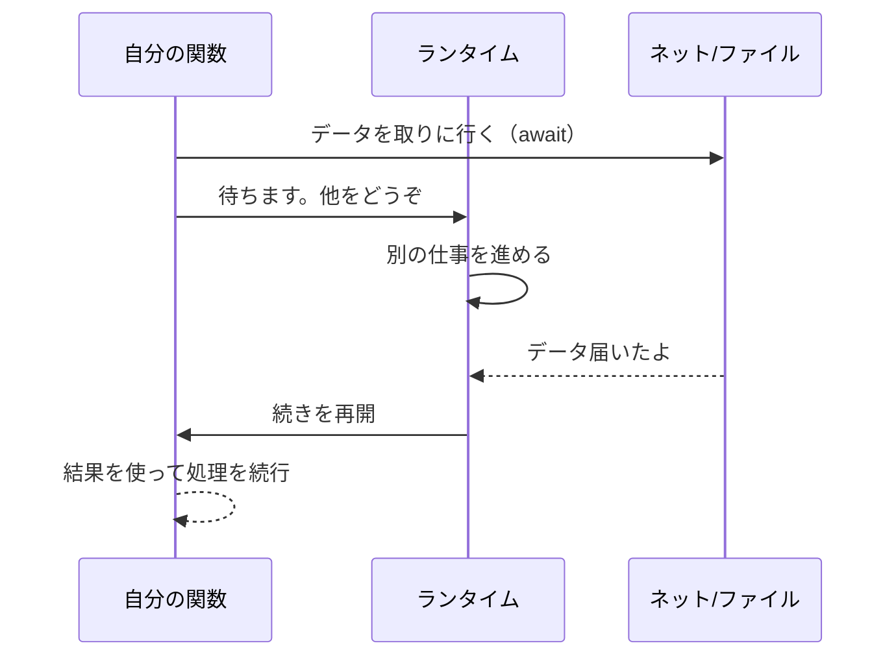

待ち時間が発生する作業を、待っている間に他の仕事を進められるようにする仕組み。

## 何ができる？／なぜ重要？

料理を作るとき、煮込み料理を火にかけたあと「煮えるまで何もせずに鍋を見つめ続ける」ことはしませんよね。煮込んでいる間にサラダを切ったり、お皿を準備したりするはずです。プログラムの世界も同じで、ネットからのデータ取得や、ファイルの読み書きには「待ち時間」がつきものです。その間に他の処理を進められれば、全体としてとても速くなります。async/await は、この「待ちながら別の作業を進める」を、人間が読んでもわかりやすい形で書ける仕組みです。

「await（待つ）」と書いた場所で、プログラムは「ここは時間がかかるから、その間に他の用事があれば先にやっていいよ」と合図します。待っていた結果が戻ってきたら、自然に続きから再開します。これがあると、レストランの厨房のように、複数の注文を並行してさばけるプログラムが書きやすくなります。

## 仕組み

await の地点で関数は一時停止し、ランタイムは空いた時間で他の仕事を進めます。外部から結果が返ってきたタイミングで、止まっていた地点から続きを再開します。

## 用語

- **async**: 「この関数は途中で待つかも」と宣言する印。
- **await**: 「ここで結果が来るまで待つ。その間は他の仕事をどうぞ」という合図。
- **Promise / Future**: 「いつか結果が返ってくる引換券」。
- **イベントループ**: 待ち中の仕事を順番に進めるランタイムの心臓部。
- **並行 (concurrency)**: 複数の仕事を切り替えながら進めること。
- **並列 (parallel)**: 複数の仕事を本当に同時に動かすこと（CPU が複数必要）。
- **ノンブロッキング**: 一つの作業が他を止めないこと。
- **ブロッキング**: 待ち時間中に何もできず止まってしまうこと。
- **ストリーム**: 結果が一度に届かず、少しずつ流れてくる形。

## vault 内での使われ方

- [[nagare]] — `Stream<T>` を `ReadableStream<T>` のサブクラスにし、async iterator/Promise ベースで Web Streams API を扱う TypeScript ライブラリ
- [[unillm]] — `await unillm().model(...).generate(...)` の Fluent API を提供する Edge-first な統合 LLM クライアント
- [[fractop]] — `await fractop().withLLM(...).parallel(5).run(...)` でチャンク並列処理を行う TS ライブラリ
- [[iteratop]] — async/await ベースの収束イテレーションループ。LLM 出力に対して評価関数で反復する

## 関連概念

- [[streaming]] — 非同期と相性のよい「少しずつ流す」設計

## Links

- [Wikipedia: Async/await](https://en.wikipedia.org/wiki/Async/await)
- [MDN: async function](https://developer.mozilla.org/en-US/docs/Web/JavaScript/Reference/Statements/async_function)
