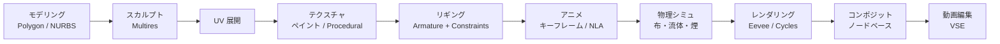
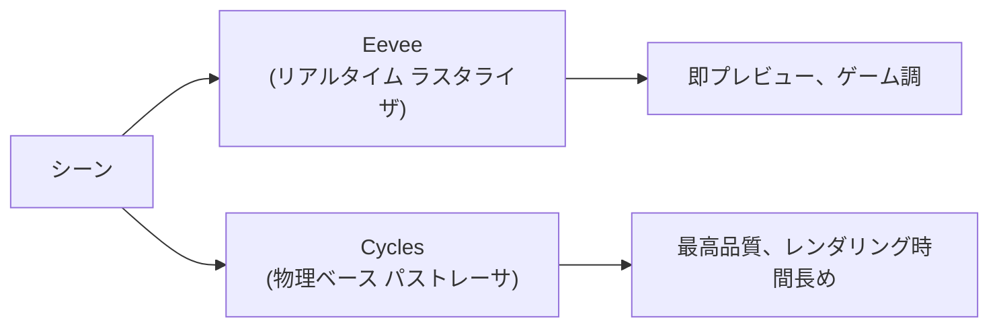

**完全無料・オープンソースの 3D 統合制作スイート**。モデリング・スカルプト・テクスチャ・リギング・アニメーション・シミュレーション・レンダリング・コンポジット・動画編集まで 1 本で揃う。Blender Foundation が開発、寄付・スポンサーで運営。Maya / 3ds Max / Cinema4D 等の数十万円ソフトを脅かす存在。

## 何ができるソフトか

「3D 制作で必要な工程をほぼすべてカバーする」のが Blender の特徴。商用 DCC ツールが工程ごとに分かれている（モデリングは Maya、テクスチャは Substance、レンダリングは V-Ray のように）のと対照的に、**Blender は1本で全部入り**。

加えて **Geometry Nodes**（プロシージャルモデリング）、**Grease Pencil**（2D アニメ）、**Python スクリプティング**で機能拡張も自在。

## 2 つのレンダラ

| レンダラ | 仕組み | 用途 |
|---|---|---|
| **Eevee** | ラスタライザ（GPU リアルタイム） | プレビュー、アニメ調、即出力 |
| **Cycles** | パストレース（物理ベース） | 写実、CM・映画品質、CPU/GPU 両対応 |

Blender 4.x からは **Eevee Next** という再設計版が導入され、両レンダラの差が縮まりつつある。

## 入出力フォーマット

入出力できる形式の広さも武器：

| 用途 | 主要フォーマット |
|---|---|
| 編集向け | `.blend`（ネイティブ）, `.fbx`, `.usd`, `.dae`, `.3ds` |
| 配信向け | `.gltf` / `.glb`, `.usdz` |
| 静止画 | `.png`, `.exr`, `.tiff` |
| 動画 | `.mp4` (FFmpeg), `.mov` |
| 単純 3D | `.obj`, `.stl`（3Dプリント用） |

[[fbx|FBX]] 互換は実装が独自（Autodesk SDK 非搭載）なので **微妙な相違**がある。アニメや法線の不一致が出たら FBX のバージョンを変えて再書き出ししてみる、が定石。

[[gltf|glTF]] エクスポータは Blender Foundation 公式実装で、**Khronos の参照実装としても扱われる**ため非常に安定。

## VTuber / VRM との関係

Blender は **VRoid Studio で完結しない作業**の引き受け手：

- **UniVRM addon for Blender** — `.vrm` の読み込み・編集・書き出し
- **VRoid からインポート** → 衣装の追加メッシュ・指の追加関節・物理ボーン調整 → 再エクスポート
- **オリジナル衣装の制作** → モデリング → ボーンウェイト調整 → VRM 衣装として書き出し
- **顔のシェイプキー追加** → カスタム表情を VRM に焼き込み

[[mixamo|Mixamo]] への中継としても：FBX で書き出して Mixamo にアップ → リグとアニメを取得 → 戻して使う。

## エディタの構造

Blender の UI は最初に挫折ポイントだが、構造を理解すると一貫している：

- **Workspace** — 用途別のレイアウト（Modeling / Sculpting / Animation / Rendering 等）
- **Editor Type** — 各ペインを 3D Viewport / Outliner / Properties / Timeline / Node Editor 等に切替可
- **Mode** — 3D Viewport の操作モード（Object / Edit / Sculpt / Pose / Weight Paint 等）
- **Modal Operations** — `G`(Grab) / `R`(Rotate) / `S`(Scale) を押すと操作モードに入り、軸キー（`X`/`Y`/`Z`）で軸固定、数値入力で精密値、`Enter` で確定

このキーボード駆動のモーダル操作が「速い」と言われる理由。

## バージョンとコミュニティ

- **2.8 (2019)** が UI 大刷新。これ以降のチュートリアルが現行
- **3.x** で Geometry Nodes が本格化
- **4.x（現行）** で Eevee Next、強化された hair system、Vulkan バックエンド進行中
- リリースサイクル: 半年に 1 メジャー
- 開発元 [Blender Foundation](https://www.blender.org/foundation/) は寄付ベース、**Development Fund** でフルタイム開発者を雇用
- Epic / NVIDIA / AMD / Microsoft / Adobe など主要企業がスポンサー

## ライセンス

- **GPLv2 / GPLv3 OR**ライセンス
- 完全無料、商用利用 OK
- **Blender で作ったコンテンツ**にライセンス制約はない（あなたの著作物）
- **Blender 自体を改変・再配布**する場合は GPL の制約あり

## 競合との比較

| ソフト | ライセンス | 強み | 弱み |
|---|---|---|---|
| **Blender** | OSS、無料 | 全部入り、コミュニティ巨大、Python 拡張 | UI 学習コスト、特化機能で商用に劣る場合も |
| Autodesk Maya | 商用、年契約 | アニメーション・リギングの業界標準、映画・ゲーム最大手で採用 | 月額数万、個人には重い |
| Autodesk 3ds Max | 商用、年契約 | アーキビズ・ゲームレベルデザイン強い | Mac 非対応 |
| Cinema 4D | 商用、年契約 | モーショングラフィックスに強い | Maya より小さいシェア |
| Houdini | 商用 + 無料 Apprentice | プロシージャル・VFX 専門、業界トップ | 学習極めて難 |
| ZBrush | 商用、買切 | スカルプト・ハイポリ造形の頂点 | スカルプト特化、汎用ではない |

## 押さえどころ（カード化候補）

- Blender の開発元とライセンス → **Blender Foundation が開発する完全無料・オープンソースの 3D 統合スイート。GPLv2/v3 OR ライセンス、商用利用可能**
- Blender がカバーする工程 → **モデリング、スカルプト、テクスチャ、リギング、アニメーション、物理シミュ、レンダリング、コンポジット、動画編集まで1本で完結**
- Blender の2つのレンダラ → **Eevee (リアルタイム ラスタライザ、プレビュー・アニメ調)、Cycles (物理ベース パストレーサ、写実)。Blender 4.x で Eevee Next として再設計**
- Blender の glTF と FBX 対応の違い → **glTF エクスポータは Blender 公式実装で Khronos 参照実装、非常に安定。FBX は Autodesk SDK 非搭載で独自実装、微妙な相違が出ることがある**
- VTuber/VRM 周辺での Blender の役割 → **UniVRM addon で .vrm を読み書きでき、VRoid Studio で完結しない作業 (衣装追加、指関節、表情シェイプキー、物理調整) の引き受け手**
- Blender のモーダル操作 → **G (Grab) / R (Rotate) / S (Scale) のキーで操作モードに入り、X/Y/Z で軸固定、数値で精密入力、Enter 確定。キーボード駆動が速さの根拠**

## Links

- [Blender 公式](https://www.blender.org/)
- [Blender Manual](https://docs.blender.org/manual/en/latest/)
- [UniVRM for Blender](https://github.com/saturday06/VRM-Addon-for-Blender)
- [Blender Studio (公式制作スタジオ)](https://studio.blender.org/)
