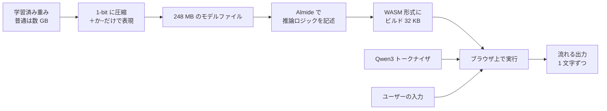

PrismML の **1-bit LLM「Bonsai」** を [[almide|Almide]] でビルドし、ブラウザチャットとして動かすプロジェクト。Almide 言語の本格利用ケース、かつ Pure CPU / Pure WASM で 1-bit LLM を走らせる稀有な事例。

## 何ができる？

普通の AI は巨大で、家庭のパソコンでは動かせません。これは「巨大な AI を、盆栽サイズに極限まで圧縮して、ブラウザの中だけで動かす」プロジェクトです。本来は数値 1 個に 16 ビット使うところを、ほぼ「+ か −」の 1 ビットだけで表現することで、データ量を 1/16 以下に縮めます。サーバを使わずブラウザで完結するので、書いた文章が外部に送られない（プライバシーが守られる）という利点もあります。「クラウドの AI ではなく、手元の PC だけで動く小さな AI」を目指した実証実験です。

## 用語

- **LLM**: 文章を生成する AI（ChatGPT のような仕組みの総称）
- **1-bit LLM**: 各重みを「+1 か −1」など 1 ビットだけで表現する超圧縮 AI
- **重み（weight）**: AI の脳細胞の繋がりの強さ。普通は小数で表現される膨大な数値
- **ビット**: 0 か 1 の最小単位。1 文字が 8 ビット
- **量子化**: 細かい数値を粗い段階に丸めて軽くする工程
- **WASM (WebAssembly)**: ブラウザで高速に動く実行形式。インストール不要で配布できる
- **WebGPU**: ブラウザからグラフィックスカード（GPU）を使う最新技術
- **トークナイザ**: 文章を AI が扱う単位（トークン）に切り分ける道具
- **KV キャッシュ**: 一度計算した中間結果を覚えておいて再利用する仕組み。会話の続きが速くなる
- **チェックポイント**: 学習済みの脳のスナップショットファイル
- **SIMD**: 1 命令で複数の数値を同時に計算する CPU の機能。並列加速の基礎
- **トークン/秒**: 1 秒間に何文字相当を生成できるかの速度指標

## 仕組み



巨大な AI モデルを 1-bit に量子化して 248 MB まで圧縮し、Almide で書いた推論コードを WASM にビルドして、ブラウザ単独で動かしています。サーバ不要・インストール不要で AI チャットが成立する点が画期的です。

## Bonsai とは

- PrismML がスクラッチから訓練した 1-bit LLM (Qwen3-1.7B アーキ、28 層)
- Q1_0 フォーマット: 128 重みごとに FP16 scale を 1 つ + 重みごとに sign bit
- 実効 **1.125 bit/weight**、1.7B モデルで **248 MB** チェックポイント
- ポストホック量子化ではなく、1-bit ground-up training run

## ライブデモ

`https://almide.github.io/bonsai-almide/`

- Qwen3 chat template + KV cache streaming + sampling (temperature / top-k / repetition penalty)
- `<|im_end|>` で停止
- WASM artifact 32 KB、モデル 248 MB（初回 IndexedDB キャッシュ）

## 数値 (2026-04-22)

| Backend | 計測 | Reference |
|---|---|---|
| native M1 (Almide + NEON + super-intrinsic + KV) | 1.38 s/tok (0.725 tok/s) | — |
| browser WASM (scalar f64) | 1.5 s/tok (0.67 tok/s) | webml-community/bonsai-webgpu (WebGPU): **51 tok/s** |
| llama.cpp Metal Q4_K_M | — | 60.9 tok/s |

スカラ f64 CPU パスとしては妥当な位置。WebGPU リファレンスから 76× 遅い。短期は SIMD → activation int8、長期は LLVM/MLIR → WebGPU compute shader auto-lowering で詰める計画（`docs/PERF_ROADMAP.md` の 5 軸）。

## モデル

- `prism-ml/Bonsai-1.7B-gguf` — `Bonsai-1.7B-Q1_0.gguf` (248 MB)
- 28 層、GQA (16 Q / 8 KV heads)、head_dim 128、SwiGLU、RoPE (θ=1,000,000)、RMSNorm
- Vocab 151,936 (Qwen3 BPE)
- ブラウザではトークナイザを `@huggingface/transformers` 経由で `Qwen/Qwen3-1.7B` から取得

## ローカル実行

```bash
# WASM + node bench
almide build --fast --target wasm \
  examples/bonsai_wasm_entry.almd -o docs/bonsai.wasm
node bench/bench_wasm_kv_stream.mjs

# Native bench
almide build bench/bench_native_kv_super.almd -o bench/bench_super
./bench/bench_super

# Browser
python3 -m http.server -d docs 8000
```

## ステータス

- **Landed**: KV cache streaming、sampling、Qwen3 chat template、EOS-aware streaming UI
- **Next**: WASM SIMD128 Q1_0 kernel、2-region allocator で bytes-shuttling 削減、Float WASM `list.sort` codegen 修正
- **Long term**: LLVM/MLIR backend → WebGPU compute shader auto-lowering

## 関連

- [[almide]] — 言語本体（WASM ターゲット駆動の実証ケース）
- [[almide-nn|nn]] — 同じく Almide で書かれた Transformer 実装（Whisper を駆動）
- [[almai]] — Almide エコシステム内の LLM クライアント（こちらは推論バックエンド側）

## Links

- [GitHub](https://github.com/almide/bonsai-almide)
- [Live demo](https://almide.github.io/bonsai-almide/)
