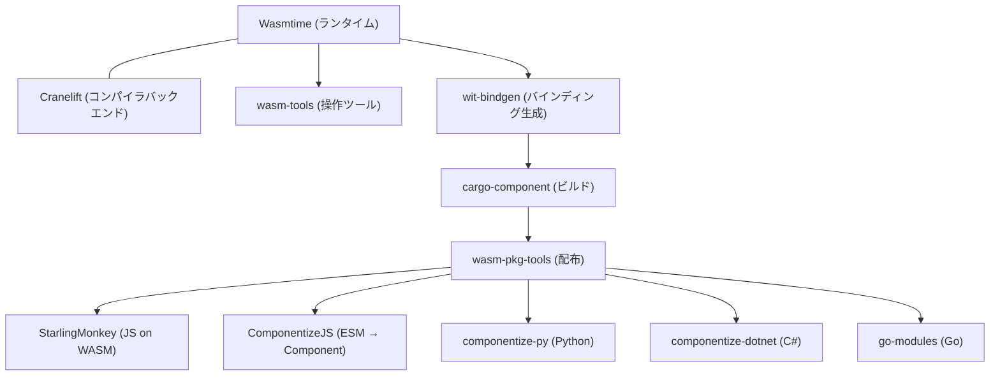

WebAssembly エコシステムの安全で標準準拠な共有実装を構築する 501(c)(6) 非営利法人。2019年に Mozilla, Fastly, Intel, Red Hat が設立。標準化団体ではなく実装団体であり、W3C WebAssembly CG が策定した仕様のリファレンス実装を提供する。

## 設立経緯

| 時期 | 出来事 |
|---|---|
| 2019年11月 | Mozilla, Fastly, Intel, Red Hat が共同設立。Lin Clark (Mozilla) が提唱 |
| 2021年4月 | 501(c)(6) 非営利法人化。Fastly, Intel, Mozilla, Microsoft が法人設立メンバー |

### 設立の動機

Lin Clark が指摘した問題:
- アプリケーションコードの約 80% がサードパーティパッケージに依存
- アプリを起動すると全依存関係にシステムリソースへの全アクセス権を暗黙委譲 (「家の鍵を渡す」)
- npm の `electron-native-notify` 事件 (150万ドルの暗号通貨窃取) が具体例

解決策: WebAssembly の「ナノプロセス」概念。デフォルトサンドボックス + メモリ隔離 + [[wasi|WASI]] による細粒度パーミッション。

## ミッション

> セキュリティ、効率性、モジュール性が共存する最先端のランタイム環境と言語ツールチェーンを、可能な限り広範なデバイスとアーキテクチャにわたって提供する。

**標準化団体ではなく実装団体**: W3C が「何を標準にするか」を決め、Bytecode Alliance が「どう実装するか」を担う。

## ガバナンス

### Board of Directors (2025年1月時点)

| 名前 | 役職 | 所属 |
|---|---|---|
| Bobby Holley | Board Chair | Mozilla |
| Tyler McMullen | Member Director | Fastly |
| Ralph Squillace | Treasurer | Microsoft |
| Oscar Spencer | Member Director | F5 |
| Deian Stefan | Member Director | UCSD |
| Bailey Hayes | At-Large Director | -- |
| Pat Hickey | At-Large Director | -- |
| Till Schneidereit | TSC Director | -- |

### Technical Steering Committee (TSC)

プロジェクトとガバナンスの最上位技術機関。Recognized Contributors の選挙で Elected Delegates を選出。

役割: プロジェクトポートフォリオの方向性、新プロジェクトのオンボーディング、プロジェクト間調整。個別プロジェクトの技術判断には介入しない。

## 主要プロジェクト

### Core Project

| プロジェクト | 概要 |
|---|---|
| [[wasmtime]] | WebAssembly + WASI のリファレンスランタイム。世界初の WASI P2 / Component Model 完全実装 |

### 主要 Hosted Projects

| プロジェクト | 概要 |
|---|---|
| Cranelift | コンパイラバックエンド (x86-64, aarch64, s390x, riscv64) |
| wasm-tools | WASM モジュールの低レベル操作 CLI + Rust ライブラリ |
| wit-bindgen | WIT からゲスト言語バインディングを生成 |
| cargo-component | WASM Component ビルド用 Cargo サブコマンド |
| wasm-pkg-tools (wkg) | OCI/Warg レジストリへの publish/fetch |
| StarlingMonkey | SpiderMonkey ベースの JS ランタイム on WASM |
| ComponentizeJS | ESM → WASM Component 変換 |
| componentize-py | Python → WASM Component 変換 |
| WAMR | 組み込み/IoT 向け軽量ランタイム (インタプリタ) |
| regalloc2 | レジスタアロケータ (Cranelift 内部) |
| cap-std | Rust 標準ライブラリの Capability-based バージョン |

## メンバー企業 (25+ 組織)

大手テクノロジー: Amazon, Microsoft, Intel, Mozilla, Fastly, F5/NGINX

WebAssembly 特化: Fermyon (→ Akamai 買収), Cosmonic, Igalia

その他: Arm, Shopify, StackBlitz, DFINITY, Stellar, Anaconda, UCSD 等

## 主要な成果

| 成果 | 時期 |
|---|---|
| WASI Preview 2 (0.2) リリース | 2024年1月 |
| Component Model の策定と実装 | 2024年〜 |
| Wasmtime LTS 体制 (12版ごと / 2年間) | 確立済み |
| WASI Preview 3 (0.3) RC | 2026年2月 |
| マルチエージェント LLM によるセキュリティスキャン | 2026年4月 (3週間で12件発見) |

## 他組織との役割分担

| 組織 | 役割 | Bytecode Alliance との関係 |
|---|---|---|
| W3C WebAssembly CG | WASM コア仕様・WASI 仕様の策定 | BA メンバーが仕様策定に参加し、実装フィードバックを提供 |
| Bytecode Alliance | 仕様のリファレンス実装・ツールチェーン | -- |
| [[wintertc\|Ecma TC55 (WinterTC)]] | JS ランタイム間の Web API 標準化 | 直接の組織関係はないが相互参照 |
| CNCF | クラウドネイティブプロジェクトのホスティング | SpinKube, wasmCloud が CNCF でもホスト |

## 2025-2026 の動向

- WASI 0.3 (native async): `stream<T>`, `future<T>` の Canonical ABI レベルサポート
- WASI 1.0 (forever-stable): 2026年後半〜2027年初頭が目標
- Akamai が Fermyon を買収 (2025年12月)。Spin/SpinKube は CNCF として継続
- マルチエージェント LLM でのセキュリティスキャン恒久化

## 押さえどころ（カード化候補）

- Bytecode Alliance の正体 → 標準化団体ではなく実装団体。W3C が「何を標準にするか」を決め、BA が「どう実装するか」を担う。501(c)(6) 非営利法人
- 設立の動機 → サードパーティ依存の約 80% が暗黙的にシステムリソースへの全アクセス権を持つ問題。WASM のサンドボックス + WASI の細粒度パーミッションで解決
- Wasmtime の位置づけ → BA の唯一の Core Project。WASI / Component Model の世界初の完全実装。リファレンスランタイムとして仕様策定と同期
- BA のプロジェクト群の構造 → Wasmtime (ランタイム) + Cranelift (コンパイラ) が中核。wasm-tools/wit-bindgen/cargo-component がツールチェーン。ComponentizeJS/py/dotnet が多言語対応
- TSC の役割 → プロジェクトポートフォリオの方向性設定、新プロジェクトのオンボーディング、プロジェクト間調整。個別プロジェクトの技術判断には介入しない
- W3C vs BA vs WinterTC vs CNCF → W3C: WASM 仕様策定。BA: 仕様のリファレンス実装。WinterTC: JS ランタイム API 標準化。CNCF: クラウドネイティブプロジェクトホスティング
- BA のセキュリティへの投資 → 2026年4月にマルチエージェント LLM で3週間で12件のセキュリティアドバイザリ発見 (うち2件 Critical)。LLM スキャンの恒久統合を方針化
- WASI 1.0 への道筋 → P2 (安定) → P3 (async, 2026) → ポイントリリースでスレッド等追加 → WASI 1.0 (forever-stable, 2026末〜2027初頭)
- Fermyon/Akamai 買収の BA への影響 → Akamai が Fermyon メンバーシップを継続。Spin/SpinKube は CNCF オープンソースとして維持。買収はオープンソース開発を加速する方向
- BA のライセンス戦略 → Apache 2.0 with LLVM Exception。LLVM Exception で GPL 互換性を確保し、GPL プロジェクトへの組み込みも可能に

## Links

- [Bytecode Alliance](https://bytecodealliance.org/)
- [Bytecode Alliance About](https://bytecodealliance.org/about)
- [Bytecode Alliance Projects](https://bytecodealliance.org/projects)
- [Announcing the Bytecode Alliance (Lin Clark)](https://hacks.mozilla.org/2019/11/announcing-the-bytecode-alliance/)
- [Governance (GitHub)](https://github.com/bytecodealliance/governance)

## 関連

- [[wasmtime]] — BA の Core Project。リファレンスランタイム
- [[wasi]] — BA が策定に深く関与し、リファレンス実装を提供
- [[wasm-at-the-edge]] — Fastly Compute, Fermyon Spin が BA 技術をエッジで活用
- [[wintertc]] — JS ランタイム側の標準化。BA とは補完関係
