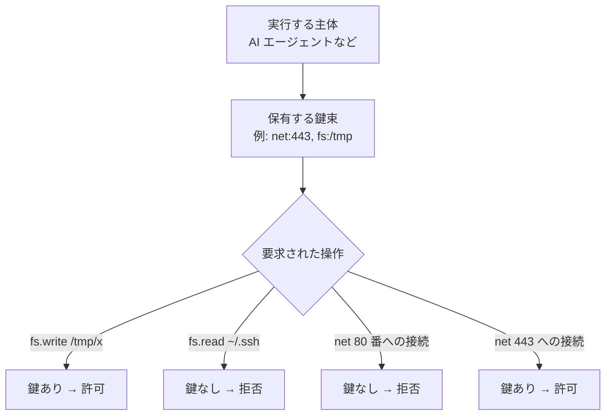

「持っている鍵で、開けられるドアが決まる」セキュリティモデル。権限を細かい単位に分けて、必要なものだけを必要な相手に渡す流儀。

## 何ができる？／なぜ重要？

家の鍵にたとえます。普通のセキュリティは「鍵を持っているのが家族なら、家中どこに入ってもよい」という方式（身分ベース）です。これだと、ペットシッターさんを呼ぶときも全部屋に入れる鍵を渡すしかありません。Capability-based security は、ホテルのフロントの発想に切り替えます。「玄関だけ開く鍵」「リビングと冷蔵庫だけ」「夕方 16〜18 時のみ」と、ドアごと・期間ごとに鍵を作り分けて配ります。鍵そのものに「どこを・いつまで」が書き込まれているので、鍵を持っているだけで権限の範囲が確定します。

なぜ重要かというと、AI エージェントや外部スクリプト、サードパーティ製プラグインのように「信頼しきれない相手」に作業を頼む機会が増えたからです。「家族だから何でも許す」ではリスクが大きすぎます。最小限の鍵だけを渡せば、もし悪意があっても被害が限定されます。

## 仕組み

主体（プロセスやエージェント）は最初から「持っている鍵」しか使えません。デフォルト拒否（deny-by-default）が基本で、鍵が足りない操作は門前払いされます。鍵は譲渡したり期限を切ったりできるので、一時的に他のプロセスへ託すことも安全に行えます。

## 用語

- **Capability（ケイパビリティ）**: 「これができる」を表す譲渡可能な権限。鍵そのもの。
- **Principal（プリンシパル）**: 鍵を持つ主体（ユーザー・プロセス・エージェント）。
- **deny-by-default**: 「初期状態は全拒否、必要なものだけ明示的に許可」の流儀。
- **least privilege（最小権限の原則）**: 仕事に必要な最小限の権限しか渡さない設計指針。
- **ACL (Access Control List)**: 対比される伝統的な方式。「対象側」が許可リストを持つ。capability は「主体側」が鍵を持つ。
- **sandbox（サンドボックス）**: 限られた capability しか持たない隔離実行環境。
- **Object capability**: 言語レベルで「参照を持っていればその操作ができる」設計。E 言語などが代表例。
- **WASI capability**: WASM が OS 機能を使うときの capability 単位（fs, net, clock など）。
- **token / handle**: 実装上の鍵そのもの。文字列や数値で表される。
- **revocation（取り消し）**: 一度渡した鍵を無効化すること。capability の重要要件。

## vault 内での使われ方

- [[porta]] — capability ベースのセキュア MCP ブリッジ。`net` `fs.write` `exec` などの鍵を組み合わせる
- [[sandboxes-o6lvl4]] — 隔離環境（サンドボックス）の運用
- [[claude-code]] — Permission System として allow/ask/deny を細かく制御
- [[famulus2]] — Permission モジュールで allow/ask/deny を制御
- [[almide]] — Effect system による「効果型」が capability に近い役割を果たす

## 関連概念

- [[oauth]] — トークンによる権限委譲。capability の web 版
- [[mcp]] — MCP サーバへの接続に capability を渡して制限する
- [[edge-computing]] — エッジで動くコードに細かい capability を配る運用
- [[theorem-proving]] — 「許可された操作のみ」を型で証明する発想と通じる

## Links

- [Capability-based security (Wikipedia)](https://en.wikipedia.org/wiki/Capability-based_security)
- [Object-capability model (Wikipedia)](https://en.wikipedia.org/wiki/Object-capability_model)
