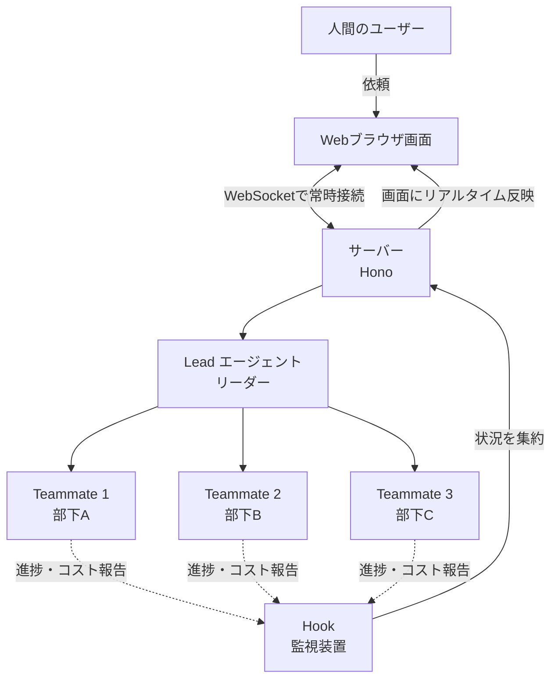
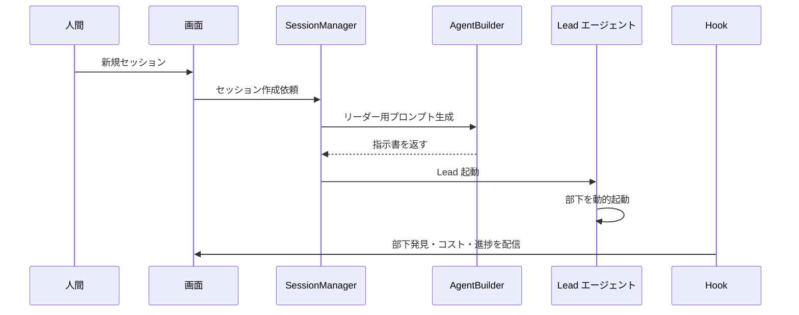

Claude Agent SDK ベースの「Lead + Teammate」チーム開発環境。Lead エージェントが複数 Teammate を動的起動し、並列タスク実行と監視を行う Web アプリ。

## 何ができる？

AI 助手をひとりではなく「リーダー＋部下たち」のチームで働かせるための、Web 画面付きの作業場です。会社で例えると、これまで一人の社員に全部やらせていた仕事を、リーダーが「君はこの調査、君はこの実装」と分担して、進捗をリーダーが見守りながら進める形に変わります。誰が何をしているか、いくらコストが掛かっているかは画面で一目瞭然。

嬉しいのは、複数の仕事を並べて同時に進められることと、リーダーが部下の様子を常に把握していること。一人で抱え込んで詰まる、を避けられます。会社の組織図と同じ感覚で AI を使えます。

## 用語

- **エージェント**: 指示を受けて自律的に作業する AI 助手プログラム。
- **Lead / Teammate**: リーダー役の AI とチームメイト役の AI。リーダーが指揮し、メイトが実作業する。
- **マルチエージェント**: AI 助手を複数並べて協力させる仕組み。
- **Hook**: AI の動きに合わせて、決まった瞬間に自動で割り込ませる仕掛け。「電話が鳴ったら録音する」装置のようなもの。
- **Session**: 1回の作業のかたまり。会議でいう「議題」1つ分。
- **WebSocket**: ブラウザとサーバーをつなぎっぱなしにして、変化を即座に伝える仕組み。「電話で話しっぱなし」状態。
- **REST API**: ブラウザがサーバーに「これお願い」と1回ずつ依頼する標準的な作法。「窓口で一件ずつ申請」のイメージ。
- **トークン**: 文章を機械が数える最小単位。AI 利用料金の計算単位。
- **Permission**: その操作を「許可・確認・拒否」のどれにするかの判定。
- **Skill / Plugin**: AI に追加できる特殊技能や拡張機能。スマホアプリを足すような感覚。
- **Snapshot**: ある瞬間の状態を丸ごと写し取ったもの。「集合写真」のようなデータ。
- **Fuel gauge**: 燃料計。ここでは「あといくらまで使えるか」の残量メーター。

## 仕組み



人間は Web 画面からリーダーに依頼を出すだけ。リーダーが部下を動的に呼び出し、仕事を分配します。Hook という監視装置が部下の動きを常に拾い、サーバー経由でブラウザに即座に届けます。会社の組織図と進捗会議が同時に見られる、と思えばイメージが近いです。

### セッション開始の流れ



## Core Idea

シングル Agent ではなく **Lead が動的に Teammate を起動・監視する** チーム構造。Agent SDK の Hook を使って Teammate の発見・タスク同期・コスト計測・DM リレーをリアルタイムに UI へ反映する。

## 主要機能

### Session Management

- Lead + Teammate 構造、`POST /api/sessions` で生成
- セッション再開（`POST /api/sessions/:id/continue`）
- token 使用量とコストをリアルタイム表示、プラン上限を fuel gauge で可視化

### Teammate Coordination

- Agent SDK Hook で Teammate を auto-discovery
- `~/.claude/tasks/{sessionId}/` の task JSON を監視・同期
- Lead ↔ Teammate 間の DM リレー（WebSocket + REST）
- ライフサイクル: `starting` → `working` → `idle` → `stopped`

### Skill & Plugin System

3 種の Skill: `official` / `external` (GitHub) / `internal` (user-defined)。GitHub repo の `ccgrid-plugin.json` を読んで一括インストール。Lead プロンプトに自動注入され Teammate からも使える。

### Permission Management

- ルールベース自動判定（toolName + pathPattern で `allow` / `deny`）
- マッチしなければ UI で対話承認、入力 rewrite も可能
- 全決定を `PermissionLogEntry` として記録

### Real-Time Communication

WebSocket で snapshot + 増分配信。Server → Client で session 状態 / Teammate 出力 / task 更新 / コスト変化を即時反映。Client → Server は permission 応答と Teammate へのメッセージ。

### File Sharing

添付ファイルを base64 で JSON 化。大きい画像は 2048px に自動リサイズ、サムネイル表示。

### Performance Optimization

`requestAnimationFrame` で大量出力を batch、Overview / Output / Teammates / Tasks の各タブ結果を cache、ローディング中は skeleton UI。

## Tech Stack

| Layer | Technology |
|---|---|
| Backend | Hono 4.7, ws 8.18, Claude Agent SDK 0.2.37 |
| Frontend | React 19.1, Zustand 5.0, Vite 6.3, Tailwind CSS 4.1 |
| Monorepo | npm workspaces |

## Architecture

```
ccgrid/
├── packages/
│   ├── shared/    型定義
│   ├── server/    Hono + WebSocket
│   │   └── src/
│   │       ├── session-manager.ts
│   │       ├── agent-builder.ts
│   │       ├── permission-evaluator.ts
│   │       ├── hook-handlers.ts
│   │       ├── task-watcher.ts
│   │       └── usage-tracker.ts
│   └── web/       React UI
```

## Session 起動フロー

```
1. NewSessionDialog → POST /api/sessions
2. SessionManager.createSession()
3. AgentBuilder が Lead プロンプト生成（custom instructions / skill list / Teammate Specs / 添付ファイル）
4. Agent SDK で Lead 起動
5. Hook が Teammate discovery / task sync / cost update を検知
6. WebSocket で UI へ配信
```

## 関連

- [[claude-code|Claude Code]] — Lead/Teammate のベース
- [[agentic-coding|Agentic Coding]] — multi-agent パラダイムの実装

## Links

- [GitHub](https://github.com/O6lvl4/ccgrid)
