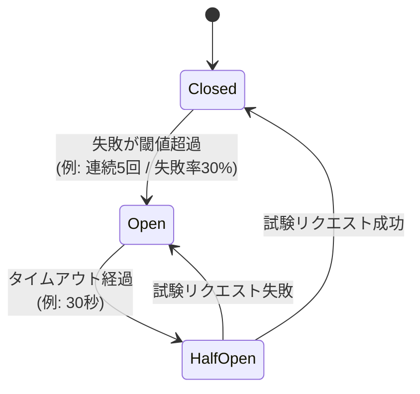

落ちている（または遅い）依存先への呼び出しを**監視し、失敗が閾値を超えたら一定時間呼び出し自体を遮断する**耐障害パターン。電気のブレーカと同じ発想で、過負荷の回路を物理的に「開いて」切り離す。Michael Nygard *Release It!* (2007) が出典、Martin Fowler が整理して広めた。

狙いは**連鎖障害（cascading failure）の防止**：応答しない下流をリトライし続けると、上流のスレッド/コネクションが待ちで枯渇し、健全だった上流まで巻き込んで全体が崩れる。ブレーカは「無駄な待ちを即座に失敗（fail fast）させて、傷を局所に閉じ込める」。

## 3状態と遷移

| 状態 | 呼び出しの扱い | 意味・役割 |
|---|---|---|
| **Closed（閉）** | 通常どおり下流へ通す。失敗をカウント | 平常運転。失敗が閾値を超えると Open へトリップ |
| **Open（開）** | 下流を呼ばず**即座にエラー**を返す（fail fast / フォールバック） | 障害中。無駄な待ちと負荷を止め、下流に回復の猶予を与える。タイムアウト後 Half-Open へ |
| **Half-Open（半開）** | **少数の試験リクエストだけ**通す | 回復したか様子見。成功なら Closed に戻し、失敗なら即 Open に戻す（全開放で再殺到を防ぐ緩衝帯） |

「閉＝通す／開＝遮断」は電気ブレーカの語感と逆に感じやすい点に注意。**閉回路＝電流が流れる＝通常**、と覚える。

## なぜ Half-Open が要るか

Open → Closed を一気に戻すと、回復しきっていない下流に全トラフィックが再び殺到し、即再ダウン（フラッピング）する。Half-Open は**1〜数件だけで生死を確認する緩衝段**。これがあるので、復旧判定が安全かつ自動になる。

## 関連パターンとの組み合わせ

- **Timeout**: そもそも応答待ちに上限を。無限待ちはブレーカ以前の前提。
- **Retry**: 一過性の失敗を吸収。ただしブレーカと併用しないとリトライ自体が連鎖障害を加速する。
- **Bulkhead（隔壁）**: リソースプールを区画化し、一つの障害が全プールを食い潰すのを防ぐ。ブレーカと相補的。
- **Fallback**: Open 時に返す代替（キャッシュ値・縮退応答）。これが無いと「fail fast」が「ただのエラー」になる。

## 実装上の勘所

- 閾値は**件数より失敗率＋最小サンプル数**で持つ方が頑健（低トラフィック時の誤発火を避ける）。
- 状態は呼び出し元プロセス側に持つ（下流が死んでいても判断できるように）。
- メトリクスを必ず出す。状態遷移はインシデントの一次情報になる。
- 代表実装: Resilience4j (Java)、Polly (.NET)、gobreaker (Go)。サービスメッシュ（Envoy/Istio）はインフラ層でこれを提供する。

## Links

- Michael Nygard, *Release It! Design and Deploy Production-Ready Software* (2007)
- Martin Fowler, [Circuit Breaker](https://martinfowler.com/bliki/CircuitBreaker.html)
- [Circuit breaker pattern — AWS Prescriptive Guidance](https://docs.aws.amazon.com/prescriptive-guidance/latest/cloud-design-patterns/circuit-breaker.html)

## 関連

- [[homeos-functional-plan]] — LLM 境界（Brain GenServer）に circuit breaker を置く設計。外部 LLM API が落ちても家の中核を守る「クリティカルパス外」の境界保護として言及される
- [[actor-model]] — Erlang/Elixir の "let it crash" + Supervisor は障害封じ込めの別アプローチ。ブレーカが「呼び出し側で外部依存を遮断」するのに対し、こちらは「プロセス単位で隔離して再起動」。相補的に使う
- [[distributed-consistency]] — ブレーカが Open 中に返すフォールバック（古いキャッシュ等）は可用性のために一貫性を緩める判断であり、CAP のトレードオフと地続き
