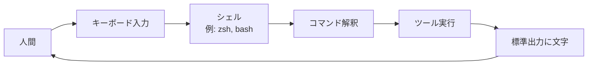

キーボードから文字でコンピュータに指示を出す方式。アイコンやボタンの代わりに、文字のコマンドで操作する。

## 何ができる？／なぜ重要？

レストランで例えるとわかりやすいです。タッチパネル式の券売機（GUI）はボタンを押すだけで誰でも注文できますが、用意されたメニューしか選べません。一方、紙の注文書に「ラーメン、ネギ多め、麺固め、替え玉あり」と細かく書く方式（CLI）は慣れが必要ですが、思い通りに細かく指示できます。

これが嬉しいのは、指示を「文章」として残せることです。同じ作業を毎日繰り返したいときも、注文書を一枚コピーすれば同じ結果が得られます。なければ、毎回ボタンを順番に押し直す必要があり、自動化や共有が難しくなります。CLI なら他の人にコマンドをそのまま渡せば、まったく同じ操作を再現できます。

## 仕組み

ユーザーがコマンドを打つと、シェルがそれを解釈してツールを起動します。ツールは結果を文字として出力し、ユーザーに返します。

## 用語

- **シェル**: ユーザーの入力を受け取ってコマンドを実行する基本ソフト（zsh、bash など）。
- **コマンド**: 「何をしてほしいか」を表す動詞。例: `ls`、`git`。
- **引数 (Argument)**: コマンドに渡す対象や設定値。例: `ls /tmp` の `/tmp`。
- **オプション (Flag)**: コマンドの動作を変える指定。例: `ls -l`。
- **標準入出力 (stdin/stdout)**: 文字の流れの入口と出口。
- **パイプ**: あるコマンドの出力を別のコマンドの入力に直接つなぐ仕組み（`|`）。
- **エグジットコード**: コマンド終了時の成否を表す数値。0 が成功。
- **ターミナル**: CLI を操作するための「黒い画面」。

## vault 内での使われ方

- [[claude-code]] — Anthropic 公式の CLI エージェント（ターミナル上で Claude が動く）
- [[rtk]] — LLM 向けコマンド出力を圧縮する Rust 製 CLI プロキシ
- [[codopsy]] — 25 言語対応の AST レベルコード品質計測 CLI
- [[codopsy-ts]] — TS/JS 専用のコード品質計測 CLI
- [[capto]] — ディレクトリ構造を PDF 化する CLI
- [[gv]] — Go ツールチェインのバージョン管理 CLI（uv 級速度を目指す Rust 実装）
- [[macleap]] — 現行 Mac との比較とトレードイン込みの差額を計算する CLI
- [[premaid]] — Mermaid を Puppeteer でレンダリングして SVG/PNG を出す CLI
- [[treesrc]] — `.gitignore` を尊重しつつディレクトリ構造とファイル内容を表示する CLI
- [[dns-checker]] — MoonBit 製の SPF / DMARC / DKIM 設定確認 CLI
- [[azprofile]] — 複数 Azure アカウントをシェル統合で切り替える CLI

## 関連概念

- [[api]] — プログラム同士の窓口（CLI は人間向け、API はプログラム向け）
- [[agentic-coding]] — エージェントが CLI を駆使してコードを書く

## Links

- [Wikipedia: コマンドラインインタフェース](https://ja.wikipedia.org/wiki/%E3%82%B3%E3%83%9E%E3%83%B3%E3%83%89%E3%83%A9%E3%82%A4%E3%83%B3%E3%82%A4%E3%83%B3%E3%82%BF%E3%83%95%E3%82%A7%E3%83%BC%E3%82%B9)
