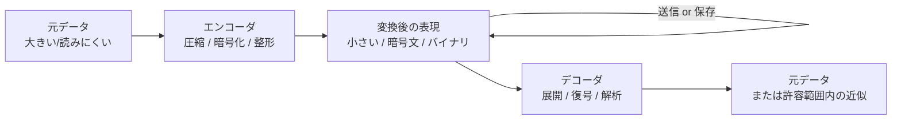

データを「送りやすい / 保存しやすい形」に変換し、必要なときに元に戻す、対になった一組のしくみ。エンコード（変換）とデコード（復元）の合成語。

## 何ができる？／なぜ重要？

ZIP の圧縮と解凍で考えると分かりやすいです。大きなフォルダをそのまま送るのは大変なので、ZIP 圧縮して 1 つの軽いファイルにします。受け取った側は解凍して元のフォルダに戻します。この「圧縮する側」と「解凍する側」の対のしくみが codec です。動画を撮ったあとに変換して小さくし、再生するときに元に戻すのも、暗号化して送って復号して読むのも、すべて codec のお仲間です。

なぜ重要かというと、現代のデータのやり取りはほぼ全てが「裸のまま」では成り立たないからです。動画はそのままだと巨大すぎ、画像も非効率、機械同士の通信も人間に読みやすい JSON のままでは無駄が多い、といった事情があります。codec は「変換しても情報が失われない or 必要なものだけ失う」「双方が同じルールで戻せる」を保証する対の規約です。

## 仕組み

エンコーダとデコーダは「同じ取り決め」を共有しているので、どこに送っても・どんな機械でも、デコーダ側を持っていれば正しく戻せます。可逆（完全に元に戻せる）と非可逆（一部情報を捨てる）の 2 種類があり、用途で使い分けます。

## 用語

- **エンコード (Encode)**: 別の表現に変換すること。圧縮・暗号化・整形などを含む広い言葉。
- **デコード (Decode)**: エンコード結果を元に戻すこと。
- **可逆 (Lossless)**: 戻すと完全に元に戻る方式（ZIP、PNG、FLAC など）。
- **非可逆 (Lossy)**: 一部情報を捨てて軽くする方式（JPEG、MP3、H.264 など）。人間が気づかない範囲で削る。
- **コンテナフォーマット**: 動画 / 音声 / 字幕などを束ねる「箱」の形式（MP4、MKV など）。中の codec とは別。
- **Base64**: バイナリを ASCII 文字列で表す古典的な codec。メールや URL で使う。
- **Codec プロトコル**: 「どう変換するか」を抽象化した取り決め（言語ライブラリの API 規約）。
- **MIME type**: 「これは何の codec で読むべきデータか」を示す目印。
- **Endianness**: バイト並びの向き。codec の互換性に効く。
- **Streaming codec**: 全体を読まずに先頭から逐次変換できる codec。動画再生に必須。

## vault 内での使われ方

- [[almide-toml]] — TOML v1.0 パーサ／シリアライザ。`type T: Codec` を派生した型に対し `toml.encode` / `toml.decode[T]` が自動動作
- [[almide-yaml]] — YAML パーサ／シリアライザ。同じく Codec プロトコル経由で `encode` / `decode` を提供
- [[almide-csv]] — RFC 4180 準拠の CSV パーサ／シリアライザ (Pure Almide 実装)
- [[almide-base64]] — Base64 (RFC 4648) と URL-safe variant を実装する Pure Almide ライブラリ
- [[almide]] — `Codec` プロトコルを言語の標準ファシリティとして提供し、各シリアライザが派生型に対し自動で encode / decode する設計

## 関連概念

- [[serialization]] — 「データを保存／送信できる形に変える」codec の代表的な使われ方
- [[quantization]] — 「精度を落として軽くする」非可逆 codec と発想が同じ

## Links

- [Codec (Wikipedia)](https://en.wikipedia.org/wiki/Codec)
- [List of codecs (Wikipedia)](https://en.wikipedia.org/wiki/List_of_codecs)
