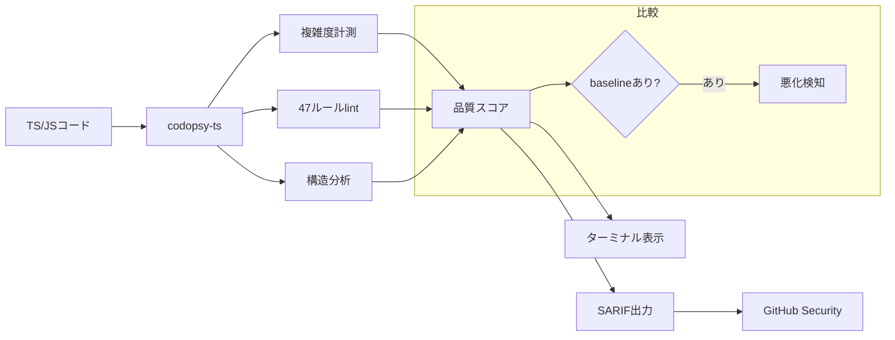

[[codopsy]] の TypeScript / JavaScript 専用版。zero config、A-F 品質スコア、47 lint ルール、baseline 比較、hotspot 検出、plugin システム、SARIF 出力。

## 何ができる？

TypeScript と JavaScript 専用の「コード健康診断士」です。本家 [[codopsy]] が 25 言語の総合医なら、こちらは Web 開発の現場で最もよく使われる二言語に特化した専門医です。設定ファイルを書かなくてもすぐ使えて、コードに A〜F の成績を付け、47 種類のルールに照らして問題箇所を指摘してくれます。

何が嬉しいかというと、Web 開発のチームが日々書く JavaScript / TypeScript のコードを、追加設定なしで即座にチェックできる点です。GitHub と連携して自動レビューさせる仕組みも整っています。

## 用語

- **TypeScript / JavaScript**: Web ブラウザや Node.js で動くプログラミング言語。TypeScript は JavaScript に「型」という安全装置を加えたもの。
- **zero config**: 「設定不要で動く」こと。インストールしてすぐ使える。
- **lint ルール**: 「こういう書き方は避けよう」という決まり事。47 個用意されている。
- **baseline**: 「前回測ったときの基準値」。今回悪くなっていないかを比べる土台。
- **hotspot**: 「複雑で、かつ頻繁に書き換えられているファイル」。要注意ポイント。
- **plugin**: 利用者が自分の好きなルールを追加できる拡張の仕組み。
- **SARIF**: 「コード解析結果」を機械間でやりとりするための共通フォーマット。GitHub の Security タブが読み取れる。
- **GitHub Action**: GitHub 上で自動的にスクリプトを動かす仕組み。コード変更時に自動でチェックさせられる。
- **CI**: Continuous Integration。コード変更のたびに自動でテストや検査を走らせる流儀。
- **dogfooding**: 自分の作った道具を自分で使うこと。codopsy-ts は自分自身を診断して 99 点を取っている。

## 仕組み



本家 [[codopsy]] と同じ考え方を、TypeScript の世界で書き直したものです。診断結果は人間向けの表示にも、機械向けの SARIF 形式にも出せて、GitHub の Security タブに自動アップロードもできます。

## Core Idea

ESLint + sonarjs / Biome / oxlint と異なり、cyclomatic + cognitive 複雑度・品質スコア・baseline・hotspot を組み込みで持つ。設定不要、`npm install -g codopsy-ts` で動く。Codopsy 自身が grade A (99/100) で self-dogfooding。

## CLI

```bash
npm install -g codopsy-ts
codopsy-ts analyze ./src
codopsy-ts analyze ./src -f sarif -o results.sarif  # GitHub Code Scanning
codopsy-ts analyze ./src --diff origin/main         # PR 変更分のみ
codopsy-ts analyze ./src --hotspots                 # 複雑度 × git churn
codopsy-ts analyze ./src --save-baseline
codopsy-ts analyze ./src --no-degradation
```

## Quality Score

3 つのサブスコアの合算（0-100）:

- **Complexity** (0-35) — cyclomatic > 10 (×2, cap 15/fn), cognitive > 15 (×1.5, cap 12/fn)
- **Issues** (0-40) — error: -8×count、warning: -4×√count、info: -1×√count（rule 単位、平方根で逓減）
- **Structure** (0-25) — max-lines (-10, cap 12), max-depth (-4, cap 12), max-params (-3, cap 10)

A (90-100) / B (75-89) / C (60-74) / D (40-59) / F (0-39)。

## Lint Rules

| Rule | Default | 説明 |
|---|---|---|
| max-complexity / max-cognitive-complexity | warning | 閾値超過 |
| max-lines / max-depth / max-params | warning | 構造的閾値 |
| no-any / no-var / eqeqeq | warning | TypeScript 安全性 |
| no-empty-function / no-nested-ternary / no-param-reassign | warning | 可読性 |
| no-console / prefer-const | info | スタイル |

## Plugin System

JS/TS モジュールで custom rule を追加可能:

```js
export default {
  rules: [{
    id: 'no-todo-comments',
    description: 'Disallow TODO comments',
    defaultSeverity: 'info',
    check(sourceFile, filePath, issues) { /* ... */ }
  }]
};
```

`.codopsyrc.json` の `plugins` 配列で登録、ルール設定で severity 変更可能。

## Programmatic API

```ts
import { analyze } from 'codopsy-ts';

const result = await analyze({ targetDir: './src' });
console.log(result.score);  // { overall: 99, grade: 'A', distribution: {...} }
```

`analyzeFile`, `analyzeComplexity`, `lintFile`, `loadConfig`, `formatReport`, `calculateProjectScore`, `findSourceFiles`, `loadPlugins` も export。

## GitHub Action

```yaml
- uses: O6lvl4/codopsy-ts@v1
  with:
    directory: ./src
```

SARIF を Security タブへ自動アップロード。

## 関連

- [[codopsy]] — Rust 製、25 言語対応の上位版
- [[codopsy-ts-skill]] — Claude Code plugin

## Links

- [GitHub](https://github.com/O6lvl4/codopsy-ts)
