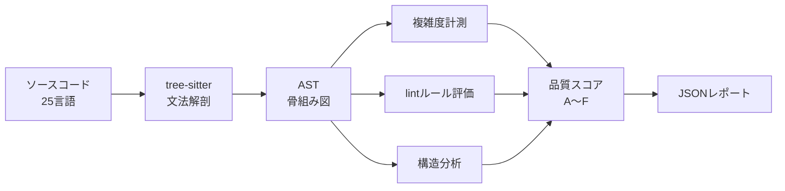

25 言語対応の AST レベル品質アナライザ。tree-sitter で複雑度・lint・構造を計測。コード実行不要。

## 何ができる？

ソースコードの「健康診断医」のような道具です。25 種類のプログラミング言語に対応していて、コードを実際に動かすことなく中身を読み取り、「ここは複雑になりすぎ」「ここは書き方が古い」といった健康状態を点数（A〜F の 5 段階）で教えてくれます。プログラムを動かさず、書かれた文字を眺めるだけで判定するので、安全で高速です。

何が嬉しいかというと、人間が一行一行レビューしなくても「どこに直すべき問題があるか」を機械が即座に指摘してくれる点です。コードの規模が大きくなるほど、この自動診断の価値は高まります。

## 用語

- **AST**: コードを「文の骨組み図」に変換したもの。文章を主語・動詞・目的語に分解した文法解析図のようなもの。
- **tree-sitter**: 25 言語に対応した「文法解剖図ジェネレータ」。各言語のソースコードを共通の骨組み図に変換する道具。
- **複雑度（cyclomatic / cognitive complexity）**: コードの「読みづらさ」を数値化した指標。分岐や入れ子が増えると数値が大きくなる。
- **lint**: コードの「書き方ルール違反」を見つける作業。文章校正の機械版。
- **CLI**: コマンドライン上で文字を打って動かす道具。
- **Rust**: 高速で安全なプログラミング言語。codopsy 自身はこれで書かれている。
- **rayon**: Rust で「複数の処理を同時並行で走らせる」ための仕組み。25 言語の解析を一度に進められる理由。
- **baseline**: 「前回測ったときの基準値」。今回それより悪化していないかを判定するために保存しておくもの。
- **hotspot**: 「複雑で、かつ頻繁に書き換えられている要注意ファイル」。バグが生まれやすい場所。
- **JSON**: 機械同士がデータをやりとりするための共通テキスト形式。

## 仕組み



ソースコードを tree-sitter が「骨組み図」に変換し、その図を歩き回って複雑さ・ルール違反・構造を測ります。最後に三つの観点を重み付けして合算し、A〜F の成績を付けます。コードは一切実行しません。

## Core Idea

ソースを実行せず tree-sitter でパースし、cyclomatic / cognitive complexity と lint 違反を検出。rayon で並列化。[[famulus2]] の Code Graph バックエンドとして利用される（Rust 製の高速 CLI）。

## 対応言語

TypeScript / TSX / JavaScript / Rust / Go / Python / C / C++ / Java / Ruby / C# / PHP / Scala / Haskell / Bash / HTML / CSS / JSON / OCaml / Swift / Lua / Zig / Elixir / YAML / [[almide|Almide]] — 計 25 言語。

JS/TS は 11 ルール、Rust は 6 ルール、それ以外は閾値ルール（max-lines, max-depth, max-params, max-complexity, max-cognitive-complexity）。

## Quality Score

| Component | Weight | 計測対象 |
|---|---|---|
| Complexity | 35% | 関数の cyclomatic / cognitive 複雑度 |
| Issues | 40% | lint 違反のファイル平均 |
| Structure | 25% | ファイル数 / 関数分布 |

A (90-100) / B (80-89) / C (70-79) / D (60-69) / F (0-59)。

## CLI

```bash
cargo install --git https://github.com/O6lvl4/codopsy.git

codopsy analyze ./src              # 解析
codopsy analyze ./src --diff main  # 変更ファイルのみ
codopsy analyze ./src --hotspots   # 複雑度 × git churn
codopsy analyze ./src --save-baseline
codopsy analyze ./src --no-degradation --fail-on-warning
```

`.codopsyrc.json` で各ルールの severity / threshold を上書き。設定はターゲットから home へ向かって探索。

## How It Works

1. **Parse** — tree-sitter で言語非依存 AST へ変換
2. **Analyze** — AST を walk して複雑度を算出、lint ルールを評価
3. **Score** — 複雑度・問題・構造の重み付け合計
4. **Report** — JSON 出力（per-file / per-function）

全静的解析、コード実行ゼロ。rayon で並列化。

## 関連

- [[codopsy-ts]] — TypeScript 移植（JS/TS 専用）
- [[codopsy-ts-skill]] — Claude Code plugin
- [[famulus2]] — Code Graph バックエンドとして codopsy を利用

## Links

- [GitHub](https://github.com/O6lvl4/codopsy)
