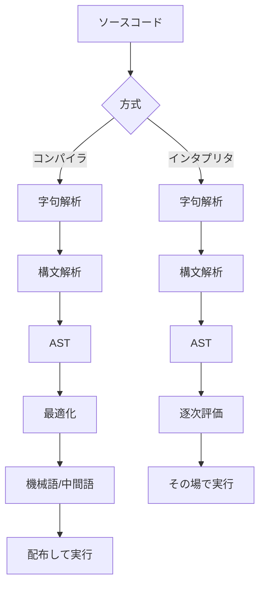

人間が書いたプログラミング言語を、機械が実行できる形に変換する仕組み。事前にまとめて翻訳するのがコンパイラ、その都度翻訳しながら動かすのがインタプリタ。

## 何ができる？／なぜ重要？

本の翻訳を考えてみてください。コンパイラは「原稿を全部翻訳して印刷した本（製本済み書籍）を読者に渡す」やり方です。インタプリタは「原稿を見ながら、ページごとにその場で読み聞かせる通訳」のやり方です。前者は印刷工程に時間がかかりますが、できあがれば誰でもスラスラ読めます。後者はすぐに始められますが、毎回通訳が必要なので少し遅くなります。

これが重要なのは、プログラムの「速さ・配布のしやすさ・開発の手軽さ」がここで決まるからです。コンパイラ言語（Rust、C++、Go）は配布しやすく速い。インタプリタ言語（Python、JavaScript の伝統的な実行）はすぐ書いて試せる。なければ、人間が書いたコードを機械はそのまま動かせず、すべてを 0 と 1 で書く必要がありました。

## 仕組み

どちらも字句解析・構文解析で AST を作るところまでは同じで、その先「機械語に変換するか」「直接評価するか」で分岐します。

## 用語

- **コンパイル**: ソースコードを別の形式（機械語、WASM、JavaScript 等）に事前変換すること。
- **インタプリト**: ソースコードをその場で解釈しながら実行すること。
- **JIT (Just-In-Time)**: 実行直前にコンパイルする両者の中間方式。
- **AOT (Ahead-Of-Time)**: 実行前に完全にコンパイルしておく方式。
- **AST**: 言語処理の中間データ。コンパイラもインタプリタも作る。
- **IR (Intermediate Representation)**: コンパイラ内部の中間言語。
- **トランスパイル**: 別の高水準言語へ変換すること（例: TypeScript → JavaScript）。
- **リンク**: 複数のコンパイル済みファイルを結合して実行可能にする工程。
- **ランタイム**: 実行時に必要なライブラリやエンジン。

## vault 内での使われ方

- [[almide]] — Rust 実装のコンパイラを持ち native binary と WebAssembly の双方を出力する言語
- [[bonsai-almide]] — Almide コンパイラで 1-bit LLM を WASM にビルドしてブラウザで動かすデモ
- [[lean2ts]] — Lean 4 の formal spec を TypeScript の型・スタブ・プロパティテストにトランスパイル
- [[playground]] — Almide コンパイラ自体を WASM 化してブラウザ上でコード実行する環境

## 関連概念

- [[parser]] — コンパイラの最初のステップ
- [[ast]] — パース結果として作られる中間表現
- [[llvm]] — 多くのコンパイラのバックエンド基盤
- [[wasm]] — コンパイル先の代表例

## Links

- [Wikipedia: コンパイラ](https://ja.wikipedia.org/wiki/%E3%82%B3%E3%83%B3%E3%83%91%E3%82%A4%E3%83%A9)
- [Wikipedia: インタプリタ](https://ja.wikipedia.org/wiki/%E3%82%A4%E3%83%B3%E3%82%BF%E3%83%97%E3%83%AA%E3%82%BF)
