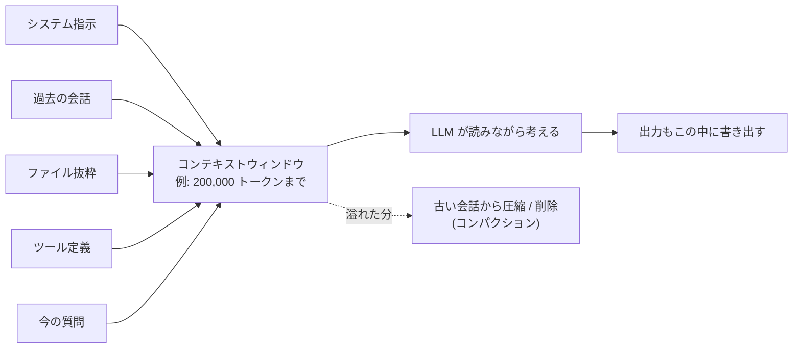

LLM が一度に「読みながら考えられる」文章の最大量。人間の短期記憶や、お出かけ用カバンの容量に近い概念。

## 何ができる？／なぜ重要？

買い物に行くときのカバンにたとえます。AI にとってのコンテキストウィンドウは、出かけるときに肩から下げる「カバンの容量」です。話題に必要な資料、過去の会話履歴、ファイル、ツールの説明書など、その場で参照したいものを全部このカバンに詰めて出かけます。カバンが大きければ大きな本（長い文章・大規模なコード）を持ち歩けますが、容量を超えるとどれかを置いていくしかありません。

なぜ重要かというと、AI の振る舞いがこのカバンの中身で大きく変わるからです。資料を入れ忘れると AI は推測で答えるしかなく、入れすぎると重要な情報が埋もれて精度が落ちます。コンテキストウィンドウは AI 利用のコスト（料金）にも直結します。詰めすぎは料金高騰の原因です。最近は「100 万トークン入る」モデルも登場しましたが、容量があっても上手にパッキングする技術が引き続き重要です。

## 仕組み

入力も出力も同じカバンに収まらないといけません。容量を超えると古いものから圧縮・削除されたり、エラーになったりします。エージェントの長時間運用では「出力が大きいコマンド」「冗長なログ」がカバンを食い潰すので、入る前に絞る工夫が効きます。

## 用語

- **トークン**: AI が文章を扱う最小単位。日本語だと 1〜2 文字で 1 トークン。
- **コンテキストウィンドウ**: 入力＋出力で扱える最大トークン数。モデルごとに上限がある（4K、200K、1M など）。
- **入力トークン / 出力トークン**: 料金体系で別々にカウントされることが多い。
- **システムプロンプト**: AI への指示文。常にカバンの先頭に入る。
- **会話履歴**: これまでのやりとり。長くなるほどカバンを食う。
- **コンパクション (Compaction)**: 古い会話を要約して圧縮すること。カバンの中身を整理する作業。
- **Long Context**: 100 万トークン級などの「大きなカバン」を持つモデルのこと。
- **Lost in the Middle**: カバンの真ん中に入れた情報が埋もれて参照精度が落ちる現象。
- **Prompt Caching**: 同じ前置きをサーバ側でキャッシュし、再送信のコストを下げる仕組み。
- **トークン圧縮**: 重要でない情報（色付き出力の制御コードなど）を削って詰め直す技術。

## vault 内での使われ方

- [[rtk]] — `git status` / test 出力 / `npm install` 等を Smart Filtering / Grouping / Truncation / Deduplication で 60-90% 圧縮し、Claude Code の PreToolUse hook 経由で透過的に挿入する
- [[fractop]] — 大文書を `chunking({ size, overlap })` で分割し並列 LLM 処理する fluent API。コンテキスト超過を回避するための前処理
- [[famulus2]] — codopsy (Rust + tree-sitter) による Code Graph で関数 / 型 / 依存関係の JSON 構造のみを LLM に渡し、合計 25,986 → 1,597 token (94% 削減)
- [[claude-code]] — Auto-compact で会話履歴を圧縮しトークン上限に対応する CLI エージェント
- [[memory-rag]] — `topK` で検索結果のみ context に挿入する in-memory RAG
- [[whenm]] — Event Calculus + Prolog で過去イベントを外部に保持し、`ask()` で現在必要な分だけ取り出す

## 関連概念

- [[rag]] — 窓に入れる情報を「必要なときだけ」検索して詰める手法
- [[mcp]] — ツール定義も窓を食う。設計次第で削れる

## Links

- [Large language model (Wikipedia)](https://en.wikipedia.org/wiki/Large_language_model)
- [Lost in the Middle (Liu et al., 2023)](https://arxiv.org/abs/2307.03172)
