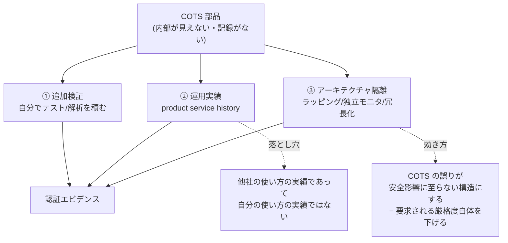

不特定多数の市場向けに販売されていて、買い手の要求に合わせて作られたのではない既製ソフトウェア。「作らずに買う」という**調達**判断であると同時に、「内部を知らず、進化を制御できない部品に依存する」という**設計**判断でもある。[[soup|SOUP]] が安全規格の側から見た同じ対象で、COTS は調達の側から見た呼び名。

## 定義 — 境界線は「無改変」

米連邦調達規則 (FAR 2.101) の COTS item は3条件を満たすもの:

1. 商用製品であること
2. 商用市場で**相当量**販売されていること
3. **無改変で、市場で売られているのと同じ形で**提供されること

一行でも顧客のために手を入れた瞬間、それは COTS ではなくなる (MOTS)。この線引きが厳しいのは形式主義ではなく、**「他の全顧客と同じ物を使っているから、市場の使用実績を自分の論拠にできる」**という一点を守るため。改変すれば、その実績は自分の版には及ばない。安全臨界での運用実績クレジット(後述)も同じ論理に乗っている。

なお FAR の COTS item は「**any item of supply (including construction material)**」であって、**ソフトウェア専用の語ではない**。民生 FPGA・ラックマウントサーバ・Ethernet スイッチのような物品も COTS で、そもそも1994年の政策転換(後述)が主に狙っていたのは MIL-SPEC 部品の民生品への置き換えだった。ソフトの文脈で使われることが多いだけで、語の射程はもっと広い(ばら積み貨物 — 農産物・石油等 — は明示的に除外)。

## \*OTS 族

上位概念は **NDI** (Non-Developmental Item) — 新規開発を要さない、あるいは最小限の改変で済む調達物。

| 略語 | 展開 | 出自 | 改変 |
|---|---|---|---|
| **COTS** | Commercial Off-The-Shelf | 商用市場 | 不可(すれば COTS でなくなる) |
| **MOTS** | Modified / Modifiable OTS | 商用 + 改変 | 可(買い手・ベンダ・第三者のいずれかが行う) |
| **GOTS** | Government Off-The-Shelf | 政府の予算・仕様で開発 | 政府が全権を持つ |
| **NOTS** | NATO / Niche OTS | 狭い専門市場向け | 場合による |

GOTS が政府調達で好まれるのは、**全側面を自分で制御できる**から。COTS の安さは制御権の放棄と引き換えになっている。

## 実物 — 業務で触るものはほぼ COTS

「COTS = 特殊な業務パッケージ」と捉えると射程を見誤る。実際には自社で書いた分以外のほぼ全部が COTS で、だからこそ仮説1(命令の99%超)が成り立つ。

| 層 | 実例 |
|---|---|
| OS・基盤 | Windows Server, RHEL, VMware vSphere, Active Directory |
| ミドルウェア | Oracle Database, SQL Server, WebSphere, Citrix NetScaler |
| 業務パッケージ | SAP ERP, OBIC7, 勘定奉行, 弥生会計 |
| SaaS | Salesforce, Workday, ServiceNow, kintone, freee, SmartHR |
| 境界・ネットワーク機器 | Fortinet FortiGate, Ivanti Connect Secure, Palo Alto PAN-OS |
| ファイル転送・連携 | MOVEit Transfer, Accellion FTA, GoAnywhere MFT |
| 組込み RTOS | VxWorks, QNX, INTEGRITY-178, Deos, PikeOS |

自社開発システムに埋まった OSS(Log4j, OpenSSL, SQLite)も、FAR の定義からは外れるが実務上の扱いは同じ。

## shadow IT との切り分け — 軸が違う

射程が広いので shadow IT と混同されやすいが、両者は**直交する別の軸**を測っている。

- **COTS** = 「**どこで作られたか**」(出自の軸) — 自社開発か、市販の既製品か
- **shadow IT** = 「**誰の承認で入ったか**」(統制の軸) — IT 部門が把握・承認しているか、現場が勝手に導入したか

|  | 承認済み | 未承認(= shadow IT) |
|---|---|---|
| **COTS** | SAP, Salesforce, Windows Server 正規調達した市販品 ← **大多数はここ** | 社員が個人カードで契約した SaaS 勝手に入れた Chrome 拡張、無料 PDF 変換サイト |
| **自社開発** | 情シスが作った社内システム | 現場が書いた野良 Excel VBA / GAS 部署が勝手に立てた VPS |

右下が効く。**shadow IT には COTS でないものが普通に含まれる**(野良マクロ、勝手に書いたスクリプト)。逆に左上は shadow IT ではないが、まぎれもなく COTS。包含関係はどちらの向きにも成り立たない。

混同が起きるのは**実務上の重なりが大きい**から。現場が勝手に導入するものは今どきほぼ SaaS なので、shadow IT の大半がたまたま COTS になる。ただしそれは重なりであって同一ではなく、困りごとの性質も対処も違う。

| | 困りごと | 対処 |
|---|---|---|
| COTS | **手が届かない**(直せない・EOL・内部不明) | ベンダ管理、EOL 台帳、隔離 |
| shadow IT | **存在を知らない** | 発見 (discovery)、調達ゲート |

**決定的な反例が Log4Shell(後述の④)** — 在庫が分からなかったのは shadow IT ではなく、契約書も資産台帳もある**正規調達の COTS 製品群**だった。つまり shadow IT を完全にゼロにしても COTS の在庫問題は丸ごと残り、だから SBOM という別の道具が要る。同一視すると「shadow IT を潰せば安全になる」という誤った結論に着地する。

## なぜ「買う」に振れたか — 1994年の政策転換

米国防総省の COTS 化は2つの文書で始まった。

- **Perry memo** (1994-06-29, "Specifications and Standards — A New Way of Doing Business") — 3万件超あった MIL-STD / MIL-SPEC をデフォルトから外し、軍固有仕様は最後の手段、使うなら Milestone Decision Authority の waiver が要る、とした。
- **FASA** (Federal Acquisition Streamlining Act of 1994, 1994-10-13 署名) — Title VIII "Commercial Items" が商用品調達の優先を法制化。

動機は2つ。**コスト**(軍仕様というだけで価格が跳ね上がる)と、**速度**。1980年代までは軍が技術の先端にいたが、90年代に PC・ネットワーク・DBMS で商用側が追い越した。COTS 化は「先端が組織の外に移った」という事実への適応であって、単なる節約策ではない。

## 買っても開発は消えない — 実証データ

Boehm & Abts "COTS Integration: Plug and Pray?" (IEEE Computer, 1999) を起点に、COCOTS プロジェクト(20件の COTS ベースシステム)が工数を定量化した。Basili & Boehm "COTS-Based Systems Top 10 List" (IEEE Computer, 2001-05) がその骨子。

**工数の内訳** — COTS に起因する活動の平均比率:

| 活動 | 平均 | 標準偏差 |
|---|---|---|
| グルーコード開発 | 37% | ±36% |
| テーラリング | 26% | ±30% |
| 評価 (assessment) | 24% | ±20% |
| 揮発性対応 (volatility) | 13% | ±11% |

標準偏差が平均と同程度に大きい。つまり**万能の配分は存在せず**、案件ごとに支配的な費目が入れ替わる。

**主要な仮説**(著者らが「仮説」として提示したもの。数字は桁の感覚として読む):

| # | 主張 | 根拠・補足 |
|---|---|---|
| 1 | 実行される計算機命令の**99%超**は COTS 由来 | 汎用 OS や DBMS を自作できる組織はない。COTS は経済的必然 |
| 2 | 大型 COTS 製品の**機能の半分以上は使われない** | 個人利用で Word/PowerPoint の計測機能の 12–16%、10人チームでも 26–29% |
| 3 | 平均 **8–9ヶ月**で新版、ベンダ支援は**直近3版のみ** | 調査値は 6.3 / 8.5 / 8.75ヶ月 |
| 4 | 統合工数は COTS 数の**二乗**に近づきうる | n個で n(n−1)/2 の界面。「4個でも多すぎることがある」 |
| 5 | **運用後コストが開発コストを超える** | 27ヶ月の開発でリリース追従を怠ると、引き渡し時点でサポート切れの製品を保守側に押し付けることになる |
| 6 | グルーコードは総工数の半分未満だが、**1行あたりの工数は約3倍** | COCOTS 中央値 100 SLOC/人月 に対し、COCOMO II のアプリ開発は 270 SLOC/人月 |
| 7 | ライセンス費・ベンダ折衝・教育といった**非開発コスト**が効く | |
| 9 | 支配的要因は結局**人の能力と経験** | COTS 経験・要員の継続性で生産性が2倍動く |
| 10 | COTS ベースシステムは超過が非 COTS より大きい**高リスク活動** | 見えない内部、ベイパーウェアの過剰約束、グルーコード規模の見積り困難が重なる |

読み方はひとつ。**「買う」は開発を消すのではなく、統合・追従・調達管理へ付け替える**。しかも付け替え先の単価は高い(1行あたり3倍)。COTS が効くのは総量が減るときであって、名目上の自作コード行数が減るときではない。

## 安全臨界での COTS — 「使うな」ではなく「正当化せよ」

規制領域では、COTS を使った瞬間に**正当化義務**が発生する。各基準の呼び名は違うが構図は同じ。

| 基準 | 呼び名 | 要求の骨子 |
|---|---|---|
| [[do-178c\|DO-178C]](航空) | COTS / PDS | §12 が既開発ソフトの扱いを規定。求める認証クレジットを PSAC で申告する |
| [[iec-62304\|IEC 62304]](医療) | [[soup\|SOUP]] | 名称・製造元・版の同定、機能/性能要求の明示、**既知不具合(アノマリ)リストの継続評価** |
| [[iso-26262\|ISO 26262]](自動車) | qualification / SEooC | 部品単体を「想定 ASIL」で作り、後から文脈に適合させる |

エビデンスの作り方は3経路あり、実務では組み合わせる。

③ が本質的に強い。個々の部品の信頼度を上げるのではなく、**部品が誤っても安全に至らない構造**を作れば、その部品に要求される厳格度そのものが下がる([[accepted-safety-in-systems|安全はアーキテクチャで作る]]の適用)。

**ベンダ側が先回りする道**もある。SQLite は avionics メーカーからの関心を受けて TH3 テストハーネスを DO-178B の要求に合わせて設計し、2009-07-25 にコアに対する **100% MC/DC** を達成した。結果として Airbus A350 の搭載系で使われている。[[ferrocene|Ferrocene]] が rustc に対してやっていることの DB 版で、**COTS を SOUP でなくすのはベンダの仕事にもできる**ことを示す例。

ここは「認証エビデンス込みで売る」という市場になっている。

| 製品 | 立ち位置 |
|---|---|
| **SQLite** (TH3) | 100% MC/DC。Airbus A350 搭載系 |
| **INTEGRITY-178 tuMP** (Green Hills) | DO-178C Level A 対応 RTOS |
| **Deos** (DDC-I) / **LynxOS-178** / **PikeOS** (SYSGO) | 同上。認証パッケージが商品価値そのもの |
| **VxWorks** (Wind River) | 組込みで圧倒的シェア。ただし URGENT/11 の当事者でもある(後述) |
| [[wasmtime]] | 認証エビデンスなし。正当化義務が丸ごと使う側に残る |

## 現代の COTS — OSS と SaaS

FAR の定義は「売られている」ことを前提にするが、実務上の困難は価格ではなく**自分が作っていない部品への依存**にある。無償の OSS は従属先が「ベンダ」から「メンテナ」に変わるだけで、構図はそのまま残る。むしろ悪化している面がある。

- 仮説1(99%)は OSS 時代にさらに極端になった
- 仮説3(追従サイクル)は OSS のほうが速い。しかも支援打ち切りの通告が来るとは限らない
- 「相当量が売られている(広く使われている)」は品質の保証ではなく、**攻撃価値の証明**でもある。xz-utils バックドア (CVE-2024-3094, 2024-03) は「みんなが使っている」ことが侵入動機そのものだった

だから SBOM と継続的な CVE トリアージに行き着く。IEC 62304 が2006年に SOUP のアノマリリスト評価として制度化していたものが、いまサプライチェーン管理として一般化した形になる。

SaaS はさらに一歩進む。**バージョンの選択権すら手放す**ため、仮説3の追従サイクルが自分の意思ではなく強制になる。

## 実際に何が起きたか — 失敗の6つの型

COTS 固有の失敗は「脆弱性があった」ではなく「**自分の手が届かない**」に由来する。型ごとに代表例を1件ずつ。

### ① 自分では直せない — MOVEit Transfer (2023)

ファイル転送製品の SQL インジェクション 0-day (CVE-2023-34362)。2023-05-27 から Cl0p が悪用し、LEMURLOOT という web shell を設置してデータを窃取。CISA 推計で米国3,000超・全世界8,000超の組織が影響を受けた(BBC、British Airways、ノバスコシア州政府など)。

本質は、**利用側の誰一人このバグを直せなかった**こと。ソースが無いので Progress 社のパッチを待つ以外にできることは、止めるか隔離するかだけ。さらに British Airways などは自社で MOVEit を使っていたのではなく、給与計算を委託した **Zellis 社**が使っていて刺さった。COTS の依存は自社の境界で止まらない。

### ② EOL が被害そのものになる — Accellion FTA (2021)

20年ものの旧世代ファイル転送製品。2020-12〜2021-01 に 0-day が波状的に悪用され、ニュージーランド準備銀行・豪 ASIC・Singtel などが被害。

肝は、**Accellion が3年前から「FTA をやめて Kiteworks へ移れ」と言い続けていた**こと。事件後に EOL を 2021-04-30 へ前倒しして打ち切った。仮説3(支援は直近3版のみ)の極限形で、**版が新しいかではなく、製品そのものが終わりかけていたか**が生死を分けた。台帳に持つべき最重要フィールドがバージョンでなく **EOL 日**である理由がこれ。

### ③ パッチが無い期間、残る手は隔離だけ — Ivanti Connect Secure (2024)

VPN 装置の認証バイパス (CVE-2023-46805 ほか)。CISA は 2024-01-19 に緊急指令 **ED 24-01** を発出、補足指示で連邦機関に「2024-02-02 23:59 までに**全インスタンスをネットワークから切り離せ**」と命じた。パッチを当てろ、ではない。

ベンダが直すまでの間に利用側へ残る手が構造側(遮断・分離)しかないことを、規制当局の指令という形で示した例。上の**経路③(アーキテクチャ隔離)がセキュリティ運用でも同じく最後の砦**になる。

### ④ どの COTS に入っているか誰も知らない — Log4Shell (2021)

CVE-2021-44228。「直せない」以前に、**自社が使う COTS 製品のどれに Log4j が含まれるのか特定できなかった**。CISA が `cisagov/log4j-affected-db` をコミュニティソースで立ち上げ、ベンダ製品ごとの影響有無を集約する事態になった(初期で500製品超)。

深刻なのは、**ベンダ自身が自社製品への同梱を把握していない**ケースが多発したこと。SBOM が一気に本気の議題になったのはここが起点。インベントリは「面倒だがやればできる作業」ではなく、**やらないと事故時に手が打てない前提条件**だと確定した。

### ⑤ COTS の中の COTS — URGENT/11 (2019)

Armis が VxWorks の TCP/IP スタック **IPnet** に11件の 0-day(うち6件が critical)を発見。2億台超の機器が影響下と推計。

構造が重要で、IPnet は Wind River が **2006年に Interpeak 社を買収して取得**したもので、脆弱性の一部は買収前から存在していた。Interpeak は同じスタックを他社にもライセンスしていたため、Green Hills **INTEGRITY**(DO-178B Level A 認証取得の安全臨界 RTOS)、ThreadX、Nucleus、OSE、ITRON、ZebOS まで横断的に波及した。

**認証を取った製品の内部に、認証と無関係な出自の COTS 部品が埋まっていた**。[[soup]] の「責任範囲は依存物まで及ぶ」が事故として顕在化した形で、SOUP の同定義務が名称・製造元・版まで求める理由がここにある。

### ⑥ パッチ経路そのものが攻撃経路になる — SolarWinds Orion (2020)

ベンダのビルドシステムが侵害され、**正規署名された更新に SUNBURST バックドアが混入**。約18,000顧客が汚染された更新を受け取った。

唯一、「更新を適用せよ」という COTS 管理の基本動作が攻撃面になった型。ゆえに現在は更新適用だけでなく**ベンダ側のビルド完全性**(署名検証、SLSA、再現ビルド)までが評価対象に入る。

## 運用の型 — 何を台帳に持ち、どこまで洗うか

上の6例が要求するものを運用に落とすと、こうなる。全数を同じ深さで見ようとすると破綻するので、**深さのほうを変える**。

**発見は人に聞かず、既存のログから引く**(棚卸しの最大のコストは発見であって記録ではない):

| 情報源 | 拾えるもの |
|---|---|
| 調達・契約DB | 正規購入分(ここは容易) |
| IdP/SSO のログイン先 | 業務で使われている SaaS |
| **経費精算・法人カード明細** | 個人契約の SaaS ← shadow IT が最も出る |
| EDR/MDM のインストール済みソフト一覧 | エンドポイントの COTS |
| プロキシ/CASB のログ | 未知の SaaS 通信 |
| SBOM・パッケージマネージャ | 自社開発物に埋まった OSS(④の教訓) |

**深さは3層に分ける**:

| Tier | 対象 | 深さ |
|---|---|---|
| 1 | 機密データを持つ / 外部公開 / 停止が事業を止める | ベンダのパッチ SLA・**EOL 日**・脆弱性開示ポリシー・第三者監査報告まで精査 |
| 2 | 内部限定・低感度 | 製品名・版・EOL 日を台帳に持ち、CVE 監視へ流すだけ |
| 3 | 個人の生産性ツール | 個別調査しない。許可リストで入口を絞る運用に倒す |

Tier 1 は通常どの組織でも数十本に収まる。全数調査に見える作業の大半は Tier 2/3 で、そこは自動監視に流して終わり。

**一度きりにする** — 調達ゲート(新規購入時の台帳登録を必須化)を先に作れば洗い直しは既存分の一回で済む。ゲートが無いまま棚卸しすると毎年同じ作業が再発する。クラウド移行やリプレースのような**「何を移すか決める」強制イベントに相乗りする**のが最も安い。

## 買うか作るか — 判断軸

| 軸 | 問い | 判断 |
|---|---|---|
| 差別化 | この領域は自社の優位の源泉か | 効かないなら買う。効くなら、買った時点で競合と同じ天井を共有することになる |
| 適合度 | テーラリングの範囲で要求に届くか | 届かないなら実質 MOTS 化し、グルーコードが膨らむ |
| 統合コスト | 部品を1つ増やす影響 | 界面は n(n−1)/2。増やす判断は毎回二乗側に効く |
| 出口コスト | 抜けるときいくら払うか | [[lock-in\|ロックイン]]。データ形式・運用手順・人の習熟が人質になる |
| 検証負担 | 規制/安全臨界か | 買った瞬間に正当化義務が発生する。「買えば楽」が逆転する唯一の領域 |

## 押さえどころ

- **COTS** → 商用市場で相当量売られ、**無改変で**同じ形で提供される既製品。改変すれば MOTS
- **無改変にこだわる理由** → 市場の使用実績を自分の論拠にできるのは、他の全員と同じ物を使っている場合だけ
- **語の射程** → ソフト専用ではない。FAR では物品全般(民生 FPGA・サーバ・スイッチ等)を含む
- **shadow IT との違い** → COTS は**出自**の軸、shadow IT は**統制**の軸で直交する。実務上重なるだけで、包含関係はない。Log4Shell の在庫不明は正規調達の COTS で起きた
- **COTS 化の起点** → 1994年の Perry memo と FASA。動機はコストと、「技術の先端が組織の外に移った」という逆転
- **グルーコード** → 総工数の半分未満だが1行あたり約3倍。買っても開発は消えず、統合へ移るだけ
- **部品数** → 統合工数は n(n−1)/2 の界面に引きずられ二乗に近づく。「4個でも多すぎることがある」
- **安全臨界での扱い** → 禁止ではなく正当化義務。追加検証 / 運用実績 / アーキテクチャ隔離の3経路
- **現代形** → OSS と SaaS。構図は同じで、追従サイクルの速さと攻撃対象性が強まった
- **COTS 固有の失敗** → 「脆弱性があった」ではなく「**自分の手が届かない**」。MOVEit=直せない / Accellion=EOL / Ivanti=隔離しか残らない / Log4Shell=在庫が不明 / URGENT/11=COTS の中の COTS / SolarWinds=更新経路が攻撃経路
- **台帳の最重要フィールド** → バージョンではなく **EOL 日**。切れた瞬間にパッチ経路そのものが消える
- **棚卸しのコツ** → 全数を同じ深さで見ない。発見は既存ログ(調達DB・SSO・経費精算・EDR)から引き、深さを Tier で変え、調達ゲートで一度きりにする

## 制限

- Top 10 List の数字は2001年時点の、著者自身が「仮説」と明記したもの。母数20件の COCOTS データベースに基づき標準偏差も大きい。厳密な予測値ではなく**桁の感覚と論点の所在**として使う
- 事故事例の被害規模(MOVEit の 8,000組織、URGENT/11 の2億台、SolarWinds の18,000顧客)はいずれも当局・調査会社の**推計**であり、確定値ではない。型の理解に使い、数字の精度には寄りかからない
- FAR の定義は米連邦調達の文脈のもの。日本の調達実務や一般的な業界用法では「COTS = 市販パッケージ」程度に緩く使われることが多く、無改変要件まで含意しないことがある

## Links

- [FAR 2.101 Definitions (Acquisition.GOV)](https://www.acquisition.gov/far/2.101)
- [Basili & Boehm, "COTS-Based Systems Top 10 List", IEEE Computer, May 2001 (PDF)](https://www.cs.umd.edu/~basili/publications/journals/J82.pdf)
- [Boehm & Abts, "COTS integration: plug and pray?", IEEE Computer 32(1), 1999](https://ieeexplore.ieee.org/document/738311/)
- [Garlan et al., "Architectural Mismatch: Why Reuse Is So Hard", IEEE Software, Nov 1995](https://ieeexplore.ieee.org/document/469757)
- ["Specifications & Standards — A New Way of Doing Business" (Perry memo, 1994-06-29)](https://www.dmi-ida.org/knowledge-base-detail/specifications-standards-a-new-way-of-doing-business-memorandum)
- [SQLite TH3 — 100% MC/DC と DO-178B](https://www.sqlite.org/th3.html)
- [CISA AA23-158A — Cl0p による MOVEit (CVE-2023-34362) 悪用](https://www.cisa.gov/news-events/cybersecurity-advisories/aa23-158a)
- [Accellion、旧 FTA 製品の EOL を発表 (2021-04-30)](https://www.kiteworks.com/company/security-updates/accellion-announces-end-of-life-eol-for-its-legacy-fta-product/)
- [CISA ED 24-01 補足指示 — Ivanti 製品の切断命令](https://www.cisa.gov/news-events/directives/supplemental-direction-v2-ed-24-01-mitigate-ivanti-connect-secure-and-ivanti-policy-secure)
- [cisagov/log4j-affected-db — 影響製品のコミュニティ集約リスト](https://github.com/cisagov/log4j-affected-db)
- [Armis URGENT/11 — VxWorks IPnet の11件の 0-day](https://www.armis.com/research/urgent-11/)

## 関連

- [[soup]] — 同じ対象を医療規格の側から見た呼び名。COTS は調達側、SOUP は安全側の語彙
- [[do-178c]] — §12 が COTS / PDS の扱いを規定。運用実績による認証クレジットの出所
- [[iec-62304]] — SOUP のアノマリリスト評価。現代の SBOM/CVE トリアージの先取り
- [[iso-26262]] — qualification / SEooC。汎用部品を後から文脈に適合させる作り方
- [[safety-critical-certification]] — 「ランタイム未認証」= 実行系を COTS として正当化する負担
- [[accepted-safety-in-systems]] — 責任範囲は依存物まで及ぶ / 安全はアーキテクチャで作る
- [[ferrocene]] — ベンダ側が正当化エビデンスを先回りして作る実例(rustc)
- [[lock-in]] — 出口コスト。COTS 採用の見積りから抜け落ちやすい費目
- [[wasmtime]] — 実務上の典型的な COTS/SOUP。使う側に正当化義務が残る
