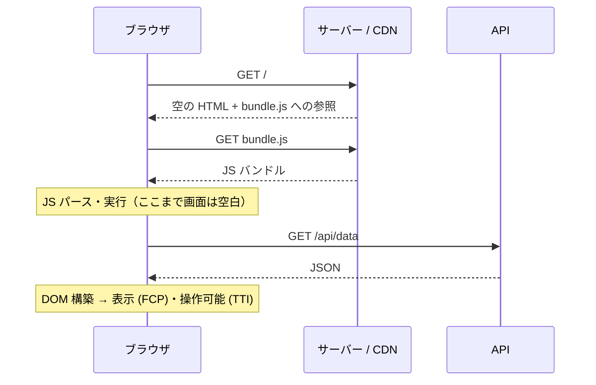

HTML の組み立てを**ブラウザ上の JavaScript に委ねる**レンダリング戦略。サーバー（や CDN）はほぼ空の HTML と JS バンドルを返すだけで、ユーザーが見るコンテンツは JS がダウンロード・実行され、API からデータを取得した後に初めて描画される。[[rendering-strategies|レンダリング戦略]]の一角で、[[ssr|SSR]]・[[ssg|SSG]] の対極。

## 仕組み



サーバーが返す HTML は典型的にこれだけ:

```html
<body>
  <div id="root"></div>
  <script src="/assets/bundle.js"></script>
</body>
```

表示までに **「HTML 取得 → JS 取得 → JS 実行 → データ取得 → 描画」の直列チェーン**を全部待つ必要があり、これが CSR の遅さの構造的な理由。ネットワークだけでなく端末の CPU 性能にも比例するため、低スペック端末で特に悪化する。

## なぜ生まれたか

| 動機 | 説明 |
|---|---|
| UI の滑らかさ | サーバー往復なしで画面を更新できる。フォーム・ドラッグ&ドロップ等のアプリ的操作 |
| 関心の分離 | フロントは静的ファイル、バックは JSON API。チーム・デプロイ・技術選定を分離できる |
| 配信の安さ | ビルド成果物は静的ファイルなので S3 + CDN に置くだけ。レンダリングサーバー不要 |
| API の再利用 | 同じ API をモバイルアプリと共有できる |

## 弱点

- **初回表示が遅い** — 上記の直列チェーンが終わるまで空白かスピナー
- **SEO / OGP** — 現代の Googlebot は JS を実行するがクロールは遅延しがちで、SNS の OGP クローラーや多くのボットは JS を実行しない
- **端末性能への依存** — サーバーを速くしても解決しない。ユーザーの端末次第

## 向くケース

**SEO が不要で、ログイン後の利用が前提のツール**。管理画面・ダッシュボード・社内ツール・エディタ系アプリ。初回ロードのコストを一度払えば、あとはアプリ的な操作感が得られる。

逆にコンテンツサイト（ブログ・EC・メディア）には不向きで、そこは [[ssr|SSR]] / [[ssg|SSG]] の領分。

## [[spa|SPA]] との関係

SPA とは「**画面づくりをブラウザに任せる**」という同じ思想の仲間で、担当が違う — **CSR は初回の HTML、SPA は 2 ページ目以降の遷移**。だから「CSR + SPA」（Create React App, Vite + React Router）が古典形としてセットで広まった。ただし軸としては独立しているので、現代の主流は初回だけ SSR に差し替えた「SSR + SPA」（Next.js）という組み替え。

## 押さえどころ（カード化候補）

- CSR の定義 → HTML の組み立てをブラウザ上の JS に委ねる戦略。サーバーは空の HTML と JS バンドルを返すだけ
- CSR が遅い構造的理由 → HTML → JS 取得 → JS 実行 → API フェッチ → 描画の直列チェーンを全部待つから。端末 CPU 性能にも比例
- CSR の SEO 問題の実態 → Googlebot は JS を実行するが遅延しがち。OGP クローラーや他ボットの多くは JS を実行しない
- CSR が向くケース → SEO 不要・ログイン前提のツール（管理画面・ダッシュボード）。コンテンツサイトには不向き
- CSR と SPA の関係 → 同じ「ブラウザで描く」思想の初回編（CSR）と遷移編（SPA）。セットが古典形だが、軸は独立で組み替え可能

## Links

- [Rendering on the Web — web.dev](https://web.dev/articles/rendering-on-the-web)
- [Client-side Rendering — patterns.dev](https://www.patterns.dev/react/client-side-rendering/)

## 関連

- [[rendering-strategies]] — CSR/SSR/SSG を横並びで比較する親ノート
- [[rendering-phases]] — 初学者向けのフェーズ全体図（いつ何が見えるか）
- [[spa]] — 同じ「ブラウザで描く」思想の遷移編。古典形はセット、軸としては独立
- [[ssr]] — 対極の戦略。初回 HTML をサーバーで作る
- [[ssg]] — もう一つの対極。ビルド時に HTML を作る
