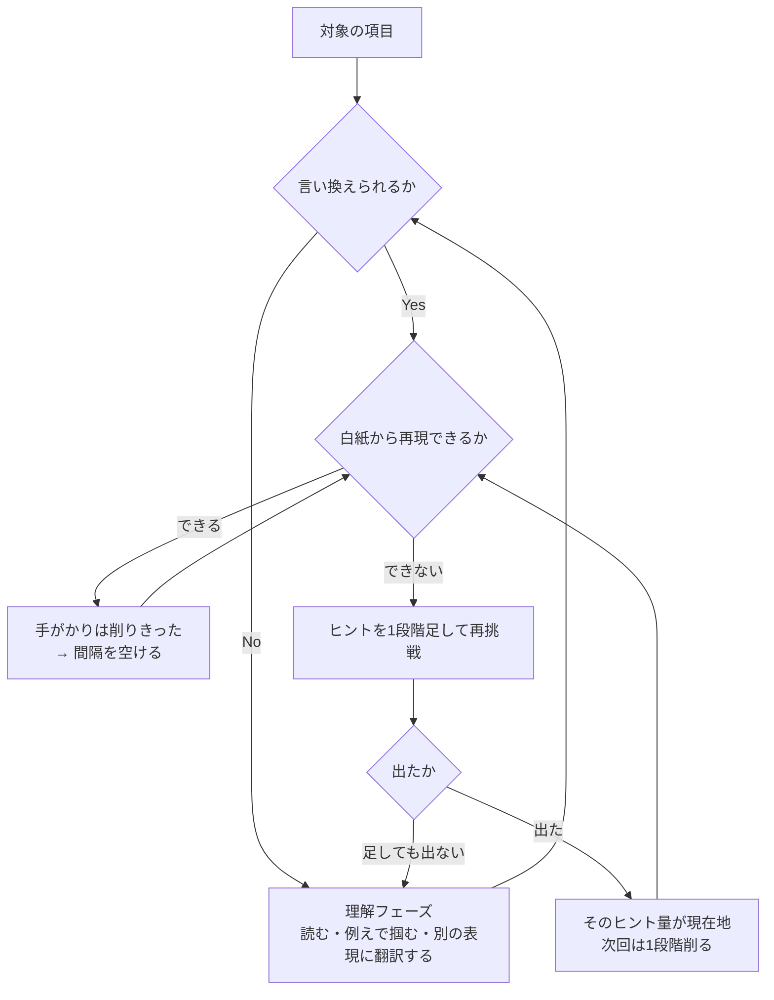

学習技法は数が多く、どれをいつ使うかで迷いやすい。ところが実用上の技法は **与える手がかりの量** という1本の軸にすべて乗り、選び方も1つのルールで決まる。技法のリストを覚える代わりに、そのルールと2つのツマミを持てばよい。

前提となる記憶の2軸([[retrieval-practice|貯蔵強度と引き出し強度]])は別ノートに譲り、ここでは選択の手続きだけを扱う。必要な前提は2つに絞れる。

- **想起して成功したときだけ、深さ(貯蔵強度)が増える**
- **増分は、そのとき思い出しにくいほど大きい**

## 技法は1本の軸に並ぶ

| 手 | 与える手がかり | 使いどころ |
|---|---|---|
| 素材を読む | 全部 | 理解フェーズだけ |
| 選択肢から選ぶ | 多い | 失敗しそうなとき |
| 穴埋め | 中 | ↓ |
| 用語 → 定義カード | 少ない | ↓ |
| 場面 → 判断カード | 少ない(別角度) | ↓ |
| **白紙再現** (free recall) | **最小** | 余裕があるとき |
| 人に教える・出題する | 最小 + 構成の要求 | 最も余裕があるとき |

バラバラの技法に見えるものが、**手がかりの量という1本の軸に全部乗る**。並べ替えると、どれが難しいかではなく、どれがどれだけ手がかりを与えているかで序列が決まっているのが分かる。

## 唯一のルール

> **成功するギリギリまで手がかりを削る。**

逆説的に見えるが、**よく覚えている項目ほど手がかりの少ない形を使い、覚えていない項目ほど手がかりを足す**ことになる。難しい形を上級者向け、易しい形を初心者向けと考えると逆をやる。

### なぜこの形になるか

2つの前提を組み合わせると出てくる。

- 手がかりを削るほど思い出しにくくなる → 増分は大きくなる
- ただし削りすぎると想起が失敗する → 増分はゼロになる

増分は手がかりの量に対して単調にならず、**途中で最大をとる**。最適は端点ではなく内点に来て、その内点が「削れるだけ削って、なお成功する」ところになる。

同じ形の最適化が復習間隔にも現れる。詰めれば思い出しやすすぎて増分ゼロ、空けすぎれば失敗して増分ゼロ、最大は途中。**手がかりと間隔は、同じ問題の2つの変数**という関係になる。

## ツマミは2つ

どちらも「思い出しにくさ」を上げるという同じ目的に効く。違うのは速度。

| ツマミ | 効き方 | 待ち時間 |
|---|---|---|
| **手がかりを減らす** | 即座に効く | 不要 |
| **間隔を空ける** | 確実に効く | 要る |

順序が決まる。**手がかりを削りきってから、時間を使う**。逆順にすると、待っている間ずっと手がかり過多の形で回すことになり、待ち時間を無駄にする。

## 判断手順



分岐は2つしかない。「言い換えられるか」と「白紙から再現できるか」で、どちらも自分で判定でき、判定した時点で次の手が決まる。

## ヒントの階段

削る操作を安全にするには、**足す側の段を先に用意しておく**必要がある。段が無いと、詰まった瞬間に答えを見ることになり、そこで想起の機会が消える。

上から順に、必要になった分だけ足す。

```
1. 白紙 + キーワード1語
2. + 見出しの一覧
3. + 各節の1文目
4. + キーワードの列挙
5. + 選択肢
6. 答え（ここまで来たら理解フェーズに戻す）
```

**5で出れば増分は入る。6まで行くと入らない。** 段を用意しておくかどうかが、この差を決める。

## 白紙再現が最も深い理由

軸の一番下にある形なので、増分も最大になる。加えて2つの副産物がある。

- **カバレッジが可視化される** — 書けなかった箇所が即座に分かる。次に何をカード化すべきかが自動的に出る
- **接続が検査される** — キーワード1語から芋づる式に出るかどうかで、知識が繋がっているかが分かる。バラバラに覚えた項目は1語から何も引っ張れない

ただし条件が2つつく。

1. **理解フェーズを通っていること** — 通っていない項目は白紙のまま終わり、増分がゼロになる
2. **必ず答え合わせをすること** — 書けたつもりで間違っている箇所は自分では検出できない。誤ったまま想起すると、誤りのほうが定着する

## 本番前だけ例外

試験や発表が近づいたら、削るのをやめて**当てにいく**側へ回る。手がかりを増やし、間隔を詰め、正解し続ける状態を作る。

学習効率は落ちる。それでも当日のアクセス確保という別の目的があるため、この期間だけ上のルールを意図的に裏切る。**裏切っていると自覚できているかどうか**が、本番前の手応えの良さを実力と誤認しないための分かれ目になる。

## 押さえどころ

- **技法の統一軸** → 与える手がかりの量。すべての技法がこの1本に並ぶ
- **唯一のルール** → 成功するギリギリまで手がかりを削る
- **逆説** → よく覚えている項目ほど手がかりの少ない形を使う。難易度と習熟度は逆に対応する
- **なぜ内点解か** → 削るほど増分は増えるが、削りすぎると想起が失敗して増分ゼロ。最大は途中にある
- **ツマミは2つ** → 手がかりの量(即効・待ち時間なし)と間隔(確実・待ちが要る)。削りきってから時間を使う
- **ヒントの階段** → 足す段を先に用意する。段が無いと詰まった瞬間に答えを見て、想起の機会が消える
- **白紙再現** → 軸の最下端。カバレッジの可視化と接続の検査を兼ねるが、理解フェーズの通過と答え合わせが条件
- **本番前** → ルールを意図的に裏切る期間。裏切っている自覚を持つ

## 制限

- 階段の段数や「1段階」の粒度に理論的な根拠はない。運用しながら決める調整値になる
- 対象は宣言的知識(語彙・概念・判断)。運動技能の習得には別の枠組みが要る
- 「成功するギリギリ」は事前に分からない。失敗して初めて削りすぎだと判明するため、探索が要る

## 関連

- [[retrieval-practice]] — 前提となる2軸モデルと3規則。本ノートのルールはそこからの帰結
- [[learning-system]] — 技法の選択を、素材からカードまでのパイプラインとして回す設計
- [[forgetting-curve]] — もう一方のツマミ(間隔)を、曲線の側から見たもの
