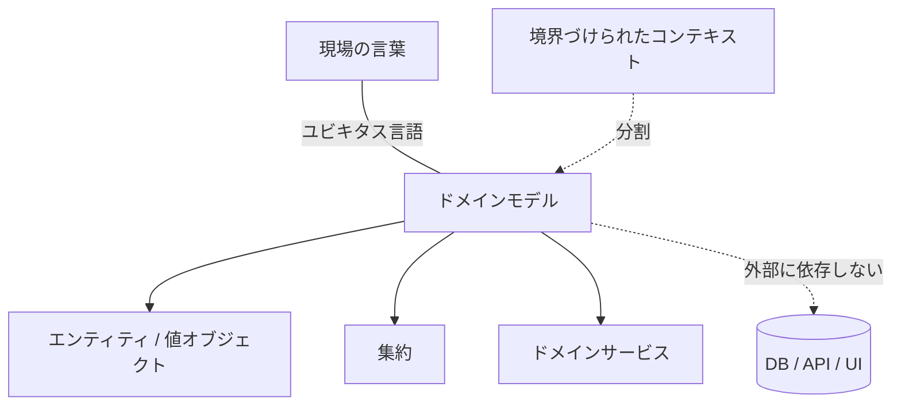

実際の業務で使われる言葉と概念に合わせてソフトウェアを組み立てる設計の流派。

## 何ができる？／なぜ重要？

お店の在庫システムを作ることを考えてみましょう。店員さんは普段「仕入れ」「棚卸し」「品出し」「返品」という言葉で仕事をしています。ところがプログラム側では「テーブル A に行を追加」「カラム X を更新」といった、まるで違う言葉で動いていたら、どうでしょう。打ち合わせのたびに翻訳が必要になり、業務ルールの変更があるたびに、店員の言葉とプログラムの世界をすり合わせる作業が発生します。これは事故とコストの温床です。

DDD（Domain-Driven Design）は、「店員さんと同じ言葉でプログラムも組もう」という発想です。「仕入れ」というクラスや関数があり、「棚卸し」という処理があり、現場の人とコードを一緒に読みながら会話できる。これを徹底すると、業務ルールの変更が起きても、コードのどこを直せばよいか直感で分かりますし、新しいメンバーも現場の話を聞くだけでコードが理解できるようになります。要するに「現場とコードの言語を一致させる」のが核心です。

## 仕組み

現場の言葉（ユビキタス言語）を起点に、エンティティ・値オブジェクト・集約・ドメインサービスとしてモデルを組み立てます。文脈ごとに境界（コンテキスト）を引き、それぞれの中で言葉を一貫させます。ドメイン層は外側の都合（DB や UI）に依存しないように保ちます。

## 用語

- **ドメイン**: ソフトウェアが扱う業務や問題領域。
- **ユビキタス言語**: 現場とコードで共通に使う言葉。
- **エンティティ**: ID で識別される、ライフサイクルを持つ存在。
- **値オブジェクト**: 値そのもので等しさが決まる、不変の小さな型。
- **集約 (aggregate)**: 一貫性を保って一塊で更新される単位。
- **境界づけられたコンテキスト**: 言葉とモデルが一貫する範囲。
- **ドメインサービス**: 単一のエンティティに収まらない業務操作。
- **リポジトリ**: 集約を取り出す「倉庫の窓口」。
- **アンチコラプションレイヤ**: 外の言語が入り込まないようにする防壁。

## vault 内での使われ方

- [[memre]] — メモリ管理ドメインを業務語彙で設計
- [[macleap]] — サービスのドメインモデルを中心に据える
- [[gulp-coach]] — コーチング業務の言葉に沿ったモデル
- [[environment-health-viewer]] — 計測対象ドメインを軸にした構造
- [[aid-on-contract-generator]] — 契約業務の語彙で組み立てた生成器
- [[aid-on-invoice-generator]] — 請求の業務モデル
- [[aid-on-tax-calculator]] — 税務ドメインを反映した計算機
- [[reporting-page-by-calendar-days]] — 業務カレンダー概念のモデル化
- [[reporting-page-by-working-days]] — 稼働日ドメインの扱い

## 関連概念

- [[hexagonal-architecture]] — ドメインを中心に守る代表的な構造
- [[dependency-injection]] — ドメイン層を外側から独立させる手段
- [[effect-system]] — ドメインを純粋に保つための言語的支え
- [[property-based-testing]] — ドメイン不変条件の検証手段

## Links

- [Wikipedia: Domain-driven design](https://en.wikipedia.org/wiki/Domain-driven_design)
- [Domain-Driven Design Reference - Eric Evans](https://www.domainlanguage.com/ddd/reference/)
