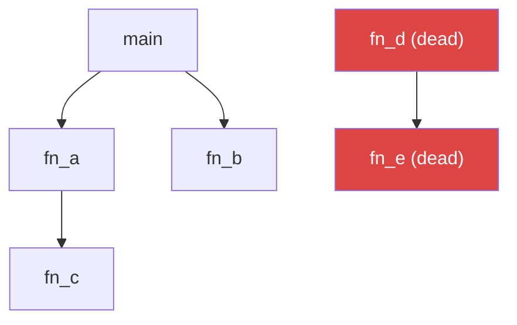
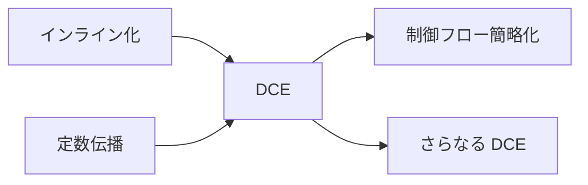

実行されることがないコード (dead code) をコンパイル時に除去する最適化。バイナリサイズの削減、キャッシュ効率の向上、他の最適化パスの有効化に寄与する。WebAssembly ではバイナリを配信するためサイズが直接ロード時間に影響し、DCE の重要度が特に高い。

## Dead Code の種類

### Unreachable Code

制御フローが到達しないコード。

```rust
fn example(x: i32) -> i32 {
    return x + 1;
    x * 2  // ← 到達不能。return の後
}
```

### Dead Definitions (未使用定義)

定義されているが、どこからも参照されない関数・変数・型。

```rust
fn used() -> i32 { 42 }
fn unused() -> i32 { 99 }  // ← どこからも呼ばれない

fn main() {
    println!("{}", used());
}
```

### Dead Store

書き込まれるが、その後読まれない変数への代入。

```rust
let mut x = compute_expensive();  // ← dead store (x は次の行で上書き)
x = 42;
println!("{x}");
```

## DCE の実装アプローチ

### 関数レベル DCE (Tree Shaking)

エントリポイントから到達可能な関数の呼び出しグラフを構築し、到達不能な関数を除去する。JavaScript バンドラ (webpack, Rollup, esbuild) では Tree Shaking と呼ばれる。



1. エントリポイント (main, export された関数) をルートとする
2. 呼び出しグラフを辿り、到達可能な関数をマークする
3. マークされなかった関数を除去する

### 命令レベル DCE

基本ブロック内、あるいは SSA (Static Single Assignment) 形式上で、結果が使われない命令を除去する。

```
// 除去前
%1 = add i32 %a, %b    // ← %1 は誰にも使われない → dead
%2 = mul i32 %a, 3
ret i32 %2

// 除去後
%2 = mul i32 %a, 3
ret i32 %2
```

LLVM の `--passes=dce` (局所) や `--passes=adce` (Aggressive DCE) が代表的。

### リンク時 DCE (LTO + GC Sections)

関数/データをそれぞれ独立セクションに配置し、リンカが参照されないセクションを除去する。

- GCC/Clang: `-ffunction-sections -fdata-sections` + リンカに `-Wl,--gc-sections`
- Rust: LTO (Link-Time Optimization) で関数境界を越えた DCE が可能
- LLVM LTO: モジュール間のインライン化 → 呼び出し先が消滅 → DCE で除去

## WebAssembly における DCE

WASM ではバイナリをネットワーク経由で配信するため、サイズがロード時間に直結する。DCE の重要性がネイティブバイナリ以上に高い。

### 問題: ランタイム関数の肥大化

典型的な問題パターン:

```
hello world プログラム
  → println を使用
    → 文字列フォーマット
      → alloc / dealloc
        → メモリ管理ランタイム全体
          → 253 関数が生存 (実際に必要なのは数十関数)
```

ランタイムライブラリの関数が相互参照していると、1つの関数を使うだけで芋づる式に大量の関数が到達可能になる。

### WASM 固有の DCE 課題

| 課題 | 説明 |
|---|---|
| 関数インデックスの安定性 | WASM の `call` 命令は関数インデックス (整数) で参照する。関数を削除するとインデックスがずれ、全 call 命令のリマップが必要 |
| 間接呼び出し (call_indirect) | テーブル経由の間接呼び出しは静的に呼び出し先を特定できない。保守的に全テーブルエントリを生存とみなす必要がある |
| export された関数 | export はホスト環境から呼ばれる可能性があるため、DCE のルートになる |
| unreachable スタブ戦略 | 関数を完全削除するとインデックスリマップが必要。代わりに関数本体を `unreachable` 命令1つに置換する方法もある (サイズ削減は限定的) |

### wasm-opt (Binaryen) の DCE

Binaryen の `wasm-opt` ツールが提供する最適化パス:

```bash
# DCE を含む最適化
wasm-opt -O3 input.wasm -o output.wasm

# DCE のみ実行
wasm-opt --dce input.wasm -o output.wasm

# 未使用 export の除去 + DCE
wasm-opt --remove-unused-module-elements input.wasm -o output.wasm
```

`wasm-opt -Oz` (サイズ最適化) はコードサイズを 20-50% 削減することが多い。

### wasm-tools strip

デバッグ情報やカスタムセクションの除去:

```bash
wasm-tools strip input.wasm -o output.wasm
```

DCE とは別だが、サイズ削減に寄与する。

## unreachable スタブ vs 完全削除

DCE で dead function を処理する2つの戦略:

| 戦略 | メリット | デメリット |
|---|---|---|
| unreachable スタブ | 関数インデックスが安定。実装が単純 | スタブ自体のサイズ (数バイト/関数) が残る。関数数が減らない |
| 完全削除 + リマップ | バイナリサイズが最小化 | 全 call/call_indirect/table のインデックスを書き換える必要がある。実装が複雑 |

WASM の場合、関数が数百あると unreachable スタブでも数 KB のオーバーヘッドになる。本格的なサイズ最適化には完全削除 + リマップが必要。

## 呼び出しグラフの構築と保守的解析

正確な DCE には正確な呼び出しグラフが必要。しかし以下のケースでは保守的 (conservative) にならざるを得ない:

| ケース | 影響 |
|---|---|
| 関数ポインタ / 間接呼び出し | 呼び出し先が不定。テーブル内の全関数を生存とみなす |
| トレイトオブジェクト (dyn Trait) | vtable 経由の動的ディスパッチ。vtable に登録された全実装を保持 |
| リフレクション | 文字列から関数を呼び出す可能性 → 全関数を保持 |
| パニックハンドラ | panic 時のみ呼ばれるが、到達可能とみなされる |

保守的すぎる解析は false positive (実際は dead なのに live と判定) を生み、DCE の効果を下げる。

## 他の最適化との関係



- インライン化 → 呼び出し先の関数が他に使われていなければ DCE で除去可能に
- 定数伝播 → 条件分岐が定数に畳み込まれ、到達不能な分岐が DCE で除去可能に
- DCE は他の最適化パスと繰り返し適用 (fixpoint iteration) することで効果が増大

## Rust / WASM でのサイズ最適化チェックリスト

```toml
# Cargo.toml
[profile.release]
opt-level = "z"       # サイズ最適化
lto = true            # Link-Time Optimization (モジュール間 DCE)
codegen-units = 1     # 単一コード生成ユニット (LTO の効果を最大化)
strip = true          # シンボル除去
panic = "abort"       # panic 時のスタック巻き戻しコードを除去
```

```bash
# ビルド後の追加最適化
wasm-opt -Oz target/wasm32-unknown-unknown/release/app.wasm -o app.opt.wasm
wasm-tools strip app.opt.wasm -o app.final.wasm
```

## 押さえどころ（カード化候補）

- DCE とは → 実行されないコード (dead code) をコンパイル時に除去する最適化。unreachable code、未使用定義、dead store の3種類がある
- Tree Shaking と DCE → Tree Shaking は関数レベルの DCE。エントリポイントから呼び出しグラフを辿り、到達不能な関数を除去。JS バンドラで広く使われる用語
- WASM で DCE が特に重要な理由 → バイナリをネットワーク配信するためサイズがロード時間に直結。ランタイム関数の芋づる式肥大化が典型的な問題
- unreachable スタブ vs 完全削除 → スタブは関数インデックスが安定で実装が単純だがサイズは残る。完全削除は最小サイズだが全 call のインデックスリマップが必要
- 間接呼び出しが DCE を阻害する理由 → call_indirect やトレイトオブジェクトは呼び出し先を静的に特定できない。保守的にテーブル/vtable 内の全関数を生存とみなす
- DCE とインライン化の相乗効果 → インライン化で呼び出し先が展開される → 他に呼び出し元がなければ元関数が dead に → DCE で除去。繰り返し適用で効果増大
- Rust/WASM のサイズ最適化 → opt-level="z" + lto=true + codegen-units=1 + panic="abort" + wasm-opt -Oz。LTO がモジュール間 DCE を可能にする
- 呼び出しグラフが保守的になるケース → 関数ポインタ、トレイトオブジェクト、リフレクション、パニックハンドラ。false positive で実際は dead な関数が保持される

## Links

- [LLVM DCE Pass](https://llvm.org/docs/Passes.html#dce-dead-code-elimination)
- [Binaryen (wasm-opt)](https://github.com/WebAssembly/binaryen)
- [Shrinking .wasm Code Size (Rust and WebAssembly)](https://rustwasm.github.io/docs/book/reference/code-size.html)

## 関連

- [[wasm-simd]] — WASM バイナリの最適化文脈で DCE が重要
