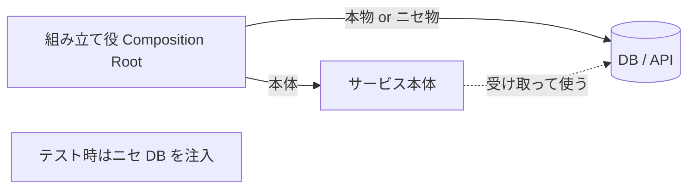

部品（依存）を中で作らず、外から差し込んで組み立てる設計の作法。

## 何ができる？／なぜ重要？

レゴブロックを思い浮かべてください。車のボディに「タイヤ」を取り付けるとき、ボディの中にタイヤを最初から固定して埋め込んでしまうと、別の種類のタイヤに替えられません。けれど、はめ込み式にしておけば、好きなタイヤを後から差し込めます。あるいは、電池を入れ替えできるおもちゃは、電池が切れても本体ごと買い替える必要はありませんね。DI（Dependency Injection）は、プログラムの部品も「後から差し込める」形にしておく考え方です。

これが嬉しいのは、テストが圧倒的に楽になるからです。本物のデータベースに毎回つなぐ代わりに、テストのときだけ「ニセのデータベース」を差し込めば、ネットワーク不要で速くテストできます。本番では本物、テストではニセ物、と差し替えるだけで済みます。さらに、新しい機能を試すときも、既存コードを書き換えずに「別の部品」を差し込んで切り替えられます。「変えやすさ」と「試しやすさ」を両立する設計の基本です。

## 仕組み

「組み立て役」が、どの部品をどの順で差し込むかを決めます。サービス本体は「外から差し込まれた部品を使う」とだけ決まっていて、中身が本物のデータベースか、ニセ物かは気にしません。差し替えはすべて組み立ての段階で行います。

## 用語

- **DI (Dependency Injection)**: 依存性注入。部品を外から渡す方式。
- **依存 (dependency)**: ある部品が動くために必要な別の部品。
- **インターフェース**: 「どんな機能があるか」を決めた契約書。中身を差し替えやすくする。
- **Composition Root**: 部品を組み立てる中心的な場所。
- **DI コンテナ**: 部品の組み立てを自動化するライブラリ。
- **モック**: テスト用のニセ物部品。
- **逆制御 (IoC)**: 制御の流れを呼び出し側ではなく外部に渡す考え方。
- **コンストラクタ注入**: 生成時に部品を渡す代表的なやり方。

## vault 内での使われ方

- [[famulus]] — README に "Every module is injected via DI container. `main.ts` only wires them together" と明記
- [[famulus2]] — README で "全テストは本物のモジュールをDIで組み立て。モック・スタブなし" と明記

## 関連概念

- [[hexagonal-architecture]] — DI を前提にした境界設計

## Links

- [Wikipedia: Dependency injection](https://en.wikipedia.org/wiki/Dependency_injection)
- [Inversion of Control - Martin Fowler](https://martinfowler.com/articles/injection.html)
