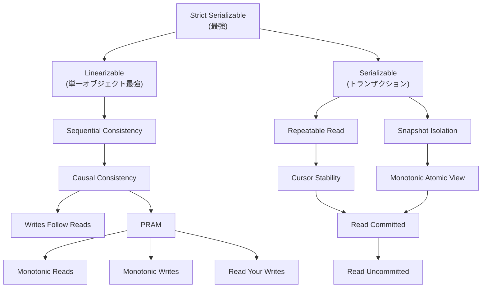
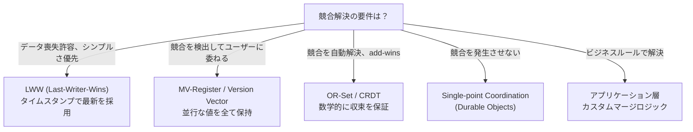

分散システムにおけるデータ一貫性の理論的基盤と実践的設計パターンの包括的整理。CAP 定理の正確な理解から、一貫性モデルの階層、CRDT の数学的定義、Edge Computing での実装まで。

---

## 1. CAP 定理

### 歴史

| 年 | 出来事 |
|---|---|
| 2000 | Eric Brewer が ACM PODC で「CAP 予想」を発表 |
| 2002 | Seth Gilbert & Nancy Lynch が形式的に証明 (ACM SIGACT News) |
| 2012 | Brewer 自身が IEEE Computer で "CAP Twelve Years Later" を発表し再解釈 |

Gilbert & Lynch の証明は、非同期ネットワークモデルにおいて、**複製された read/write レジスタ**が C, A, P の全てを同時に満たすことが不可能であることを示した。

### 厳密な定義

| 性質 | 厳密な意味 | よくある誤解 |
|---|---|---|
| **C (Consistency)** | **Linearizability** — 全ての操作が、呼び出しと応答の間のある一点で瞬時に実行されたかのように見え、全体で全順序が存在する | ACID の C (整合性制約の保持) とは別物 |
| **A (Availability)** | **故障していない全てのノードが、全てのリクエストに対して応答を返す** | 「高可用性 (99.99%)」とは別物。CAP の A は全ノードが必ず応答を返すことを要求する |
| **P (Partition tolerance)** | **ネットワーク分断が発生しても、システムが動作し続ける** | 「選択肢」ではない。分散システムでは分断は不可避の物理現象 |

### 「3つから2つ選ぶ」が不正確な理由

分散システムにおいて P (ネットワーク分断) は「選ばない」ことができない物理現象である。地震を「選ばない」ことができないのと同様。したがって本質的な選択は:

> **分断が発生したとき、C (一貫性) と A (可用性) のどちらを優先するか?**

- **CP**: 分断中は一部のリクエストに応答しない (一貫性を維持)
- **AP**: 分断中も全リクエストに応答するが、stale なデータを返しうる

「CA」は単一ノードシステム (非分散) にのみ該当し、分散システムの設計選択としては実質的に存在しない。

### Brewer の 2012 年再解釈

Brewer は "CAP Twelve Years Later: How the 'Rules' Have Changed" (IEEE Computer, 2012) で以下を主張:

1. **CAP が禁じるのはデザイン空間のごく一部** — 完全な可用性と完全な一貫性が、分断下で同時に成立しないだけ
2. **分断は稀なイベント** — 分断が発生していない間は C と A の両方を最大化できる
3. **分断を明示的に扱うことで、3つの性質を部分的に全て達成できる** — 分断の検出、分断中の制限的動作、分断回復後の補償という3フェーズで設計すべき
4. **「2つ選べ」は誤解を招く** — 連続的なトレードオフとして捉えるべき

---

## 2. 一貫性モデルの階層

Jepsen による一貫性モデルの階層 (上ほど強い):

### 全体構造



### 各モデルの定義

#### Strong Consistency

| モデル | 定義 | 特徴 |
|---|---|---|
| **Linearizability** | 全ての操作が呼び出しと応答の間の一点で瞬時に実行されたかのように見え、その点の実時間順序と矛盾しない全順序が存在する | リアルタイム制約あり。CAP の C はこれ |
| **Sequential Consistency** | 全プロセスが同一の操作インターリーブを観測し、各プロセスのプログラム順序が保存される。ただしリアルタイム順序は保存しない | Linearizability からリアルタイム制約を除いたもの |
| **Serializability** | トランザクションの結果が、あるシリアル実行順序の結果と等しい | トランザクション文脈の一貫性。マルチオブジェクト |
| **Strict Serializability** | Serializability + Linearizability。トランザクションがリアルタイム順序と矛盾しないシリアル順序で実行されたかのように見える | 最強。Linearizability のトランザクション版 |

#### Weak Consistency

| モデル | 定義 | 特徴 |
|---|---|---|
| **Causal Consistency** | 因果関係のある操作は全プロセスで同一順序で観測される。並行な (因果関係のない) 操作は異なる順序で観測されうる | Sequential Consistency から「全員が同一の全順序を見る」制約を因果関係のみに緩和 |
| **PRAM** | 各プロセスの書き込みは、全プロセスでそのプロセスの発行順に観測される。異なるプロセスの書き込みは任意の順序 | Pipeline RAM。プロセス単位の順序のみ保証 |
| **Read Your Writes** | プロセスが自分の書き込みを必ず読める | セッション保証の一つ |
| **Monotonic Reads** | 一度読んだ値より古い値を後で読むことがない | セッション保証の一つ |
| **Monotonic Writes** | 同一プロセスの書き込みが発行順に全ノードに反映される | セッション保証の一つ |
| **Writes Follow Reads** | 読み取りの後の書き込みは、読んだ値以降の状態に対して行われる | セッション保証の一つ |
| **Eventual Consistency** | 更新が停止すれば、全レプリカが最終的に同一の状態に収束する | 最も弱い有用な一貫性。収束までの時間は未定義 |

#### 可用性との関係

Jepsen の分析によると:

- **Cursor Stability 以上** (Sequential, Linearizable, Serializable, Strict Serializable) — 非同期ネットワークで total availability を達成不可能
- **Read Your Writes より強いモデル** — sticky availability (同一ノードへの固定) のみ可能
- **それより弱いモデル** (Eventual, Monotonic Reads 等) — totally available にできる

---

## 3. Eventual Consistency と Strong Eventual Consistency

### Eventual Consistency (EC)

**定義**: 新しい更新が行われなければ、全てのレプリカが最終的に同一の値に収束する。

- 収束までの時間について保証がない
- 収束過程で矛盾する値を返しうる
- 収束の方法 (競合解決) が別途必要

#### 競合解決戦略

| 戦略 | 仕組み | 長所 | 短所 |
|---|---|---|---|
| **Last-Writer-Wins (LWW)** | タイムスタンプが最大の書き込みが勝つ | 単純、決定的 | データ喪失。クロック同期に依存 |
| **Vector Clocks** | N次元のベクタで因果関係を追跡 | 因果関係を正確に捕捉 | メタデータ O(N)。スケーリングに難 |
| **Version Vectors** | 各ノードが観測したバージョンを追跡 | 競合検出が正確 | Vector Clock と同様のサイズ問題 |
| **アプリケーション層解決** | 競合を検出してユーザーやビジネスロジックに委ねる | 正確な解決が可能 | 実装が複雑 |

### Strong Eventual Consistency (SEC)

**定義** (Shapiro et al., 2011): 同じ更新の集合を受信した任意の2つのレプリカは、**即座に** 同一の状態になる。「最終的に」ではなく、更新の処理完了と同時に収束が保証される。

EC との違い:

| | EC | SEC |
|---|---|---|
| 収束タイミング | 「いつか」(未定義) | 同じ更新集合を処理した時点で即座 |
| 競合解決 | 外部メカニズムが必要 | データ構造の数学的性質が自動解決 |
| 調整 (coordination) | 必要な場合がある | 不要 |

SEC は CRDT が保証するもの。

---

## 4. CRDT (Conflict-free Replicated Data Types)

### 理論的背景

2011年、Marc Shapiro, Nuno Preguica, Carlos Baquero, Marek Zawirski が INRIA 技術報告 (RR-7506) "A Comprehensive Study of Convergent and Commutative Replicated Data Types" で形式的に定義。

**核心的アイデア**: データ構造の状態空間が数学的に join-semilattice を形成するように設計すれば、任意の順序でマージしても同じ結果に収束する。

### 2つのアプローチ

#### State-based CRDT (CvRDT — Convergent Replicated Data Types)

- レプリカ間で**状態全体**を送受信
- **マージ関数** が join-semilattice を形成する:
  - **可換性**: `merge(a, b) = merge(b, a)`
  - **結合性**: `merge(merge(a, b), c) = merge(a, merge(b, c))`
  - **冪等性**: `merge(a, a) = a`
- 通信チャネルに要件なし (順序不要、重複可)
- 欠点: 状態全体を送信するためバンド幅が大きい

#### Operation-based CRDT (CmRDT — Commutative Replicated Data Types)

- レプリカ間で**操作**を送受信
- 操作が**可換** (concurrent な操作の適用順序が結果に影響しない)
- 通信チャネルに要件あり: 全操作が全レプリカに**正確に一度**配信される必要がある
- 長所: 送信データが小さい

#### Delta-state CRDT

- State-based と Operation-based の利点を組み合わせた最適化
- 状態全体ではなく、**差分 (delta)** のみを送信
- 差分も join-semilattice を形成する
- 非信頼チャネルで動作 (state-based の利点) しつつ、メッセージサイズが小さい (operation-based の利点)

### 主要なデータ型

#### Counters

##### G-Counter (Grow-only Counter)

単調増加のみ可能なカウンター。

```
型:        Map<ReplicaId, Nat>
値:        value(c) = sum(c[r] for all r)
increment: c[self] += 1
merge:     for each r: result[r] = max(c1[r], c2[r])
順序:      c1 <= c2 iff forall r: c1[r] <= c2[r]
```

各レプリカが自分のスロットだけをインクリメントし、マージ時にスロットごとの max を取る。合計値は全スロットの和。

##### PN-Counter (Positive-Negative Counter)

増減可能なカウンター。2つの G-Counter の組。

```
型:        { P: GCounter, N: GCounter }
値:        value(pn) = value(pn.P) - value(pn.N)
increment: pn.P[self] += 1
decrement: pn.N[self] += 1
merge:     { P: merge(pn1.P, pn2.P), N: merge(pn1.N, pn2.N) }
```

#### Registers

##### LWW-Register (Last-Writer-Wins Register)

```
型:        { value: T, timestamp: Timestamp }
write:     { value: v, timestamp: now() }
merge:     timestamp が大きい方を採用 (同値なら決定的なタイブレーク)
順序:      r1 <= r2 iff r1.timestamp <= r2.timestamp
```

**注意**: 同時書き込みの一方が失われる。タイムスタンプの一意性と単調増加性が前提。

##### MV-Register (Multi-Value Register)

```
型:        Set<(T, VectorClock)>
write:     因果的に先行する値を全て削除し、新しい (v, vc) を追加
merge:     因果的に先行しない値を全て保持 (並行な書き込みは全て残す)
```

並行な書き込みを検出し、全ての値を保持する (アプリケーション層で解決を委ねる)。Amazon Dynamo のショッピングカートで使われたアプローチ。

#### Sets

##### G-Set (Grow-only Set)

```
型:        Set<T>
add:       s = s union {e}
merge:     s1 union s2
```

要素の削除不可。追加のみ。

##### 2P-Set (Two-Phase Set)

```
型:        { added: GSet, removed: GSet }
member:    e in added AND e not in removed
add:       added = added union {e}
remove:    removed = removed union {e}  (e in added が前提)
merge:     { added: merge(a1, a2), removed: merge(r1, r2) }
```

**重大な制約**: 一度削除した要素は二度と追加できない。

##### OR-Set (Observed-Remove Set)

```
型:        Map<T, Set<UniqueTag>>
add:       新しいユニークタグ t を生成し、s[e] = s[e] union {t}
remove:    s[e] に現在含まれる全タグを削除 (remove 時に観測されたタグのみ)
member:    s[e] is non-empty
merge:     for each e: s[e] = s1[e] union s2[e]
```

**核心**: add-wins セマンティクス。add と remove が並行に発生した場合、add で生成された新しいタグは remove が観測していないため生存する。実用上最も重要な Set CRDT。

##### LWW-Element-Set

```
型:        { addTimes: Map<T, Timestamp>, removeTimes: Map<T, Timestamp> }
member:    addTimes[e] > removeTimes[e]
add:       addTimes[e] = now()
remove:    removeTimes[e] = now()
merge:     addTimes = unionWith(max, ...), removeTimes = unionWith(max, ...)
```

最新の操作 (add/remove) が勝つ。2P-Set と異なり再追加が可能。

#### Sequences

##### RGA (Replicated Growable Array)

```
型:        Map<UID, (value, parentUID, tombstone)>
           UID = (timestamp, replicaId)  -- グローバルに一意
insert:    親要素の UID を参照して新ノードを挿入
delete:    要素を tombstone でマーク (実際には削除しない)
順序:      親 UID からのリンクを辿って論理的な順序を再構築
```

協調テキスト編集の基盤。各文字がユニークな位置識別子を持ち、隣接要素との相対関係でソートされる。

##### Logoot / LSEQ

位置識別子ベースのシーケンス CRDT。RGA がリンク構造を使うのに対し、Logoot/LSEQ は辞書順の位置識別子を割り当てる。

- **Logoot**: 固定的な位置生成。挿入が特定のパターンに偏ると識別子が爆発的に長くなる
- **LSEQ**: 適応的な位置生成戦略 (boundary+, boundary-) をランダムに選択し、識別子の増大を抑制

| 比較 | RGA | Logoot/LSEQ |
|---|---|---|
| 位置表現 | リンク構造 (親UID) | 辞書順位置識別子 |
| 識別子サイズ | 固定サイズ | 可変 (増大しうる) |
| 実装の複雑さ | やや複雑 | 比較的単純 |

#### Maps / Graphs

##### OR-Map (Observed-Remove Map)

OR-Set のセマンティクスをマップに拡張。キーの存在管理に OR-Set を使い、値には任意の CRDT をネストできる。

##### Add-Only DAG

ノードとエッジの追加のみ可能な有向非巡回グラフ。`{vertices: GSet, edges: GSet}` で構成。因果関係の追跡やバージョン履歴に有用。

### CRDT の限界

| 限界 | 詳細 |
|---|---|
| **トゥームストーンによるメモリ膨張** | 削除された要素のメタデータ (tombstone) が残り続ける。OR-Set のタグ、RGA のソフト削除など。レプリカ間で tombstone を安全に回収するには全レプリカの同期確認が必要 |
| **ガベージコレクションの困難さ** | tombstone を削除するには「全レプリカがその削除を観測済み」であることを保証する必要があり、これ自体が分散合意問題。オフラインのレプリカが存在すると GC 不可能 |
| **全てのデータ構造が CRDT にできるわけではない** | 状態空間が join-semilattice を形成しない操作 (例: 制約付き減算、集合のサイズ制限) は CRDT にできない |
| **セマンティクスの制約** | CRDT の自動解決は数学的に正しいが、ビジネス的に正しいとは限らない。例: 在庫を負にしない制約は CRDT 単体では表現不可能 |
| **デルタ CRDT でもメタデータは残る** | delta-state CRDT はメッセージサイズを削減するが、メタデータの根本的な蓄積問題は解決しない |

---

## 5. Edge Computing における一貫性の実践

### Cloudflare Workers KV — Eventual Consistency (AP)

| 項目 | 詳細 |
|---|---|
| モデル | Eventually consistent |
| 伝播遅延 | ~60秒 (ハイブリッド push/pull レプリケーション) |
| 構造 | 中央ストアに書き込み、全 Edge ロケーションにレプリケーション |
| 適用先 | 読み取り主体、stale 許容のデータ (設定情報、feature flags) |
| 非対応 | アトミック操作、read-modify-write トランザクション |

### Cloudflare Durable Objects — Strong Consistency (CP)

| 項目 | 詳細 |
|---|---|
| モデル | Strict Serializability (single-point-of-coordination) |
| 仕組み | グローバルに一意なオブジェクト ID に対して単一インスタンスを保証 |
| ストレージ | SQLite (10GB/オブジェクト) + 5フォロワーレプリケーション |
| 適用先 | リアルタイム協調、排他制御、強い一貫性が必要な状態管理 |
| トレードオフ | 書き込みレイテンシが高い (単一ポイントへのラウンドトリップ) |

### Cloudflare D1 Read Replication — Session-based Sequential Consistency

D1 は 2025年4月にグローバル Read Replication のベータを開始。3層アーキテクチャ上で session-based sequential consistency を実現。

**Bookmark メカニズム**:

1. 全ての書き込みが WAL (Write-Ahead Log) に追記され、各エントリに単調増加する **bookmark** (Lamport タイムスタンプ) が付与される
2. セッション内で最新の bookmark を追跡
3. 読み取りクエリがレプリカにルーティングされると、そのレプリカが当該 bookmark 以降の WAL を適用済みであることを確認してから実行
4. 未適用の場合は待機またはプライマリにフォワード

これにより、同一セッション内では **read-your-own-writes** と **monotonic reads** が保証される。異なるセッション間では eventual consistency。

レプリカラグは典型的に 30-75ms (地理的距離に依存)。追加料金なし。

### Deno KV — Strong + Optional Eventual

| 項目 | 詳細 |
|---|---|
| バックエンド | FoundationDB (Deno Deploy 上) |
| デフォルト | Strong consistency (プライマリ内で linearizable) |
| オプション | `consistency: "eventual"` で個別の読み取りを緩和可能 |
| トランザクション | ACID (strict serializability) |
| レプリケーション | 35リージョンにグローバルレプリカ |
| 優位性 | Workers KV (60秒の伝播遅延) に対し、デフォルトで強い一貫性を提供 |

### Edge 一貫性の比較

| プラットフォーム | 一貫性モデル | PACELC 分類 | 適用シナリオ |
|---|---|---|---|
| Workers KV | Eventual (~60s) | PA/EL | 読み取り主体、設定情報 |
| Durable Objects | Strict Serializable | PC/EC | 協調、排他制御 |
| D1 + Read Replication | Sequential (Session) | PA/EC (セッション内) | 読み取り主体 SQL |
| Deno KV (strong) | Linearizable | PC/EC | トランザクション、在庫管理 |
| Deno KV (eventual) | Eventual | PA/EL | キャッシュ、低レイテンシ読み取り |
| Turso Sync | Eventual (sync) | PA/EL | ローカルファースト、オフライン |

---

## 6. PACELC 定理

Daniel Abadi が 2012年に提唱した CAP の拡張。

### 定義

> 分散システムにおいて、ネットワーク分断 (**P**artition) が発生した場合は **A**vailability と **C**onsistency のトレードオフがある。それ以外 (**E**lse) の通常時には **L**atency と **C**onsistency のトレードオフがある。

CAP が「分断時のみ」のトレードオフを扱うのに対し、PACELC は「分断がないときも常にトレードオフが存在する」ことを明示する。

### 分類

| 分類 | 意味 | 例 |
|---|---|---|
| **PA/EL** | 分断時: 可用性優先、通常時: 低レイテンシ優先 | Dynamo, Cassandra, Workers KV |
| **PA/EC** | 分断時: 可用性優先、通常時: 一貫性優先 | — |
| **PC/EL** | 分断時: 一貫性優先、通常時: 低レイテンシ優先 | PNUTS |
| **PC/EC** | 分断時: 一貫性優先、通常時: 一貫性優先 | Spanner, Durable Objects, Deno KV (strong) |

### Edge における PACELC の意義

Edge 環境はノード間のレイテンシが本質的に大きい (大陸間: 100-200ms RTT)。通常時の L/C トレードオフが特に重要になる:

- **低レイテンシを選ぶ (EL)**: 最寄りの Edge レプリカから即座に応答。stale なデータを返しうる
- **一貫性を選ぶ (EC)**: プライマリへのラウンドトリップが必要。レイテンシが増大
- **中間解**: D1 のような session-based consistency でセッション内は一貫性を保ちつつ、読み取りは最寄りレプリカから行う

---

## 7. 実用的な設計パターン

### 因果的順序付けの実装

#### Lamport タイムスタンプ

```
初期化:   clock = 0
送信時:   clock += 1; メッセージに clock を付与
受信時:   clock = max(clock, received_clock) + 1
```

- スカラー値。メッセージサイズ O(1)
- 必要条件: `A -> B ならば TS(A) < TS(B)`
- **逆は成立しない**: `TS(A) < TS(B)` であっても `A -> B` とは限らない
- 因果関係の検出には不十分。並行性の判定ができない

#### ベクタークロック

```
初期化:   VC = [0, 0, ..., 0]  (N プロセス分)
ローカル: VC[self] += 1
送信時:   VC[self] += 1; メッセージに VC を付与
受信時:   for each i: VC[i] = max(VC[i], received_VC[i]); VC[self] += 1
```

- メッセージサイズ O(N)
- **因果関係の完全な捕捉**: `A -> B iff VC(A) < VC(B)` (全要素が <=、かつ少なくとも1つが <)
- **並行性の検出**: `VC(A)` と `VC(B)` が比較不能なら A と B は並行
- スケーリング問題: N が大きくなるとメタデータが膨大に

### Session Guarantees パターン

Terry et al. (1994) が定義した4つのセッション保証:

| 保証 | 意味 | 実装手段 |
|---|---|---|
| **Read Your Writes** | 自分の書き込みを必ず読める | 書き込み後の bookmark/version を追跡し、読み取り時にそれ以降の状態を要求 |
| **Monotonic Reads** | 一度読んだ値より古い値を読まない | 最後に読んだ version を追跡し、以降はそれ以上の version のみ返す |
| **Monotonic Writes** | 書き込みが発行順に反映される | 前回の書き込みの version を記録し、次の書き込み前にその反映を確認 |
| **Writes Follow Reads** | 読み取り後の書き込みが、読んだ状態以降に反映される | 読み取りの version を書き込みリクエストに添付し、依存関係を明示 |

D1 の Session API はこれらのうち Read Your Writes と Monotonic Reads を bookmark メカニズムで実装している。

### 競合解決の設計判断



---

## 押さえどころ (カード化候補)

- CAP 定理の C は Linearizability であり ACID の C (整合性制約) とは異なる。CAP の A は「全ノードが必ず応答する」であり「99.99% 可用性」とは異なる。P はネットワーク分断という物理現象であり選択肢ではない
- 「3つから2つ選ぶ」は不正確 -- P は不可避なので、本質は「分断発生時に C と A のどちらを優先するか」。Brewer 自身が 2012年の再解釈で「2つ選べ」は誤解を招くと認めた
- 一貫性モデルの階層: Strict Serializable > Linearizable > Sequential > Causal > PRAM > {Monotonic Reads, Read Your Writes, Monotonic Writes} > Eventual。上位モデルは下位モデルを含意する
- Linearizability と Sequential Consistency の違い -- Linearizability はリアルタイム制約あり (操作が実時間の invocation-response 区間内の一点で実行されたかのように見える)。Sequential はプログラム順序のみ保存でリアルタイム順序は保存しない
- Eventual Consistency vs Strong Eventual Consistency (SEC) -- EC は「いつか収束する」(時間の保証なし)。SEC は「同じ更新集合を受信した時点で即座に同一状態」。CRDT が保証するのは SEC
- State-based CRDT (CvRDT) と Operation-based CRDT (CmRDT) の違い -- CvRDT は状態全体を送信しマージ関数 (join-semilattice) で合流、通信チャネルに要件なし。CmRDT は操作を送信し可換性で合流、exactly-once 配信が必要
- CRDT の join-semilattice 要件 -- merge 関数が可換 (a merge b = b merge a)、結合 ((a merge b) merge c = a merge (b merge c))、冪等 (a merge a = a) を満たせば、任意の順序・重複でマージしても同じ結果に収束する
- G-Counter の仕組み -- 各レプリカが自分のスロットだけをインクリメント。マージはスロットごとの max。値は全スロットの sum。PN-Counter は G-Counter 2つの組 (P-N)
- OR-Set の add-wins セマンティクス -- 各要素にユニークタグを付与。add は新タグ生成、remove は観測済みタグのみ削除。並行な add と remove では add のタグが未観測のため生存する
- CRDT の根本的限界 -- tombstone によるメモリ膨張、分散 GC の困難さ (全レプリカの同期確認が必要 = これ自体が分散合意問題)、全データ構造が CRDT にできるわけではない (semilattice を形成しない操作は不可)
- PACELC 定理 -- CAP の拡張。分断時の A/C トレードオフに加え、通常時の L/C トレードオフを明示。Edge は通常時の L/C トレードオフが特に重要 (大陸間 100-200ms RTT)
- D1 Read Replication の bookmark メカニズム -- 各 WAL エントリに単調増加する Lamport タイムスタンプ (bookmark) を付与。セッション内で最新 bookmark を追跡。読み取りレプリカが bookmark 以降の WAL 適用済みを確認してからクエリ実行。read-your-own-writes と monotonic reads を保証
- Durable Objects vs CRDT の設計思想 -- DO は「全員が一箇所に集まることで競合を発生させない」(CP)。CRDT は「全員がバラバラに動いて数学的に収束を保証」(AP)。DO は実装が単純でレイテンシが犠牲、CRDT はオフライン対応で実装が複雑
- ベクタークロックと Lamport タイムスタンプの違い -- Lamport はスカラー O(1)、A->B なら TS(A)<TS(B) だが逆は不成立。ベクタークロックは N次元 O(N) だが因果関係を完全に捕捉し並行性を検出可能
- Edge 一貫性の実践的選択 -- Workers KV: eventual (PA/EL)、Durable Objects: strict serializable (PC/EC)、D1: session-based sequential (PA/EC)、Deno KV: strong + optional eventual。ユースケースに応じて選択
- Session Guarantees -- Read Your Writes, Monotonic Reads, Monotonic Writes, Writes Follow Reads の4つ。グローバルな一貫性ではなくクライアント単位の一貫性を保証。Causal より弱いが実用上十分な場合が多い
- Sequence CRDT (RGA) の仕組み -- 各要素にグローバルに一意な UID (timestamp, replicaId) を割り当て、親要素の UID を参照して挿入位置を決定。削除は tombstone。協調テキスト編集の基盤
- 競合解決の設計判断 -- LWW (シンプルだがデータ喪失)、MV-Register (並行値を全保持しユーザーに委ねる)、OR-Set/CRDT (数学的自動解決)、Single-point (競合自体を防止)。ビジネス要件に応じて選択

## Links

- [Gilbert & Lynch, 2002 — Brewer's Conjecture and the Feasibility of Consistent, Available, Partition-Tolerant Web Services (PDF)](https://awoc.wolski.fi/dlib/big-data/GiLy02-CAP.pdf)
- [Brewer, 2012 — CAP Twelve Years Later: How the "Rules" Have Changed (IEEE Xplore)](https://ieeexplore.ieee.org/document/6133253/)
- [Shapiro et al., 2011 — A Comprehensive Study of Convergent and Commutative Replicated Data Types (INRIA)](https://inria.hal.science/inria-00555588v1/document)
- [Almeida et al., 2016 — Delta State Replicated Data Types (arXiv)](https://arxiv.org/abs/1603.01529)
- [Jepsen — Consistency Models](https://jepsen.io/consistency/models)
- [Cloudflare D1 Read Replication — Sequential Consistency Without Borders](https://blog.cloudflare.com/d1-read-replication-beta/)
- [Cloudflare Durable Objects](https://developers.cloudflare.com/durable-objects/)
- [Deno KV](https://deno.com/kv)
- [CRDT.tech](https://crdt.tech/)
- [Ian Duncan — The CRDT Dictionary (2025)](https://www.iankduncan.com/engineering/2025-11-27-crdt-dictionary/)

## 関連

- [[edge-computing]] -- Edge Computing の全体像
- [[edge-data]] -- Edge データストアの具体的な比較
- [[edge-platforms]] -- Edge プラットフォーム比較
- [[copy-on-write]] -- COW は CRDT の delta 最適化と関連する概念
