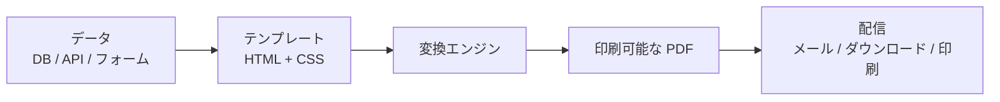
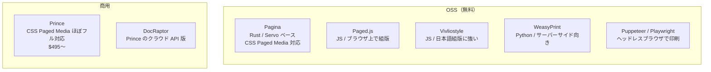

テンプレートにデータを流し込んで、印刷可能な PDF（契約書、請求書、帳票、証明書等）をプログラムで生成すること。

## なぜ必要か

手作業で Word や Excel から PDF を作るのは:
- 人数分の契約書を1枚ずつ作るのが非効率
- 入力ミスが起きる
- デザインの統一が崩れる
- バージョン管理できない

プログラムで自動生成すれば、データベースの値を流し込むだけで何百枚でも正確に出せる。

## パイプライン



## テンプレートの書き方

主流は **HTML + CSS**。Web の技術がそのまま使える。

```html
<!-- 契約書テンプレートの例 -->
<style>
  @page {
    size: A4 portrait;
    margin: 25mm 20mm;
    @top-center { content: "業務委託契約書"; }
    @bottom-right { content: counter(page) " / " counter(pages); }
  }
</style>

<h1>業務委託契約書</h1>
<p>甲: {{company_name}}</p>
<p>乙: {{contractor_name}}</p>
<p>契約期間: {{start_date}} 〜 {{end_date}}</p>
```

`{{変数}}` の部分をテンプレートエンジン（Jinja2, Handlebars, Almide の文字列テンプレート等）で埋める。

## CSS Paged Media — 印刷のための CSS

ブラウザの `@media print` では不十分な部分を補う CSS 仕様群。

| 機能 | CSS プロパティ | 用途 |
|---|---|---|
| ページサイズ | `@page { size: A4 }` | A4, Letter, B5 等 |
| 余白 | `@page { margin: 25mm }` | 印刷の余白 |
| ヘッダ/フッタ | `@top-center`, `@bottom-right` | ページ番号、タイトル |
| 改ページ制御 | `page-break-before`, `break-after` | 章ごとに改ページ |
| 柱 | `string-set`, `content: string()` | ランニングヘッダ |
| 脚注 | `float: footnote` | ページ下部に注釈 |
| 目次 | `target-counter()` | 参照先のページ番号を自動取得 |

問題: **ブラウザは CSS Paged Media をほぼ実装していない。** だから変換エンジンが必要。

## 変換エンジンの選択肢



| エンジン | 言語 | CSS Paged Media | 向いている用途 |
|---|---|---|---|
| [[prince\|Prince]] | CLI | ほぼフル対応 | 高品質な出版物 |
| [[pagina\|Pagina]] | Rust (CLI) | コア機能対応 | 高速・OSS での本格組版 |
| Paged.js | JS (CDN) | 部分的 | フロントエンドでプレビュー+印刷 |
| Vivliostyle | JS (CLI) | 部分的 | 日本語の書籍組版 |
| WeasyPrint | Python | 部分的 | サーバーサイドの帳票生成 |
| Puppeteer | Node.js | ブラウザ依存 | スクショ感覚で PDF 化 |

## ユースケース別の選び方

| ユースケース | おすすめ |
|---|---|
| 社内の請求書・見積書 | WeasyPrint or Puppeteer（十分） |
| 契約書（レイアウト重要） | Prince or Paged.js |
| 書籍・マニュアル（日本語） | Vivliostyle |
| ブラウザ上でプレビュー → 印刷 | Paged.js |
| API で大量生成 | WeasyPrint or DocRaptor（Prince のクラウド版） |

## 関連

- [[css-paged-media|CSS Paged Media]] — 印刷レイアウトのための CSS 仕様
- [[prince|Prince]] — 最高品質の HTML → PDF 変換エンジン
- [[vn3-license|VN3 ライセンス]] — 利用規約の自動生成という関連分野
