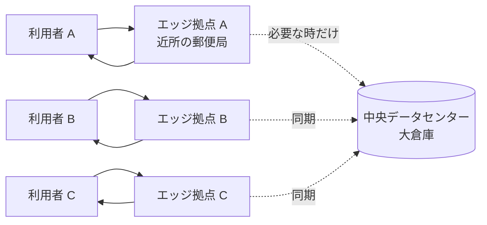

データセンターまで往復するのではなく、利用者の近くにあるサーバ（エッジ）で処理を完結させる仕組み。物理的な距離が短いぶん速く、安く、止まりにくい。

## 何ができる？／なぜ重要？

宅配便にたとえます。これまでネットのサービスは「遠い大きな倉庫（データセンター）にすべての荷物が集まり、利用者は毎回その倉庫まで往復する」しくみでした。距離が遠いので、ボタンを押してから返事が返るまでに時間がかかります。エッジコンピューティングは「街の郵便局」を全国に置く発想です。日常的な受け渡しは近所の郵便局で完結し、本当に必要なときだけ大きな倉庫に問い合わせます。

なぜ重要かというと、応答が速くなり、通信費が下がり、回線が混んだり大きな倉庫が止まったりしてもサービスが続くからです。さらに、利用者のデータが地元から動かないので、プライバシーや法律上の制約にも合わせやすくなります。AI 推論やリアルタイム動画など「ミリ秒が効く」用途で特に効きます。

## 仕組み

利用者の問い合わせはまず一番近いエッジ拠点で受け取られます。ほとんどの処理はその場で完了し、中央倉庫まで行くのは最低限です。各エッジ拠点は中央倉庫と緩やかに同期していて、1 拠点が止まっても他の拠点が肩代わりします。

## 用語

- **エッジ (Edge)**: 利用者やデバイスに近い場所のこと。「ネットワークの末端」の意。
- **データセンター (Origin)**: 巨大なサーバが集中する中央の建物。倉庫のメインハブ。
- **CDN (Content Delivery Network)**: 静的ファイル（画像・JS）を世界中のエッジに配るしくみ。エッジコンピューティングの先輩。
- **Edge Function**: エッジ拠点で動く小さなプログラム。問い合わせをその場で処理する。
- **Cold Start**: 動いていなかったプログラムが起動する瞬間の遅れ。エッジでは小さく速いことが多い。
- **Latency（レイテンシ）**: 「お願いしてから返事が来るまで」の時間。距離が短いほど短い。
- **Cloudflare Workers / Vercel Edge / Deno Deploy**: 代表的なエッジ実行プラットフォーム。
- **POP (Point of Presence)**: 各都市に置かれたエッジ拠点。「街の郵便局」の本体。
- **Replication（レプリケーション）**: データを複数拠点にコピーしておくこと。1 拠点が落ちても続けられる。
- **Eventual Consistency**: 「いずれ全拠点で揃う」緩やかな同期。即時一致は諦めて速さを取る考え方。

## vault 内での使われ方

- [[unillm]] — エッジでも動く LLM プロバイダ抽象
- [[fractop]] — エッジ稼働を前提にした並列ファイル処理
- [[nagare]] — エッジ稼働を前提にしたストリーム処理基盤
- [[memory-rag]] — 外部 DB なしでエッジで動く RAG。Cold start ゼロが売り
- [[whenm]] — Cloudflare Workers などのエッジで動く時系列メモリ
- [[next-auth-providers]] — Edge runtime にも対応する認証プロバイダ
- [[auth-providers-ts]] — Vercel Edge / Cloudflare Workers での OAuth
- [[llm-throttle]] — 分散環境でのレート制御に通じる発想

## 関連概念

- [[serialization]] — エッジ間でデータを送り合うので形式設計が効く
- [[codec]] — 動画やバイナリをエッジで効率配信する
- [[oauth]] — エッジでのトークン検証
- [[capability-based-security]] — エッジで動くコードに細かい権限を渡す

## Links

- [Edge computing (Wikipedia)](https://en.wikipedia.org/wiki/Edge_computing)
- [What is edge computing? (Cloudflare Learning)](https://www.cloudflare.com/learning/serverless/glossary/what-is-edge-computing/)
