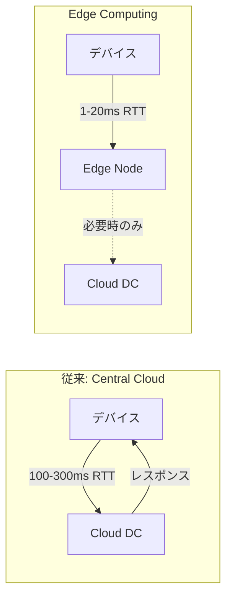
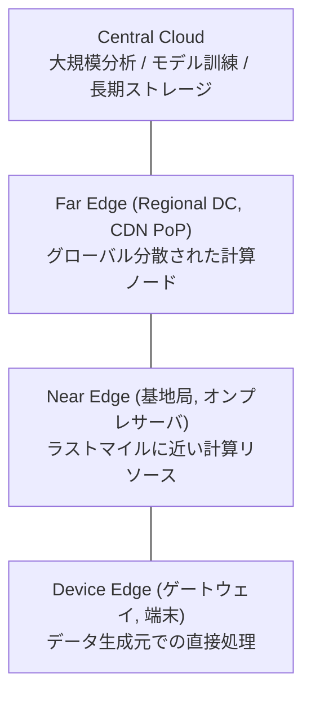
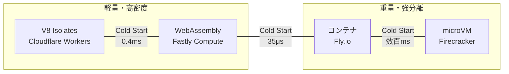

データが生成・消費される場所の近くで計算処理を行う分散コンピューティングパラダイム。中央クラウドへの往復を排除することで、レイテンシ削減・帯域幅節約・データ主権の確保を実現する。

Linux Foundation (LF Edge) の定義:
> "The delivery of computing capabilities to the logical extremes of a network in order to improve the performance, operating cost and reliability of applications and services."

## なぜ Edge Computing が必要か

| 動機 | 説明 |
|---|---|
| レイテンシ | 自動運転 (1-10ms)、AR/VR (20ms 未満) など、物理的にクラウド往復では不可能な応答時間要件 |
| データ量 | IoT デバイスが生成するデータ (2025年: 79.4ZB 予測) を全てクラウドに送るのは帯域幅的に不可能 |
| データ主権 | GDPR 等の規制で個人データの越境移転に制限。Edge でローカル処理することでコンプライアンス確保 |
| 帯域幅コスト | Edge でデータをフィルタリング・集約し、重要な情報のみクラウドに転送 |
| 耐障害性 | ネットワーク障害時もオフラインで動作し続ける |

## アーキテクチャ: Cloud-Edge-Device の3層

| 層 | 位置 | レイテンシ | 例 |
|---|---|---|---|
| Device Edge | エンドデバイス上 | <1ms | スマートフォン、センサー、Jetson |
| Near Edge | ラストマイルのインフラ側 | 1-10ms | 5G 基地局、工場内サーバ |
| Far Edge | リージョナル DC / CDN PoP | 10-50ms | Cloudflare PoP、AWS Local Zone |
| Central Cloud | 大規模 DC | 50-300ms | AWS us-east-1、GCP |

Edge は「1つの場所」ではなく、Cloud と Device の間の連続体 (continuum)。

## 4つのカテゴリ

### CDN Edge

CDN インフラ上でコードを実行する。Web 開発者にとって最も身近な Edge。

| プラットフォーム | 実行モデル | PoP 数 |
|---|---|---|
| Cloudflare Workers | V8 Isolates | 330+ |
| Fastly Compute | WebAssembly | 90+ |
| Akamai EdgeWorkers | V8 + Wasm | 4,200+ |
| Vercel Edge Functions | V8 Isolates | Cloudflare 経由 |
| Deno Deploy | V8 Isolates | 35+ |

ユースケース: コンテンツパーソナライズ、A/B テスト、認証、API ゲートウェイ。

### Telco Edge (MEC)

5G ネットワーク内に計算リソースを配置。ETSI が Multi-access Edge Computing (MEC) として標準化。

| プラットフォーム | 特徴 |
|---|---|
| AWS Wavelength | Verizon/T-Mobile の 5G 内に AWS インフラを直接配置 |
| Azure Edge Zones | 都市レベルの PoP |
| Google Distributed Cloud Edge | オンプレミス + Edge ハイブリッド |

ユースケース: 自動運転、クラウドゲーミング、ライブストリーミング。サブ 10ms レイテンシ。

### IoT Edge

リソース制約デバイス上での推論・データ前処理。オフライン動作能力が重要。

| プラットフォーム | 特徴 |
|---|---|
| AWS IoT Greengrass | Lambda 関数を Edge デバイスで実行 |
| Azure IoT Edge | コンテナベースのモジュール |
| NVIDIA Jetson | GPU 搭載 Edge AI デバイス |

ユースケース: 製造ラインの品質検査、予知保全、スマートシティ。

### Enterprise Edge

企業拠点にマイクロデータセンターを配置。

ユースケース: POS、在庫管理、データ主権対応。Red Hat OpenShift Edge、SUSE Rancher 等。

## Edge の実行モデル

| 特性 | V8 Isolates | WebAssembly | コンテナ | microVM |
|---|---|---|---|---|
| 代表 | Cloudflare Workers | Fastly Compute | Fly.io | AWS Lambda |
| Cold Start | 0.4ms | 35μs | 数百ms〜数秒 | 3-8ms (snapshot) |
| メモリ/ユニット | 3-4MB | バイナリ依存 | 数十〜数百MB | 64MB〜 |
| ホスト密度 | ~32,000/host | 高密度 | ~数百/host | ~2,000/host |
| セキュリティ分離 | プロセス内 (V8 sandbox) | メモリセーフ sandbox | OS レベル | HW (KVM) |
| 言語 | JS/TS (+Wasm) | Rust, Go, C/C++, JS | 任意 | 任意 |

V8 Isolates: 1プロセス内で数千の独立 JS コンテキストを実行。Cold start がほぼゼロだが、V8 sandbox escape のリスクが全テナントに波及する。

WebAssembly: メモリセーフな sandbox でリクエストごとに実行。Rust/Almide 等のコンパイル言語から直接 WASM を生成でき、[[dead-code-elimination|DCE]] によるバイナリサイズ最適化が Cold start に直結する。

microVM: 2026年、スナップショット復元が 3-8ms に短縮され、V8 Isolates のレイテンシ優位性が多くのワークロードで縮小。セキュリティ重視なら microVM が有利に。

## Edge Computing の制約

| 制約 | 説明 |
|---|---|
| リソース制限 | CPU 時間 (Workers: 最大5分)、メモリ (128MB/isolate)、ストレージ制限 |
| ステートフルの困難 | ステートレスは容易。地理分散ステートフル処理は一貫性保証が本質的に困難 |
| デバッグ | 330+ PoP に分散されたコードの動作再現が難しい。地域依存のエラー |
| 一貫性 | CAP 定理により strong consistency と可用性の両立は不可能。eventual consistency が主流 |
| ベンダーロックイン | プラットフォーム固有の API・制約。WinterCG による標準化が進行中 |

## 関連概念との境界

| 概念 | Edge Computing との関係 |
|---|---|
| CDN | Edge の歴史的起源。静的キャッシュ + 配信 → Edge は CDN 上でコード実行を追加 |
| Fog Computing | Cisco が 2012年に提唱。Cloud と Edge の間の中間層。概念として Edge に吸収されつつある |
| Serverless | 直交する概念。Edge は「どこで」、Serverless は「どう運用するか」。Cloudflare Workers は Edge + Serverless |
| P2P | Edge は事業者が所有・管理するインフラ。P2P は参加者のデバイスが構成する非中央集権ネットワーク |

## 歴史

| 年 | 出来事 |
|---|---|
| 1998 | Akamai 設立。CDN の商用化 |
| 2002 | Akamai が "Edge Computing" の用語を公式使用 |
| 2009 | CMU の Satyanarayanan が Cloudlet (2層アーキテクチャ) を提唱。現代 Edge の理論的基盤 |
| 2012 | Cisco が Fog Computing を提唱 |
| 2014 | ETSI ISG MEC 設立。Mobile Edge Computing 標準化開始 |
| 2017 | Cloudflare Workers ベータ。V8 Isolates による Edge 実行の商用化 |
| 2018 | OpenFog Consortium が IEEE に統合。LF Edge の Open Glossary v1.0 |
| 2019-2020 | 5G 商用展開。AWS Wavelength, Azure Edge Zones 登場 |
| 2024-2025 | Edge AI の台頭。Akamai が Fermyon 買収。WASM at the Edge が成熟期へ |

## 市場規模

- IDC (2025年5月): $261B → $380B (2028, CAGR 13.8%)
- Edge AI 市場: $25.65B (2025) → $143B (2034)
- CIO の 97% が 2025-2026 ロードマップに Edge AI を含む
- Edge function 採用が前年比 287% 増 (2025年)

## 現在のトレンド (2025-2026)

- Edge AI / ML推論: SLM (Small Language Models) への移行。4-8bit 量子化で Edge デプロイ可能に
- WASM at the Edge: Workers デプロイの 34% が Wasm を含む (2023: 12%)。Akamai が Fermyon 買収
- Edge Database の成熟: Cloudflare D1 (GA)、Turso (libSQL)、Neon (Postgres)。SQLite がread-heavy で 3-10x レイテンシ削減
- Edge-first Architecture: "Cloud-first" から "Edge-first" へのパラダイムシフト

## 押さえどころ（カード化候補）

- Edge Computing の定義 → データが生成・消費される場所の近くで計算処理を行う分散コンピューティングパラダイム。中央クラウドへの往復を排除してレイテンシ削減・帯域幅節約・データ主権を確保
- Edge が必要な5つの動機 → レイテンシ (物理的限界)、データ量 (IoT の爆発)、データ主権 (GDPR)、帯域幅コスト、耐障害性。クラウド集中では解決できない問題がある
- Edge の3層モデル → Device Edge (<1ms) → Near Edge (1-10ms) → Far Edge (10-50ms) → Central Cloud (50-300ms)。Edge は1つの場所ではなく Cloud-Device 間の連続体
- Edge の4カテゴリ → CDN Edge (Cloudflare Workers)、Telco Edge (5G MEC)、IoT Edge (Greengrass/Jetson)、Enterprise Edge (オンプレミス)
- V8 Isolates vs WebAssembly vs microVM → V8: 0.4ms cold start, 32K/host, プロセス内分離。WASM: 35μs cold start, メモリセーフ sandbox。microVM: 3-8ms snapshot, HW 分離 (KVM)
- WASM が Edge で有利な理由 → 35μs の最速 cold start。メモリセーフ sandbox。Rust 等から直接コンパイル。バイナリサイズが cold start に直結するため DCE が重要
- Edge の最大の制約 → ステートフル処理の困難さ。地理分散データの一貫性を保証することが CAP 定理により本質的に困難。eventual consistency が主流
- CDN と Edge Computing の関係 → CDN は Edge の歴史的起源。静的キャッシュ → 動的コード実行へ進化。Cloudflare, Fastly, Akamai は CDN から Edge プラットフォームに進化
- Edge vs Serverless → 直交する概念。Edge は「どこで処理するか」、Serverless は「どう運用するか」。Cloudflare Workers = Edge + Serverless
- Fog Computing の現在 → Cisco が 2012年に提唱。Cloud と Edge の中間層。2018年に OpenFog が IEEE に統合され、概念として Edge Computing に吸収された
- Edge AI のトレンド → SLM (Small Language Models) へのシフト。4-8bit 量子化で Edge デプロイ可能に。CIO の 97% がロードマップに含む
- WASM at the Edge の成長 → Workers デプロイの 34% が Wasm を含む (2023: 12%)。Akamai が Fermyon を買収。Spin 3.0 と WASI 0.2 で標準化・ポータビリティが向上

## Links

- [LF Edge - Open Glossary of Edge Computing](https://github.com/State-of-the-Edge/glossary/blob/master/edge-glossary.md)
- [ETSI ISG MEC](https://www.etsi.org/technical-groups/mec/)
- [Cloudflare Workers](https://developers.cloudflare.com/workers/)
- [Fastly Compute](https://www.fastly.com/products/edge-compute)
- [IBM - What Is Edge Computing](https://www.ibm.com/think/topics/edge-computing)

## 関連

- [[wasm-simd]] — Edge 上での WASM 実行に関連する SIMD 最適化
- [[dead-code-elimination]] — WASM バイナリサイズと Edge の Cold start の関係
- [[quic-http3]] — QUIC/HTTP/3 が Edge CDN の 0-RTT・コネクションマイグレーション基盤
