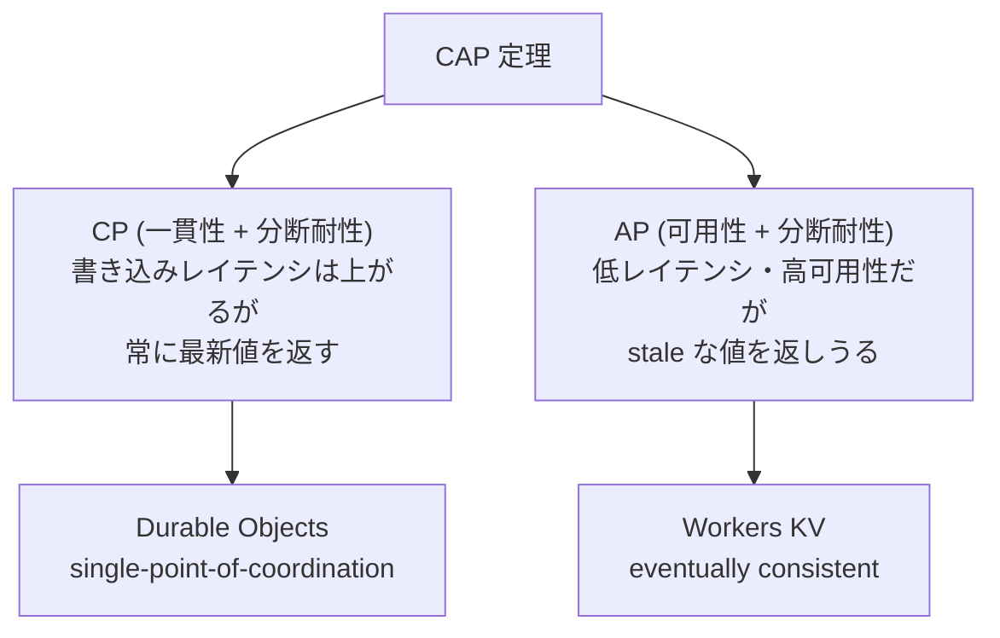
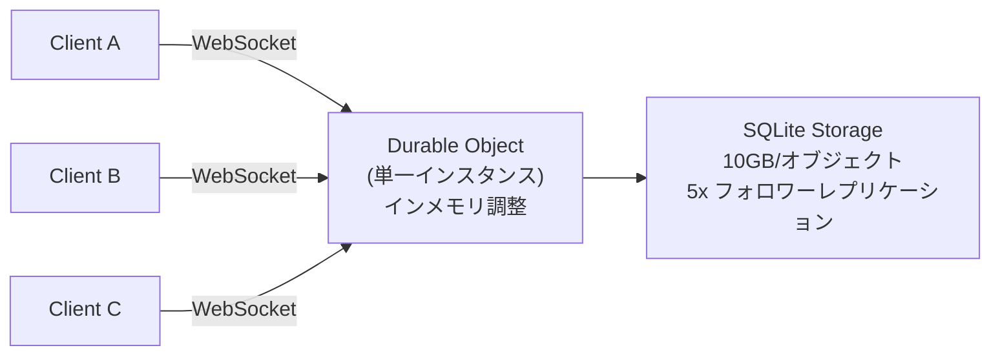
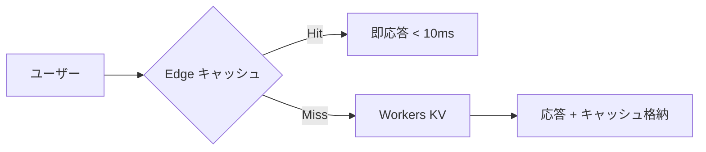
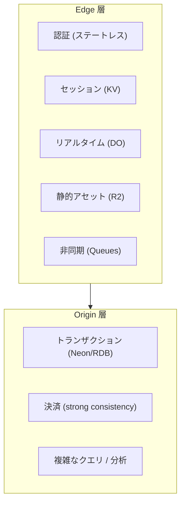
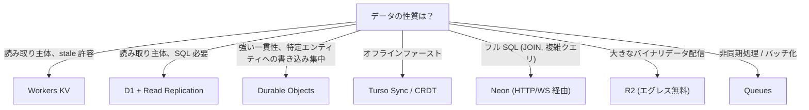

[[edge-computing|Edge Computing]] における最大の技術的課題: データの配置と一貫性。「データをユーザーに近づけるほどレイテンシは下がるが、一貫性の維持コストが上がる」というジレンマが全ての設計判断の根底にある。

## CAP 定理と Edge

Edge 環境はネットワーク分断が常態であるため P (分断耐性) は必須。設計上の選択肢は CP か AP の二択。

| | Strong Consistency (CP) | Eventual Consistency (AP) |
|---|---|---|
| 保証 | 常に最新値を返す | 時間経過で収束。stale な値を返しうる |
| レイテンシ | 高い (合意に時間) | 低い (ローカルレプリカから即応答) |
| 適用例 | 決済、排他ロック、在庫確認 | 設定情報、カウンター、CDN キャッシュ |

## KV ストア

### Workers KV

グローバル分散 KV ストア。読み取り特化 (global read, regional write)。3層キャッシュ構造。

| 項目 | 値 |
|---|---|
| 一貫性 | Eventually consistent (~60秒で伝播) |
| キーサイズ | 最大 512 bytes |
| 値サイズ | 最大 25 MiB |
| 同一キー書き込み | 1回/秒 |
| 名前空間 | アカウントあたり 1,000 |

料金 (Paid): 読み取り 10M/月含む ($0.50/M 超過)、書き込み 1M/月含む ($5.00/M 超過)、ストレージ 1GB 含む ($0.50/GB)。

ユースケース: 更新頻度が低い読み取り主体のデータ。設定情報、feature flags、i18n、URL リダイレクトマップ。

### Deno KV

FoundationDB 上に構築。デフォルトで strongly consistent (プライマリ内で linearizable)。ACID トランザクション対応。

| 項目 | 値 |
|---|---|
| 一貫性 | Strong (選択的に eventual も可) |
| キーサイズ | 最大 2 KiB |
| 値サイズ | 最大 64 KiB |
| トランザクション | ACID (strict serializability) |

### KV 比較

| 特性 | Workers KV | Deno KV | Fastly KV |
|---|---|---|---|
| 一貫性 | Eventual (~60秒) | Strong | Eventual |
| トランザクション | なし | ACID | なし |
| 値サイズ上限 | 25 MiB | 64 KiB | 25 MB |
| 強み | グローバル読み取り、大きな値 | 強一貫性、トランザクション | 大規模リスト |

## Durable Objects

Edge での最大の革新の一つ。「グローバルに一意なオブジェクト ID に対して、必ず単一のインスタンスが存在する」という保証で、分散合意プロトコル不要の強い一貫性を実現。

### アーキテクチャ

- ステートは論理単位 (チャットルーム、ドキュメント、カート) に分割
- インメモリで調整してから非同期で永続化 → ストレージ層に触れずにクライアント間を調整
- Cloudflare がデータセンターを自動選択、必要に応じて透過的にマイグレーション

### SQLite バックエンド (2025年4月 GA)

- 10 GB/オブジェクトの SQLite DB
- コミット時に5台のフォロワーに即転送、3台以上の応答で確認
- Point-in-Time Recovery: 過去30日の任意の時点に復元可能

### Hibernation API

WebSocket 接続を維持したまま DO をスリープ。スリープ中は duration 課金なし。メッセージ到着で自動ウェイクアップ。まばらなメッセージングで劇的なコスト削減。

### DO の本質

CRDT が「全ノードで独立に書き込み、後で収束」なら、DO は「全員が一箇所に集まることで競合を発生させない」。分散合意の複雑さを回避する single-point-of-coordination アプローチ。

### 料金

| 項目 | Paid (含む分) | 超過 |
|---|---|---|
| リクエスト | 100万/月 | $0.15/百万 |
| Duration | 400K GB-s/月 | $12.50/百万 GB-s |
| SQLite 読み取り | 250億行/月 | $0.001/百万 |
| SQLite 書き込み | 5,000万行/月 | $1.00/百万 |
| SQLite ストレージ | 5 GB | $0.20/GB-月 |

### 制限

- SQLite ストレージ: 10 GB/オブジェクト
- スループット: ~1,000 req/s のソフトリミット
- CPU 時間: 最大 5分/呼出
- WebSocket メッセージ: 32 MiB (受信)

## Edge Database

### Cloudflare D1

SQLite ベースの Edge DB。Durable Objects 上に構築。

Global Read Replication (2025年4月ベータ): 全リージョンに自動リードレプリカ。Session ベースの sequential consistency で "read-your-own-writes" を保証。追加料金なし。

| 項目 | Free | Paid |
|---|---|---|
| 読み取り | 500万行/日 | 250億行/月 ($0.001/M 超過) |
| 書き込み | 10万行/日 | 5,000万行/月 ($1.00/M 超過) |
| DB サイズ | 500 MB | 10 GB |
| DB 数 | 10 | 50,000 |

Time Travel: 過去 30日 (Paid) / 7日 (Free) の任意の時点に復元可能。

### Turso (libSQL)

SQLite フォーク。ローカルファースト設計。

- Embedded Replicas: ローカル SQLite がリモート DB と同期。読み取りは即座、書き込みは自動同期
- 2025年の転換: Edge Replicas 概念を廃止 → Turso Sync (真のローカルファースト、push/pull 操作) に移行
- オフライン完全対応
- マルチテナント SaaS (DB-per-tenant) に強い

### Neon (Serverless Postgres)

ストレージとコンピュートの分離。2025年5月に Databricks が約10億ドルで買収。

- Branching: Git のような O(1) DB ブランチ (CoW)。1秒未満で完了
- Autoscaling / Scale to Zero
- Edge 接続: HTTP/WS ベースの serverless ドライバー。PgBouncer 内蔵で最大 10,000 プール接続
- ストレージ価格: $0.35/GB-月 (2025年に $1.75 から引き下げ)

### Edge DB 比較

| 特性 | D1 | Turso | Neon |
|---|---|---|---|
| エンジン | SQLite | libSQL (SQLite fork) | PostgreSQL |
| Edge 読み取り | 自動 Read Replication | Embedded Replicas / Sync | HTTP/WS ドライバー (データは Edge にない) |
| 一貫性 | Sequential (Session) | Eventual (sync) | Strong (プライマリ) |
| ブランチング | なし | なし | あり (O(1) CoW) |
| 最大 DB サイズ | 10 GB | プラン依存 | 大容量対応 |
| SQL 機能 | SQLite SQL | SQLite SQL + 拡張 | 完全な PostgreSQL |
| 強み | CF エコシステム統合、無料 Read Replication | ローカルファースト、オフライン | フル Postgres、ブランチング |

## Cloudflare R2

S3 互換オブジェクトストレージ。エグレス完全無料。

| 比較 | S3 エグレス | R2 エグレス |
|---|---|---|
| 10TB/月 | ~$891 | $0 |

ストレージ $0.015/GB-月。Workers から直接アクセス (同一ネットワーク内で転送コストゼロ)。メディア配信、データレイク、マルチクラウドアーキテクチャに最適。

## Cloudflare Queues

Edge ネイティブなメッセージキュー。Workers と直接統合。

Producer (Worker) → Queue → Consumer (Worker) のパイプライン。料金: 100万 ops/月含む、超過 $0.40/M。

用途: 非同期処理の Edge 化、バースト吸収、オリジンへのバッチ書き込み、イベント駆動アーキテクチャ。

## CRDT (Conflict-free Replicated Data Types)

全レプリカが独立に書き込み可能で、アルゴリズム的に自動収束するデータ構造。中央コーディネーター不要。

| データ型 | 動作 | ユースケース |
|---|---|---|
| G-Counter | 各レプリカのカウントの max の和 | ビューカウント、いいね数 |
| PN-Counter | 増加用 + 減少用の G-Counter ペア | 在庫数、リソースプール |
| LWW-Register | タイムスタンプが大きい値が勝つ | プロファイル、設定値 |
| OR-Set | 要素にユニークタグ、同時追加は生存 | ショッピングカート、協調編集 |

DO vs CRDT: DO は「全員が一箇所に集まる」(single-point)。CRDT は「全員がバラバラに動いて後で合流する」(multi-writer)。

主要ライブラリ: Yjs (テキスト協調)、Automerge (JSON CRDT)、crdt-kit (Edge / リソース制約向け)。

採用事例: Figma (マルチプレイヤー)、Linear (オフライン同期)、Apple Notes (クロスデバイス)。

## Edge データの設計パターン

### Read-Heavy (KV + キャッシュ)

適用: 商品カタログ、ブログ、i18n、A/B テスト設定。

### Write-Heavy (Durable Objects)

全クライアントが同一 DO インスタンスに接続。インメモリで調整、非同期永続化。

適用: リアルタイムチャット、協調編集、ゲームセッション。

### Edge-Origin ハイブリッド

設計原則: 全てを Edge に移すのではなく、地理的分散の恩恵を受けるレイヤーを特定し、そのレイヤーが Origin から独立して動作できるよう構造化する。

### 選択フローチャート

## 押さえどころ（カード化候補）

- Edge データの根本的ジレンマ → データをユーザーに近づけるほどレイテンシは下がるが、一貫性の維持コストが上がる。CAP 定理により P 必須の Edge では CP (一貫性) か AP (可用性) の二択
- Workers KV の位置づけ → 読み取り特化の eventually consistent KV。書き込み後 ~60秒で全 Edge に伝播。設定情報、feature flags など更新頻度が低いデータに最適
- Durable Objects の本質 → グローバルに一意なオブジェクト ID に単一インスタンスを保証。分散合意プロトコル不要で強い一貫性。「全員が一箇所に集まることで競合を発生させない」アプローチ
- DO vs CRDT のアプローチの違い → DO: single-point-of-coordination (全員が一箇所に集まる)。CRDT: multi-writer (全員がバラバラに動いて後で合流)。DO は実装が単純だがレイテンシのトレードオフ、CRDT はオフライン対応だが実装が複雑
- DO の Hibernation API → WebSocket 接続を維持したまま DO をスリープ。duration 課金なし。メッセージ到着で自動ウェイクアップ。まばらなメッセージングで劇的コスト削減
- D1 の Read Replication → 全リージョンに自動リードレプリカ。Session ベース sequential consistency で read-your-own-writes を保証。追加料金なし
- R2 のエグレス無料の意味 → S3 互換でエグレス完全無料。10TB/月配信で S3 の $891 vs R2 の $0。メディア配信やマルチクラウドアーキテクチャのコスト構造を根本的に変える
- Edge DB の選択基準 → D1: CF エコシステム統合、SQLite、自動 Read Replication。Turso: ローカルファースト、オフライン対応。Neon: フル Postgres、ブランチング。データが Edge にあるのは D1 と Turso のみ
- CRDT の具体的データ型 → G-Counter (単調増加)、PN-Counter (増減可能)、LWW-Register (最新タイムスタンプ勝ち)、OR-Set (同時追加は生存)。各型にトレードオフあり
- Edge-Origin ハイブリッドの設計原則 → 全てを Edge に移すのではなく、地理的分散の恩恵を受けるレイヤーを特定。認証/セッション/リアルタイムは Edge、トランザクション/決済/複雑クエリは Origin
- Queues の Edge での意義 → 非同期処理の Edge 化、バースト吸収、オリジンへのバッチ書き込み。Edge と Origin の間の緩衝材
- Read-Heavy vs Write-Heavy パターン → Read-Heavy: KV + キャッシュ (< 10ms 応答)。Write-Heavy: DO (単一コーディネーター + インメモリ調整)。大半のアプリは読み取り主体なので KV から始めるべき
- Neon の Edge 接続 → データ自体は Edge にない。HTTP/WS ドライバーで serverless 接続。PgBouncer 内蔵で最大 10,000 プール接続。フル Postgres が必要な場合の選択肢
- Turso の方向転換 → Edge Replicas 廃止 → Turso Sync に移行。「真のローカルファースト」で読み書き可能、明示的 push/pull。オフライン完全対応。DB-per-tenant パターンに強い

## Links

- [Cloudflare Workers KV](https://developers.cloudflare.com/kv/)
- [Cloudflare Durable Objects](https://developers.cloudflare.com/durable-objects/)
- [Cloudflare D1](https://developers.cloudflare.com/d1/)
- [Cloudflare R2](https://developers.cloudflare.com/r2/)
- [Cloudflare Queues](https://developers.cloudflare.com/queues/)
- [Deno KV](https://deno.com/kv)
- [Turso](https://turso.tech/)
- [Neon](https://neon.tech/)

## 関連

- [[edge-computing]] — Edge データの全体的な文脈
- [[edge-platforms]] — 各プラットフォームのストレージエコシステム比較
- [[v8-isolates]] — Durable Objects が V8 Isolate 上で動作
