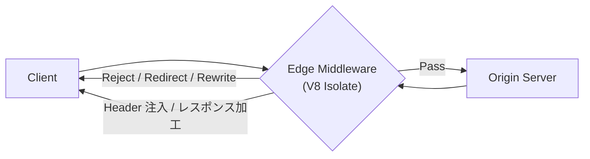
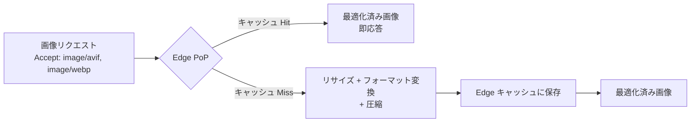
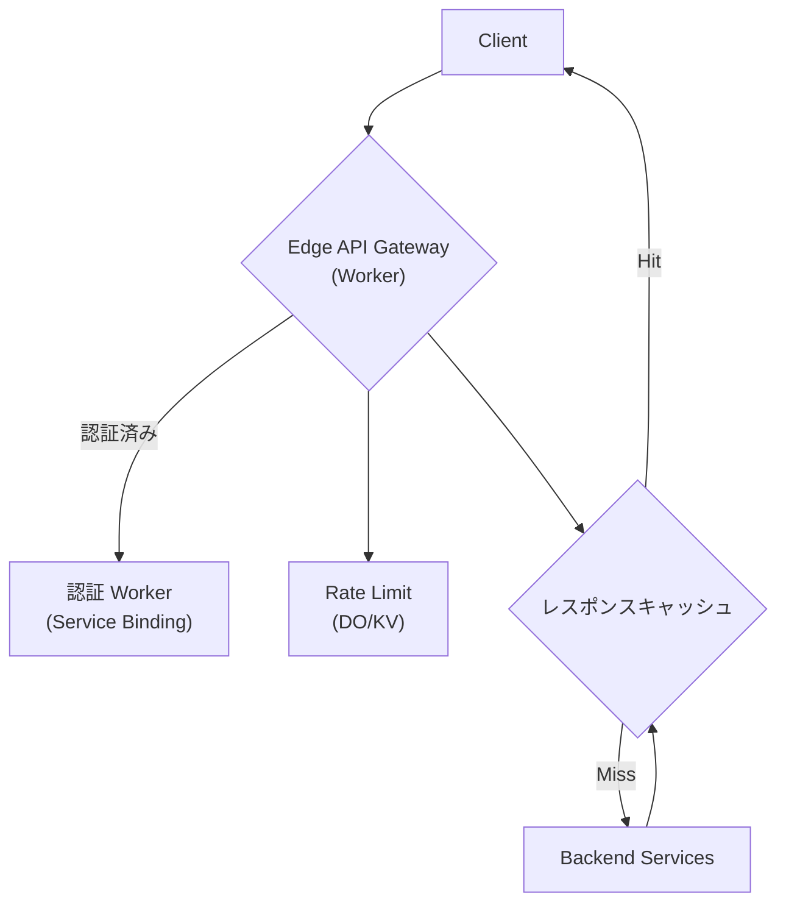
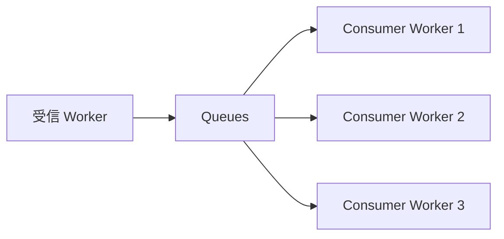
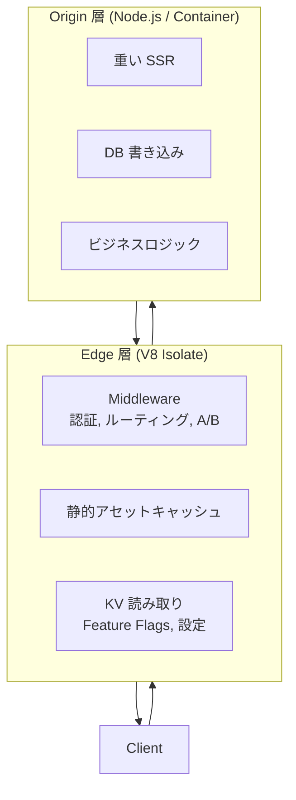
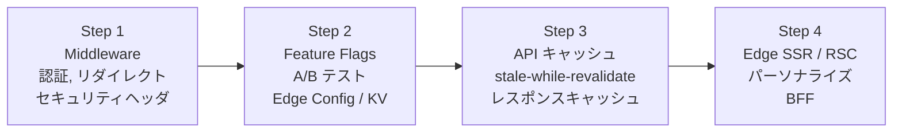

[[edge-computing|Edge Computing]] をWeb開発の実務でどう使うか。インフラ論ではなく「リクエストが到着してからレスポンスを返すまでに Edge で何をするか」の設計パターン集。

## 1. Edge Middleware パターン

### Edge Middleware とは

リクエストがオリジンに到達する**前**に、Edge PoP 上で実行される軽量な介入コード。リクエスト/レスポンスの検査・加工・ルーティング判断を行い、不要なリクエストをオリジンに流さない「門番」の役割を担う。



従来のオリジン側ミドルウェア (Express middleware 等) との決定的違い:
- 実行場所がユーザーに近い (10-50ms RTT vs 50-300ms)
- オリジンに到達する前にリクエストを弾ける → オリジン負荷削減
- V8 Isolate ベースで cold start <1ms

### Next.js Middleware

プロジェクトルートの `middleware.ts` に配置。Vercel Edge Functions 上でグローバル実行。

```typescript
// middleware.ts
import { NextResponse } from 'next/server'
import type { NextRequest } from 'next/server'

export function middleware(request: NextRequest) {
  // 1. 認証チェック
  const token = request.cookies.get('session')?.value
  if (!token && request.nextUrl.pathname.startsWith('/dashboard')) {
    return NextResponse.redirect(new URL('/login', request.url))
  }

  // 2. Rewrite (URL を内部的に書き換え、ブラウザの URL は変わらない)
  if (request.nextUrl.pathname === '/blog') {
    return NextResponse.rewrite(new URL('/blog/home', request.url))
  }

  // 3. ヘッダ注入
  const response = NextResponse.next()
  response.headers.set('X-Frame-Options', 'DENY')
  response.headers.set('X-Content-Type-Options', 'nosniff')
  return response
}

// matcher: Middleware を実行するパスを静的に定義
// 値は定数でなければならない (ビルド時に静的解析される)
export const config = {
  matcher: [
    '/dashboard/:path*',
    '/api/:path*',
    '/((?!_next/static|_next/image|favicon.ico).*)',
  ],
}
```

**matcher のベストプラクティス**: 可能な限り具体的に定義する。全パスで実行すると不要なオーバーヘッドが発生する。negative lookahead で静的アセットを除外するのが定石。

**CVE-2025-29927**: Next.js Middleware バイパス脆弱性。`x-middleware-subrequest` ヘッダを外部から注入することで Middleware を迂回できた。教訓: **Middleware を唯一の認証レイヤーにしてはならない**。Data Access Layer パターンで多層防御を実現すべき。

### Cloudflare Workers を Middleware として使う

Workers はスタンドアロンの Edge 実行環境だが、既存オリジンの前段に配置して Middleware として機能させるパターンが多い。

```typescript
export default {
  async fetch(request: Request, env: Env): Promise<Response> {
    const url = new URL(request.url)

    // 地理的ルーティング
    const country = request.cf?.country || 'US'
    if (country === 'JP') {
      url.hostname = 'api-tokyo.example.com'
    } else if (country === 'DE') {
      url.hostname = 'api-frankfurt.example.com'
    }

    // オリジンにプロキシ
    const response = await fetch(url.toString(), request)

    // セキュリティヘッダ注入
    const modifiedResponse = new Response(response.body, response)
    modifiedResponse.headers.set('Strict-Transport-Security', 'max-age=31536000')
    modifiedResponse.headers.set('X-Content-Type-Options', 'nosniff')
    return modifiedResponse
  }
}
```

### 認証 at the Edge

JWT 検証を Edge で実行し、不正なリクエストをオリジンに到達させない。Web Crypto API で署名検証が可能。

```typescript
async function verifyJWT(token: string, secret: CryptoKey): Promise<boolean> {
  const [headerB64, payloadB64, signatureB64] = token.split('.')
  const data = new TextEncoder().encode(`${headerB64}.${payloadB64}`)
  const signature = base64UrlDecode(signatureB64)
  return crypto.subtle.verify('HMAC', secret, signature, data)
}
```

Clerk の実装例: ハイブリッド JWT アプローチで認証を 1ms 未満で実行。セッション失効は1分以内にグローバル伝播。

**制約**: Edge での認証はステートレス検証 (JWT の署名検証、有効期限チェック) に限定すべき。セッション DB へのルックアップはレイテンシが発生するため、KV にキャッシュするか Edge Config を使う。

### Rate Limiting at the Edge

2つのアプローチ:

| 手法 | 一貫性 | 精度 | コスト |
|---|---|---|---|
| Workers KV + カウンター | Eventual (~60秒) | 近似的 | 低い |
| Durable Objects | Strong | 正確 | 高い |

KV 方式は PoP ごとにカウンターが分散するため厳密なレート制限は不可能だが、大半のユースケースには十分。厳密な制御が必要なら Durable Objects (API キーごとに1 DO インスタンス) を使う。

Cloudflare の Rate Limiting binding: スライディングウィンドウ方式の組み込みレート制限。Worker のコードに直接統合可能。

### Bot 検出 at the Edge

Cloudflare Bot Management: ML + 行動分析で Bot Score (1-99) を算出。Score < 30 は Bot の可能性が高い。

```typescript
export default {
  async fetch(request: Request): Promise<Response> {
    const botScore = request.cf?.botManagement?.score || 0
    if (botScore < 30) {
      return new Response('Blocked', { status: 403 })
    }
    // 正常なリクエストはオリジンへ
    return fetch(request)
  }
}
```

Detection IDs (`cf.bot_management.detection_ids`) で検出ロジックの種類を識別可能。WAF カスタムルール、Rate Limiting ルール、Workers で横断的にアクセス可能。

### 地理的ルーティング

`request.cf.country`, `request.cf.city`, `request.cf.region` 等で判定。

ユースケース: リージョナルオリジンへの振り分け、法規制対応 (GDPR 圏の PII 処理制限)、通貨・言語のデフォルト設定。

### A/B テスト at the Edge

Edge は A/B テストの「キラーアプリ」。クライアントサイドの A/B テストで発生するフリッカー (元のコンテンツが一瞬見えてから変わる) を完全に排除できる。

```typescript
export function middleware(request: NextRequest) {
  // 既存の Cookie があればそれを使う (セッション維持)
  const variant = request.cookies.get('ab-variant')?.value
    || (Math.random() < 0.5 ? 'A' : 'B')

  const response = NextResponse.rewrite(
    new URL(`/experiment/${variant}`, request.url)
  )
  // Cookie がなければ設定 (次回以降同じバリアントを表示)
  if (!request.cookies.has('ab-variant')) {
    response.cookies.set('ab-variant', variant, { maxAge: 60 * 60 * 24 * 30 })
  }
  return response
}
```

決定論的ハッシュ (ユーザー ID をキーに) で割り当てると、Cookie 不要でも一貫したバリアントを保証できる。

### Feature Flags at the Edge

Edge での Feature Flag 評価は、SDK がフラグ定義を Edge データストアから読み込み、ネットワーク往復なしで評価するモデル。

| プロバイダ | Edge ストア | 伝播速度 |
|---|---|---|
| LaunchDarkly + Cloudflare | Workers KV | ~60秒 |
| LaunchDarkly + Vercel | Edge Config | <300ms |
| Statsig + Vercel | Edge Config | <300ms |
| 自前実装 | Workers KV / D1 | ~60秒 |

LaunchDarkly の Cloudflare 統合: フラグデータを Workers KV に同期。Worker 内で評価する際にネットワーク往復不要。クライアントサイド ID (非秘密) を使用。

Vercel Flags SDK: `@flags-sdk/launchdarkly` アダプターで LaunchDarkly フラグを Edge Config 経由で同期読み出し。ネットワークホップゼロ。

**注意**: CDN キャッシュはフラグ更新の遅延を増幅する。頻繁に変更するフラグには Edge Config (<300ms 伝播) が適し、KV (最大60秒) は安定したフラグ向き。

### ヘッダ操作

セキュリティヘッダ注入はオリジンの責務から Edge に移すべき最も手軽で効果的なパターン。

```typescript
const SECURITY_HEADERS = {
  'Strict-Transport-Security': 'max-age=31536000; includeSubDomains',
  'X-Content-Type-Options': 'nosniff',
  'X-Frame-Options': 'DENY',
  'Referrer-Policy': 'strict-origin-when-cross-origin',
  'Permissions-Policy': 'camera=(), microphone=(), geolocation=()',
}

// CORS ヘッダも Edge で統一管理
const CORS_HEADERS = {
  'Access-Control-Allow-Origin': 'https://example.com',
  'Access-Control-Allow-Methods': 'GET, POST, OPTIONS',
  'Access-Control-Allow-Headers': 'Content-Type, Authorization',
}
```

## 2. Edge-Side Rendering (ESR) / Edge SSR

### Origin SSR vs Edge SSR

| 特性 | Origin SSR | Edge SSR |
|---|---|---|
| 実行場所 | 中央データセンター (1-3箇所) | CDN PoP (300+ 箇所) |
| TTFB | 50-300ms (地理距離に依存) | 10-50ms (ユーザーに近い) |
| Cold start | 数百ms-数秒 (コンテナ/Lambda) | <1ms (V8 Isolate) |
| Node.js API | フルアクセス | 制限あり (Edge Runtime) |
| データアクセス | DB 直接接続 | HTTP/WS 経由、KV/D1 |
| CPU 制限 | 緩い | 厳格 (10-50ms CPU 時間) |

Edge SSR のメリットは「全世界のユーザーに対して均一に低い TTFB を提供」すること。Origin SSR ではオリジンに近いユーザーのみ高速だが、Edge SSR は地理的不公平を解消する。

### Streaming SSR at the Edge

React 18 の `renderToReadableStream` (Web Streams API) が Edge Runtime で使用可能。

```typescript
// Edge Runtime で Streaming SSR
export const runtime = 'edge'

export default async function handler(req: Request) {
  const stream = await renderToReadableStream(<App />, {
    bootstrapScripts: ['/client.js'],
  })
  return new Response(stream, {
    headers: { 'Content-Type': 'text/html' },
  })
}
```

Node.js の `renderToPipeableStream` に対し、Edge では Web Streams ベースの `renderToReadableStream` を使う。

Streaming のメリット: ページ全体の描画を待たず、準備できた部分から HTML をストリーミング送信。Suspense 境界で段階的にコンテンツを表示。TTFB と FCP を劇的に改善。

### ISR の Edge バリアント

ISR (Incremental Static Regeneration) は stale-while-revalidate パターンの SSG 版。Edge Runtime と ISR は現時点で**直接的な互換性がない**。

代替パターン: `Cache-Control` ヘッダを手動設定。

```
Cache-Control: public, s-maxage=60, stale-while-revalidate=3600
```

- Edge キャッシュから即座にレスポンス (stale でも)
- バックグラウンドでオリジンに再検証リクエスト
- ユーザーは再検証の遅延を感じない
- ブログ、商品カタログ等の頻繁に変わらないコンテンツに最適

Next.js 15.2 の ISR + `revalidate` は Vercel CDN 上で stale-while-revalidate を実現。Edge Runtime の再生成オーバーヘッドを 70% 削減。

### React Server Components と Edge

RSC は Edge SSR との親和性が高い。

- サーバー専用コードが Edge PoP で実行 → クライアントへの JS バンドルサイズ削減
- API キー等のシークレットがクライアントに露出しない
- 出力は HTML ストリームとして Edge からクライアントに直接送信

```typescript
// app/page.tsx — Edge で RSC を実行
export const runtime = 'edge'

export default async function Page() {
  // Edge PoP 上でデータ取得
  const data = await fetch('https://api.example.com/products', {
    next: { revalidate: 60 },
  })
  const products = await data.json()
  return <ProductList products={products} />
}
```

**制約**: RSC が Edge で呼び出す外部 API が地理的に遠い場合、Edge 化のメリットが薄れる。データソースの位置と Edge の位置関係を意識する必要がある (Data Gravity)。

### Next.js Edge Runtime

`export const runtime = 'edge'` で Page / Route Handler を Edge Runtime に切り替え。

| | Node.js Runtime | Edge Runtime |
|---|---|---|
| API | フル Node.js | Web API サブセット |
| ファイル I/O | あり | なし |
| DB 接続 | TCP 直接 | HTTP/WS 経由 |
| npm パッケージ | ほぼ全て | Node.js 依存パッケージは不可 |
| バンドルサイズ | 制限緩い | 厳格 (数 MB) |
| Cold start | 数百ms | <1ms |

### フレームワーク Edge 対応状況 (2026)

| フレームワーク | Edge SSR | Edge Middleware | Edge API | 備考 |
|---|---|---|---|---|
| Next.js | `runtime = 'edge'` | `middleware.ts` | Route Handler | 最も成熟。Vercel 統合 |
| SvelteKit | Netlify Edge Adapter | - | - | `edge: true` オプション。Deno Deploy 対応 |
| Nuxt | Nitro + Edge preset | - | Edge API routes | Cloudflare Workers, Deno Deploy |
| Remix | Cloudflare Workers adapter | - | Loader/Action | Workers 上でフル SSR |
| Astro | Cloudflare adapter | - | Edge endpoints | ハイブリッド (静的 + 動的) |

SvelteKit の特徴: 「ビルド一回、どこでもデプロイ」。Node, Serverless, Edge, 静的のいずれにもコード変更なしで対応。

## 3. Edge でのパーソナライズ

### パーソナライズとキャッシュのジレンマ

パーソナライズされたコンテンツは本質的にキャッシュ不可能 (ユーザーごとに異なる)。しかし Edge の価値はキャッシュによる高速化。この矛盾の解決パターンが3つある。

### パターン 1: Edge Side Includes (ESI)

ページの静的部分をキャッシュし、動的部分だけを別リクエストで取得して Edge で合成。

```html
<!-- キャッシュ可能なページ -->
<header>共通ナビゲーション</header>
<main>商品一覧 (全ユーザー共通)</main>
<!-- 動的部分: Edge が別途取得して注入 -->
<esi:include src="/api/recommendations?user=123" />
<footer>共通フッター</footer>
```

ESI (Edge Side Includes) は Akamai が 2001年に提案した W3C Note。現在は Akamai, Fastly (VCL), Cloudflare (Workers で手動実装) がサポート。

Edge Side Rendering (ESR) として、CDN の Edge Computing 機能で静的コンテンツと動的コンテンツをストリーミングモードで段階的に返す進化形もある。

### パターン 2: HTML Streaming + Suspense

React の Streaming SSR で、パーソナライズ部分を Suspense 境界内に配置。共通部分を先にストリーミングし、パーソナライズ部分は準備でき次第注入。

```tsx
export default function Page() {
  return (
    <html>
      <body>
        {/* 即座にストリーミング (キャッシュ可能) */}
        <Header />
        <ProductGrid />
        {/* パーソナライズ部分: 準備でき次第注入 */}
        <Suspense fallback={<Skeleton />}>
          <PersonalizedRecommendations />
        </Suspense>
      </body>
    </html>
  )
}
```

### パターン 3: Edge Middleware での動的ルーティング

事前に複数の静的バリアントを生成し、Edge Middleware でユーザーコンテキストに基づいて適切なバリアントにルーティング。「動的を静的の速度で」。

```typescript
export function middleware(request: NextRequest) {
  const country = request.geo?.country || 'US'
  const variant = request.cookies.get('pricing-tier')?.value || 'standard'

  // 事前生成済みの静的ページにリライト
  return NextResponse.rewrite(
    new URL(`/pages/${country}/${variant}`, request.url)
  )
}
```

### Geo ベースのパーソナライズ

| コンテキスト | データソース | ユースケース |
|---|---|---|
| 国/地域 | `request.cf.country` | 通貨、法規制対応、コンテンツ制限 |
| 都市 | `request.cf.city` | 配送オプション、店舗検索 |
| タイムゾーン | `request.cf.timezone` | 時刻表示、営業時間 |
| 言語 | `Accept-Language` ヘッダ | i18n |
| デバイス | `User-Agent` / Client Hints | レスポンシブ画像、モバイル最適化 |

HashiCorp の事例: Edge Middleware で地理情報を使い、ローカライズされたコンテンツ・通貨・言語を即座に提供。外部サービス不要。

## 4. Edge での画像最適化

### Edge 画像最適化パイプライン



### Cloudflare Image Resizing

URL パラメータまたは Workers から変換指示。`format=auto` で Accept ヘッダに基づき最適フォーマットを自動選択。

```
/cdn-cgi/image/width=800,quality=80,format=auto/images/photo.jpg
```

| フォーマット | 圧縮率 (vs JPEG) | ブラウザサポート | エンコード速度 |
|---|---|---|---|
| WebP | 25-35% 小さい | 97%+ | 高速 |
| AVIF | 50%+ 小さい | 93%+ | 低速 (10x) |

AVIF はエンコードが非常に遅いため、Cloudflare ではエンコードが時間内に完了しない場合 WebP にフォールバックする。

### Cloudinary / Imgix

Imgix, Cloudinary は専用の Edge CDN で画像変換を実行。URL ベースの変換 API を提供。

```
// Imgix
https://example.imgix.net/photo.jpg?w=800&auto=format,compress

// Cloudinary
https://res.cloudinary.com/demo/image/upload/w_800,f_auto,q_auto/photo.jpg
```

Workers AI との統合: AI 生成画像をストレージ前またはデリバリー時に Edge で最適化するパイプラインも構築可能。

## 5. Edge での API Gateway パターン

### Edge API Gateway の構造



### リクエストルーティング

```typescript
export default {
  async fetch(request: Request, env: Env): Promise<Response> {
    const url = new URL(request.url)

    // パスベースルーティング
    if (url.pathname.startsWith('/api/users')) {
      return env.USERS_SERVICE.fetch(request) // Service Binding
    }
    if (url.pathname.startsWith('/api/products')) {
      return env.PRODUCTS_SERVICE.fetch(request) // Service Binding
    }

    return new Response('Not Found', { status: 404 })
  }
}
```

Service Binding による Worker-to-Worker 呼び出しは、パブリックインターネットを経由せず、ネットワークホップ・認証オーバーヘッドがゼロ。

### 認証/認可のオフロード

Edge Gateway で JWT 検証を完了し、認証済みのリクエストだけをバックエンドに転送。バックエンドは認証ロジックを持つ必要がなくなる。

### レスポンスキャッシュ

```typescript
const cacheKey = new Request(request.url, { method: 'GET' })
const cache = caches.default

let response = await cache.match(cacheKey)
if (!response) {
  response = await fetch(request)
  response = new Response(response.body, response)
  response.headers.set('Cache-Control', 's-maxage=60')
  await cache.put(cacheKey, response.clone())
}
return response
```

### BFF (Backend for Frontend) at the Edge

従来の BFF はリージョナルサーバー上に配置していたが、Edge に配置することで:
- フロントエンドに特化したデータ集約をユーザーに近い場所で実行
- 複数のバックエンド API を呼び出し、フロントエンドに最適な形に変換
- API キーをクライアントから隠蔽

```typescript
// Edge BFF: モバイル用に複数 API をまとめる
export default {
  async fetch(request: Request, env: Env): Promise<Response> {
    const [user, products, notifications] = await Promise.all([
      env.USER_SERVICE.getUser(userId),
      env.PRODUCT_SERVICE.getRecommendations(userId),
      env.NOTIFICATION_SERVICE.getUnread(userId),
    ])

    // モバイルに最適化されたレスポンス
    return Response.json({
      user: { name: user.name, avatar: user.avatar },
      recommendations: products.slice(0, 5),
      unreadCount: notifications.length,
    })
  }
}
```

**注意**: BFF がバックエンドを呼び出す際、バックエンドが地理的に遠い場合は Edge 化のメリットが薄れる。Edge → Origin のレイテンシを考慮し、データが Edge にキャッシュ可能かどうかが判断基準。

## 6. Edge Worker のアーキテクチャパターン

### ファンアウト / ファンイン



Queues で1つのイベントから複数の Consumer を起動するファンアウト。at-least-once delivery、設定可能なリトライ。

ファンインは Service Binding で複数の Worker の結果を1つの Worker で集約:

```typescript
// 集約 Worker
export default {
  async fetch(request: Request, env: Env): Promise<Response> {
    const [a, b, c] = await Promise.all([
      env.SERVICE_A.getData(),
      env.SERVICE_B.getData(),
      env.SERVICE_C.getData(),
    ])
    return Response.json({ a, b, c })
  }
}
```

### Service Binding (Worker-to-Worker)

ゼロコスト、ゼロネットワークホップの Worker 間通信。型安全な RPC。

```typescript
// Worker A が Worker B を呼び出す
const result = await env.AUTH_SERVICE.verifyToken(token)
```

本質: 各 Worker を独立したマイクロサービスとしてデプロイしつつ、モノリスに匹敵するパフォーマンス特性を維持する。認証、ロギング、Rate Limiting、Feature Flags を個別 Worker に分離し、Service Binding で接続するパターンが推奨。

### Queues vs Workflows

| | Queues | Workflows |
|---|---|---|
| 用途 | 単一ステップ、デカップリング | 多段処理、条件分岐 |
| 実行時間 | 短い | 数時間〜数週間 |
| リトライ | ジョブ全体 | ステップ単位 |
| 一時停止/再開 | 不可 | 可能 |

組み合わせパターン: 高スループットのエントリポイントで Queues に投入し、各メッセージから Workflow インスタンスを起動。

### Edge + Origin ハイブリッドレンダリング



原則: **読み取り/軽量処理は Edge、書き込み/重い処理は Origin**。Edge はオリジンの「スマートなフロントドア」であり、オリジンの代替ではない。

## 7. アンチパターン

### Edge に持っていくべきでないもの

| アンチパターン | 理由 |
|---|---|
| 強い一貫性が必要なデータ書き込み | ACID トランザクション、在庫管理、決済処理は Edge では不可能。Origin DB に任せる |
| 重い計算処理 | CPU 時間制限 (10-50ms) を超えるとリクエストが 503 で切断される |
| 大きな依存パッケージ | PDF 生成、重い画像処理ライブラリはバンドルサイズ制限に抵触 |
| 外部 API への多段呼び出し | Edge → 遠い API × 複数回 = レイテンシ悪化。Data Gravity の法則に反する |
| 秘密情報を含むビジネスロジック | Edge は分散実行されるため、セキュリティ表面が広い |

### Chatty Edge アンチパターン

**最も多い設計ミス**。Edge にロジックを配置しながら、地理的に遠い DB に繰り返しクエリを発行するパターン。Edge 化のレイテンシ削減効果が相殺され、むしろ悪化する。

```
// アンチパターン: Edge Worker が遠い DB に5回クエリ
Edge (Tokyo) → DB (Virginia) × 5 = 5 × 200ms = 1,000ms

// 正しい: Origin (Virginia) が DB に5回クエリ
Client → Origin (Virginia) → DB (Virginia) × 5 = 200ms + 5 × 2ms = 210ms
```

**解決策**: データが Edge に移動できないなら、コードも移動すべきではない。読み取りレプリカや KV キャッシュで Edge にデータを近づけるか、処理自体を Origin に残す。

### 過度な Edge 化

全てを Edge に移行しようとする「Edge maximalism」は失敗する。

- **単一地域のユーザー基盤**: ユーザーが1つの地域に集中しているなら、200+ PoP は不要。リージョナルサーバーで十分
- **Forrester の調査 (2025)**: Edge プロジェクトの 60% がセキュリティ、スケーラビリティ、統合の計画不足で失敗
- **Edge を Hard dependency にする**: Edge 機能が停止した場合のフォールバックを設計していないと、クリティカルな障害に

### Worker 固有のアンチパターン

| アンチパターン | 正しいパターン |
|---|---|
| `passThroughOnException()` でエラーをオリジンに流す | 明示的 try-catch + 構造化エラーレスポンス |
| モジュールレベルの可変状態 (`let currentUser`) | リクエストスコープで状態を渡す。Isolate はリクエスト間で再利用される |
| 浮遊 Promise (await/return しない) | 全 Promise を `await`, `return`, `ctx.waitUntil()` で処理 |
| REST API で他のバインディングにアクセス | 直接バインディングを使う (ネットワークホップ・認証不要) |
| DB に直接 TCP 接続 | Hyperdrive 経由で接続プール。直接接続は 300-500ms のオーバーヘッド |

## 8. ユースケース / 事例

### Vercel Edge Middleware 事例

| 企業 | パターン | 効果 |
|---|---|---|
| SumUp | パーソナライズ + A/B テスト | フリッカーなしの実験。バリアントを即座に表示 |
| HashiCorp | Geo ベースのローカライゼーション | 外部サービスなしで言語・通貨を自動切替 |
| Super (Notion→Web) | マルチテナント URL リライト | 複数サイトを1つのコードベースで Lighthouse スコア高水準維持 |
| Clerk | 認証 | 1ms 未満の JWT 検証。フリッカーなしの認証体験 |

### パフォーマンス実測値

| 指標 | 値 | ソース |
|---|---|---|
| TTFB 削減 | 60-80% (グローバルユーザー) | 複数ソース |
| Edge Runtime cold start | <1ms (V8 Isolate) vs 数百ms (コンテナ) | Cloudflare / Vercel |
| Vercel Edge TTFB 平均 | ~70ms | Vercel |
| Edge cold start vs Serverless | 最大 9x 高速 | Vercel |
| Backend コスト削減 | 40-60% (API キャッシュ) | 複数事例 |
| Edge Function 採用増 | 287% YoY (2025) | 業界調査 |

### Edge 配置の判断フレームワーク

3つの質問で判断:

1. **ユーザーは地理的に分散しているか?** → 分散していなければ Edge の恩恵は限定的
2. **ロジックは Edge Runtime の制約内で実行できるか?** → CPU 10-50ms、Node.js API 制限、バンドルサイズ制限
3. **Edge 化で合計レイテンシは実際に下がるか?** → ボトルネックが移動するだけではないか (Data Gravity)

### 推奨導入順序



低リスク・高リターンの Middleware から始め、段階的に Edge 化の範囲を広げる。

## 押さえどころ（カード化候補）

- Edge Middleware の本質 → リクエストがオリジンに到達する前に Edge PoP で実行される軽量な介入コード。不要なリクエストをオリジンに流さない「門番」。V8 Isolate ベースで cold start <1ms
- Next.js Middleware の仕組み → プロジェクトルートの middleware.ts。matcher で対象パスを静的定義。NextResponse で rewrite/redirect/header 操作。Edge Runtime で実行
- CVE-2025-29927 の教訓 → Middleware バイパス脆弱性。Middleware を唯一の認証レイヤーにしてはならない。Data Access Layer で多層防御が必須
- Edge での認証パターン → Web Crypto API で JWT 署名検証。ステートレス検証に限定すべき。セッション DB ルックアップは KV キャッシュ経由で
- A/B テストが Edge のキラーアプリな理由 → クライアントサイドのフリッカー (元のコンテンツが一瞬見えてから変わる) を完全排除。Cookie ベースの決定論的割り当てでセッション一貫性を保証
- Edge Feature Flags のアーキテクチャ → SDK がフラグ定義を Edge データストア (KV/Edge Config) から読み込み、ネットワーク往復なしで評価。LaunchDarkly は Workers KV に同期、Vercel は Edge Config (<300ms 伝播)
- Origin SSR vs Edge SSR → Origin: 中央 DC で実行、TTFB 50-300ms、フル Node.js API。Edge: 300+ PoP で実行、TTFB 10-50ms、API 制限あり。Edge SSR は地理的不公平を解消
- Streaming SSR at the Edge → React 18 の renderToReadableStream (Web Streams API)。Suspense 境界で段階的にコンテンツをストリーミング。TTFB と FCP を劇的改善
- ISR と Edge の関係 → Edge Runtime と ISR は直接互換性なし。代替は Cache-Control: stale-while-revalidate の手動設定。Next.js 15.2 は Vercel CDN 上で stale-while-revalidate を実現
- パーソナライズとキャッシュのジレンマ → パーソナライズは本質的にキャッシュ不可能。解決策: ESI (部分的キャッシュ)、HTML Streaming + Suspense (段階的注入)、Edge Middleware での静的バリアントルーティング
- Chatty Edge アンチパターン → Edge にロジックを配置しながら遠い DB に繰り返しクエリ。Edge 化のメリットが相殺され悪化。データが移動できないならコードも移動すべきでない
- Service Binding の本質 → Worker 間のゼロコスト・ゼロネットワークホップ通信。各 Worker をマイクロサービスとして独立デプロイしつつモノリス同等のパフォーマンス
- Edge + Origin ハイブリッドの原則 → 読み取り/軽量処理は Edge、書き込み/重い処理は Origin。Edge はオリジンの「スマートなフロントドア」であり代替ではない
- Edge 画像最適化 → format=auto で Accept ヘッダに基づき WebP/AVIF を自動選択。AVIF は JPEG 比 50%+ 小さいがエンコード 10x 遅く、タイムアウト時は WebP にフォールバック
- BFF at the Edge → 複数バックエンド API を Edge で集約しフロントエンドに最適化。API キーをクライアントから隠蔽。ただしバックエンドが遠い場合は Data Gravity に反する
- Edge 化の3つの判断質問 → (1) ユーザーは地理的に分散しているか (2) Edge Runtime の制約内で実行できるか (3) 合計レイテンシは実際に下がるか
- Edge 導入の推奨順序 → Middleware (認証, リダイレクト) → Feature Flags / A/B → API キャッシュ → Edge SSR / RSC。低リスク高リターンから段階的に
- Worker のアンチパターン → passThroughOnException() でエラー隠蔽、モジュールレベル可変状態 (Isolate 再利用で漏洩)、浮遊 Promise、REST 経由のバインディングアクセス
- Edge での Rate Limiting → KV (eventual, 近似的, 低コスト) vs Durable Objects (strong, 正確, 高コスト)。大半は KV で十分、厳密なら DO を API キーごとに1インスタンス
- Edge での Bot 検出 → Cloudflare Bot Management: ML + 行動分析で Bot Score 1-99。Score < 30 は Bot。WAF, Rate Limiting, Workers で横断的に利用可能
- Queues vs Workflows → Queues: 単一ステップ、ファンアウト、バッファリング。Workflows: 多段処理、条件分岐、数時間〜数週間、ステップ単位リトライ。組み合わせが最強
- Edge プロジェクトの失敗要因 → Forrester 2025: 60% が失敗。セキュリティ・スケーラビリティ・統合の計画不足。Edge maximalism (全てを Edge に移行しようとする)
- Data Gravity の法則 → ロジックの配置はデータの位置で決まる。コードをデータから引き離すとレイテンシが発生。データが Edge に来られないならコードも Origin に留まるべき
- TTFB 60-80% 削減 → Edge 化による実測値。Vercel Edge 平均 TTFB ~70ms。Cold start は V8 Isolate で Serverless 比 最大 9x 高速
- Next.js Edge Runtime の制約 → Web API サブセットのみ。ファイル I/O 不可、TCP 直接接続不可、Node.js 依存パッケージ不可。代わりに HTTP/WS 経由で DB 接続、Hyperdrive で接続プール
- ESI (Edge Side Includes) → 2001年 Akamai 提案。ページの静的部分をキャッシュし動的部分だけ別リクエスト。パーソナライズとキャッシュの両立。ESR (Edge Side Rendering) として進化中
- フレームワーク Edge 対応状況 (2026) → Next.js が最も成熟。SvelteKit は「ビルド一回、どこでもデプロイ」。Nuxt は Nitro + Edge preset。Remix は Workers 上でフル SSR。Astro はハイブリッド

## Links

- [Next.js Middleware](https://nextjs.org/docs/app/building-your-application/routing/middleware)
- [Next.js Edge Runtime](https://nextjs.org/docs/app/api-reference/edge)
- [Cloudflare Workers Best Practices](https://developers.cloudflare.com/workers/best-practices/workers-best-practices/)
- [Cloudflare Image Resizing](https://developers.cloudflare.com/images/)
- [Vercel Edge Middleware](https://vercel.com/resources/edge-middleware-experiments-personalization-performance)
- [LaunchDarkly Cloudflare SDK](https://launchdarkly.com/docs/sdk/edge/cloudflare)
- [LaunchDarkly Vercel SDK](https://launchdarkly.com/docs/sdk/edge/vercel)
- [Vercel Edge Middleware Templates](https://vercel.com/templates/edge-middleware)
- [Cloudflare Bot Management](https://www.cloudflare.com/products/bot-management/)
- [Edge vs Origin: Where Should Your Code Live (2026)](https://dailydevpost.com/blog/edge-vs-origin-business-logic-cdn)
- [Edge Computing 2026: Web Performance Architecture](https://www.digitalapplied.com/blog/edge-computing-2026-web-performance-architecture)

## 関連

- [[edge-computing]] -- Edge Computing の基礎概念・歴史・市場規模
- [[edge-data]] -- Edge データストアの詳細 (KV, DO, D1, R2, Queues, CRDT)
- [[edge-platforms]] -- プラットフォーム比較 (Cloudflare, Fastly, Vercel, Deno)
- [[v8-isolates]] -- Edge の実行基盤である V8 Isolates の詳細
- [[anycast-cdn]] -- Edge のネットワーク基盤
- [[wasm-at-the-edge]] -- WASM を使った Edge 実行モデル
- [[distributed-consistency]] -- CAP 定理、CRDT、一貫性モデル
