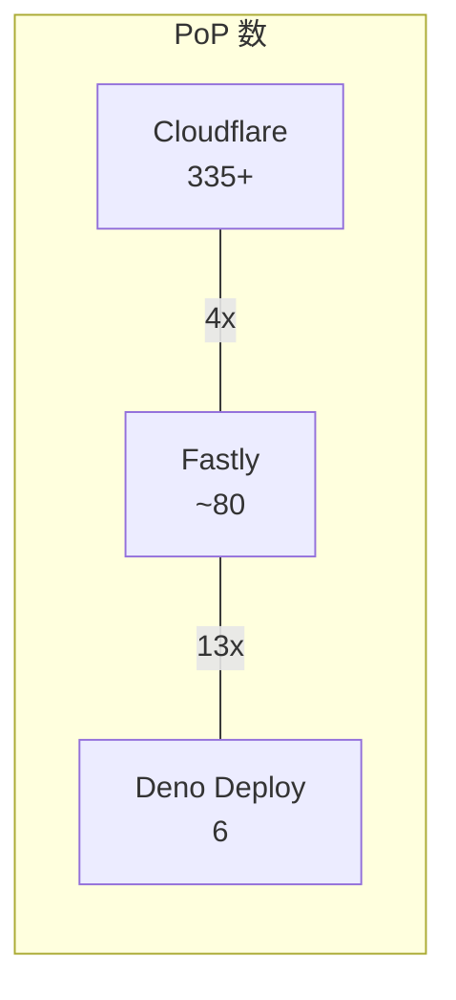

CDN Edge の主要3プラットフォーム — Cloudflare Workers、Deno Deploy、Fastly Compute — を比較する。それぞれ [[v8-isolates|V8 Isolates]]、V8 Isolates、[[wasm-at-the-edge|WASM]] と異なる実行モデルを採用している。

## 全体比較

| 項目 | Cloudflare Workers | Deno Deploy | Fastly Compute |
|---|---|---|---|
| 実行モデル | V8 Isolates (workerd) | V8 Isolates (Deno 2.0) | WASM (Wasmtime) |
| Cold Start | ~0ms (sub-ms) | ~0ms (sub-ms) | <1ms (WASM インスタンス化) |
| PoP 数 | 335+ | 6 リージョン | ~80 |
| 言語 | JS/TS + WASM (Rust, Python 等) | JS/TS (Deno ネイティブ) | Rust, Go, JS (WASM 経由) |
| 基本料金 | $5/月 | $20/月 (Pro) | 従量制 ($50 トライアル) |
| メモリ | 128MB/Isolate | 512MB/アプリ | 128MB/実行 |
| CPU 時間 | 最大 5分/リクエスト | 40h/月 (Pro) | 50ms/リクエスト |
| ストレージ | KV, D1, R2, DO, Queues, Vectorize | Deno KV | KV Store, Object Store |
| ロックインリスク | 中〜高 | 低〜中 | 低 |

## Cloudflare Workers

2017年ベータ開始。335+ PoP で世界人口の 95% を 50ms 圏内にカバーする最大規模の Edge プラットフォーム。

### エコシステム

他プラットフォームを圧倒する統合ストレージ/サービス群:

| サービス | 用途 |
|---|---|
| KV | グローバル分散 KV ストア。高速読み取り特化 (eventual consistency) |
| D1 | サーバーレス SQLite。月 25B 行読み取り含む |
| R2 | S3 互換オブジェクトストレージ。エグレス料金無料 |
| Durable Objects | ステートフル協調。SQLite バックエンド GA。WebSocket 対応 |
| Queues | 非同期メッセージキュー |
| Vectorize | グローバル分散ベクトル DB |
| Hyperdrive | 既存 Postgres/MySQL への接続アクセラレータ |
| Workers AI | Edge AI 推論。GPU 強化中 |

### 料金

| 項目 | Free | Standard ($5/月) |
|---|---|---|
| リクエスト | 100K/日 | 10M/月 (超過: $0.30/M) |
| CPU 時間 | 10ms/呼出 | 30M ms/月、最大 5分/呼出 |
| Workers 数 | 100 | 500 |

### 得意なワークロード

- グローバル低レイテンシ API/ミドルウェア (335+ PoP)
- フルスタック Edge アプリ (D1 + R2 + DO + Pages)
- AI アプリケーション (Workers AI + Vectorize + Hyperdrive)
- リアルタイム協調 (Durable Objects + WebSocket)
- コスト効率 ($5/月で広範な機能)

### 制約

- メモリ 128MB/Isolate
- 独自バインディングへの依存が深まるとロックインリスク
- Rust/Go は WASM 経由で開発体験が JS/TS に劣る

## Deno Deploy

TypeScript ファーストの設計思想。Web 標準 API への忠実さが最大の差別化。

### エコシステム

| サービス | 用途 |
|---|---|
| Deno KV | グローバル分散 KV (FoundationDB/SQLite ベース) |
| Fresh | Islands Architecture の Web フレームワーク |
| JSR | TypeScript ファースト ESM パッケージレジストリ |
| Subhosting | BaaS。他者の JS コードをサンドボックス実行 (Netlify Edge Functions が利用) |

### 料金

| 項目 | Free | Pro ($20/月) |
|---|---|---|
| リクエスト | 1M/月 | 5M/月 (超過: $2/M) |
| 帯域幅 | 20GB | 200GB |
| CPU 時間 | 15h/月 | 40h/月 |

大量リクエストでは割高。100M リクエスト/月で ~$210 (Cloudflare は ~$32)。

### 得意なワークロード

- TypeScript ネイティブ開発 (ゼロコンフィグ)
- Web 標準ベースのポータブルなコード
- Subhosting によるマルチテナント SaaS 基盤
- シンプルな API サーバー/BFF

### 制約

- 6 リージョンに縮小 (以前は 35)。APAC カバレッジが脆弱
- ストレージが KV のみ (SQL DB, オブジェクトストレージなし)
- Deno Deploy Classic は 2026年7月20日にシャットダウン
- Node.js 互換は ~98% だが完全ではない

## Fastly Compute

WASM-native の Edge プラットフォーム。Wasmtime ベースで per-request isolation。

### エコシステム

| サービス | 用途 |
|---|---|
| KV Store | Edge KV ストア |
| Object Store | ラージオブジェクトストレージ |
| Config Store | 動的構成管理 |
| Secret Store | シークレット管理 |

### 料金

| 項目 | Free Tier | 有料 |
|---|---|---|
| リクエスト | 10M/月 | $0.50/M (ボリュームディスカウントあり) |
| vCPU | 100M ms/月 | $0.05/M ms |
| 20ms 以下のリクエスト | vCPU 料金なし | vCPU 料金なし |

20ms 以下の軽量リクエストは vCPU 無料 → 超軽量処理が極めてコスト効率的。

### 得意なワークロード

- CDN/キャッシュカスタマイズ (元々 CDN プラットフォーム)
- 多言語対応 (WASM 経由で Rust, Go, JS)
- ベンダーロックイン回避 (WASM バイナリのポータビリティ)
- VCL からの段階的モダン化
- 超低レイテンシのステートレス処理

### 制約

- ストレージエコシステムが薄い (SQL DB なし)
- CPU 50ms/リクエスト、Wall Clock 最大 2分
- PoP ~80 (Cloudflare の 1/4)
- フレームワークサポートが限定的
- Python サポートなし

## コスト比較シミュレーション

| シナリオ | Cloudflare | Deno Deploy | Fastly |
|---|---|---|---|
| 10M req/月 (5ms CPU) | ~$5 | ~$30 | ~$2.50 |
| 100M req/月 (5ms CPU) | ~$32 | ~$210 | ~$47.50 |

Deno Deploy は大量リクエストで割高。Fastly は軽量処理 (20ms以下) で最安。Cloudflare は最もバランスが良い。

## TTFB 比較 (P50, warm, 実測)

| プラットフォーム | US | EU | APAC |
|---|---|---|---|
| Cloudflare Workers | 8ms | 12ms | 20ms |
| Fastly Compute | 12ms | 15ms | 45ms |

Cloudflare が全リージョンで最速。APAC での差が特に顕著 (PoP 数の差)。

## ネットワーク規模

参考: Akamai 4,100+、CloudFront 600+、Vercel 126。

## ストレージエコシステム比較

| 機能 | Cloudflare | Deno | Fastly |
|---|---|---|---|
| KV | Workers KV | Deno KV | KV Store |
| SQL DB | D1 (SQLite) | -- | -- |
| オブジェクトストレージ | R2 (S3互換、エグレス無料) | -- | Object Store |
| ステートフル協調 | Durable Objects | -- | -- |
| ベクトル DB | Vectorize | -- | -- |
| メッセージキュー | Queues | -- | -- |
| DB 接続高速化 | Hyperdrive | -- | -- |
| AI 推論 | Workers AI | -- | -- |

Cloudflare のストレージエコシステムは圧倒的。ただしこれが深いロックインの源泉でもある。

## ベンダーロックインと互換性

| プラットフォーム | ロックイン | 互換性戦略 |
|---|---|---|
| Cloudflare | 中〜高 | workerd は OSS だが D1/R2/DO 等は独自。WinterTC 共同創設メンバー |
| Deno Deploy | 低〜中 | Deno は OSS。Web 標準 API 重視で最もポータブル。WinterTC 共同創設メンバー |
| Fastly Compute | 低 | WASM/WASI は標準規格。同じバイナリを他 WASM 環境で実行可能 |

WinterTC (旧 WinterCG → Ecma TC55): Edge ランタイム間の API 標準化。Minimum Common Web API の初版が 2025年12月に Ecma Standard として採択。

## ワークロード別の選択ガイド

| ワークロード | 推奨 | 理由 |
|---|---|---|
| グローバル API Gateway | Cloudflare | 335+ PoP、0ms cold start、$5/月 |
| フルスタック Web アプリ | Cloudflare | D1 + R2 + Pages + フレームワーク統合 |
| AI アプリケーション | Cloudflare | Workers AI + Vectorize + Hyperdrive |
| TS ファーストの軽量 API | Deno Deploy | ゼロコンフィグ TS、Web 標準 |
| マルチテナント SaaS 基盤 | Deno Deploy | Subhosting |
| CDN カスタマイズ | Fastly | CDN ネイティブ、VCL 移行パス |
| WASM/多言語ワークロード | Fastly | WASM-native、言語非依存 |
| ポータビリティ重視 | Fastly | WASI 標準、ロックイン最小 |
| リアルタイム協調 | Cloudflare | Durable Objects + WebSocket |

## 他プラットフォームの位置づけ

| プラットフォーム | 実行モデル | PoP | 特徴 |
|---|---|---|---|
| Vercel Edge Functions | V8 Isolates | 126 | Next.js 最適化。フロントエンドチーム向け |
| Netlify Edge Functions | Deno (Subhosting) | 16+ | 静的サイト+α。Deno 依存 |
| AWS Lambda@Edge | コンテナ | 13 (リージョナル) | AWS エコシステム統合。cold start 100ms-5s |
| CloudFront Functions | 軽量 JS | 600+ | 1ms 実行、2MB メモリ。変換処理特化 |
| Akamai EdgeWorkers + Spin | JS + WASM | 4,100+ | 最大ネットワーク。Fermyon 買収で WASM 統合中 |
| Fly.io | microVM (Firecracker) | 35+ | フル VM 対応。長時間実行向け。Edge ではなく分散 PaaS |

## 押さえどころ（カード化候補）

- 3プラットフォームの実行モデルの違い → Cloudflare: V8 Isolates (workerd)。Deno Deploy: V8 Isolates (Deno 2.0)。Fastly: WASM (Wasmtime)。分離粒度が異なる (Isolate/テナント vs WASM instance/リクエスト)
- Cloudflare Workers の強み → 335+ PoP で 0ms cold start。D1/R2/DO/Queues/AI の統合エコシステムが圧倒的。$5/月で広範な機能。フルスタック Edge アプリの最有力
- Deno Deploy の強み → TypeScript ネイティブ (ゼロコンフィグ)、Web 標準 API への忠実さで最もポータブル。Subhosting でマルチテナント SaaS 基盤を提供。ただし 6 リージョンに縮小
- Fastly Compute の強み → WASM-native で言語非依存。WASI 標準によりベンダーロックイン最小。per-request isolation で構造的にセキュア。20ms 以下のリクエストは vCPU 無料
- コスト構造の違い → 100M req/月で Cloudflare ~$32、Fastly ~$47.50、Deno ~$210。Deno は大量リクエストで割高。Fastly は軽量処理で最安。Cloudflare が最もバランス良い
- ストレージエコシステムの差 → Cloudflare は KV/D1/R2/DO/Queues/Vectorize/Hyperdrive/AI と圧倒的。Deno は KV のみ。Fastly は KV + Object Store。Cloudflare の広さがロックインの源泉でもある
- PoP 数の影響 → Cloudflare 335+ > Fastly ~80 > Deno 6。APAC で TTFB 差が顕著 (CF 20ms vs Fastly 45ms)。グローバル低レイテンシが必須なら Cloudflare 一択
- ロックインリスクの比較 → Fastly が最低 (WASM バイナリのポータビリティ)。Deno が次点 (Web 標準 API)。Cloudflare は独自サービスへの依存で最もロックインリスクが高い
- WinterTC の意義 → Edge ランタイム間の API 標準化。Minimum Common Web API で Cloudflare/Deno/Vercel のコアランタイム API 互換性を確保。ベンダーロックイン軽減の鍵
- ワークロード選択の原則 → フルスタック/AI: Cloudflare。TS ファースト/Subhosting: Deno。WASM/多言語/ポータビリティ: Fastly。長時間実行/フル VM: Fly.io
- Akamai + Fermyon の影響 → 4,100+ PoP のネットワークに WASM FaaS を統合。Fastly Compute の最大の競合。2026年はエンタープライズ WASM Edge の分水嶺
- Deno Deploy のリスク → 35 リージョン → 6 リージョンに縮小。Classic の 2026年7月終了。プラットフォーム安定性への懸念。軽量 API には良いがグローバル低レイテンシには不適

## Links

- [Cloudflare Workers](https://developers.cloudflare.com/workers/)
- [Cloudflare Workers Pricing](https://developers.cloudflare.com/workers/platform/pricing/)
- [Deno Deploy](https://deno.com/deploy)
- [Deno Deploy Pricing](https://deno.com/deploy/pricing)
- [Fastly Compute](https://www.fastly.com/products/edge-compute)
- [Fastly Pricing](https://www.fastly.com/pricing)
- [WinterTC](https://wintertc.org/)

## 関連

- [[edge-computing]] — Edge Computing の全体像
- [[v8-isolates]] — Cloudflare Workers と Deno Deploy の実行モデル
- [[wasm-at-the-edge]] — Fastly Compute の実行モデル
- [[edge-vs-cloud-vs-onprem]] — 判断フレームワーク
- [[go-on-cloudflare-workers]] — Cloudflare Workers で Go(TinyGo→WASM)を動かす実例
